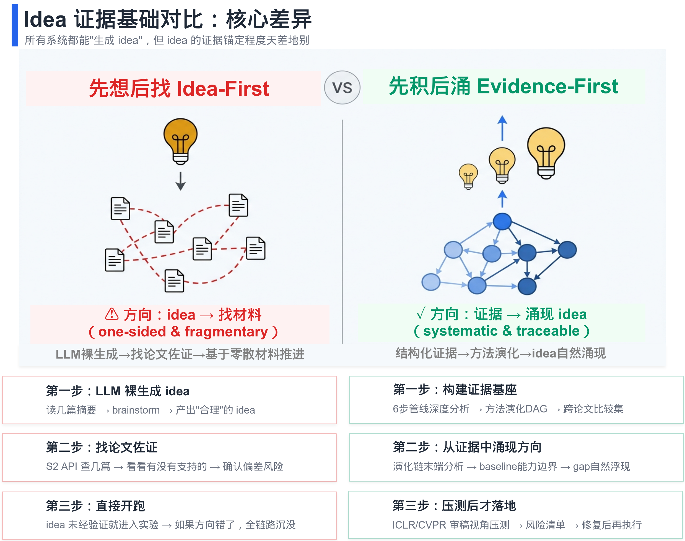

<p align="center">
  
</p>

<h1 align="center">ResearchFlow</h1>

<p align="center"><strong>面向研究 Agent 的结构化论文分析与 Research Memory</strong></p>

<p align="center"><strong>让每一个 idea 都有 <mark>出处</mark>，让每一个判断都有 <mark>锚点</mark>。</strong></p>

<p align="center">
  <a href="README.md">中文</a> |
  <a href="README_EN.md">English</a>
</p>

<p align="center">
  
  
  
  
  
  
  
  
</p>

> 🔥 **ResearchFlow 社区交流** | **[💬 微信交流 / ResearchFlow微信交流群](./WECHAT_CN.md)**
>
> 🔥 **News**：[PaperBite](https://github.com/RipeMangoBox/PaperBite) 是由 ResearchFlow 分析框架沉淀出的多级资产证据，主要覆盖 `L0-L3` 的证据资产。它提供了开箱即用的公开 evidence vault；如果你本身做 AI 相关研究，建议直接在 PaperBite 之上继续构建自己的 evidence vault。

---

<p align="center">
  
</p>

> **ResearchFlow 是什么？** ResearchFlow 是一个本地优先的研究工作流框架，帮助你将论文分析转化为结构化笔记，并构建可复用的个人 research memory。

> **适合谁？** 适合想构建论文知识库、证据驱动研究 workflow、或让 agent 参与文献理解与 idea 生成的研究者。

> 🧠 **先构建知识，再让 Agent 行动。** 大多数 AI 科研工具关注“帮你跑实验、写论文”。
> ResearchFlow 更关注上游问题：**你的 agent 在做决策时，手里有没有足够的、结构化的、可检索的论文证据？**
>
> 🧩 **把结构化论文分析沉淀为可复用的 research memory。**
> ResearchFlow 把论文 PDF 和论文列表组织成**层次化的本地资产**：原始文献、单点分析、领域知识面构建、跨领域资产沉淀与碰撞，从而支持智能的涌现与溯源。
>
> 🪶 **本地优先，低锁定。** 默认 workflow 完全基于本地文件：
> PDF、Markdown、JSONL 索引和 idea notes 都位于 `obsidian-vault/` 下。正常使用不需要数据库、后端服务或在线部署。

💡 _ResearchFlow 是一种方法论和本地知识工作流，不是封闭平台。真正有价值的是你持续积累的**多级科研资产**。_

## 🧠 核心思想

ResearchFlow 的核心不在于“先产出一个看起来合理的 idea”，而在于先沉淀结构化证据，
再让研究方向从证据中自然涌现，最后用审稿视角做压力测试，避免在证据薄弱时过早推进实验。

## 🗂️ 资产层级

<p align="center">
  
</p>

本图展示 ResearchFlow 的六层资产结构：`L0-L3` 由 PaperBite 驱动，完成知识积累与建库；`L4` 是观点涌现层；`L5` 是实验验证层。

下表按**自底向上**顺序对应图片中的六层结构：

| 层级 | 产物 | 作用 |
| --- | --- | --- |
| `L0` | 论文 PDF | 保留原始文献 |
| `L1` | 单篇论文分析 | 提取 main idea、core design、experiment proofs |
| `L2` | 单领域 Research Vault | 支持领域内归纳、演绎与对比 |
| `L3` | 多领域 Research Vault | 支持跨领域启发与方向涌现 |
| `L4` | Idea Vault | 涌现层 |
| `L5` | Experiment Vault | 验证层 |

## 🎯 工作方式

给 ResearchFlow 一个研究方向，它可以帮你把知识库逐步建起来：

```text
collect candidate papers / import local PDFs
  -> batch MinerU PDF parse
  -> structured paper analysis
  -> index
  -> query / ideate / review / export
```

你可以用四种常见模式使用它：

| 模式 | 用途 | 常用入口 |
| --- | --- | --- |
| Build | 收集候选论文、批量解析 PDF、分析论文并刷新索引 | `research-workflow` |
| Query | 按主题、任务、方法、venue、年份、标题或技术标签检索论文 | `papers-query-knowledge-base` |
| Decision | 在选择 baseline、修改方案或写 related work 前对比方法 | `papers-query-knowledge-base` |
| Idea | 基于本地知识库生成、收敛并压力测试研究方向 | `research-brainstorm-from-kb`, `idea-focus-coach`, `reviewer-stress-test` |

## 🚀 快速开始

### 1. 创建 conda 环境

```bash
git clone https://github.com/<your-username>/ResearchFlow.git
cd ResearchFlow
conda env create -f environment/environment.yml
conda activate researchflow
```

### 2. 配置模型和解析工具

需要设置模型密钥、模型名或 parser override 时，在仓库根目录创建自己的 `.env`，
并参考 [environment/.env.example](environment/.env.example)。

### 3. 安装或配置 MinerU

MinerU 是前置的 PDF 批量解析阶段，不属于 ResearchFlow 的结构化分析本体。ResearchFlow 推荐先完成 MinerU 批量解析，再复用其输出进入后续分析。最小验证方式：`mineru --help` 能运行，或在 `.env` 中设置 `MINERU_CLI_PATH`。

### 4. 先完成批量 MinerU 解析

对于中大规模论文集合，建议先批量完成 MinerU 解析，并把结果整理到可复用的 `--mineru-output-root` 下。后续 ResearchFlow 分析应优先复用这些解析结果，而不是在分析阶段重复解析 PDF。

### 5. 从 workflow skill 开始

```text
/research-workflow
我想从 PDF 构建 controllable motion generation 的论文知识库。
请告诉我下一步应该做什么，以及会生成哪些结果。
```

## 📚 延伸简介

- [资产架构](docs/asset-architecture.md)
- [系统架构](docs/system-architecture.md)
- [正式本地分析链](docs/formal-analysis-chain.md)

## 📖 使用示例

<details>
<summary>从零构建一个主题知识库</summary>

```text
/research-workflow
我想构建 text-driven reactive motion generation 的论文知识库。
请从候选论文收集开始，告诉我每个阶段应该使用哪个 skill。
```

</details>

<details>
<summary>从 GitHub 论文列表收集候选论文</summary>

```text
/papers-collect-from-github-repo
从这个 GitHub repository 收集 controllable human motion generation 相关论文：<URL>
只保留 diffusion、controllability、real-time generation 或 long-form motion 相关条目。
输出适合后续下载 workflow 使用的候选列表。
```

</details>

<details>
<summary>运行正式本地分析链</summary>

先复用已有的 MinerU 输出进入分析：

```bash
python3 scripts/run_local_paper_analysis.py \
  --mineru-output "<mineru_output_dir>" \
  --paper-pdf "obsidian-vault/paperPDFs/<Category>/<Venue_Year>/<Paper>.pdf" \
  --conf-year "<Venue_Year>" \
  --export-vault
```

如果没有现成输出，也可以在单篇运行时由脚本触发 MinerU：

```bash
python3 scripts/run_local_paper_analysis.py \
  --pdf "obsidian-vault/paperPDFs/<Category>/<Venue_Year>/<Paper>.pdf" \
  --conf-year "<Venue_Year>" \
  --export-vault
```

批量分析时，建议要求复用已有 MinerU 输出：

```bash
python3 scripts/run_paper_list_analysis.py \
  --source obsidian-vault/paper_list.csv \
  --state Downloaded \
  --mineru-output-root "<mineru_output_root>" \
  --require-existing-mineru-output
```

</details>

## ✨ 核心能力

| 需求 | Skill |
| --- | --- |
| 判断下一步 pipeline | `research-workflow` |
| 从网页收集候选论文 | `papers-collect-from-web` |
| 从 GitHub 论文列表收集候选论文 | `papers-collect-from-github-repo` |
| 根据 triage list 下载 PDF | `papers-download-from-list` |
| 生成单篇深度报告 | `paper-report` |
| 重建本地索引 | `papers-build-index` |
| 基于本地笔记查询 / 对比论文 | `papers-query-knowledge-base` |
| 基于知识库生成研究想法 | `research-brainstorm-from-kb` |
| 把想法收敛为可执行计划 | `idea-focus-coach` |
| 做 reviewer 风格压力测试 | `reviewer-stress-test` |
| 导出可分享 Markdown | `notes-export-share-version` |

完整 skill 地图见 [.claude/skills/README.md](.claude/skills/README.md)。

## 🤖 Agent 兼容

ResearchFlow 有意保持朴素：文件夹、Markdown、JSONL、CSV 和 `SKILL.md`。因此同一
份 research memory 可以被多个 Agent 共享：

- Claude Code / Cursor 可以直接读取 `.claude/skills`。
- Codex CLI 可以用 `scripts/setup_shared_skills.py` 生成本地 alias。
- 其他能读取文件的 Agent 可以直接读取 `obsidian-vault/index/index.jsonl`
  和 `obsidian-vault/analysis/`。

## 补充配置

`<a id="codex-cli-compat"></a>`

<details>
<summary>Codex CLI compatibility</summary>

Claude Code / Cursor 不需要这一步；Codex CLI 需要。

```bash
python3 scripts/setup_shared_skills.py
python3 scripts/setup_shared_skills.py --check
```

</details>

`<a id="obsidian-config"></a>`

<details>
<summary>Obsidian setup</summary>

- Obsidian 是可选但推荐的可视化层。
- 如果需要 graph view、backlinks 和人工浏览，可以把 `obsidian-vault/`
  作为 Obsidian vault 打开。
- 不要把 Obsidian 页面当作独立 source of truth。

</details>

## Citation

```bibtex
@misc{lin2026researchflow,
  title        = {{ResearchFlow}: A Structured Paper Analysis Framework for Knowledge-Grounded Research},
  author       = {Jingzhong Lin and Ziheng Huang},
  year         = {2026},
  howpublished = {\url{https://github.com/RipeMangoBox/ResearchFlow}},
  note         = {GitHub repository}
}
```

## License

MIT
