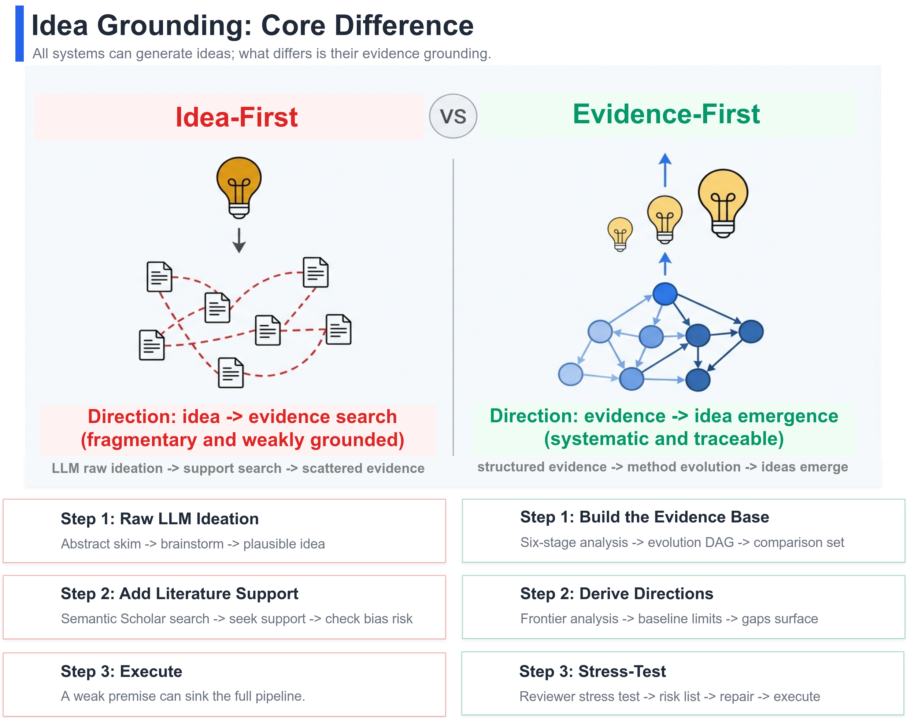
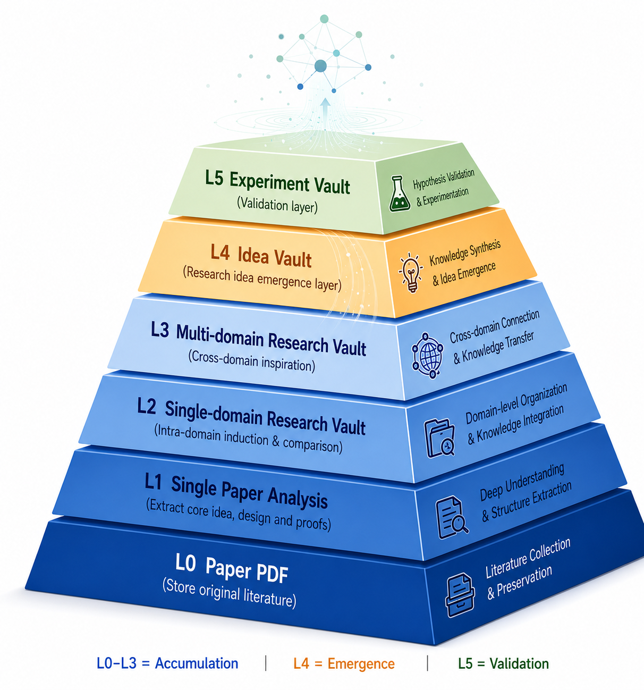

<p align="center">
  
</p>

<h1 align="center">BITE</h1>

<p align="center"><strong>Bibliographic Intelligence for Thought Emergence</strong></p>

<p align="center"><strong>Let every idea have a <mark>source</mark>, and every judgment have an <mark>anchor</mark>.</strong></p>

<p align="center">
  <a href="README.md">中文</a> |
  <a href="README_EN.md">English</a>
</p>

<p align="center">
  
  
  
  
  
  
  
  
</p>

> This project was formerly known as **ResearchFlow**. It has been renamed to **BITE** (Bibliographic Intelligence for Thought Emergence).
>
> 🔥 **BITE Community** | **[💬 WeChat / BITE WeChat Group](./WECHAT.md)**
>
> 🔥 **News**: BITE's public evidence layer is published on HuggingFace dataset [PaperBite-Assets](https://huggingface.co/datasets/RipeMangoBox/PaperBite-Assets), covering `L0-L3` structured paper assets (Markdown analysis notes + figures + manifests). Incrementally sync with `scripts/sync_assets_from_hf.py`; if you work on AI-related research, it is a strong starting point for building your own evidence vault.

---

<p align="center">
  
</p>

> **What is BITE?** BITE is a local-first workflow framework for structured paper analysis and research memory, purpose-built for knowledge-grounded research agents. It transforms paper analysis into structured notes and builds a persistent, reusable research memory.

> **Who is this for?** Researchers building paper-grounded knowledge bases,
> agent-assisted literature workflows, or evidence-backed idea generation.

> 🧠 **Knowledge first, not execution first.** Many AI research tools focus on
> helping you run experiments or draft papers. BITE focuses on the
> upstream question: **when an agent makes a research decision, does it have
> enough structured, searchable paper evidence in hand?**
>
> 🧩 **Turn structured paper analysis into reusable research memory.**
> BITE organizes paper PDFs and paper lists into layered local assets:
> source literature, single-paper evidence units, domain knowledge surfaces,
> cross-domain evidence accumulation, and downstream idea or experiment records.
>
> 🪶 **Local-first with low lock-in.** The default workflow is local files only:
> PDFs, Markdown notes, JSONL indexes, and idea notes all live under
> `obsidian-vault/`. Normal use does not require a server, database, or service
> deployment.

💡 _BITE is a methodology and local knowledge workflow, not a closed
platform. What matters is the layered research assets you keep accumulating._

## 🧠 Core Idea

BITE is not centered on idea generation in isolation. The core claim is
that research directions should emerge from an accumulated, structured, and
traceable evidence base, then be stress-tested before execution.

## 🗂️ Asset Levels

<p align="center">
  
</p>

This diagram shows BITE's six-layer asset hierarchy: `L0-L3` (knowledge building, powered by PaperBite), `L4` (emergence), and `L5` (validation).

The table below follows the diagram **from bottom to top**:

| Level | Output | Role |
| --- | --- | --- |
| `L0` | paper PDFs | preserve source literature |
| `L1` | single-paper analysis | extract idea, design, and evidence |
| `L2` | Domain Research Vault | support domain-level induction and deduction |
| `L3` | Cross-Domain Research Vault | support transfer and idea emergence |
| `L4` | Idea Vault | emergence layer |
| `L5` | Experiment Vault | validation layer |

## 🎯 How It Works

Give BITE a research direction, and it helps you build the knowledge
base step by step:

```text
collect candidate papers / import local PDFs
  -> batch MinerU PDF parse
  -> structured paper analysis
  -> index
  -> query / ideate / review / export
```

You can use it in four common modes:

| Mode | Purpose | Typical entry |
| --- | --- | --- |
| Build | Collect candidates, batch-parse PDFs, analyze papers, and refresh the index | `research-workflow` |
| Query | Retrieve papers by topic, task, method, venue, year, title, or technique tags | `papers-query-knowledge-base` |
| Decision | Compare methods before choosing baselines, changing a design, or writing related work | `papers-query-knowledge-base` |
| Idea | Generate, focus, and stress-test research directions grounded in the local knowledge base | `research-brainstorm-from-kb`, `idea-focus-coach`, `reviewer-stress-test` |

## 🚀 Quick Start

### 1. Create the conda environment

```bash
git clone https://github.com/<your-username>/BITE.git
cd BITE
conda env create -f environment/environment.yml
conda activate researchflow
```

### 2. Configure model and parser access

Create a repo-root `.env` when you need model keys, model names, or parser
overrides. Use [environment/.env.example](environment/.env.example) as a
reference.

### 3. Install or configure MinerU

MinerU is the upstream batch PDF parsing stage, not the structured analysis stage itself. BITE is designed to reuse MinerU outputs before running analysis. Minimal verification: `mineru --help` should run, or `.env` should set `MINERU_CLI_PATH`.

### 4. Batch-prepare MinerU outputs first

For medium and large paper collections, batch MinerU parsing should happen before structured analysis. BITE analysis should preferentially reuse prepared MinerU outputs through `--mineru-output` or `--mineru-output-root` instead of reparsing PDFs during analysis.

### 5. Start from the workflow skill

```text
/research-workflow
I want to build a knowledge base for controllable motion generation from PDFs.
Please tell me the next step and the expected outputs.
```

### 6. Optional: Sync Public Evidence Layer

To use BITE's pre-built structured paper assets, sync from HuggingFace by layer:

```bash
pip install huggingface_hub

# Text only: analysis notes + indexes (~43 MB)
python scripts/sync_assets_from_hf.py --mode text

# Assets only: figures and tables (~1.8 GB)
python scripts/sync_assets_from_hf.py --mode assets

# Everything (default)
python scripts/sync_assets_from_hf.py --mode all --dry-run   # preview first
python scripts/sync_assets_from_hf.py                        # full sync
```

## 📚 Further Reading

- [Asset Architecture](docs/asset-architecture.md)
- [System Architecture](docs/system-architecture.md)
- [Formal Local Analysis Chain](docs/formal-analysis-chain.md)

## 📖 Usage Examples

<details>
<summary>Build a topic knowledge base from scratch</summary>

```text
/research-workflow
I want to build a knowledge base for text-driven reactive motion generation.
Start by collecting candidate papers and tell me which skill to use at each stage.
```

</details>

<details>
<summary>Collect candidate papers from a GitHub paper list</summary>

```text
/papers-collect-from-github-repo
Collect papers related to controllable human motion generation from this GitHub repository: <URL>
Keep only items related to diffusion, controllability, real-time generation, or long-form motion.
Write a candidate list suitable for the downstream download workflow.
```

</details>

<details>
<summary>Run the formal local analysis chain</summary>

Reuse existing MinerU output first when available:

```bash
python3 scripts/run_local_paper_analysis.py \
  --mineru-output "<mineru_output_dir>" \
  --paper-pdf "obsidian-vault/paperPDFs/<Category>/<Venue_Year>/<Paper>.pdf" \
  --conf-year "<Venue_Year>" \
  --export-vault
```

If no cached parse exists, the runner can also invoke MinerU during a
single-paper run:

```bash
python3 scripts/run_local_paper_analysis.py \
  --pdf "obsidian-vault/paperPDFs/<Category>/<Venue_Year>/<Paper>.pdf" \
  --conf-year "<Venue_Year>" \
  --export-vault
```

For batch analysis, require reuse of prepared MinerU outputs:

```bash
python3 scripts/run_paper_list_analysis.py \
  --source obsidian-vault/paper_list.csv \
  --state Downloaded \
  --mineru-output-root "<mineru_output_root>" \
  --require-existing-mineru-output
```

</details>

## ✨ Core Capabilities

| Need | Skill |
| --- | --- |
| Decide the next pipeline step | `research-workflow` |
| Collect candidates from web pages | `papers-collect-from-web` |
| Collect candidates from GitHub paper lists | `papers-collect-from-github-repo` |
| Download PDFs from a triage list | `papers-download-from-list` |
| Generate a deep single-paper report | `paper-report` |
| Rebuild the local index | `papers-build-index` |
| Query or compare papers from local notes | `papers-query-knowledge-base` |
| Generate grounded research ideas | `research-brainstorm-from-kb` |
| Focus an idea into an executable plan | `idea-focus-coach` |
| Run reviewer-style stress tests | `reviewer-stress-test` |
| Export share-ready Markdown | `notes-export-share-version` |

See [.claude/skills/README.md](.claude/skills/README.md) for the full skill map.

## 🤖 Agent Compatibility

BITE intentionally stays plain: folders, Markdown, JSONL, CSV, and
`SKILL.md`. The same research memory can therefore be shared by multiple agents:

- Claude Code / Cursor can read `.claude/skills` directly.
- Codex CLI can use `scripts/setup_shared_skills.py` to generate local aliases.
- Other agents can read `obsidian-vault/index/index.jsonl` and
  `obsidian-vault/analysis/` directly.

## Advanced Config

<details>
<summary>Codex CLI compatibility</summary>

Claude Code / Cursor does not need this step. Codex CLI does.

```bash
python3 scripts/setup_shared_skills.py
python3 scripts/setup_shared_skills.py --check
```

</details>

<details>
<summary>Obsidian setup</summary>

- Obsidian is optional but recommended as a visualization layer.
- Open `obsidian-vault/` as an Obsidian vault if you want graph view,
  backlinks, and manual browsing.
- Do not treat Obsidian pages as a separate source of truth.

</details>
