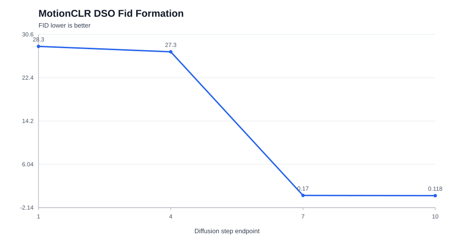
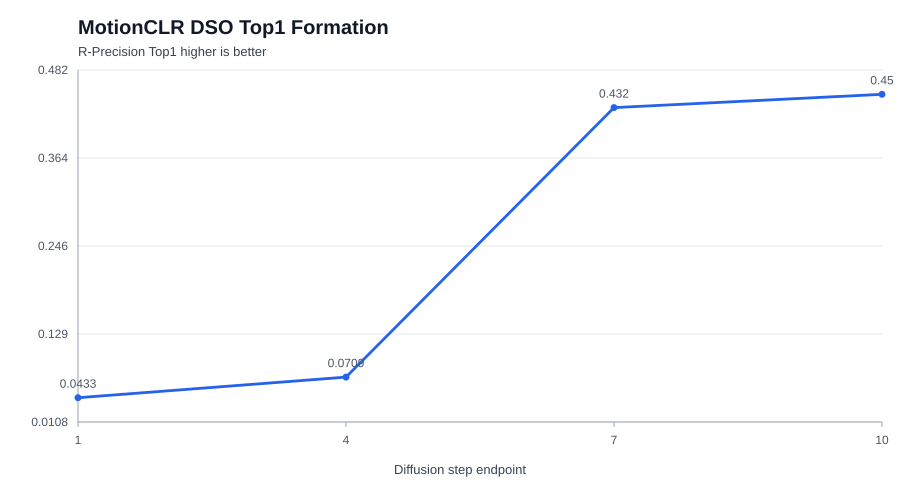
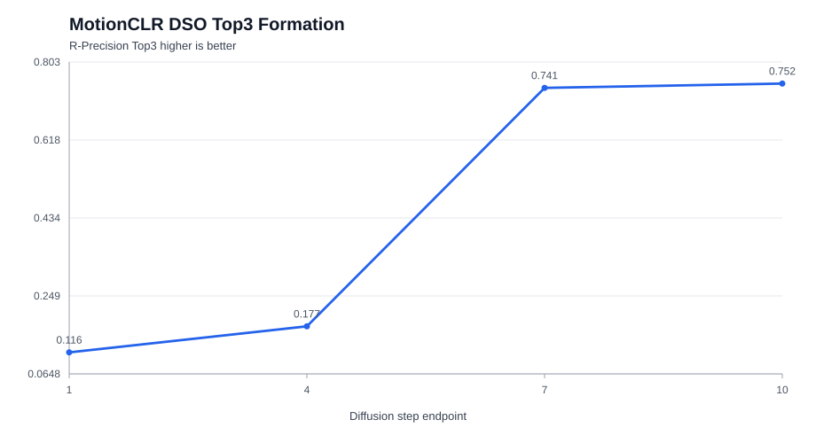
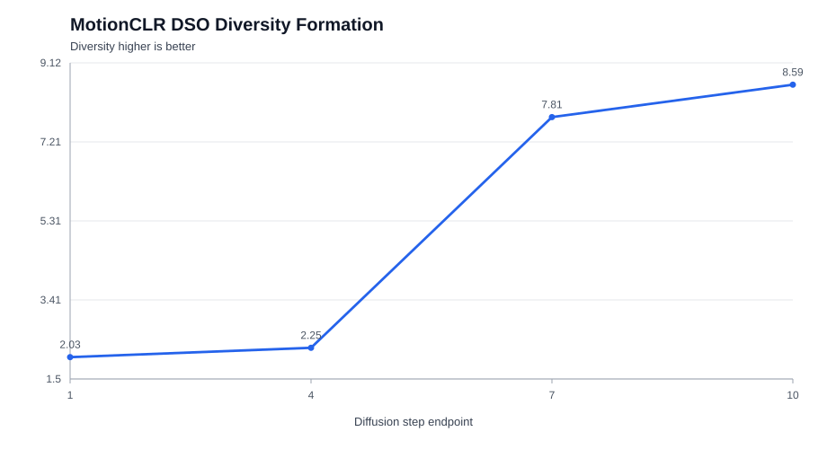
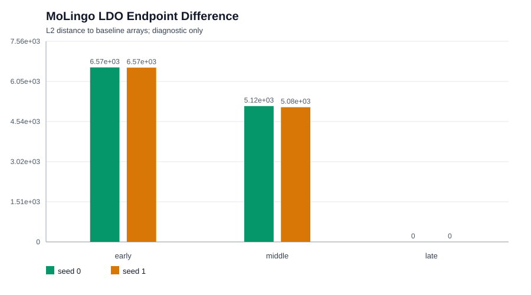
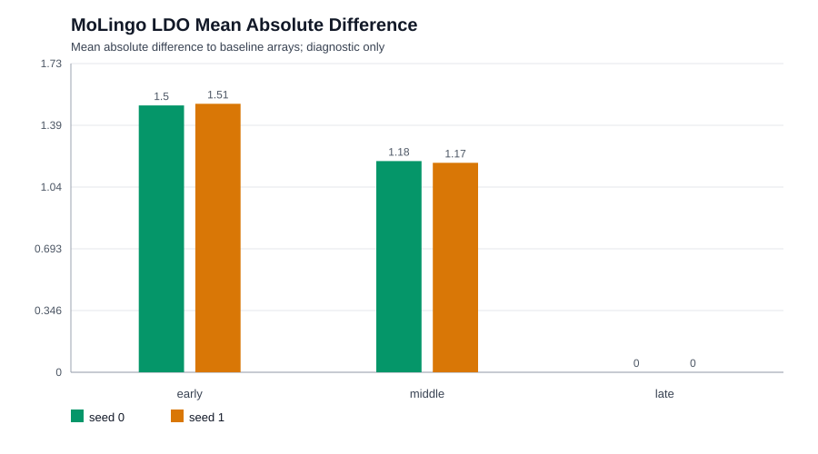

# LDO/DSO 诊断报告

## 状态

Formal root:

```text
/data/public/ripemangobox/Motion/experiments/MoDebug/ldo_dso/formal_20260608
```

| Baseline | LDO | DSO | 说明 |
|---|---|---|---|
| MotionCLR | `blocked_incompatible_interface` | `full_evaluator_metrics_computed` | CLRBlock 中间输出不能直接解码；DSO 使用 diffusion step endpoint。 |
| MotionGPT | `blocked_incompatible_interface` | `not_present_in_formal_root` | T5 decoder hidden state 不是 motion token；formal root 无 DSO manifest。 |
| MoLingo | `diagnostic_arrays_computed_not_official_metrics` | `not_present_in_formal_root` | LDO 是 early-exit decoded arrays 诊断代理；formal root 无 DSO manifest。 |

结构化文件：

- [ldo_dso_status.csv](../visualization/data/ldo_dso_status.csv)
- [motionclr_dso_metrics.csv](../visualization/data/motionclr_dso_metrics.csv)
- [molingo_ldo_metrics.csv](../visualization/data/molingo_ldo_metrics.csv)
- [molingo_ldo_block_summary.csv](../visualization/data/molingo_ldo_block_summary.csv)

## MotionCLR DSO

MotionCLR DSO 是 formal root 中唯一完成 full evaluator metrics 的 DSO。端点为 10 步采样中的 step 1/4/7/10。

| Endpoint | FID | Top1 | Top3 | Matching | Diversity | 读法 |
|---|---:|---:|---:|---:|---:|---|
| step 1/10 | 28.3106 | 0.0433 | 0.1157 | 7.3553 | 2.0259 | 早期噪声端点，质量和检索都很差。 |
| step 4/10 | 27.2832 | 0.0709 | 0.1774 | 7.1321 | 2.2507 | 仍处在低质量阶段。 |
| step 7/10 | 0.1703 | 0.4317 | 0.7414 | 3.5191 | 7.8124 | 质量和对齐已接近最终输出。 |
| step 10/10 | 0.1184 | 0.4496 | 0.7517 | 3.4492 | 8.5941 | 最终端点。 |









解读边界：

- 这是 diffusion step output 的 formation curve，不是 layer direct-output。
- step 1/4 的高 FID 不能被解读为模型最终质量差；它只说明早期 scheduler sample 还不是可用 motion。
- step 7 到 step 10 的跳变是后续机制实验的重要对照：任何修复或 adapter 应同时观察 DSO 轨迹是否更稳定，而不是只看最终 FID。

## MoLingo LDO

MoLingo LDO 使用 decoder early-exit 代理：在 endpoint layer 之后，将后续 TransformerDecoder layers 替换为 `Identity`，再经过未改动的 flow sampling 和 VAE decode。它不是 official evaluator metrics。

| Block | Endpoint layer | L2 vs baseline mean | Mean abs vs baseline mean | Allclose count | 读法 |
|---|---:|---:|---:|---:|---|
| early | 4 | 6570.3259 | 1.5014 | 0/2 | 保留到 layer 4 后移除后续层，会显著改变最终数组。 |
| middle | 10 | 5096.3232 | 1.1798 | 0/2 | 保留到 layer 10 后仍有明显差异，但小于 early endpoint。 |
| late | 15 | 0.0000 | 0.0000 | 2/2 | 构造性结果：layer 15 是最后一层，没有后续层可替换。 |





必须避免的过度解释：

- late endpoint 的 0 距离不能说明 layer 15 hidden 与 baseline 恒等，也不能说明 decoder early-exit。
- 这些 L2/mean-abs 数值只能做同一 LDO 设置内比较，不能作为 official motion quality 指标。
- MoLingo CFG_CA layer 15 official eval 已完成；LDO 不能替代 official eval，只能解释 endpoint replacement 代理。

## 方法结论

- LDO 应按“合法 endpoint decode + probe”两路处理：可直接解码的 endpoint 才能做输出级诊断；不能合法解码的 hidden state 应转为 probe，而不是强行当 motion output。
- DSO 应画成形成曲线：早期、中期、最终端点的 alignment/quality 同时看，才可能区分 semantic plan 和 local quality refinement 的形成顺序。
- 下一步优先并行在 MotionCLR CFG_CA 12-15 与 MoLingo CFG_CA late layers 做 cond/uncond 表征诊断、CFG scale sweep、swap/restore 和 natural-representation check。
