# Attention Intervention 综合报告

## 范围

本文汇总 4090 双卡 attention intervention 与 LDO/DSO 诊断的有效结果。MoLingo 20260603/20260605 旧 eval 已因 official setting 不一致作废；正式汇总只使用 20260609 official-setting 代表层重跑结果。

报告入口：

- [MotionCLR](motionclr.md)
- [MotionGPT](motiongpt.md)
- [MoLingo](molingo.md)
- [LDO/DSO](ldo_dso.md)
- [数据分析与机制讨论](data_analysis_and_mechanism_discussion_20260609.md)

## 完成矩阵

| Baseline | Baseline | SA | CA | CFG_SA | CFG_CA | 状态 |
|---|---:|---:|---:|---:|---:|---|
| MotionCLR | 2 manifests | 18 | 18 | 18 | 18 | 完成；最终聚合使用 20260605 roots |
| MotionGPT | 1 | 12 | 12 | unsupported | unsupported | 支持的 family 已完成 |
| MoLingo | 1 | 3 representative | 3 representative | 3 representative | 3 representative | 20260609 official-setting 代表层完成 |

MotionCLR 有两个 baseline manifest，是因为 baseline 条件同时出现在两张 GPU 的 split root 中；这应视为同一 baseline 的重复证据，而不是两个不同实验条件。

## LDO/DSO 矩阵

| Baseline | LDO | DSO | 说明 |
|---|---|---|---|
| MotionCLR | `blocked_incompatible_interface` | complete | CLRBlock hidden 不能直接解码；DSO endpoint full evaluator 已完成。 |
| MotionGPT | `blocked_incompatible_interface` | not present | T5 hidden 不是 motion token；formal root 无 DSO manifest。 |
| MoLingo | diagnostic arrays | not present | LDO 是 decoded-array proxy；formal root 无 DSO manifest。 |

## 可审计性矩阵

| Baseline | Manifest 状态 | Provenance | Hook 证据 | Unsupported/blocked 处理 | 说明 |
|---|---:|---:|---:|---:|---|
| MotionCLR | 强 | 强 | 强 | LDO blocked 合理 | 审计链路最完整。 |
| MotionGPT | 强 | 强 | 良好 | CFG 和 LDO 均 fail-fast/blocked | CFG family 明确 unsupported。 |
| MoLingo | 强 | 强 | 强 | 旧结果已 invalidated | official-setting representative rerun 完成，`CFG_CA/layer_15` 有完整 hook/replacement 证据。 |

## 运行时间对比

| Baseline | 单层中位运行时间 | 主要原因 |
|---|---:|---|
| MotionGPT | 约 3.8 min | 支持的 eval 路径最快，且只有 12 层。 |
| MotionCLR | 约 7.2-7.4 min | batched official eval，指标面板完整。 |
| MoLingo | 约 79-96 min | MS-272 official sampling/eval loop 更重，`cfg=5.5, acc=3`。 |

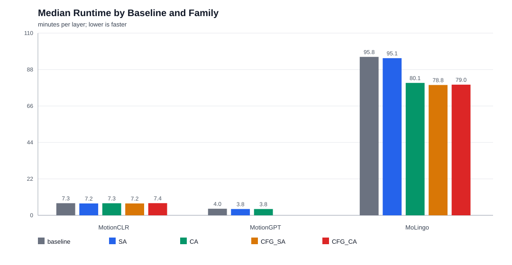

## 结果阅读规则

- 优先做同一 baseline 内比较；不同 baseline 的 evaluator protocol 和指标命名并不完全一致。
- MotionGPT 的 CFG_SA/CFG_CA 不应按缺失值处理，它们是架构/封装层面 unsupported。
- MotionCLR 最终聚合只使用 20260605 full eval roots。
- MoLingo 20260609 official-setting representative rerun 已完成；`CFG_CA/layer_15` 是 MoLingo 最严重退化点。
- LDO/DSO 是诊断，不应和 attention official evaluator 指标混写成同一性能结论。

## Baseline 内主要发现

| Baseline | 主要模式 | 证据强度 |
|---|---|---|
| MotionCLR | `CFG_CA` 在 12-15 层严重退化；layer 16/17 恢复到近 baseline。 | hard evidence |
| MotionGPT | SA/CA 基本接近 baseline，该 intervention/evaluator 组合不敏感；CFG unsupported。 | hard evidence for supported families |
| MoLingo | `CFG_CA/layer_15` 严重退化，FID_TMR 7.7003、Top1 0.7240、Top3 0.9165；其他 families 退化较轻。 | hard evidence |
| MotionCLR DSO | step 1/4 很差，step 7 接近最终输出，step 10 最好。 | diagnostic proxy |
| MoLingo LDO | endpoint 4/10 移除后续层会显著改变输出数组；endpoint 15 为构造性 0 距离。 | diagnostic proxy |

补充确认：三个 baseline 的 attention `metrics_summary.json` 均记录了 R-Precision Top1/Top2/Top3。CSV 与图像已补齐 Top1/Top2，不是由 Top3 反推。

## 跨模型结论

- MotionCLR 与 MoLingo 都在 late `CFG_CA` 出现明显退化。这是 hard evidence。
- “退化源于通用 CFG cond/uncond 深层融合脆弱性”仍是 hypothesis；需要 cond/uncond 表征、CFG scale sweep、swap/restore 和 natural-representation check 验证。
- MotionCLR 的 late `CFG_CA` 检索崩塌更极端；MoLingo 的 layer 15 FID_TMR 增幅更大，但 Top3 仍保留到 0.9165。
- MotionGPT 不提供 CFG 数据，因此不能证明或反驳 late-CFG hypothesis，只能作为 supported SA/CA 不敏感的对照。

## 趋势图

### MotionCLR

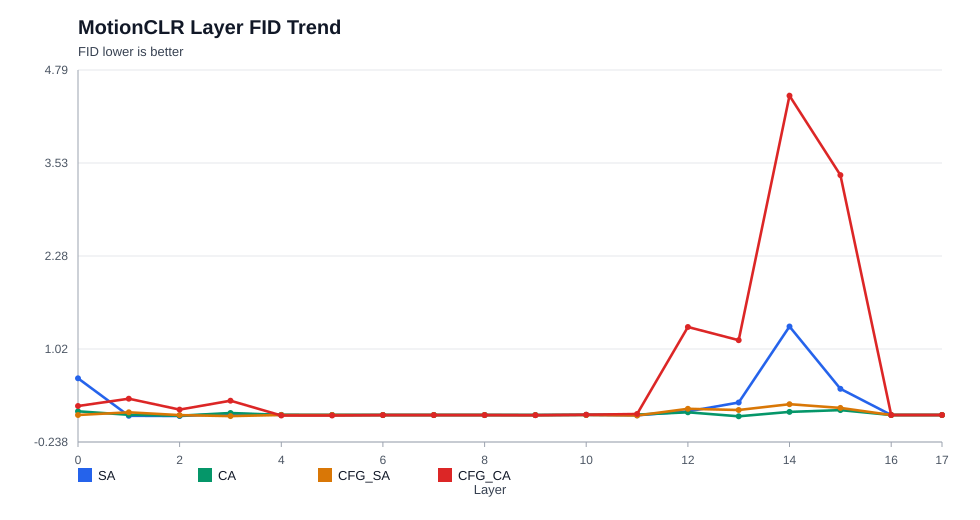

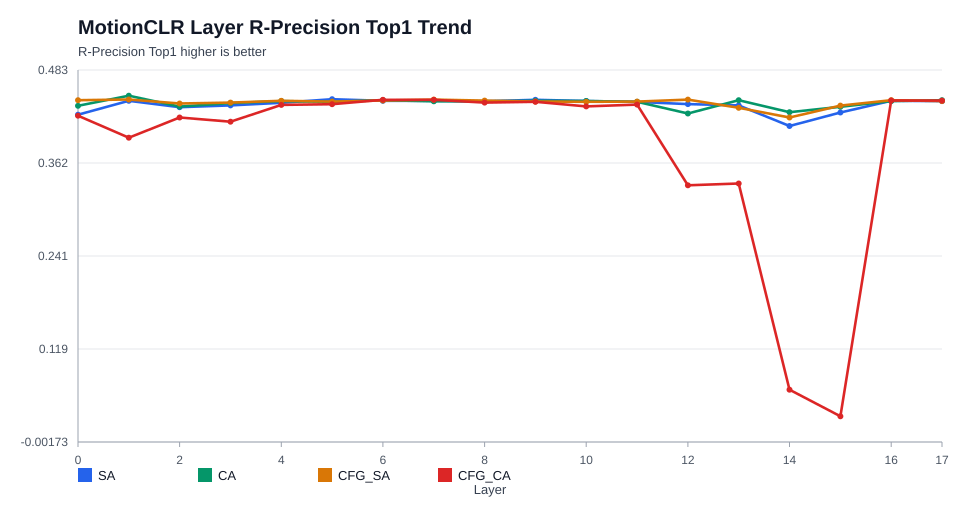

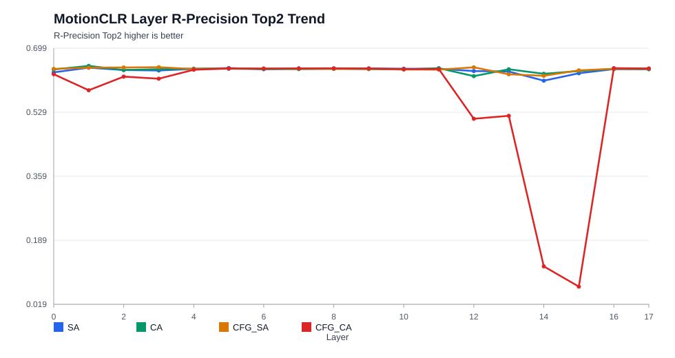

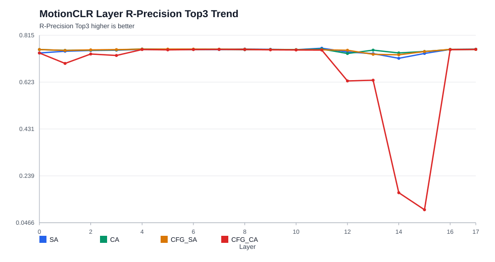

### MotionGPT

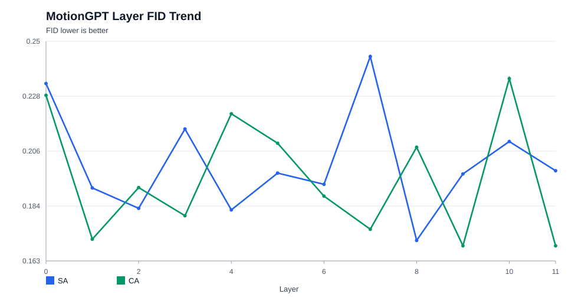

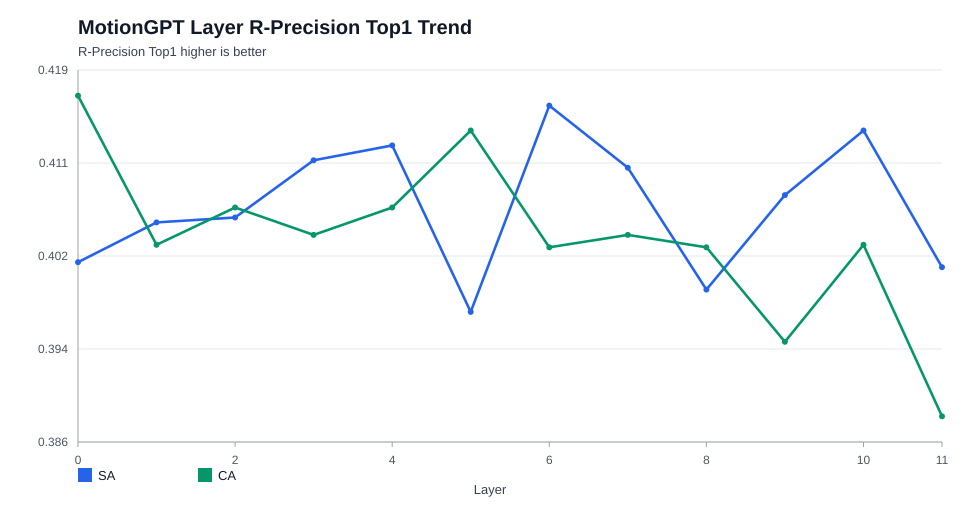

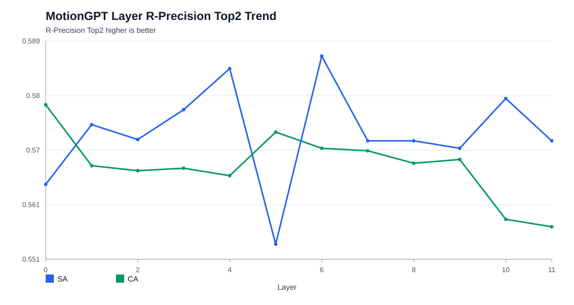

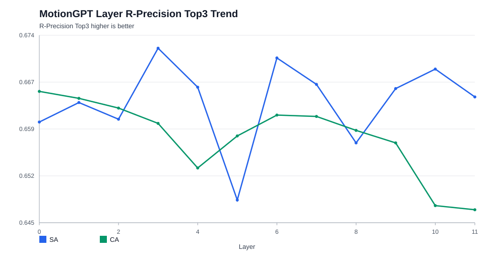

### MoLingo

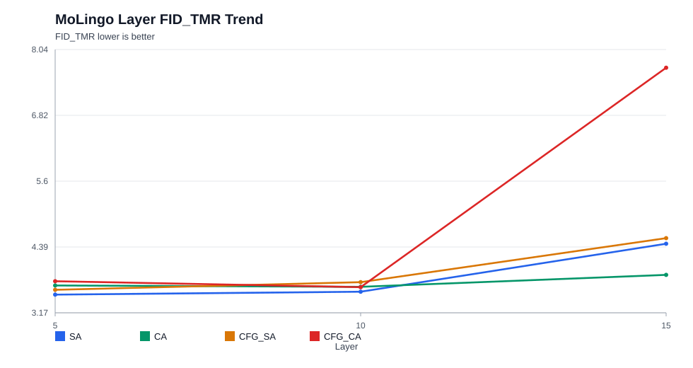

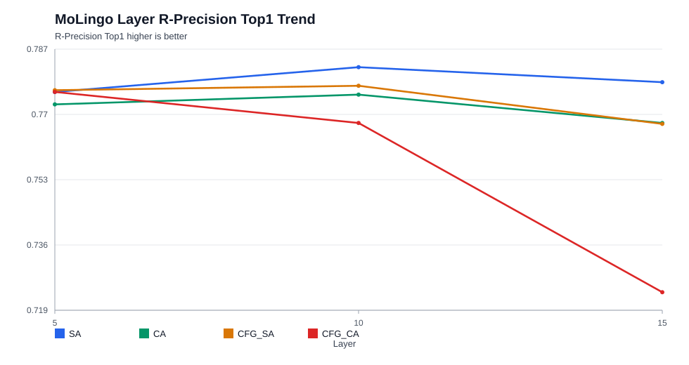

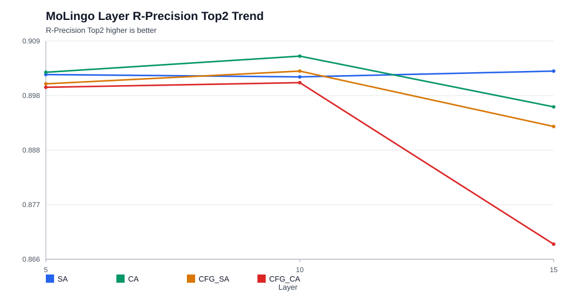

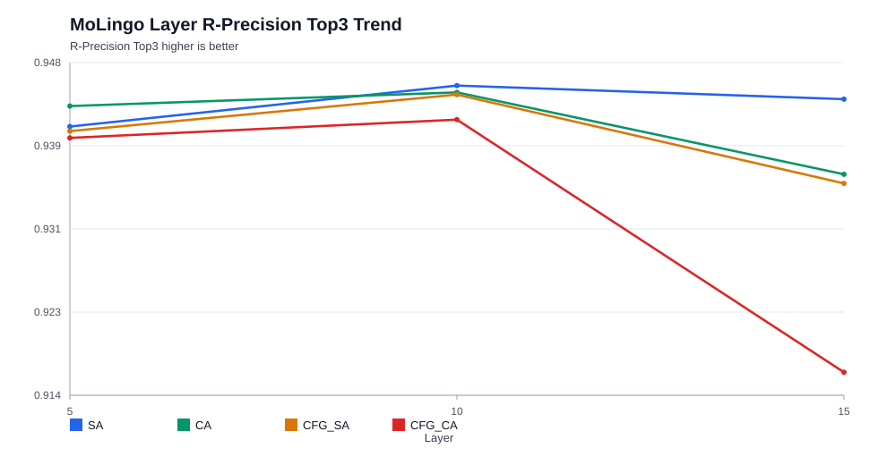

### LDO/DSO

## 研究讨论入口

基于有效数据、subagent 阅读清单审查和 DeepSeek max 严格质询，结论采用三层证据标签：

- Hard evidence: MotionCLR `CFG_CA` 12-15 退化；MoLingo `CFG_CA/layer_15` 退化；MotionGPT supported SA/CA 不敏感。
- Diagnostic proxy: MotionCLR DSO formation curve；MoLingo LDO endpoint-difference curve。
- Hypothesis: CFG branch coupling、stage-wise semantic/quality split、spatial-temporal guided adapter 或 loss 设计。

下一步优先级：

1. 并行对 MotionCLR `CFG_CA` 12-15 与 MoLingo `CFG_CA` layer 10/12/14/15 做 cond/uncond cosine、norm ratio、attention entropy、MMD/EMD 和 natural-representation check。
2. 做 CFG scale sweep，判断 late `CFG_CA` 退化是否随 CFG scale 单调变化。
3. 开发模型无关 late-CFG branch diagnosis 脚本，统一抽取 cond/uncond hidden 和 attention output，支持跨模型对齐比较。
4. 把 intervention 输出转成 frame × joint/body-part delta，并用 ReMoGPT-style 六部位 ontology 对齐文本中被提到的 body part。
5. 对可 token 化输出追加 codebook usage、RVQ/base token distance、transition token distance，避免只看全局 FID/R-Precision。
