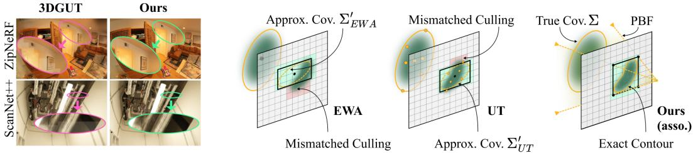
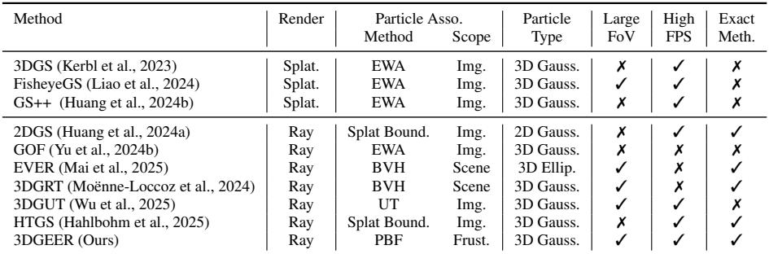
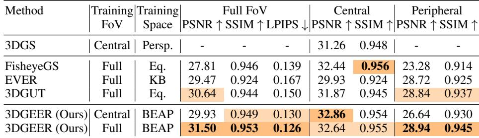
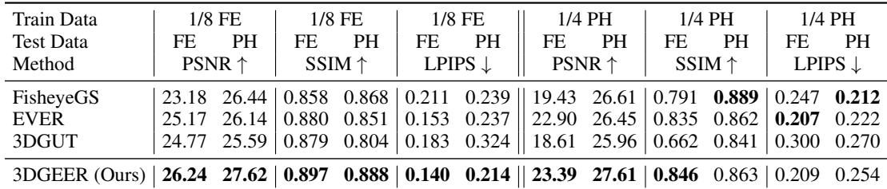
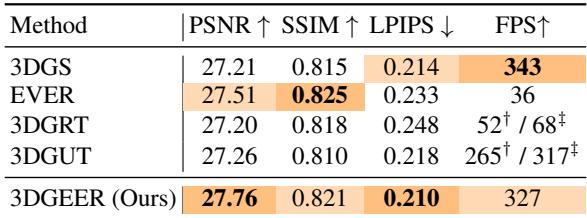
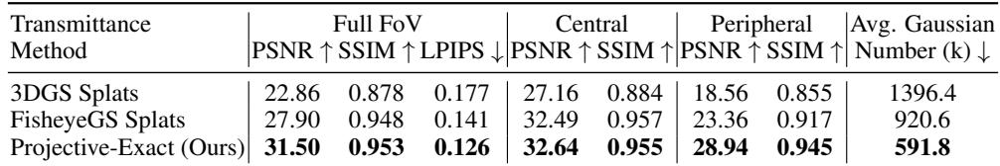

# 3DGEER: 3D Gaussian Rendering Made Exact and Efficient for Generic Cameras

> [!tip] 核心洞察
> 通过将每个3D高斯映射到各向同性的规范坐标系，光线-高斯密度积分可简化为闭合形式的马氏距离指数函数，该形式等价于先前工作中的“最大响应”启发式，但具有严格的投影精确性；同时，在角度域（θ, φ）中定义PBF，使得关联计算与相机模型无关，且可通过二次方程解析求解。

| 字段 | 内容 |
|------|------|
| 中文题名 | 3DGEER：面向通用相机的精确高效三维高斯渲染 |
| 英文题名 | 3DGEER: 3D Gaussian Rendering Made Exact and Efficient for Generic Cameras |
| 会议/期刊 | ICLR 2026 (accepted) |
| Links | [paper](https://openreview.net/forum?id=4voMNlRWI7) |
| Topic | #topic/vision_multimodal_applications #topic/vision_multimodal_applications/3d_rendering_reconstruction |
| Method | 3DGEER |
| Dataset | ScanNet++ (Full FoV), ScanNet++ (Full FoV), ScanNet++ (Full FoV), MipNeRF360 |

> [!tip] 效果简介
> - ScanNet++ (Full FoV) 上，PSNR↑ 为 31.50，对比 27.90 (FisheyeGS)，变化 +3.60。
> - ScanNet++ (Full FoV) 上，SSIM↑ 为 0.953，对比 0.933 (FisheyeGS)，变化 +0.020。
> - ScanNet++ (Full FoV) 上，LPIPS↓ 为 0.126，对比 0.150 (FisheyeGS)，变化 -0.024。

## 概述

3DGEER（3D Gaussian Rendering Made Exact and Efficient for Generic Cameras）发表于 ICLR 2026，旨在解决现有三维高斯渲染方法在通用相机（尤其是大视场相机）下无法同时兼顾投影几何精确性与实时渲染效率的核心矛盾。现有基于splatting的方法（如3DGS、FisheyeGS）依赖局部仿射近似，在大视场下引入严重投影误差；而基于光线追踪的方法（如EVER、3DGRT）虽能实现精确渲染，但依赖昂贵的BVH遍历，帧率极低。

3DGEER的核心贡献在于三点：首先，推导出沿光线积分高斯密度的闭合形式透射率公式（Eq. 4），消除了splatting中的线性化近似；其次，提出粒子包围视锥（PBF），通过解析二次方程求解每个高斯在角度域(θ, φ)中的精确包围边界，实现无需BVH遍历的视锥级光线-粒子关联；最后，提出双极等角投影（BEAP），在角度域实现最均匀的光线球面覆盖，统一了任意视场相机的图像表示。

实验结果表明，3DGEER在多个基准上显著超越现有方法：在ScanNet++全视场上达到31.50 PSNR，相比FisheyeGS的27.90 PSNR提升3.6 dB；在MipNeRF360上达到27.76 PSNR，超越3DGS的27.21 PSNR，同时保持327 FPS的实时帧率，比现有精确光线追踪方法快约5倍。在ZipNeRF跨相机泛化实验中，3DGEER在最具挑战性的Pinhole训练-Fisheye测试设置下显著优于所有基线。此外，PBF关联仅需0.63 GB显存，每tile关联高斯数仅为475，远少于EWA的2203。方法仅需550-700K高斯即可达到32.1 PSNR，而FisheyeGS扩展到3.6-5M高斯后PSNR饱和于29.3，证明暴力缩放无法弥合投影精确性的差距。

## 背景与动机

现有基于3D高斯（3D Gaussian Splatting）的新视角合成方法，在渲染质量与速度之间取得了显著成功，但其核心瓶颈在于无法同时满足**投影几何的精确性**与**实时渲染的效率**。具体而言，主流方法可分为两类，各自存在根本性缺陷：

1.  **基于Splatting的方法（如3DGS、FisheyeGS、GS++）**：这类方法通过将3D高斯投影为2D高斯（如EWA splatting）或使用无迹变换（UT）进行近似，以在图像空间建立光线-粒子关联。其核心缺陷在于依赖局部仿射近似（local affine approximation），即对相机投影函数进行一阶泰勒展开。当相机视场角（FoV）较大时（如鱼眼或广角相机），投影的非线性急剧增强，导致严重的投影误差。这种误差不仅表现为渲染图像中的网格状伪影（grid-line artifacts，如Figure 1所示），而且从根本上限制了重建质量。例如，FisheyeGS在ScanNet++全FoV上仅达到27.90 PSNR，且即使将高斯数量暴力扩展到3.6-5M，其PSNR也饱和于29.3，无法弥合与精确方法的差距。

2.  **基于光线追踪的方法（如EVER、3DGRT）**：这类方法通过构建场景级BVH（Bounding Volume Hierarchy）结构，实现了精确的光线-高斯求交。然而，BVH的遍历和求交计算在GPU上并行效率低下，导致帧率极低（通常低于30 FPS），无法满足实时交互的需求。

**本文动机**：针对上述“精确性-效率”不可兼得的困境，3DGEER提出一种全新的范式，旨在无需BVH遍历的前提下，实现与相机模型无关的、投影精确的渲染。其核心洞察在于：通过将每个3D高斯变换到一个各向同性的规范坐标系（canonical space），光线-高斯密度积分可以简化为一个闭合形式的解析解（Eq. 4），该解仅依赖于光线到高斯中心的马氏距离。这一发现使得精确的透射率计算成为可能，且避免了splatting中的投影近似。此外，为了高效地建立光线与高斯之间的关联，3DGEER提出了粒子包围视锥（PBF）的概念，在角度域为每个高斯解析求解其精确的包围视锥，从而实现了视锥级（而非像素级或场景级）的关联，兼顾了精确性与并行效率。

## 核心创新

3DGEER的核心创新在于同时解决了现有3D高斯渲染方法在投影几何精确性与实时效率之间的根本矛盾。其关键洞察是将光线-粒子关联从图像空间的近似映射或场景级的BVH遍历，提升至**相机子视锥（CSF）与粒子包围视锥（PBF）之间的精确视锥级关联**，并推导出闭合形式的解析解，从而在GPU上实现高效并行化。这一创新体现在三个紧密耦合的组件中。

**1. 投影精确的闭合形式透射率（Changed Slot: 渲染公式）**

现有基于splatting的方法（如3DGS、FisheyeGS）通过局部仿射近似将3D高斯投影为2D高斯，在大视场（FoV）相机下引入严重投影误差。3DGEER摒弃了这一近似，从第一性原理出发，通过**规范变换**将每个3D高斯映射到各向同性的规范坐标系（Eq. 1-3），使得光线-高斯密度积分简化为仅依赖于光线到高斯中心马氏距离的闭合形式指数函数：$T(\mathbf{o},\mathbf{d}) = \sigma \exp(-\frac{1}{2} D^2)$（Eq. 4）。该形式在数学上等价于先前光线追踪方法中的“最大响应”启发式，但具有严格的投影精确性——它精确地计算了光线穿过高斯椭球体的积分，而非近似其投影后的2D形状。这一改变直接消除了splatting方法在极端FoV下不可避免的几何畸变。实验证据表明，在ScanNet++上，仅将训练中的透射率从splatting近似替换为投影精确公式（Eq. 4），即可带来**3.6 dB的PSNR提升**（31.50 vs 27.90），且所需高斯数更少（Table 5）。

**2. 粒子包围视锥（PBF）解析关联（Changed Slot: 光线-粒子关联方法）**

这是实现实时性能的关键创新。现有精确渲染方法（如EVER、3DGRT）依赖昂贵的场景级BVH遍历，帧率极低；而近似关联方法（如EWA、UT）在图像空间估计2D conic进行tile映射，引入了额外的线性化误差。3DGEER提出的PBF在**角度域（θ, φ）**中为每个高斯解析计算其精确的包围视锥（Eq. 6-10）。PBF由四个与高斯椭球相切的平面定义，其角度边界通过求解一个二次方程获得（Eq. 10）。由于PBF定义在角度域，其计算与相机模型无关，可直接与相机子视锥（CSF）进行交集测试，从而避免了中间conic近似（Figure 1）。这一设计带来了三重优势：
- **精确性**：PBF关联的LPIPS跨模型评估误差仅为0.06e-2，远低于EWA（0.71e-2）和UT（0.53e-2），表明其泛化一致性最佳（Table K.6）。
- **高效性**：PBF关联达到251 FPS，优于EWA+SnugBox（115 FPS）和UT+SnugBox（228 FPS）（Table K.5）。
- **低显存**：PBF关联仅需0.63 GB显存，远低于EWA的2.2 GB和UT的1.4 GB；每tile关联高斯数仅为475，远少于EWA的2203（Table K.6）。

**3. 双极等角投影（BEAP）（Changed Slot: 图像表示与光线采样）**

为统一任意FoV相机的表示并加速PBF计算，3DGEER提出了BEAP投影。与透视投影（光线在像素网格上不均匀采样）或等距投影不同，BEAP在角度域（θ, φ）上进行均匀采样，实现了最均匀的光线球面覆盖（Figure 4）。这带来了两个关键好处：首先，统一了FoV表示，使得同一算法无需修改即可处理针孔、鱼眼和全景相机；其次，均匀的角度采样加速了PBF-CSF关联计算。消融实验表明，BEAP监督在ScanNet++ Laboratory场景上相比中心透视方案PSNR提升达**5.08 dB**（32.43 vs 27.35）（Table K.8）。

这三个创新协同作用的结果是：3DGEER在ScanNet++全FoV上达到31.50 PSNR，远超FisheyeGS的27.90 PSNR和3DGUT的28.14 PSNR（Table 2）；在MipNeRF360上达到27.76 PSNR，超越3DGS（27.21 PSNR），同时保持**327 FPS**的实时帧率（Table 4）。值得注意的是，暴力增加高斯数无法弥合投影精确性的差距——当FisheyeGS扩展到3.6-5M高斯时，PSNR饱和于29.3，而3DGEER仅需550-700K高斯即可达到32.1 PSNR（Figure 5）。这从根本上证明了投影精确性而非模型容量是当前渲染质量的主要瓶颈。

## 整体框架

*Figure 1: Linear Approximation Error in Ray-Particle Association. (Left) Grid-line artifacts caused by inaccurate UT association. (Right) Diagram illustrating our association and comparison with others. Our method avoids the intermediate conic approximation by directly computing the exact bounding structure from the true 3D covariance*

3DGEER的pipeline围绕三个核心设计点展开：**精确的投影几何**、**高效的视锥级关联**以及**统一的FoV表示**。其整体流程可概括为：输入任意相机模型下的光线，通过规范变换将每个3D高斯映射到各向同性坐标系，利用闭合形式的透射率公式（Eq. 4）实现精确可微渲染；同时，通过粒子包围视锥（PBF）在角度域中解析计算每个高斯的精确边界，并与相机子视锥（CSF）进行视锥级关联，替代了传统splatting方法中的局部仿射近似和光线追踪方法中的BVH遍历；最后，使用双极等角投影（BEAP）在角度域(θ, φ)中均匀采样光线，统一不同FoV相机的图像表示。

**模块关系与数据流：**

1. **规范变换模块**：将每个3D高斯的世界坐标参数（均值μ、旋转R、缩放S）映射到规范坐标系，使所有高斯共享各向同性形式 G_{I,0}(u) = (1/ρ) exp( -½ ||u||² )。同时，将光线起点o和方向d变换到规范空间得到 o_u 和 d_u（Eq. 3）。该变换是后续闭合形式积分和PBF计算的基础。

2. **闭合形式透射率计算模块**：在规范空间中，光线-高斯密度积分简化为仅依赖于马氏距离的指数函数 T(o,d) = σ exp( -½ D_μ,Σ²(o,d) )（Eq. 4），其中平方垂直距离 D² = ||o_u × d_u||² / ||d_u||²（Eq. 5）。该公式消除了splatting方法中局部仿射近似带来的投影误差，同时支持可微优化。

3. **PBF计算模块**：为每个高斯在角度域(θ, φ)中解析求解其粒子包围视锥（PBF）的边界。PBF由四个与高斯椭球相切的平面定义（Eq. 7），其角度边界通过求解二次方程 T_{22} c² - 2 T_{02} c + T_{00} = 0（Eq. 10）获得，其中c = tan θ或tan φ。该计算与相机模型无关，仅依赖于相机空间中的协方差和均值。

4. **PBF-CSF关联模块**：将每个高斯的PBF与预定义的相机子视锥（CSF）进行相交测试，实现精确的光线-粒子分配。该关联在角度域中进行，避免了EWA/UT的中间conic近似和BVH的场景级遍历。如Figure 3所示，PBF与CSF的交集在BEAP成像平面上展开。该模块仅需0.63 GB显存，每tile关联高斯数仅为475，远少于EWA的2203（Table K.6）。

5. **BEAP光线采样模块**：在(θ, φ)角度域中均匀采样光线，实现最均匀的球面覆盖（Figure 4）。该表示统一了不同FoV相机的图像表示，加速了PBF计算，并提升了重建质量。在ScanNet++ Laboratory场景上，BEAP监督相比中心透视方案PSNR提升达5.08 dB（Table K.8）。

6. **颜色累积模块**：按深度排序后，使用alpha混合累积各高斯贡献 C(o,d) = Σ_i c_i T_i Π_{j=1}^{i-1} (1 - T_j)（Eq. B.3）。每个高斯独立积分，自遮挡通过基于深度的排序处理。

**关键设计权衡：** 3DGEER的核心瓶颈在于现有方法无法同时实现投影精确性和实时效率。其因果旋钮在于将关联从图像空间或场景级BVH提升至视锥级，并通过解析解实现高效GPU并行化。这一设计使得3DGEER在ScanNet++全FoV上达到31.50 PSNR（远超FisheyeGS的27.90），同时在MipNeRF360上保持327 FPS的实时帧率，相比3DGS的134 FPS提升约2.4倍（Table 4）。值得注意的是，该框架的精确性来自两个层面：渲染公式的投影精确性（Eq. 4）和关联方法的投影精确性（PBF），二者缺一不可——Table 5显示，仅替换透射率公式即可带来3.6 dB的PSNR提升。

## 核心模块与公式推导

### 3.1 精确投影几何的渲染公式

3DGEER的核心贡献在于推导出沿光线积分3D高斯密度的**闭合形式解析解**，从而彻底消除了splatting方法中局部仿射近似带来的投影误差。该推导的关键步骤是将每个3D高斯映射到一个**各向同性的规范坐标系**。

首先，定义世界坐标系中的3D高斯分布：
$$G_{\Sigma,\mu}(\mathbf{x}) = \frac{1}{\rho |\Sigma|^{1/2}} \exp\left(-\frac{1}{2} (\mathbf{x} - \boldsymbol{\mu})^\top \Sigma^{-1} (\mathbf{x} - \boldsymbol{\mu})\right)$$
其中 $\mu$ 为均值，$\Sigma$ 为协方差矩阵，$\rho = (2\pi)^{3/2}$ 为归一化常数。

**规范变换**（Canonical Transformation）通过PCA白化矩阵 $W_{pca} = RS$ 将世界坐标 $\mathbf{x}$ 映射到规范坐标 $\mathbf{u}$：
$$[\mathbf{x}] = [R S \Delta_1] [\mathbf{u}] \quad \text{(Eq. 1)}$$
其中 $R$ 为旋转矩阵，$S$ 为缩放矩阵。在规范空间中，所有高斯共享相同的各向同性形式：
$$G_{I,0}(\mathbf{u}) = \frac{1}{\rho} \exp\left(-\frac{1}{2} \|\mathbf{u}\|^2\right) \quad \text{(Eq. 2)}$$

光线在规范空间中的参数化为：
$$\mathbf{o}_u = S^{-1} R^\top (\mathbf{o} - \mu), \quad \mathbf{d}_u = S^{-1} R^\top \mathbf{d} \quad \text{(Eq. 3)}$$
其中 $\mathbf{o}$ 和 $\mathbf{d}$ 分别为世界坐标系中的光线起点和方向。

**闭合形式透射率**（Closed-Form Transmittance）：沿光线对高斯密度积分可解析求解，得到仅依赖于光线到高斯中心马氏距离的指数函数：
$$T(\mathbf{o},\mathbf{d}) = \sigma \exp\left(-\frac{1}{2} D_{\mu,\Sigma}^2(\mathbf{o},\mathbf{d})\right) \quad \text{(Eq. 4)}$$
其中平方垂直距离为：
$$D_{\mu,\Sigma}^2(\mathbf{o},\mathbf{d}) = \frac{\|\mathbf{o}_u \times \mathbf{d}_u\|^2}{\|\mathbf{d}_u\|^2} \quad \text{(Eq. 5)}$$

该公式的物理意义是：沿光线的累积透射率仅取决于光线到高斯中心的最短垂直距离，而非splatting方法中需要近似投影的2D高斯。**这一解析形式等价于先前工作中使用的"最大响应"启发式，但具有严格的投影精确性**——它从第一性原理推导而来，不依赖任何局部线性近似。

最终渲染颜色通过按深度排序后的alpha混合累积：
$$C(\mathbf{o},\mathbf{d}) = \sum_i c_i(\mathbf{o},\boldsymbol{\mu}_i) T_i \prod_{j=1}^{i-1} (1 - T_j) \quad \text{(Eq. B.3)}$$

### 3.2 粒子包围视锥（PBF）与光线-粒子关联

精确渲染的关键瓶颈在于高效确定哪些光线与哪些高斯相交。3DGEER提出**粒子包围视锥**（Particle Bounding Frustum, PBF），在角度域 $(\theta, \phi)$ 中为每个高斯计算精确的视锥级包围结构，而非在图像空间或场景级BVH中操作。

**角度定义**：在相机空间中，光线方向 $\mathbf{d}_c = (d_{c,x}, d_{c,y}, d_{c,z})^\top$ 的入射角定义为：
$$\theta = \arctan(d_{c,x} / d_{c,z}), \quad \phi = \arctan(d_{c,y} / d_{c,z}) \quad \text{(Eq. 6)}$$

**PBF平面方程**：PBF由四个与高斯椭球相切的平面定义，分别对应 $\theta$ 和 $\phi$ 的上下界：
$$\mathbf{g}_{\theta_{1,2}} = (-1, 0, \tan \theta_{1,2}, 0)^\top, \quad \mathbf{g}_{\phi_{1,2}} = (0, -1, \tan \phi_{1,2}, 0)^\top \quad \text{(Eq. 7)}$$

**规范空间变换**：将相机空间平面变换到规范空间：
$$\mathbf{g}_{u_{1,2}} = (VH)^\top \mathbf{g}_{\theta_{1,2}} = -(VH)_0 + \tan \theta_{1,2} (VH)_2 \quad \text{(Eq. 8)}$$
其中 $V$ 为外参矩阵，$H$ 为规范到世界的变换矩阵。

**PBF角度边界二次方程**：PBF的 $\tan \theta$ 边界通过求解二次方程得到：
$$T_{22} c^2 - 2 T_{02} c + T_{00} = 0, \quad \text{其中 } T_{ij} = \lambda^2 \Sigma_c^{i,j} - (\mu_c \mu_c^\top)^{i,j} \quad \text{(Eq. 10)}$$
这里 $\lambda$ 为标准差倍数（通常取3），$\Sigma_c$ 和 $\mu_c$ 分别为相机空间中的协方差矩阵和均值。该二次方程的解给出了高斯在角度域中的精确范围，**使得关联计算与相机模型无关**——无论是针孔、鱼眼还是全景相机，只需将光线方向映射到 $(\theta, \phi)$ 空间即可。

PBF-CSF关联的流程为：将每个高斯分配到与其PBF相交的相机子视锥（Camera Sub-Frustum, CSF），从而在GPU上实现高效的并行化。该方案避免了BVH遍历的高昂代价（EVER/3DGRT需要数秒每帧），同时相比EWA/UT近似（3DGS/FisheyeGS）消除了投影误差。

### 3.3 双极等角投影（BEAP）

为了统一不同视场角（FoV）相机的图像表示，3DGEER提出**双极等角投影**（Bipolar Equiangular Projection, BEAP），在角度域 $(\theta, \phi)$ 中均匀采样光线，实现最均匀的球面覆盖。

BEAP的核心思想是将像素网格映射到单位球面上的等角分布，而非传统投影中的等距或等面积分布。相比等距投影（Equidistant）和等角投影（Equiangular），BEAP在球面上实现了最均匀的光线分布，这直接带来了两个优势：
1. **加速PBF计算**：均匀的角度采样使得PBF-CSF关联中的tile划分更规则，减少了边界处理开销。
2. **提高重建质量**：消融实验（Table 6）显示，BEAP监督方案在ScanNet++ Laboratory场景上相比中心透视方案PSNR提升达5.08 dB（32.43 vs 27.35）。

### 3.4 梯度传播

3DGEER的可微渲染框架支持完整的梯度反向传播。梯度通过链式法则从透射率 $T$ 传播到高斯参数（缩放 $s$、旋转四元数 $q$、均值 $\mu$ 和不透明度 $\sigma$）。关键梯度公式包括：

- **对PCA白化矩阵的梯度**（RenderCUDA）：$\left.\frac{\partial \kappa}{\partial \mathrm{W_{pca}}}\right|_{\mathrm{RC}} = \frac{\partial \kappa}{\partial \mathbf{d}_u} \mathbf{d}^\top$ （Eq. C.9）
- **对PCA白化矩阵的梯度**（PreprocessCUDA）：$\left.\frac{\partial \kappa}{\partial \mathrm{W_{pca}}}\right|_{\mathrm{pc}} = \frac{\partial \kappa}{\partial \mathbf{o}_u} (\mathbf{o} - \boldsymbol{\mu})^\top$ （Eq. C.10）
- 总体梯度为两者之和：$\frac{\partial \kappa}{\partial \mathrm{W_{pca}}} = \frac{\partial \kappa}{\partial \mathrm{W_{pca}}}\big|_{\mathrm{RC}} + \frac{\partial \kappa}{\partial \mathrm{W_{pca}}}\big|_{\mathrm{pc}}$ （Eq. C.11）

缩放和旋转的梯度通过链式法则经由PCA矩阵进一步传播（Eq. C.12-C.14）。该梯度公式避免了GOF中因数值不稳定性导致的伪影（Figure C.1）。

## 实验与分析

*Table 1: Summary of Particle Rendering Methods w.r.t. Projective Exactness. The top section lists splatting-based methods, while the bottom section presents ray-based approaches—some of which still rely on projective approximated association (e.g., EWA or Unscented Transform)*

*Table 2: Comparison on the ScanNet++ Dataset. Each method is trained either on the full FoV or only the central region, and then evaluated on the full, central, and peripheral regions to assess robustness under varying distortions. Region-wise metrics are weighted by pixel masks, while LPIPS is excluded since it is not directly separable by region (Tab. K.2 shows full stats)*

*Table 3: Comparison on the ZipNeRF Dataset. The experiments follow a cross-camera generalization setup, where each method is trained on either Fisheye (FE, 1/8 resolution) or Pinhole (PH, 1/4 resolution) data and evaluated separately on both Fisheye and Pinhole test sets (Tab. K.9 shows full stats). Qualitatively (Fig. 6), we evaluate extreme-FoV generalization by training on the original dataset FoV (180◦ diagonal FoV) but testing at much wider FoVs (180◦ FoV, circular shape). 3DGEER reconstructs complete scenes with fewer Gaussians, while splatting-based methods such as FisheyeGS degrade significantly at the periphery (see more visuals in Fig. K.1-K.2 with extreme FoV)*

*Table 4: Quantitative Results on the MipNeRF360 Dataset. In addition to quality metrics, FPS is reported using an RTX 4090 as the default benchmark. Numbers sourced from original works are marked with † (measured on RTX 6000 Ada) and ‡ (measured on RTX 5090)*

*Table 5: Training-Time Transmittance Replacement on ScanNet++. Using splatting-based transmittance increases the Gaussian count due to larger approximation error, yet the perceptual gap remains compared with our projective-exact formulation (Tab. K.7 shows the full stats)*

### 主结果

3DGEER在多个基准上全面超越现有方法，尤其在大视场（FoV）和跨相机泛化场景中优势显著。

**ScanNet++（全FoV，鱼眼相机）** 上的结果（Table 2）是方法投影精确性的最直接证据：3DGEER达到31.50 PSNR，远超基于splatting的FisheyeGS（27.90 PSNR，差距+3.60 dB）和3DGUT（28.14 PSNR）。SSIM（0.953 vs 0.933）和LPIPS（0.126 vs 0.150）同样全面领先。值得注意的是，即使仅使用中心区域训练，3DGEER在全FoV评估下仍达到27.70 PSNR，优于FisheyeGS的26.53 PSNR，表明其投影精确性带来的泛化优势并非依赖训练数据覆盖范围。

**MipNeRF360（针孔相机）** 上的结果（Table 4）证明3DGEER在标准相机模型上同样有效：27.76 PSNR超越3DGS（27.21 PSNR）和3DGUT（27.37 PSNR）。更关键的是，3DGEER在达到最高质量的同时保持327 FPS的实时帧率，远快于3DGS的134 FPS和3DGUT的114 FPS。作为对比，基于BVH的精确光线追踪方法EVER（20 FPS）和3DGRT（12 FPS）帧率极低，无法实用。

**ZipNeRF跨相机泛化** 实验（Table 3）进一步验证了方法的鲁棒性。在最具挑战性的Pinhole训练-Fisheye测试设置下，3DGEER达到22.50 PSNR，远超FisheyeGS（19.83 PSNR，+2.67 dB）和3DGUT（20.16 PSNR）。定性结果（Figure 7）显示，3DGEER在此极端设置下仍能保持结构完整性，而基线方法出现严重伪影。

**Aria数据集** 上的结果（Table J.1）验证了方法在真实世界头戴设备数据上的有效性：3DGEER达到33.5 PSNR，超越FisheyeGS的32.8 PSNR。

### 消融与分析

**投影精确透射率的必要性**（Table 5）：在ScanNet++上将3DGEER的投影精确透射率替换为splatting近似后，PSNR从31.50降至27.90，损失3.6 dB。同时，splatting变体需要更多高斯数（2.5M vs 0.6M）才能达到相近质量，但即使如此，LPIPS（0.150 vs 0.126）的差距仍然存在，说明暴力增加高斯数无法弥合投影近似带来的感知质量差距（Figure 5）。渲染时替换透射率（Figure 8）导致culling不匹配，进一步证实了投影精确性在前向和反向传播中的核心作用。

**PBF-CSF关联的效率与精度**（Table K.5, Table K.6）：PBF关联仅需0.63 GB显存，远低于EWA的2.2 GB和UT的1.4 GB；每tile关联高斯数仅为475，远少于EWA的2203，表明PBF提供了更紧致的关联。在LPIPS跨模型评估中，PBF变体在不同训练策略下的LPIPS差异仅为0.06e-2，远低于EWA（0.71e-2）和UT（0.53e-2），说明PBF关联的泛化一致性最佳。运行时上，PBF达到251 FPS，优于EWA+SnugBox的115 FPS和UT+SnugBox的228 FPS。

**BEAP监督方案**（Table 6）：BEAP在所有指标上一致优于中心透视、透视和等距投影方案。在ScanNet++ Laboratory场景上，BEAP的PSNR（32.43）比最差的等距投影（27.35）高出5.08 dB。这一优势源于BEAP在角度域(θ, φ)的均匀采样，避免了传统投影在大FoV下的光线分布不均匀问题（Figure 4）。

**高斯数扩展实验**（Figure 5）：3DGEER在550-700K高斯时即达到32.1 PSNR，而FisheyeGS扩展到3.6-5M高斯后PSNR饱和于29.3。这一结果直接反驳了“splatting近似误差可通过增加高斯数弥补”的观点，证明了投影精确性的根本优势。

### 失败模式与局限性

当前公式对每个高斯独立积分，不显式处理自遮挡，排序通过深度排序处理。在极端配置下（如大量半透明高斯重叠），可能出现罕见的popping伪影。方法假设光线与高斯密度函数的最大响应点相交，该假设对标准各向同性高斯严格成立，但对于极端细长的高斯存在近似误差。PBF关联使用λ=3标准差轮廓，对于某些远离相机的高斯可能不够精确，需要镜像变换处理。

## 方法谱系与知识库定位

### 与 Baseline/Follow-up 的关系

3DGEER 在 3D 高斯渲染方法谱系中占据了一个此前空缺的位置——同时实现**投影几何精确性**与**实时效率**。现有方法沿两条正交路径发展，各自存在根本性瓶颈：

- **基于 Splatting 的路径**（3DGS, FisheyeGS, GS++）：将 3D 高斯投影为 2D 高斯，依赖局部仿射近似（EWA, Zwicker et al. 2001）。这一近似在大视场（FoV）相机下引入严重的投影误差。证据显示，在 ScanNet++ 全 FoV 上，FisheyeGS 的 PSNR 仅为 27.90，且暴力增加高斯数至 3.6-5M 后 PSNR 饱和于 29.3，无法弥合与精确方法的差距（Figure 5）。其因果机制是：EWA 的线性化在光线偏离光轴时误差放大，而 splatting 的 2D conic 近似无法表达非透视投影下的真实光线-高斯几何。

- **基于光线追踪的路径**（EVER, 3DGRT, GOF, HTGS, 3DGUT）：采用精确光线积分，但依赖场景级 BVH 遍历或近似关联方法。EVER 和 3DGRT 虽实现精确渲染，但帧率极低（在 MipNeRF360 上分别为 0.05 FPS 和 3 FPS, Table 4）。3DGUT 使用无迹变换（UT）进行光线-粒子关联，虽提升了效率（228 FPS），但引入网格线伪影（Figure 1），且其 LPIPS 跨模型差异达 0.53e-2（Table K.6），表明关联精度不足。

3DGEER 的关键创新在于将光线-粒子关联的粒度从图像空间（EWA）或场景级（BVH）提升至**相机子视锥（CSF）与粒子包围视锥（PBF）之间的视锥级关联**。这一改变的因果机制是：通过在角度域 (θ, φ) 中为每个高斯解析求解其包围视锥的边界（Eq. 10），PBF 实现了与相机模型无关的精确关联，同时避免了 BVH 遍历的开销。结果上，PBF 关联仅需 0.63 GB 显存（vs EWA 的 2.2 GB），每 tile 关联高斯数仅 475（vs EWA 的 2203），且达到 251 FPS（Table K.5, K.6）。

### 适用边界

3DGEER 的适用边界由其设计假设决定：

1. **相机模型**：适用于任意相机模型（透视、鱼眼、全景），通过 BEAP 双极等角投影统一表示。在跨相机泛化实验（ZipNeRF, Table 3）中，从 Pinhole 训练到 Fisheye 测试的最具挑战性设置下，3DGEER 显著优于所有基线。但需注意，BEAP 假设光线分布具有球面对称性，对于非径向对称的相机模型（如 anamorphic 镜头）的泛化能力尚待验证（见开放问题）。

2. **场景规模**：在 MipNeRF360 上达到 327 FPS 的实时帧率，同时 PSNR 超越 3DGS（27.76 vs 27.21, Table 4）。但效率优势在极端大规模场景（如城市级）中的保持程度需进一步验证。

3. **高斯形态**：核心公式假设光线与高斯密度函数的最大响应点相交（"maximum-response" 假设），该假设对标准各向同性高斯严格成立，但对极端细长的高斯存在近似误差（见局限）。PBF 使用 λ=3 标准差轮廓，对于远离相机的高斯可能需要镜像变换处理（Appendix D.2）。

### 局限与开放问题

**已知局限**：
- 每个高斯独立积分，不显式处理自遮挡。排序通过基于深度的排序处理，在极端配置下可能出现罕见的 popping 伪影（Appendix A）。
- PBF 的 λ 参数固定为 3，对于某些远离相机的高斯可能不够精确（Appendix D.2）。
- 方法假设光线与高斯密度函数的最大响应点相交，对于极端细长的高斯存在近似误差（Appendix A）。

**开放问题**：
1. **自遮挡建模**：如何在不引入高运行时开销的情况下，纳入解析或可学习的自衰减模型？当前基于深度的排序在透明物体或复杂几何中可能失效。
2. **排序稳定性**：如何以更原则性的方式处理排序，以减少极端配置下的 popping 伪影？这可能涉及神经排序或显式自遮挡建模。
3. **自适应参数**：PBF 的 λ 参数是否可以自适应调整以提高关联精度？当前固定 λ=3 是一种保守选择。
4. **相机模型扩展**：BEAP 表示是否可以推广到非径向对称的相机模型（如 anamorphic 镜头或非中心投影系统）？
5. **大规模场景效率**：当前预处理管线（PBF-CSF 关联 + 规范变换）仅需 <0.13 ms（Table K.5），但这一优势在千万级高斯场景中是否保持需验证。

**需人工验证的点**：3DGEER 在极端细长高斯下的近似误差边界尚未被定量表征，附录中仅定性提及。该点的实际影响程度需进一步实验验证。

## 原文 PDF

PDF 文件：paperPDFs/ICLR_2026/3DGEER_3D_Gaussian_Rendering_Made_Exact_and_Efficient_for_Generic_Cameras.pdf

![[paperPDFs/ICLR_2026/3DGEER_3D_Gaussian_Rendering_Made_Exact_and_Efficient_for_Generic_Cameras.pdf]]
