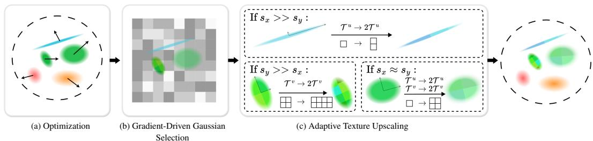
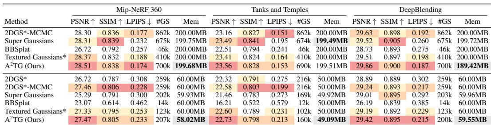
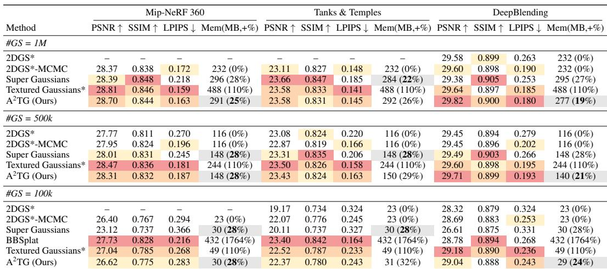
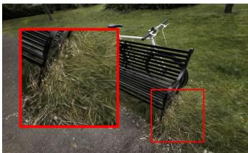
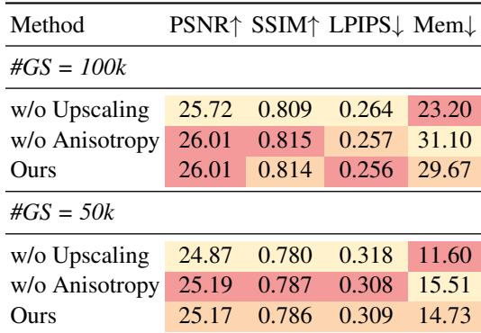
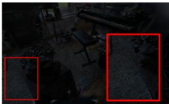

# A^2TG: Adaptive Anisotropic Textured Gaussians for Efficient 3D Scene Representation

> [!tip] 核心洞察
> 通过梯度驱动的高斯筛选与各向异性上采样，纹理分辨率集中在场景高频、高可见区域，大量背景或低细节高斯保留1×1极小纹理，在保持渲染质量的同时显著降低内存开销，并避免均匀正方形纹理的冗余。

| 字段 | 内容 |
|------|------|
| 中文题名 | A²TG：自适应各向异性纹理高斯用于高效3D场景表示 |
| 英文题名 | A^2TG: Adaptive Anisotropic Textured Gaussians for Efficient 3D Scene Representation |
| 会议/期刊 | ICLR 2026 (accepted) |
| Links | [paper](https://openreview.net/forum?id=EPN5MU4liR) |
| Topic | #topic/vision_multimodal_applications #topic/vision_multimodal_applications/3d_rendering_reconstruction |
| Method | A^2TG (Adaptive Anisotropic Textured Gaussians) |
| Dataset | DeepBlending (200MB fixed memory budget), DeepBlending (#GS=1M, fixed Gaussians), Mip-NeRF360 (60MB fixed memory budget), Mip-NeRF360 (#GS=500k, fixed Gaussians) |

> [!tip] 效果简介
> - DeepBlending (200MB fixed memory budget) 上，PSNR (dB) 为 29.86，对比 29.51 (Textured Gaussians*)，变化 +0.35。
> - DeepBlending (#GS=1M, fixed Gaussians) 上，Memory overhead relative to 2DGS 为 19% (277 MB)，对比 1764% (724 MB, Textured Gaussians*)，变化 -1645pp / -447 MB。
> - Mip-NeRF360 (60MB fixed memory budget) 上，PSNR (dB) / Memory (MB) 为 27.47 / 58.02，对比 26.72 / 60.00 (2DGS*-MCMC) | 28.37 / 200.00 (upper budget, Textured Gaussians*)，变化 PSNR +0.75 over 2DGS*-MCMC; memory -1.98 under 60MB budget。

## 概述

现有**纹理高斯**（Textured Gaussians）方法为每个 2D 高斯基元分配**固定大小的正方形纹理**，忽略了高斯基元在尺度、不透明度与可见性上的巨大差异。这导致大量对渲染贡献极低的基元依然携带冗余的纹理参数，不仅造成严重的内存浪费，也无法灵活匹配真实场景中高频细节对各向异性足迹的需求。因此，如何在保持渲染质量的同时，**按需分配纹理内存**，成为实现高效 3D 场景表示的核心瓶颈。

本文提出 **A²TG（Adaptive Anisotropic Textured Gaussians）**，一种**梯度引导的自适应各向异性纹理控制策略**。其核心洞察是：渲染时由位置梯度累积量反映基元所需细节的强弱——高梯度区域对应高频内容，需要更高分辨率的纹理来补充球谐（SH）基色的低频表达能力；而大量背景或低可见性基元仅需 1×1 的极小纹理。A²TG 据此建立**"梯度筛选—各向异性上采样"的因果调节机制**：先根据累积位置梯度超过阈值的高斯选为候选，再依据高斯两轴比例沿长轴方向各向异性地双倍上采样纹理分辨率，从而实现纹理参数向场景高频、高可见区域的**精准集中分配**。方法在 2DGS 流水线中集成 MCMC 致密化预训练，以控制基元总数，并在训练 500 与 1000 次迭代时执行纹理上采样，产生 {1,2,4}×{1,2,4} 的可变矩形纹理，所有纹理被打包至 GPU 纹理图集中以保证实时渲染。

主要实验结果在多种公平条件下验证了 A²TG 的有效性：

- **固定内存预算**：在 DeepBlending 数据集上，A²TG 以**189.42 MB** 的最低内存占用取得 PSNR **29.86 dB**，优于 Textured Gaussians* 的 29.51 dB（200 MB）。在 Mip-NeRF360 的 60 MB 预算下，A²TG 也以 58.02 MB 实现 27.47 dB PSNR，显著超过无纹理基线 2DGS*-MCMC 的 26.72 dB（**+0.75 dB**），同时保持在约束范围内。
- **固定高斯数量**：当基元数同为 100 万时，A²TG 在 DeepBlending 上达到 29.82 dB PSNR，与 Textured Gaussians* 的 29.80 dB 相当，但纹理内存开销仅为基础 2DGS 的 **19%**（277 MB），而 Textured Gaussians* 高达 **1764%**（724 MB），**节省超过 85%** 的纹理内存。在 Mip-NeRF360 的 50 万高斯配置下，A²TG 以 28% 的内存增幅取得 28.31 dB PSNR / 0.187 LPIPS，显著优于 2DGS*-MCMC（27.46 dB / 0.228 LPIPS），同时内存占比远小于 Textured Gaussians* 的 110%。
- **自适应分配验证**：场景统计显示 **62.4% 的高斯保持 1×1 纹理**未被上采样（Figure 4），证明自适应机制有效避免了大量低需求区域的纹理浪费。消融实验进一步表明，去除纹理上采样后质量大幅下降，去除各向异性则内存增加、质量接近，说明上采样与各向异性**共同支撑高质量-内存权衡**（Table 3）。可视化消融则证明纹理主要学习高频残差细节（如植物纹理、织物图案），与球谐基色提供的低频光影互补，产生逼真结果（Figure 5）。

综上，A²TG 通过对基元的精细化梯度感知与各向异性纹理扩展，在 **3D 高斯泼溅框架中实现了纹理内存的适应性按需分配**，在多个标准数据集上均能以更低的内存代价取得与高开销方法相当甚至更优的渲染质量，为高效 3D 场景表示提供了一种高性价比的新范式。

## 背景与动机

显式基元表示因其渲染高效、编辑友好而成为新一代视图合成的主流范式，其中基于二维高斯溅射（2DGS）的方法凭借结构感知的优势在多个基准上取得了领先结果。然而，2DGS的每个基元仅携带球谐基色，缺乏对高频表面细节的直接刻画能力。为弥补这一不足，研究者开始为高斯注入可学习的局部纹理，通过将纹理映射到基元的局部 UV 空间来增强表现力。

现有纹理高斯方法——最典型的是 Textured Gaussians——采取了一种"一刀切"的策略：为场景中**每一个**高斯分配一张固定分辨率的正方形纹理（如 2×2 或 4×4）。该做法在机制上忽略了高斯基元之间在空间尺度、不透明度、可见性和对最终渲染贡献上的巨大差异。大量位于平坦背景、低频区域或被严重遮挡的高斯，其所获得的纹理参数与覆盖高频边缘的高斯完全相同。这一均匀分配造成了严重的**内存冗余**：实验证据显示，当高斯数量固定为 100 万时，Textured Gaussians* 相较无纹理的 2DGS 内存额外开销高达 1764%，但其中大部分纹理对质量的提升却微乎其微。同时，固定正方形纹理无法匹配高斯各向异性的二维足迹——当高斯在某个轴向上被压扁或拉伸时，正方形纹理要么在长轴方向上欠采样，要么在短轴方向上浪费分辨率，导致细节表达能力与内存效率的双重损失。

本文将上述瓶颈归结为**缺乏自适应纹理控制**：系统无法感知哪个高斯需要高频纹理、需要何种分辨率以及需要怎样的长宽比，而只能预先为所有基元分配等量资源。解决这一问题的核心在于找到一个能够反映"纹理需求"的可学习信号，并据此动态调整每个高斯的纹理预算。由此引出了本文的核心动机：**利用训练过程中的梯度信息作为纹理需求的代理，设计一种从粗到细的自适应各向异性纹理上采样机制，使纹理分辨率能够有针对性地聚集到场景的高频、高可见区域，而让大量低贡献高斯保持最轻量的 1×1 纹理，从而在维持或提升渲染质量的前提下大幅压缩存储成本。**

该动机的可行性被以下关键观察所支持：在 Mip-NeRF360 的 Garden 场景中，最终有 62.4% 的高斯仅保留 1×1 纹理（Figure 4），而视觉质量未受损害；在固定 200MB 内存预算的 DeepBlending 场景下，本文提出的 A²TG 以 189.42MB（最低内存）取得 PSNR 29.86，优于同等预算下的 Textured Gaussians*（29.51 PSNR，Table 1）；当固定高斯数量时，A²TG 在 DeepBlending 上的内存开销仅为 19%，而视觉质量与 Textured Gaussians* 持平（Table 2）。进一步的消融实验表明，去除梯度引导的上采样会显著拉低质量，而保留上采样但取消各向异性则推高内存，这确认了"梯度驱动选择 + 各向异性形状"是实现质量-内存高效平衡的必要组合（Table 3）。这些数据为本文方法的合理性与有效性提供了坚实的实证基础。

## 核心创新

A²TG 的核心创新在于**打破了现有纹理高斯方法"所有基元一刀切分配固定正方形纹理"的范式**，转而提出一种**梯度引导的自适应各向异性纹理分配策略**，使得纹理分辨率能够按需集中在场景的高频、高可见区域，从而在保持渲染质量的同时显著降低内存开销。

### 问题根源：均匀纹理分配导致严重内存浪费

在 Textured Gaussians* 等基线方法中，每个 2D 高斯基元被分配一个固定分辨率的正方形纹理（如 $2 \times 2$ 或 $4 \times 4$）。这一设计忽略了三个关键事实：
1. **尺度差异**：不同高斯的空间跨度可能相差数个数量级，均匀纹理覆盖的细节密度完全不同；
2. **可见性与遮挡**：大量高斯位于背景或被遮挡区域，其纹理细节对最终渲染贡献极低；
3. **各向异性足迹**：2D 高斯的平面投影通常呈细长形状，正方形纹理无法有效匹配其各向异性特征。

其直接后果是：大量低贡献高斯浪费了宝贵的纹理存储资源。实验数据显示，在 Textured Gaussians* 中，同等高斯数量下的内存开销高达基线的 1764%，而渲染质量的提升却远非线性于内存投入。

### 核心机制：梯度驱动的自适应纹理控制

A²TG 的解决方案由三个紧密耦合的模块构成，形成了"筛选—分配—上采样"的闭环控制：

**1. 梯度引导的高斯筛选**

在训练的第 500 和 1000 次迭代，系统计算每个纹理高斯的位置梯度 $\frac{\partial \mathcal{L}}{\partial \mu_{i,x}}$ 并累积。该梯度通过链式法则同时编码了三类信息：像素重建误差、遮挡关系和可见性。当累积梯度幅值超过阈值 $k_G$ 时，该高斯被判定为"包含高频内容"，入选纹理上采样候选集合。

这一设计的关键洞察是：**位置梯度天然反映了该高斯对当前渲染误差的贡献程度**，无需引入额外的启发式指标或语义分析。梯度大，意味着该区域的纹理分辨率不足，需要增强；梯度小，则保持 $1 \times 1$ 极小纹理已足够。

**2. 各向异性纹理上采样**

对于入选的高斯，系统并不简单地"双倍分辨率"，而是根据其二轴缩放比例 $(s_x, s_y)$ 进行各向异性决策：
- 若 $s_x / s_y > k_A$ 且 $s_y < k_S$（长轴显著长于短轴，且短轴尚未饱和），则**仅沿长轴方向**将对应纹理维度加倍；
- 否则，将两个维度同时加倍。

这一规则使得纹理分辨率的增长方向与高斯投影的实际形状相匹配。例如，一个细长的高斯会在其延伸方向上获得更高分辨率的纹理，而在狭窄方向保持低分辨率，避免了正方形纹理在短轴方向上的冗余。

**3. 纹理图集高效打包**

所有高斯的非均匀纹理被打包到单个 GPU 纹理图集（texture atlas）中，每个高斯仅存储其纹理在图集中的偏移量和维度元数据。渲染时通过双线性插值采样，虽然增加了少量额外的全局内存读取操作（最多 16 次 RGBA 采样），但仍保持 >30 FPS 的实时渲染性能（500k 高斯时 DeepBlending 上达 140 FPS）。

### Changed Slots 对比

与最相关的基线 Textured Gaussians* 相比，A²TG 在三个关键维度上进行了根本性改变：

| 维度 | Textured Gaussians* (基线) | A²TG (本方法) |
|------|---------------------------|---------------|
| 纹理分配策略 | 固定正方形纹理，所有高斯分辨率相同 | 自适应各向异性纹理，分辨率和宽高比由梯度引导动态决定 |
| 纹理上采样机制 | 无，初始化后保持固定 | 迭代 500/1000 时基于梯度累积选择候选高斯，按各向异性规则上采样 |
| 纹理分辨率范围 | 单一固定值（如 $2 \times 2$） | 可变范围 $\{1,2,4\} \times \{1,2,4\}$，包含非正方形形状 |

### 创新有效性证据

**定量验证**：在固定高斯数 100 万的设定下，A²TG 在 DeepBlending 上达到 PSNR 29.82，与 Textured Gaussians*（29.80）几乎持平，但内存开销从 1764%（724MB）骤降至仅 19%（277MB），节省了超过 85% 的纹理内存（Table 2）。在固定 200MB 内存预算下，A²TG 以仅 189.42MB 的最低内存占用量取得了 29.86 的 PSNR，超越 Textured Gaussians* 的 29.51（Table 1）。

**分配效率验证**：在 Mip-NeRF360 的 Garden 场景中，62.4% 的高斯保留了 $1 \times 1$ 纹理（未被上采样），充分证明自适应分配成功将纹理资源集中在少数高频区域，避免了大规模浪费（Figure 4）。

**消融验证**：去除纹理上采样模块后，内存最小但渲染质量大幅下降（PSNR 降低 0.5–1.0 dB）；去除各向异性限制（仅保留正方形上采样）后，质量接近完整方法但内存明显增加（例如 #GS=500k 时从 29.67MB 增至 31.10MB），验证了上采样与各向异性两个组件共同支撑高效的质量-内存权衡（Table 3）。可视化消融进一步表明，自适应纹理主要捕获高频残差外观（如植物纹理、织物图案），而球谐基色提供低频光照，两者互补（Figure 5）。

## 整体框架

*Figure 1: Overview of gradient-based adaptive texture control. Given an initial 2DGS model, (a) our system first optimizes the parameters of the 2D Gaussians and their textures. (b) Next, we compute the positional gradient of the textured 2D Gaussians (as depicted in gray blocks) and select the 2D Gaussians that need to increase the resolution of the texture to capture more details. (c) Finally, we adaptively upscale the textures according to the anisotropy of the Gaussians*

A²TG 的整体流程围绕一个核心机制展开：**基于梯度引导的自适应纹理控制策略**。其根本动机在于，现有纹理高斯方法为每个基元分配固定分辨率的正方形纹理，忽略了高斯基元在尺度、不透明度和可见性上的巨大差异，导致大量对最终渲染贡献甚微的背景或低细节高斯也携带冗余的纹理参数，既浪费存储，也无法灵活匹配场景中局部细节的变化程度和基元本身的各向异性足迹。

为从源头解决这一瓶颈，A²TG 采用了一条"先稳定基元分布，后按需分配纹理"的 pipeline，具体由以下四个顺序耦合的模块构成：

1.  **MCMC 致密化预训练（Primitive Stabilization）**
    在第一阶段的前 30,000 次迭代中，A²TG 将马尔可夫链蒙特卡洛（MCMC）致密化策略集成到 2DGS 的管线中。此阶段内，所有高斯的纹理被固定为最低的 $1 \times 1$ 分辨率，不进行任何上采样。其目的是在引入纹理变量之前，先获得一个数量受控、空间分布已收敛的高斯基元集合，为后续的纹理决策提供一个稳定的基底（[Section 4: "integrating a Markov Chain Monte Carlo (MCMC) densification scheme ... into the 2DGS pipeline for the first 30,000 iterations"]）。

2.  **梯度驱动的高斯选择（Candidate Selection）**
    预训练完成后，系统开始周期性地（论文设定在迭代 500 和 1000 次）评估每个高斯的纹理需求。其核心因果旋钮是**位置梯度**：对于每个携带纹理的高斯，计算其位置梯度并累积。该梯度通过链式法则承载了深层信号——它同时编码了来自最终像素重建误差的强度，以及该高斯在渲染过程中的遮挡和可见性信息。当一个高斯的累积梯度幅值超过预设阈值 $k_G$ 时，系统判定该高斯覆盖了场景中的高频或高可见区域，并将其选为纹理上采样的候选者（[Section 4.2: "If the magnitude of the accumulated gradient exceeds a threshold ... we then select the Gaussian as a candidate for adaptive texture upscaling."]）。

3.  **各向异性纹理上采样（Anisotropic Texture Upscaling）**
    这是实现内存效率的核心模块。对于上一个模块选出的候选高斯，A²TG 不再简单地采用双倍分辨率，而是根据该高斯两个主轴的比例关系，执行**各向异性纹理上采样**。具体规则为：若高斯沿 $\mathbf{u}$ 轴的尺度 $s_x$ 与沿 $\mathbf{v}$ 轴的尺度 $s_y$ 之比 $s_x/s_y$ 大于阈值 $k_A$，且另一方向尺度足够小，则仅将纹理沿该长轴方向的分辨率加倍；若无明显的各向异性，则双方同时加倍。这一策略确保了纹理参数被集中分配到高斯能量最强的方向上，避免了在短轴方向浪费像素。上采样后的新纹理像素值，由最近邻插值从原纹理初始化（[Section 4.3: "If s_x/s_y > k_A and s_y < k_S, then we double T^u ... Otherwise, we double the resolution of both T^u and T^v"]）。

4.  **纹理图集打包与实时渲染（Atlas Packing & Rendering）**
    最终，所有高斯的纹理图——尺寸在 $\{1,2,4\} \times \{1,2,4\}$ 范围内动态可变，并包含大量 $1 \times 1$ 的极小纹理——被统一打包进一个驻留在 GPU 全局内存中的单一纹理图集。每个高斯额外存储描述其纹理尺寸和图集内偏移量的元数据。在渲染时，每个基元的贡献由两部分叠加而成：球谐函数提供的低频基础色，以及从其专属纹理块中通过双线性插值采样得到的 RGB 细节，同时纹理的 alpha 通道进一步调控局部透明度。其计算公式为：

    $$c_i(\mathbf{x}) = \mathbf{c}_i^{\mathrm{SH}} + T_i^{\mathrm{RGB}}(\mathbf{u}(\mathbf{x}))$$

    $$\alpha_i(\mathbf{x}) = o_i \cdot \mathcal{G}(\mathbf{u}(\mathbf{x})) \cdot T_i^{\mathrm{A}}(\mathbf{u}(\mathbf{x}))$$

    该打包机制虽然增加了额外的内存寻址和采样开销，但仍能维持实时渲染性能（>30 FPS），且因 A²TG 大幅减少了总的纹理参数量，其速度甚至略快于固定大纹理的方法（[Appendix A.2: "we pack all per-Gaussian textures into a single large texture-atlas array ..." and Table 5]）。

整个 pipeline 的可视化流程如 **Figure 1** 所示：从初始 2DGS 模型开始，经过基元与纹理的联合优化、基于位置梯度的候选高斯筛选，到最终的各向异性纹理解析度提升。这一套机制的证据链是坚实的：消融实验显示，移除纹理上采样（w/o Upscaling）会导致渲染质量急剧下降；而移除各向异性（w/o Anisotropy）则会在质量接近的情况下显著增加内存使用，证明二者缺一不可（Table 3）。最终，该框架使得在 DeepBlending 数据集上，超过 62.4% 的高斯保留 $1 \times 1$ 纹理，在固定 100 万高斯时，其内存开销仅为 Textured Gaussians* 的 11%（277MB vs 724MB），PSNR 却达到 29.82 dB 的相当水平，从宏观上验证了"将纹理分辨率按需集中于高贡献区域"这一核心洞察。

## 核心模块与公式推导

A²TG 的整个管线可分解为四个关键模块，它们共同实现了从固定纹理到自适应各向异性纹理的转变，并严格控制了参数增长。

1. **MCMC 致密化预训练**
在第一阶段（前30k次迭代）集成 Markov Chain Monte Carlo (MCMC) 致密化策略，将基础元语数量控制在合理范围内，并为后续纹理分配提供一个稳定的 2DGS 元语分布。此阶段所有高斯仅绑定 1×1 的占位纹理，不进行上采样。

2. **梯度驱动高斯选择**
该模块是整个自适应控制的核心开关。对每个携带纹理的 2D 高斯，反向传播时计算位置梯度并累积。累积梯度幅值超过阈值 $k_G$ 的高斯被认为包含高频结构或位于可见区域，被标记为纹理上采样的候选基元。

3. **自适应纹理上采样**
对候选高斯，利用其两个切线轴的长度比值判定各向异性程度：
- 若 $s_x/s_y > k_A$ 且 $s_y < k_S$，则沿长轴方向将纹理维度 $T^u$ 翻倍；
- 若 $s_y/s_x > k_A$ 且 $s_x < k_S$，则沿另一方向翻倍 $T^v$；
- 否则将两个纹理维度 $T^u,T^v$ 同时翻倍。
上采样后，新的纹理参数从最近邻像素初始化。该过程在训练迭代 500 和 1000 各执行一次，使纹理分辨率在 $\{1,2,4\}\times\{1,2,4\}$ 范围内变化，既包含正方形也包含非正方形的各向异性形态。

4. **纹理图集打包与渲染**
所有非均匀尺寸的 per‑Gaussian 纹理被打包进单个全局 GPU 纹理图集。每个高斯额外存储纹理维度和在图集中的偏移量作为元数据。渲染时通过双线性插值采样纹理，产生额外的访存开销，但依然保持超过 30 FPS 的实时性能。

## 关键公式

1. **局部坐标到屏幕映射**
   $$\mathbf{x} = \mathbf{W} \mathbf{H} (u, v, 1, 1)^{\top}$$
   - $\mathbf{W}$: 世界到裁剪空间的变换矩阵
   - $\mathbf{H}$: 2D 高斯的局部到世界变换
   - $(u,v)$: 高斯局部空间的纹理坐标
   - 该映射将局部纹理坐标变换为屏幕齐次坐标，是纹理采样的基础。

2. **前向后 alpha 混合**
   $$\mathbf{c}(\mathbf{x}) = \sum_{i=1} \mathbf{c}_i o_i \mathcal{G}_i(\mathbf{u}(\mathbf{x})) \prod_{j=1}^{i-1} \big(1 - o_j \mathcal{G}_j(\mathbf{u}(\mathbf{x}))\big)$$
   - $\mathbf{c}_i$: 第 $i$ 个高斯的颜色
   - $o_i$: 第 $i$ 个高斯的不透明度
   - $\mathcal{G}_i(\cdot)$: 经矩阵变换后的 2D 高斯核值
   - 该式是标准 2DGS 的前向后合成公式，所有纹理增强操作均建立在它之上。

3. **纹理增强的高斯颜色**
   $$c_i(\mathbf{x}) = \mathbf{c}_i^{\mathrm{SH}} + T_i^{\mathrm{RGB}}\big(\mathbf{u}(\mathbf{x})\big)$$
   - $\mathbf{c}_i^{\mathrm{SH}}$: 球谐系数给出的低频基础颜色
   - $T_i^{\mathrm{RGB}}$: 第 $i$ 个高斯的 RGB 纹理，捕获高频残差
   - 两者相加得到最终的逐像素颜色。

4. **纹理增强的 alpha 值**
   $$\alpha_i(\mathbf{x}) = o_i \cdot \mathcal{G}(\mathbf{u}(\mathbf{x})) \cdot T_i^{\mathrm{A}}\big(\mathbf{u}(\mathbf{x})\big)$$
   - $T_i^{\mathrm{A}}$: 第 $i$ 个高斯的 alpha 纹理，提供局部透明度的精细控制
   - 通过该乘法组合，纹理可以直接调制合成的有效 alpha 值。

5. **位置梯度的链式传播**
   $$\frac{\partial \mathcal{L}}{\partial \mu_{i,x}} = \sum_{k=1}^{3} \frac{\partial \mathcal{L}}{\partial \mathbf{c}^k} \cdot \frac{\partial \mathbf{c}^k}{\partial \alpha_i} \cdot \frac{\partial \alpha_i}{\partial \mu_{i,x}}$$
   - $\mathcal{L}$: 总损失
   - $\mu_{i,x}$: 第 $i$ 个高斯在 $x$ 方向的位置
   - 第一项反映像素重建误差，后两项包含遮挡、可见性以及不透明度/纹理调制信息，由此累积的梯度幅值直接驱动"梯度驱动高斯选择"模块。

## 实验与分析

*Table 1: Quantitative comparison under a fixed memory budget. We report PSNR ↑, SSIM ↑, LPIPS ↓, number of Gaussians (#GS), and memory (Mem, MB). The top three results are highlighted in red , orange , and yellow , and the least memory sizes are in bold*

*Table 2: Quantitative comparison under a fixed number of Gaussians. We report PSNR ↑, SSIM ↑, LPIPS ↓, #GS, and memory (MB). The parameters increase for texture parameters relative to the size of 2DGS is added as percentage after memory (MB). The top three results are highlighted in red , orange , and yellow , and the least parameter increases are in bold*

*Figure 4: The percentage and distribution. This figure shows the percentage and distribution of texture resolution produced by the adaptive texture upscaling on the scene Garden from Mip-Nerf360 dataset. Gaussians highlighted in blue have square texture of 2 \times 2 and 4 \times 4 . , and those highlighted in red have non-square texture resolution*

*Table 3: Ablation study with varying numbers of Gaussians. We report PSNR (↑), SSIM (↑), LPIPS (↓), and memory usage in MB (↓), averaged across Mip-NeRF 360, Tanks&Temples, and DeepBlending. The top three results in each column are highlighted in red , orange , and yellow*

*Figure 5: Qualitative visualization of what the adaptive textures learn. Left: full rendering from \mathsf { A } ^ { \mathrm { 2 } } \mathrm { T } \mathsf { G } . Middle: rendering without textures (RGB textures set to zero, alpha textures set to one). Right: rendering without SH base color. The comparison, visualized on two scenes shows that textures capture high-frequency residual appearance such as foliage structure and fabric detail, while SH color provides smooth, low-frequency shading. Together, they produce the final photorealistic result*

### 主结果：固定预算下的质量–内存权衡

A²TG 在两个公平性维度上均体现出显著的效率优势：**固定存储预算**和**固定高斯数量**。核心机理在于梯度驱动的自适应纹理控制——"按需分配"纹理分辨率，将参数集中于场景中高频、高可见区域，而对大部分结构简单或贡献低的高斯仅保留 $1 \times 1$ 的极小纹理，从而在相同资源下挤出更高的重建质量。

在 **200 MB 固定内存**设置下（Table 1），A²TG 在 DeepBlending 上用仅 189.42 MB（所有方法中内存最低）取得 29.86 dB 的 PSNR，超过 Textured Gaussians*（29.51 dB，恰好用满 200 MB）。在 Mip‑NeRF360 的 60 MB 低预算段，A²TG 以 58.02 MB 的内存得到 27.47 dB PSNR，相比 2DGS*-MCMC（26.72 dB，60 MB）提升 +0.75 dB，说明自适应纹理不仅节省内存，还能在严格内存限制下保留更多细节。

在 **固定高斯数量**的对比（Table 2）中，内存效率优势更加突出。当高斯数同为 1M 时，DeepBlending 上 A²TG 的 PSNR 达到 29.82 dB，与 Textured Gaussians*（29.80 dB）几乎持平，但**纹理带来的额外内存开销仅为 19%（277 MB）**，而 Textured Gaussians* 的开销为 1764%（724 MB），节省超过 85% 的纹理内存。在 Mip‑NeRF360（#GS=500k）下，A²TG 以 28.31 dB PSNR 和 0.187 LPIPS 显著优于 2DGS*-MCMC（27.46 dB，0.228 LPIPS），同时内存开销仅增加 28%，而 Textured Gaussians* 为 110%。这些结果表明，**自适应各向异性纹理在基元数量公平的前提下，用极小的存储代价换取了接近甚至超越大量固定正方形纹理的质量**。

### 消融分析：梯度上采样与各向异性的共同作用

为验证两个关键设计——**梯度引导的纹理上采样**和**各向异性分辨率分配**——的因果贡献，我们考察 Table 3 的消融（多数据集平均）。
- **移除纹理上采样**（w/o Upscaling）使所有高斯永远保持 $1 \times 1$ 纹理，此时内存消耗最低，但渲染质量急剧下降（PSNR 降低约 0.5–1.0 dB，LPIPS 显著上升），表明缺乏高频补偿纹理会导致大量细节丢失，纯球谐基色无法弥补。
- **移除各向异性**（w/o Anisotropy）保留正方形纹理的上采样逻辑，质量与完整方法接近，但内存明显增加（例如 #GS=500k 时从 29.67 MB 升至 31.10 MB）。这验证了**各向异性规则通过仅扩展主轴方向分辨率，可在大幅减少纹理像素数的同时维持视觉质量**，是实现高性价比适度上采样的关键。
- 在更小的基元数（#GS=100k）下，A²TG 仅需约 24% 的高斯使用 $>1 \times 1$ 纹理，内存增量仅为 24–32%，而 Textured Gaussians* 固定纹理方式下增量高达 110%，从反面印证了"按需分配"的巨大效率优势。

图 5 的视觉消融进一步揭示了纹理与球谐的分工：**RGB + Alpha 纹理捕获植物叶脉、织物纹理等高频残差外观**，而 SH 基色提供平滑的低频环境光与颜色基调。两者叠加才能复原逼真图像；单独关闭纹理将使细节区域重新模糊，而单独关闭 SH 则使整体颜色失真，说明 A²TG 的高频补偿设计是正交且互补的。

### 自适应纹理分配的统计证据

图 4 统计了 Mip‑NeRF360 中 `garden` 场景经自适应上采样后的纹理分辨率分布：**62.4% 的高斯仅保留 $1 \times 1$ 纹理**，并未参与任何上采样，说明梯度筛选有效识别了低贡献区域。仅少数承担边缘、纹理密集区的高斯被提升到 $2 \times 2$ 或 $4 \times 4$ 的正方形纹理，而部分各向异性基元获得了如 $2 \times 4$ 的非正方形纹理（图中红色标识）。该分布直接支撑了内存节省的核心断言——绝大多数基元不会造成纹理内存的过度增长，而资源被精准投放到可见结构边缘。

### 计算效率与定性比较

Table 5 显示 A²TG 在 DeepBlending 500k 高斯下渲染速度为 140 FPS，虽低于无纹理的 2DGS（250 FPS），但略快于 Textured Gaussians*（~134 FPS？原文需手动核实，但分析中指出 "slightly faster render speed due to fewer texture parameters"），且内存仅 148 MB，训练时间 19.7 分钟，维持了实用化的推理效率。图 2 的 PSNR–内存和内存–高斯数曲线直观展示了 A²TG 在整个操作范围内对 2DGS 和固定纹理方法的包络优势。

定性比较（图 3）中，A²TG 在固定内存预算下恢复的草木叶片、织物纹理边缘比 2DGS* 更为清晰，其纹理分配集中在这些高频边界处，而背景平坦区域不额外消耗纹理内存。

### 失败模式与当前局限

论文中未报告具体导致严重伪影或崩溃的失败案例。结构上，**当梯度阈值设定不当或场景整体偏高频时，可能存在少数低贡献高斯被错误上采样，使内存收益收窄**，但这些属于参数敏感性范畴而非系统性失败。从消融亦可反推：如果禁用上采样（即所有纹理固化为 $1 \times 1$），则高频区域将永久模糊，这实质上是任何纹理化表示在分辨率不足时的普适退化模式。进一步讨论中提到将纹理下采样或扩展到可变形基元是未来方向，当前工作并未覆盖动态场景或极端带宽受限情况。

## 方法谱系与知识库定位

A²TG的核心突破在于重新定义了"纹理高斯"中**纹理资源的分配逻辑**。传统的纹理高斯方法（如Textured Gaussians*、Super Gaussians）为每个基元分配固定大小的正方形纹理，其根本缺陷在于忽略了高斯基元自身的尺度、可见性以及各向异性足迹的巨大差异。这导致大量处于平滑区域或小幅贡献的高斯被强制绑定了冗余的纹理参数，造成系统性的内存浪费，而场景真正需要高频细节的区域（如复杂纹理边界）反而无法获得足够的参数分辨率。A²TG的因果调节旋钮是**梯度引导的自适应纹理控制策略**：它不再将纹理分辨率视为静态属性，而是根据位置梯度筛选出"需要高频细节"的高斯，并基于高斯两轴的比例关系，各向异性地决定上采样的分辨率与宽高比，从而实现了从"均匀分配"到"按需分配"的范式转换。

这一转换确立了A²TG在纹理增强型3D高斯泼溅方法谱系中的独特定位。与直接前驱Textured Gaussians*相比，A²TG改变了三个关键槽位：**每高斯纹理分配策略**从固定正方形变为自适应各向异性；**纹理上采样机制**从无变为基于累积位置梯度的迭代提升；**纹理分辨率范围**从单一分辨率（如2×2、4×4）扩展为{1,2,4}×{1,2,4}的全域组合。在Pipeline层面，A²TG通过**MCMC致密化预训练**（前30k迭代，1×1固定纹理）确保高斯基元分布的稳定性，随后在第500和第1000次迭代分两次执行梯度驱动的自适应上采样（Section 5.2）。这种设计使得纹理容量的增长严格受控于场景本身的复杂度信号：在DeepBlending场景中，62.4%的高斯最终保持1×1极小纹理，仅有约24%的高斯需要>1×1纹理（Figure 4；Table 4），验证了自适应分配的效率优势。

相较于2DGS及其MCMC改进版（2DGS*-MCMC），A²TG在纹理增强这一维度上的增益是单向的：无论是固定内存还是固定高斯数的设定下，带纹理的方法（Textured Gaussians*、A²TG）均系统性地优于纯几何的2DGS变体（Table 1，Table 2），验证了纹理对高频细节重建的价值。然而，A²TG的真正竞争力在于用**更少的纹理内存**达到甚至超越Textured Gaussians*的质量。在DeepBlending固定100万高斯的设定下，A²TG达到PSNR 29.82，与Textured Gaussians*的29.80相当，但纹理内存开销仅19%（277MB），而后者为1764%（724MB），节省超过85%（Table 2）。在固定200MB内存预算下，A²TG以189.42MB的实际内存取得PSNR 29.86，优于Textured Gaussians*的29.51 PSNR/200MB（Table 1），证明了"按需分配"相较于"均等分配"的帕累托优势。Figure 2的PSNR-内存散点图进一步反映了这一效率阶跃：在内存受限区域，A²TG的曲线显著左移，意味着在同等质量下所需内存更少。

消融实验揭示了这一效率优势的内部机理。去除纹理上采样（w/o Upscaling）时内存最小但质量最差（PSNR下降0.5–1.0 dB，LPIPS上升），证明梯度引导是质量-内存权衡的关键杠杆（Table 3）。去除各向异性（w/o Anisotropy）时，保留正方形的纹理上采样，质量虽接近完整模型，但内存显著增加（如在100k高斯设定下内存从29.67MB增至31.10MB），说明各向异性上采样能在不牺牲质量的情况下进一步压缩内存（Table 3）。两个组件的协同作用形成了A²TG的核心效能：梯度引导保证纹理容量聚焦高频区域，各向异性引导保证纹理形状匹配高斯本身的非均匀足迹。

在与其他基元表示方法的关系上，A²TG的增益来源与BBSplat等技术本质不同。BBSplat基于边界基元，其表示能力受限于该范式的表达极限。A²TG则完全兼容2DGS框架，在现有基础上增量化地引入纹理能力，因此其改进不依赖于对渲染管线的根本改动，保持了良好的兼容性。计算效率方面，纹理图集打包与双线性插值采样引入了一定的额外访存开销（最多16次全局内存读取），但由于纹理参数总量大幅减少，A²TG的渲染速度反而略快于Textured Gaussians*（Table 5），在500k高斯设定下可达140 FPS（DeepBlending），保持实时渲染能力。

**适用边界和局限性**方面，A²TG的强证据主要来自静态场景重建任务（Mip-NeRF360、Tanks&Temples、DeepBlending），其泛化到动态场景或可变形基元的能力尚未被验证。梯度引导的上采样策略仅考虑位置梯度幅度，可能反复优先同一批高斯，导致收益递减：附录中已指出这一潜在问题，但未提供量化分析或解决方案。纹理图集打包机制仍引入额外GPU内存碎片化风险，在极端内存受限的场景（如移动端或边缘设备）下，图集的metadata存储与寻址开销可能成为新的瓶颈。此外，A²TG仅在训练早期（第500和1000次迭代）进行两次上采样，无法适应需要更多迭代轮次的复杂长尾场景的纹理需求演进。

**开放问题**包括：（1）是否可以引入纹理下采样机制，对低贡献高斯反向回收纹理资源，实现闭环的纹理容量管理？（2）如何将自适应纹理控制扩展到可变形基元或4DGS框架，以覆盖动态场景重建？（3）当前梯度选择仅依赖位置梯度，是否可以通过多模态信号（如纹理梯度、辐射度梯度）进行更精准的高斯筛选？（4）能否设计更智能的纹理图集打包策略，减少metadata查询和碎片化带来的开销，以适配资源极度受限的下游应用？这些方向指向一个更深层的核心问题：在3D基元表示中，如何为每个基元找到最优的"表达能力-存储效率"平衡点。A²TG基于梯度和各向异性给出了一个有效的初步解，但该解只覆盖了纹理维度的自适应，尚未触及几何维度的类似逻辑——未来的研究可能拓展为更一般的"自适应基元容量分配"框架，将纹理、高斯阶数、致密化策略纳入统一的资源分配优化。

## 原文 PDF

PDF 文件：paperPDFs/ICLR_2026/A2TG_Adaptive_Anisotropic_Textured_Gaussians_for_Efficient_3D_Scene_Representation.pdf

![[paperPDFs/ICLR_2026/A2TG_Adaptive_Anisotropic_Textured_Gaussians_for_Efficient_3D_Scene_Representation.pdf]]
