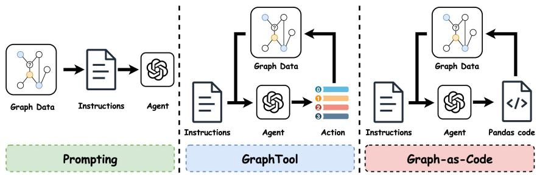
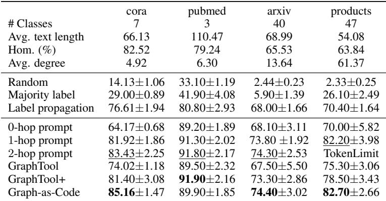
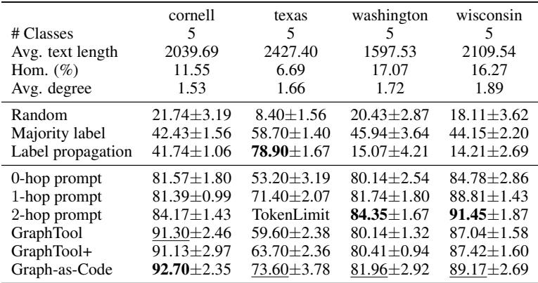
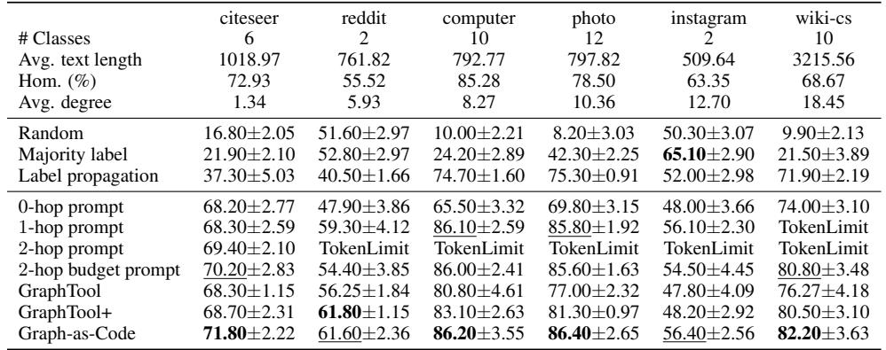
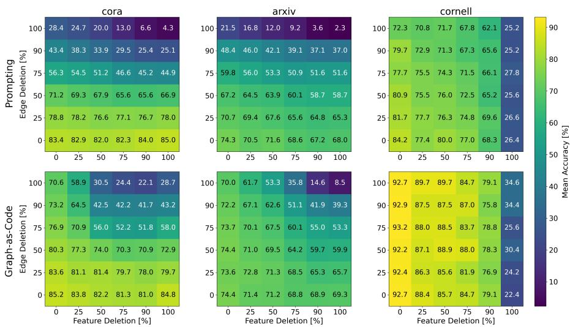
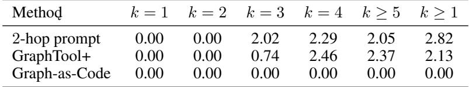

# Actions Speak Louder than Prompts: A Large-Scale Study of LLMs for Graph Inference

> [!tip] 核心洞察
> LLM作为代码生成器能够通过程序化查询动态切换对结构、特征和标签的依赖，从而在长文本、高同配性和异配性图上均取得最优或高度竞争的性能，且比经典提示方法更鲁棒、更节省token。

| 字段 | 内容 |
|------|------|
| 中文题名 | 行动胜于提示：大语言模型在图推断任务上的大规模研究 |
| 英文题名 | Actions Speak Louder than Prompts: A Large-Scale Study of LLMs for Graph Inference |
| 会议/期刊 | ICLR 2026 (accepted) |
| Links | [paper](https://openreview.net/forum?id=MgJUj9Sk3C) |
| Topic | #topic/generative_models_diffusion #topic/generative_models_diffusion/generative_models_and_autoencoders |
| Method | Graph-as-Code |
| Dataset | cora, pubmed, cornell, texas |

> [!tip] 效果简介
> - cora 上，Accuracy (%) 为 85.16±1.47，对比 83.43±2.25 (2-hop prompt)，变化 +1.73。
> - pubmed 上，Accuracy (%) 为 89.90±1.85，对比 91.90±2.16 (GraphTool+)，变化 -2.00。
> - cornell 上，Accuracy (%) 为 92.70±2.35，对比 87.82±2.97 (2-hop prompt)，变化 +4.88。

## 概述

让大语言模型（LLM）在图上进行推断的核心瓶颈在于，传统的提示（serialization）与工具调用范式受限于固定的上下文窗口和僵化的检索机制，难以高效、自适应地同时利用图的拓扑结构、节点特征与标签信息。尤其在文本较长或需要访问高阶邻居的场景下，静态提示极易超出 token 预算，且无法按需选择信息，导致性能退化。

本文提出了 **Graph-as-Code** 方法，将对 LLM 与图的交互从"单次注入静态提示"转变为"迭代生成并执行代码"的范式。在该框架中，图数据被表示为一个以节点为行的结构化 DataFrame，LLM 在每一轮推理后生成精确的 pandas 查询，由执行环境返回所需的结构、特征或标签结果，模型据此进一步推理并决定下一步动作或输出最终预测。这种"按需、手术式"的信息检索方式，使得模型能够灵活组合拓扑、文本和标签这三种信号，其核心机制在于将交互的控制权从预设的提示模板转移到 LLM 自身的代码生成与执行能力。

实验结果表明，Graph-as-Code 在短文本同配图、异配图以及长文本同配图等多个基准测试中均取得了最优或次优的准确率，例如在 cora 数据集上达到 85.16%，在 cornell 上达到 92.70%，在 computer 和 photo 上分别达到 86.20% 和 86.40%（Table 1、Table 2、Table 3）。相比于 2-hop 提示，它在边随机删除、文本截断和部分标签隐藏的消融实验中表现出更强的鲁棒性；在极端条件下（如所有边被删除或文本被完全截断），Graph-as-Code 仍能保留较高精度，体现出灵活的依赖转移能力（Figure 2、Figure 4）。在合成的最短路径长度预测任务中，Graph-as-Code 对所有路径长度均实现了零误差，而提示和工具调用在路径长度 ≥3 时 MSE 急剧上升（Table 10）。此外，邻接矩阵随机打乱导致其性能大幅下降（cora 上由 85.16% 降至 56.50%），证实其性能真正依赖于真实图结构，而非代码生成的先验（Table 9）。

总体而言，Graph-as-Code 确立了一种新的 LLM 与图交互范式：通过将图访问交给程序化执行，模型能够在 token 预算受限的情况下更精准、更灵活地利用图的多元信息，在准确率、鲁棒性和算法推理能力上均显著优于传统提示与工具调用方法。该研究目前仅聚焦于节点分类任务，其向更大规模图、其他图机器学习任务以及跨语言/多模态场景的拓展，仍待进一步探索。

## 背景与动机

图结构数据广泛存在于学术网络、社交平台与知识库中。利用大语言模型（LLM）在图上进行推理，特别是节点分类，已成为一个活跃的研究方向。其核心挑战在于如何让语言模型有效访问并融合图拓扑、节点文本特征以及邻居标签三类异质信息，而每一次交互都受到有限的上下文窗口（token budget）约束。

现有的 LLM-图交互策略可归为两大类：**静态提示** 与 **工具调用**。提示式方法（如图 1 左侧所示）将目标节点及其 k-hop 邻域的文本描述和邻居标签一次性序列化为一轮对话提示，然后交由模型进行零样本预测。这种模式高度依赖上下文窗口的大小：对于短文本、小邻域的图，2-hop 提示往往能捕获足够的结构信号；但当节点文本较长（如 Reddit 帖子、产品描述）或邻域规模较大时，完整 2-hop 序列化常超出 token 上限，迫使研究者采用随机采样的 budget-prompt，而这类静态截断无法保证截取到与推理最相关的信息。更根本的是，一次性注入全部邻域信息会使模型淹没在无关或低质文本中，缺乏按需筛选的机制。

为克服提示的僵化性，GraphTool 将节点分类重构为"思考-行动-观察"的迭代循环：模型依次调用拓扑查询、特征查询、标签查询等固定动作，逐步收集信息直至做出最终决策。GraphTool+ 进一步扩充了精确 k-hop 的特征与标签批量检索动作。这类工具调用模式提供了一定的交互灵活性（Figure 1 中间），但其动作集合本质上是离散且预定义的，难以组合多个条件（例如"获取标签为 A 的 2-hop 邻居中那些包含关键词 B 的节点特征"）。在实际使用中，模型不得不生成多步往返调用并手动拼接结果，既占用大量对话轮次，又无法保证查询的精确性，导致在需要精细组合结构、特征和标签的任务上效率低下。

上述缺陷揭示了一个关键瓶颈：**固定上下文窗口与僵化检索机制严重制约了 LLM 对图拓扑、节点特征和标签的自适应利用**。尤其在长文本、高异配性或需要高阶邻域信息的场景下，现有方法要么超出 token 预算，要么因无法手术式地组合信息而性能受限。

这一观察直接驱动了本文的核心动机——将 LLM-图交互从被动接受文本序列提升至主动生成和执行代码的 **Graph-as-Code** 范式。在该范式下，图数据被表示为一个以节点 ID 为索引的 DataFrame，列分别为特征、邻居列表和标签。模型不再被限制于固定的查询原语，而是迭代地生成增量的 pandas 程序，通过执行器在受控环境中运行并获得结构化结果，进而推理下一步决策。这种"思考 → 生成代码 → 执行 → 观测结果"的循环（Figure 1 右侧）使模型能够按需动态组合结构化查询、标签传播和文本特征过滤，就像一个拥有完整 SQL/DataFrame 能力的分析师，而非带着固定"工具包"的检索机器。

实证驱动方面，初步观察表明：针对短文本同配性数据集（如 Cora），2-hop 提示已能取得 83.43% 的准确率（Table 1），但该方法在长文本异配性场景下因 token 限制或检索粗放而严重失效；Graph-as-Code 则有望通过外科手术式的信息检索和灵活的代码执行，同时具备对这些限制的强鲁棒性，从而在一系列有挑战性的零样本图推断基准上实现显著提升。本文正是为了系统检验这一假设，并揭示代码生成策略在 LLM-图交互中的真实潜力。

## 核心创新

LLM在图节点分类任务中的瓶颈并非模型本身的推理能力不足，而是**LLM与图结构之间的交互方式存在根本性限制**。传统的静态提示（如2-hop prompt）将目标节点及其全部邻域的文本、标签塞入单次上下文（changed slot: `graph_interaction_mode` 基线），导致信息冗余、token预算超标，且在长文本或高阶邻居时失效。工具调用模式（GraphTool/GraphTool+）虽允许迭代查询，但受限于固定动作集，无法按需组合结构、特征与标签。两者共同的问题在于采用图信息的**静态序列化**（changed slot: `graph_representation` 基线）和**全量注入**（changed slot: `information_retrieval` 基线），无法实现手术式的信息检索。

Graph-as-Code（本文提出的核心交互范式）将图重新定义为**结构化表格**（DataFrame，列为 `features`、`neighbors`、`label`），**LLM的角色从直接阅读图变为生成并迭代执行pandas查询**（changed slot: `graph_interaction_mode`）。这种转变的因果效应是使模型可以**按需检索**（changed slot: `information_retrieval`）——例如仅取2-hop邻居的标签（token消耗极低）而忽略冗余特征，或仅聚合指定条件的信息，从而在受限的上下文窗口内实现高度自适应。其核心洞察在于：LLM作为代码生成器，能够动态、高效地组合图拓扑、节点特征与标签依赖，而非被动接受一个固定的文本化邻域。

这一创新获得强有力的实验支撑：

- **准确率优势**：在短文本同配性 (`cora` 85.16 vs. 83.43, Table 1)、异配性 (`cornell` 92.70 vs. 87.82, Table 2) 及长文本数据集 (`computer` 86.20 vs. 86.00, Table 3) 上，Graph-as-Code均取得最佳或高度竞争的性能，且一致超过静态提示和工具调用。
- **依赖转移的鲁棒性**：边删除、文本截断、标签部分隐藏的联合消融显示，Graph-as-Code能在结构或特征严重受损时，灵活地将依赖转向剩余可用信息，而2-hop提示性能塌缩（Figure 2, 3, 4）。极端情况下去掉所有边或全部文本时，该方法仍保留相当精度。
- **高阶图推理零误差**：在合成的最短路径长度预测任务中，Graph-as-Code对 $k=1..4$ 路径长度实现 **MSE=0.00**，而提示和GraphTool+在 $k\ge3$ 时MSE急剧上升（Table 10），证明其可执行精确的多跳拓扑推理。
- **对真实图结构的真实利用**：将邻接矩阵随机打乱后，Graph-as-Code在 `cora` 上准确率从85.16降至56.50（Table 9），说明模型真正依赖图结构进行决策，而非仅凭代码先验猜测。

需要指出的是，该范式的成功高度依赖LLM的代码生成能力：在小模型（如Llama）上提升幅度有限，且需要在受控环境中安全执行代码（失败模式）。此外，在个别数据集上（`pubmed`, `washington`）未达到绝对最优，表明该模式的收益与图特征分布及模型规模相关，但其整体鲁棒性和token效率已构成明确的创新突破。

## 整体框架

*Figure 1: Illustration of the LLM-graph interaction strategies described in Section 3.1*

Graph-as-Code 将传统的静态提示式 LLM-图交互转变为迭代的"代码生成-执行-推理"循环，整个流程围绕四个核心模块展开，形成一条完整的信息获取与决策管道（图数据以结构化表格形式输入，最终输出节点类别预测）。

**输入表示**
图数据被组织为一张类型化表格（DataFrame），以 `node_id` 为索引，列分别包含 `features`（文本特征）、`neighbors`（邻居节点 ID 列表）和 `label`（整数或空值）。这一表示同时容纳拓扑、特征和标签三类信息，为后续程序化检索提供了统一的接口。

**核心循环与模块协作**
1. **推理模块（Reasoning）**
   根据当前已获得的信息（目标节点特征、已知邻居标签等），进行自然语言推理，判断还缺少何种信息才能做出可靠决策，并规划下一步的查询方向。

2. **代码生成模块（Code Generation）**
   将推理决策转化为对底层 DataFrame 的有效 pandas 查询（例如 `df.loc[133][['features','label']]`），允许按需组合列过滤、邻居索引、聚合等操作，实现"手术式"信息检索。

3. **代码执行器（Code Executor）**
   在受控环境中执行生成的代码，返回结构化结果（文本、标签或列表）。执行器保证了查询过程安全、确定，且结果精炼，避免了大量无关文本进入上下文。

4. **决策模块（Decision）**
   根据执行返回的新信息判断是否已足够完成预测。若足够，则输出最终答案 `Answer [class_id]`；否则将新信息追加到对话历史，重新进入推理-生成-执行循环。

**输出与交互模式对比**
与传统单轮提示（将邻域全量文本一次性注入）不同，Graph-as-Code 的迭代式代码生成使 LLM 能够动态地、按需地切换对结构、特征和标签的依赖。这种"程序化交互"在保持高精度的同时，显著降低了 token 消耗，并在边删除、文本截断、标签部分隐藏等消融场景下表现出更强的鲁棒性（参见 Figure 2-4）。整个框架仅通过定义清晰的表格接口和代码执行环境，而不依赖额外的工具调用动作空间或预定义检索模板，从而保持了简洁且可扩展的流程。

## 核心模块与公式推导

### 结构化图表示

Graph-as-Code 将图数据组织为一张以 `node_id` 为索引的 DataFrame。该表格包含三列：

- `features`：节点的文本特征（字符串类型）
- `neighbors`：邻接节点 ID 列表
- `label`：节点标签（整数或 `None`，未知时为空）

这种结构化表示使得 LLM 能够通过 pandas 表达式对图的结构、特征和标签进行组合式检索，替代传统提示方法中一次性序列化全部邻域文本的方式。

### 核心模块

Graph-as-Code 的工作流程由以下四个模块构成一个迭代循环：

1. **推理模块**：根据当前已获取的信息（目标节点特征、已知邻居标签等）分析缺失数据，规划下一步需要查询的内容。输出自然语言推理链。

2. **代码生成模块**：将推理决策转化为对底层 DataFrame 的有效 pandas 查询。LLM 可对 `df` 的任意列进行查询、过滤、聚合等操作，例如 `df.loc[133][['features','label']]` 或检索特定跳数邻居的标签。

3. **代码执行器**：在受控环境中执行 LLM 生成的代码，返回结构化结果（文本、标签或列表）。执行环境仅暴露 DataFrame 的只读操作，确保安全性。

4. **决策模块**：判断是否已收集足够信息进行最终预测。若条件满足，输出 `Answer [class_id]` 结束循环；否则回到推理模块，利用新返回的数据继续下一轮。

### 关键公式

**Token 序列集合**

$$\mathcal{T} = \bigcup_{n>0} \Sigma^n$$

其中 $\Sigma$ 为基础词汇表。该集合包含所有有限长度的 token 序列，用于定义 LLM 的输入输出空间。

**图的形式化定义**

$$G = (V, E, X, Y)$$

- $V$：节点集合
- $E$：边集合
- $X$：节点的文本特征
- $Y$：节点标签

图为无权重图，所有实验均基于此定义构建图数据。

**三种 LLM-图交互模式的签名**

$$\phi_{\mathrm{prompt}}, \phi_{\mathrm{tool}}, \phi_{\mathrm{code}} : \mathcal{T} \times \mathcal{T}^N \times \{0,1\}^{N \times N} \to \mathcal{T}$$

三种交互模式均将对话历史、$N$ 个节点的文本特征以及 $N \times N$ 的邻接矩阵映射为 token 序列。区别在于映射过程的实现机制：

- $\phi_{\mathrm{prompt}}$ 为单轮静态提示，一次性将所有信息序列化
- $\phi_{\mathrm{tool}}$ 为迭代式工具调用，通过预定义的动作集合与图环境交互
- $\phi_{\mathrm{code}}$ 为 Graph-as-Code，通过生成并执行程序化查询实现手术式信息检索

**标签传播公式**

$$\hat{A} = D^{-1}A, \quad \hat{Y} = \hat{A}^{\ell} Y, \quad \ell = 10$$

其中 $A$ 为原始邻接矩阵，$D$ 为度矩阵（对角线元素 $D_{ii} = \sum_j A_{ij}$），$\hat{A}$ 为随机游走归一化的邻接矩阵。$Y$ 为 one-hot 标签矩阵，$\hat{Y}$ 为 $\ell=10$ 步迭代传播后的预测分数。每个节点取得分最高的标签作为预测结果，该基线仅利用拓扑信息。

## 实验与分析

### 主结果

Graph-as-Code 在绝大多数数据集上取得了最优或次优的准确率，显著优于各类提示（prompting）和 GraphTool 变体。在短文本同配性数据集（Table 1）上，Graph-as-Code 在 cora 上达到 85.16±1.47，较 2-hop prompt 提升 1.73 个百分点；在 pubmed 上以 89.90±1.85 略低于 GraphTool+（91.90±2.16），但在其余三个数据集上保持领先或持平。异配性数据集（Table 2）的结果更为突出：Graph-as-Code 在 cornell 上获得 92.70±2.35，比最优的 2-hop prompt 高出 4.88 个百分点；texas 上 73.60±3.78，提升 8.60 个百分点。长文本同配性数据集（Table 3 和 Table 8）中，Graph-as-Code 在 6 个数据集中的 5 个（citeseer、reddit、computer、photo、wiki-cs）达到最高或并列最高，仅 washington 上 80.43±1.74 低于 2-hop prompt 的 84.35±1.67。总体而言，Graph-as-Code 在多类图结构下均表现出稳定的性能优势，凸显了程序化查询带来的"手术式"信息检索能力。

在对 LLM 规模与推理模式的进一步考察（Table 4、Table 5）中，Graph-as-Code 的优势随模型规模增大而扩大，且启用推理模式能进一步提高准确率，表明该范式的效益与模型代码生成能力的强弱正相关。

### 消融与可靠性分析

为验证 Graph-as-Code 的工作机制，我们关注三个维度的消融结果。第一，在边随机删除和文本截断的联合消融（Figure 2）中，Graph-as-Code 在 cora、arxiv 和 cornell 上均比 2-hop prompt 更鲁棒：当边大量缺失时，2-hop prompt 准确率急速下降，而 Graph-as-Code 仍能保持较高精度，仅轻微退化；当文本被完全截断时，Graph-as-Code 也可通过边和标签信息维持可观性能。这说明模型能够根据可用信息灵活地转移对结构、文本和标签的依赖。Figure 4 在标签部分隐藏的场景下进一步确认了这一趋势。

第二，对抗性结构验证（Table 9）表明，当邻接矩阵被随机打乱后，Graph-as-Code 的准确率大幅下降（例如 cora 从 85.16 降至 56.50），而 2-hop prompt 和 GraphTool 也有类似幅度但绝对性能更低的退化。这确认了 Graph-as-Code 确实利用了真实的图拓扑，而非仅依靠代码生成的文本先验。

第三，合成最短路径预测任务（Table 10）提供了算法推理层面的关键证据：Graph-as-Code 对所有路径长度 $k=1,\dots,4$ 实现了 MSE=0.00，而 2-hop prompt 在 $k=3$ 时 MSE 跳升至 2.02，GraphTool+ 也有显著误差。这表明代码执行模式使 LLM 能够精确进行多跳关系的聚合与推断，其能力不受语料中常见的邻居爆炸（context explosion）的限制。

### 效率与局限性

在长文本数据集上，Graph-as-Code 的 token 消耗远低于 1-hop 和 2-hop prompt（Table 6），例如在 reddit 上平均仅用 11.4K token，而 2-hop prompt 超出上下文窗口；延迟（Table 7）与 GraphTool 相当，均优于 2-hop prompt。因此，Graph-as-Code 在多数情形下具有计算效率优势。

然而，该方法存在若干已知界限。首先，所有实验限定在节点分类任务，尚未覆盖链接预测、图分类等其它图学习场景。其次，在极大规模图（如 products）上的扩展性及实时推理延迟未被充分探索。第三，方案依赖 LLM 的代码生成能力，对于代码能力较弱的较小模型（如 Llama 3.1-8B）提升幅度有限，且需要安全的代码执行环境。此外，在 washington 等异配性数据集上，该方法未见超越 2-hop prompt，提示其采样策略在某些拓扑中可能并非最优。最后，本研究未评估跨语言或多模态特征，也未与经过微调的图专用模型进行深入对比，这些方向有待后续工作。

## 方法谱系与知识库定位

### 从静态提示到程序化推理：交互范式的关键跃迁
本研究系统地梳理了 LLM 与图结构交互的三种模式，并以此定位 `Graph-as-Code` 在整个方法谱系中的突破点。基线方法覆盖了从单轮文本序列化（`0-hop prompt`、`1-hop prompt`、`2-hop prompt` 及其预算版本 `budget prompt`）到迭代工具调用（`GraphTool`、`GraphTool+`）的完整频谱。其中，静态提示将目标节点的 k 跳邻域的全部文本特征与标签一次性嵌入提示词，虽简单有效，但在长文本或稠密图上极易溢出 token 上限（`Table 6`），且受限于固定上下文窗口，无法按需筛选信息（`Section 3.1`）。工具调用模式（ReAct 风格）通过定义"拓扑-特征-标签"查询动作赋予了 LLM 主动探索的能力，但动作空间仍被预设为有限的固定原语，检索粒度粗放，难以组合复杂条件。

`Graph-as-Code` 的根本创新在于将交互范式从"给定动作空间内的选择"升级为"自生成可执行代码的程序合成"。图数据被标准化为带有 `features`、`neighbors`、`label` 列的 DataFrame，LLM 迭代生成并执行 `pandas` 查询（`Section 3.1`）。这一转变使 LLM 能够动态组合结构、特征与标签依赖，例如仅检索 2 跳邻居的标签而忽略大段文本特征（`Section D.1`），从而在保持高准确率的同时将 token 消耗降低数个数量级（`Table 6`）。因此，`Graph-as-Code` 在方法谱系中属于**迭代式、程序驱动的图交互范式**，显著突破了静态提示的信息冗余瓶颈和工具调用的动作僵化问题。

### 性能对比与鲁棒性边界
实验证据（`Table 1–3`，`Table 8`）表明，`Graph-as-Code` 在大多数场景下取得了最优或次优准确率，并在异配图（如 Cornell：92.70 vs 2-hop 的 87.82）和长文本图（如 Computer：86.20 vs 最优 baseline 86.00）上展现出明显优势。关键鲁棒性边界由联合消融实验刻画（`Figure 2–4`）：
- **结构依赖转移**：当边被随机删除，`Graph-as-Code` 能更多地依赖节点特征维持性能；当文本被完全截断，它又能利用纯粹的图结构信息完成任务，而静态提示在极端信息缺失时往往急剧退化。
- **标签信息利用**：即便已知标签大量缺失，`Graph-as-Code` 仍可通过结合结构查询与剩余标签保持较高精度，体现出灵活的多源信息外科式组合能力。
- **对抗性验证**：一旦将邻接矩阵随机打乱，`Graph-as-Code` 性能大幅下跌（Cora 从 85.16 降至 56.50，`Table 9`），证实其性能并非来自代码生成的先验知识，而是真实利用了图结构。

在算法推理层面，合成最短路径长度预测任务（`Table 10`）提供了边界最清晰的证据：`Graph-as-Code` 对所有路径长度（k=1-4）实现零误差（MSE=0.00），而提示和工具调用在 k≥3 时 MSE 急剧上升（如 2-hop prompt 在 k=3 时 MSE 达 2.02）。这说明代码范式能够执行多步组合推理，而静态上下文或固定工具原语难以胜任此类组合性任务。

### 适用局限与已知限制
尽管效果显著，`Graph-as-Code` 的适用范围仍存在明确边界（`Limitations`）：
1. **任务范围**：当前研究仅验证了节点分类任务，尚未扩展到链接预测、图分类或知识图谱推理。
2. **规模与延迟**：虽然在大规模图（如 products）上进行了部分实验，但缺少对数十亿边级别图及实时推理场景下延迟与吞吐率的系统性评估（`Table 7` 给出了相对延迟，但未涵盖极端规模）。
3. **LLM 能力依赖**：该方法的核心前提是 LLM 能够生成正确且安全的代码，对于代码能力较弱的模型（如较小的 Llama）提升幅度较小，且必须依赖受控的代码执行沙箱。
4. **模态与语言限制**：所有实验均基于英文文本数据集，未涵盖多语言或多模态特征（如图像）的图。
5. **架构协同缺失**：当前 `Graph-as-Code` 以纯 LLM-Only 方式运行，未与 GNN 编码器进行深入融合（`Table 11` 显示混合模型通常更优），也未与 RAG 或微调策略进行综合对比。

### 开放问题与未来方向
上述限制自然衍生出数个值得探索的开放挑战：
- **混合模型设计**：能否将程序化查询与 GNN 嵌入相结合，使 LLM 在生成代码时能够利用图神经网络编码的稠密表示，进一步提高在特征稀疏或结构嘈杂情况下的鲁棒性？
- **任务泛化**：`Graph-as-Code` 的代码生成范式能否直接迁移到子图匹配、时间图预测等需要更复杂组合操作的推理任务，并保持同样的零样本泛化能力？
- **安全与可控性**：在生产系统中，如何量化代码执行引入的安全风险，并设计轻量级的验证与回退机制，以防止错误或恶意代码破坏图数据索引？
- **推理成本自适应**：是否可以根据图规模或任务难度自动选择交互模式（静态提示、工具调用或代码生成），构建一个形式化的成本-精度权衡策略，从而在延迟敏感场景中实现按需降级？

这些开放问题将 `Graph-as-Code` 定位为一种具有高度可扩展性的基础交互框架，它在 LLM-图推理领域中的角色可能不仅是最终解决方案，更是连接符号程序合成与图神经网络的新支点。当前的工作为这一方向提供了坚实的实证基础与明确的边界刻画。

## 原文 PDF

PDF 文件：paperPDFs/ICLR_2026/Actions_Speak_Louder_than_Prompts_A_Large-Scale_Study_of_LLMs_for_Graph_Inference.pdf

![[paperPDFs/ICLR_2026/Actions_Speak_Louder_than_Prompts_A_Large-Scale_Study_of_LLMs_for_Graph_Inference.pdf]]
