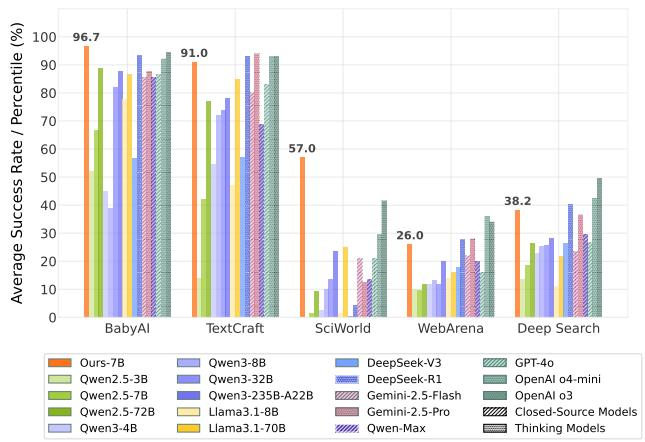
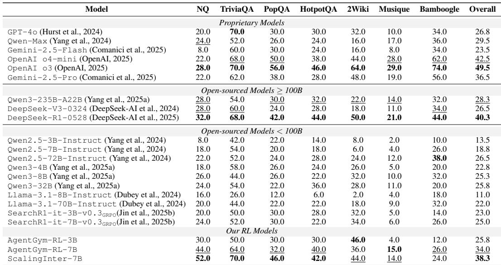
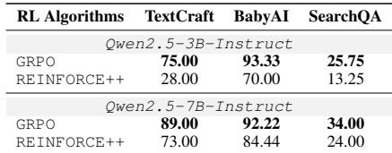
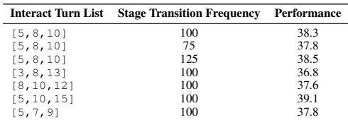
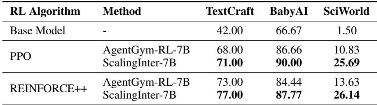
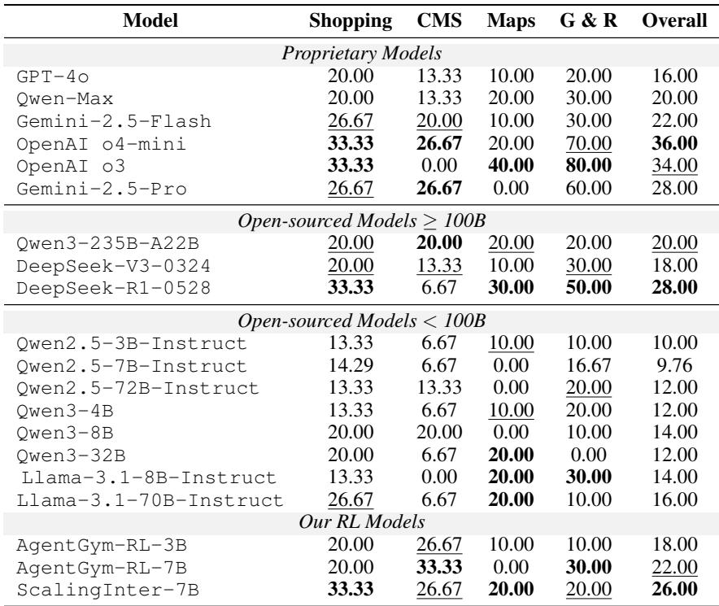

# AgentGym-RL: An Open-Source Framework to Train LLM Agents for Long-Horizon Decision Making via Multi-Turn RL

> [!tip] 核心洞察
> 智能体能力的提升不仅依赖内部推理，更需要通过与环境的扩展交互来获取新知识和技能；渐进式扩展交互步数可以在保持训练稳定性的同时实现更深层次的探索。

| 字段 | 内容 |
|------|------|
| 中文题名 | AgentGym-RL：一个用于通过多轮强化学习训练LLM智能体进行长时程决策的开源框架 |
| 英文题名 | AgentGym-RL: An Open-Source Framework to Train LLM Agents for Long-Horizon Decision Making via Multi-Turn RL |
| 会议/期刊 | ICLR 2026 (accepted) |
| Links | [paper](https://openreview.net/forum?id=ZgCCDwcGwn) |
| Topic | #topic/vision_multimodal_applications #topic/vision_multimodal_applications/language_speech_and_dialog |
| Method | ScalingInter-RL |
| Dataset | Deep Search, WebArena, TextCraft, BabyAI |

> [!tip] 效果简介
> - Deep Search 上，Overall 为 38.3，对比 34.0 (AgentGym-RL-7B)，变化 +4.3。
> - WebArena 上，Overall accuracy 为 26.00%，对比 16.00% (GPT-4o)，变化 +10.00%。
> - TextCraft 上，Overall score 为 91.00%，对比 14.00% (Qwen2.5-3B-Instruct)，变化 +77.00%。

本文提出 **AgentGym-RL**，一个面向多轮决策任务的模块化、解耦式开源强化学习框架，以及 **ScalingInter-RL**，一种渐进式交互步数扩展训练方法。核心贡献在于：通过从短时程交互开始建立基础策略，逐步增加最大交互轮数，解决了长时程RL训练中常见的训练不稳定和崩溃问题。在涵盖Web导航、深度搜索、数字游戏、具身控制和科学任务的27个任务上，ScalingInter-RL平均提升33.65个点，7B模型在多个基准上匹配甚至超越OpenAI o3和Gemini-2.5-Pro等商业模型。

# 2. 背景与动机

**现有瓶颈**：现有开源社区缺乏统一的强化学习框架，无法在多样化的真实环境中从头训练智能体；同时，直接进行长时程交互训练会导致训练不稳定和崩溃。

**问题形式化**：智能体任务被建模为部分可观测马尔可夫决策过程（POMDP）(U, S, A, O, T, r)。策略梯度通过以下公式估计：

$$\nabla_\theta J(\theta) = \mathbb{E}_{\tau \sim \pi_\theta} \left[ r(\tau) \sum_{k=0}^K \nabla_\theta \log \pi_\theta(a_k | s_k) \right]$$

其中轨迹 $\tau = (a_0^T, o_1, a_1^T, \dots, a_{K-1}^T, o_K)$ 包含推理路径和动作与观测的交替序列。

**核心洞察**：智能体能力的提升不仅依赖内部推理，更需要通过与环境的扩展交互来获取新知识和技能；渐进式扩展交互步数可以在保持训练稳定性的同时实现更深层次的探索。

# 3. 核心创新

**ScalingInter-RL** 的核心创新在于**渐进式交互步数扩展策略**。该方法从短时程交互开始建立基础策略，逐步增加最大交互轮数，具体调度为：

$$h_{t+1} = h_t + \delta_h$$

其中 $h_t$ 是第t阶段的最大交互轮数，$\delta_h$ 是自适应增量，每 $\Delta$ 训练步更新一次。轨迹在约束 $K_t \le h_t$ 下采样。

**关键改变**：
- **最大交互轮数**：从固定值（如5、10、15、20等）改为渐进式递增
- **训练阶段调度**：从单阶段固定交互轮数训练改为多阶段课程学习

# 4. 整体框架

AgentGym-RL采用模块化设计，包含三个核心模块：

**环境模块（Environment Module）**：将每个环境封装为独立服务，通过HTTP API提供/observation、/available_actions、/step、/reset接口，支持并行部署。

**智能体模块（Agent Module）**：封装LLM智能体的推理-行动循环，接收环境观测，执行多轮推理并输出动作。

**训练模块（Training Module）**：提供统一的强化学习流水线，管理轨迹收集、优势估计、策略优化和奖励塑形，支持在线和离线算法（PPO、GRPO、RLOO、REINFORCE++、SFT、DPO、self-improvement）。

框架覆盖五大场景：Web导航、深度搜索、数字游戏、具身控制和科学任务。

# 5. 核心模块与公式推导

**ScalingInter-RL目标函数**：

$$J(\theta) = \mathbb{E}_{\tau \sim \pi_\theta} \left[ r(\tau) \right]$$

在受限交互预算下最大化期望最终奖励。

**轨迹定义**：

$$\tau = (a_0^T, o_1, a_1^T, \dots, a_{K-1}^T, o_K)$$

包含推理路径和动作与观测的交替序列，K为总交互轮数。

**交互轮数约束**：

$$\tau_t \sim \pi_\theta(\tau | h_t), \quad \text{subject to } K_t \le h_t$$

在第t阶段，轨迹在最大交互轮数 $h_t$ 的约束下采样。

**交互轮数更新调度**：

$$h_{t+1} = h_t + \delta_h$$

每 $\Delta$ 训练步后，最大交互轮数增加自适应增量 $\delta_h$。

# 6. 实验与分析

## 1 主要结果

| 基准 | 指标 | ScalingInter-7B | 基线 | 提升 | 锚点 |
|------|------|-----------------|------|------|------|
| Deep Search | Overall | 38.3 | 34.0 (AgentGym-RL-7B) | +4.3 | Table 1 |
| WebArena | Overall accuracy | 26.00% | 16.00% (GPT-4o) | +10.00% | Table 5 |
| TextCraft | Overall score | 91.00% | 14.00% (Qwen2.5-3B-Instruct) | +77.00% | Table 6 |
| BabyAI | Overall accuracy | 96.67% | 94.44% (OpenAI o3) | +2.23% | Table 7 |
| SciWorld | Overall score | 57.00% | 41.50% (OpenAI o3) | +15.50% | Table 8 |

**关键发现**：
- ScalingInter-7B在Deep Search基准上达到38.3总体分，超过DeepSeek-R1-0528（40.3）以外的所有开源模型（Table 1）
- 在BabyAI上，ScalingInter-7B在GoTo、Pickup、AOD、SLoc子任务上均达到100.00%（Table 7）
- 在SciWorld的Chem-Mix子任务上，所有模型得分均为0，表明存在系统性挑战（Table 8）

## 2 消融研究

- **超参数敏感性**：ScalingInter-RL对初始交互轮数、阶段转换频率和交互间隔等超参数不敏感（第6.3节）
- **算法通用性**：ScalingInter-RL在不同RL算法（PPO、REINFORCE++）上均带来性能提升（Table 4）
- **算法对比**：GRPO在TextCraft、BabyAI、SearchQA上均优于REINFORCE++（Table 2）

## 3 训练动态分析

Figure 4展示了Deep Search环境下不同最大交互轮数的训练动态。直接使用长时程交互训练（如10轮）会导致训练崩溃，而短时程训练稳定但性能受限。ScalingInter-RL渐进增加交互步数，最终实现更高、更高效的长期性能。

Figure 11进一步实证分析了长时程训练的不稳定性，显示梯度范数出现多个尖峰。

## 4 公平性说明

- 所有RL模型均基于Qwen2.5系列基础模型训练，与基线模型使用相同的骨干网络
- 商业模型（如OpenAI o3、Gemini-2.5-Pro）的评估结果来自论文引用，可能使用不同的提示策略或评估设置
- ScalingInter-RL在训练和评估中使用相同的最大交互轮数设置

# 7. 方法谱系与知识库定位

**方法谱系**：ScalingInter-RL属于**课程强化学习**（Curriculum RL）范式，与以下方法形成对比：
- **固定交互轮数RL**（如AgentGym-RL vanilla）：直接使用固定最大交互轮数，长时程训练不稳定
- **测试时计算扩展**（如Search-R1）：仅扩展推理时的交互步数，不涉及训练阶段
- **分层多轮RL**（如Archer）：通过层次化策略分解长时程任务

**知识库定位**：
- **核心贡献**：首个系统解决LLM智能体长时程RL训练不稳定问题的开源框架
- **工程贡献**：提供解耦式模块化架构，支持五种异构环境、多种RL算法，并包含可视化UI
- **实证贡献**：在27个任务上系统验证了渐进式交互扩展的有效性，7B模型匹配商业模型性能

**局限性**：
- RL智能体在WebArena和SciWorld等任务中仍存在过度交互问题
- 在SciWorld的Chem-Mix子任务上所有模型得分均为0
- RL智能体在科学场景中缺乏深度程序性理解
- 长时程训练仍可能因梯度异常而崩溃
- 框架目前仅支持五种场景

**开放问题**：
- 自适应增量 $\delta_h$ 和阶段转换步数 $\Delta$ 如何根据任务复杂度自动确定？
- 不同环境中的奖励函数 $r(\tau)$ 具体如何定义？是否可以在不同任务间共享或迁移？
- ScalingInter-RL能否与更先进的RL算法（如IMPALA、SAC）结合？
- 如何从根本上解决RL智能体的过度交互问题？

## 整体框架

## 实验与分析

*Table 1: Evaluation results on Deep Search benchmark. For each group, the best result is in bold, and the second-best is underlined. SearchR1-it-v0.3 baseline uses Search-R1-v0.3 models (Jin et al., 2025a). See Appendix D for results of tasks on other scenarios.*

*Table 2: Evaluation results of different RL algorithms.*

*Table 3: Ablation study of ScalingInter-RL.*

*Table 4: Applying ScalingInter-RL to more algorithms.*

*Table 5: Evaluation results on WebArena benchmark. For each group, the best result is in bold, and the second-best is underlined. In the first row, G & R means GitLab and Reddit.*

## 原文 PDF

![[paperPDFs/ICLR_2026/AgentGym-RL_An_Open-Source_Framework_to_Train_LLM_Agents_for_Long-Horizon_Decision_Making_via_Multi-Turn_RL.pdf]]
