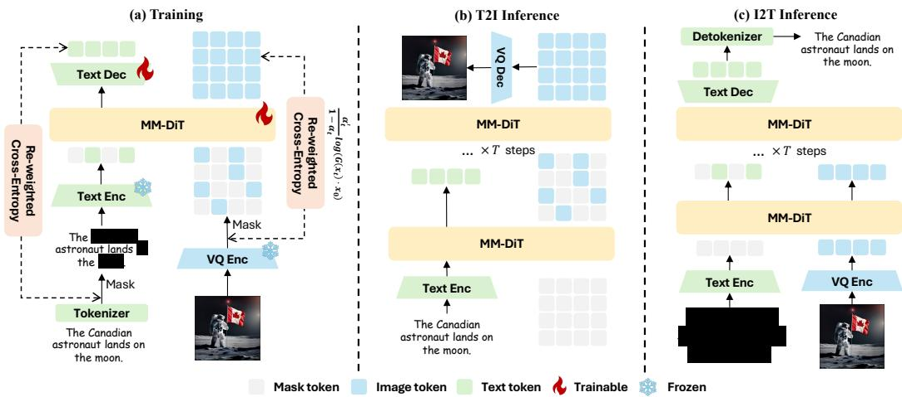
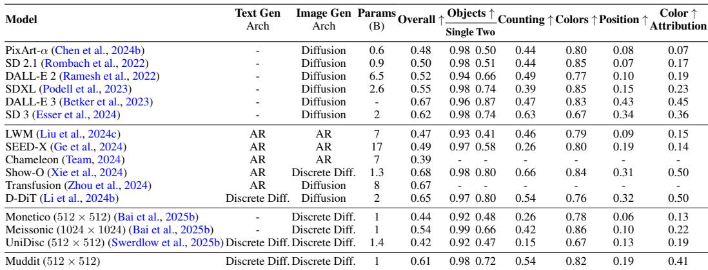
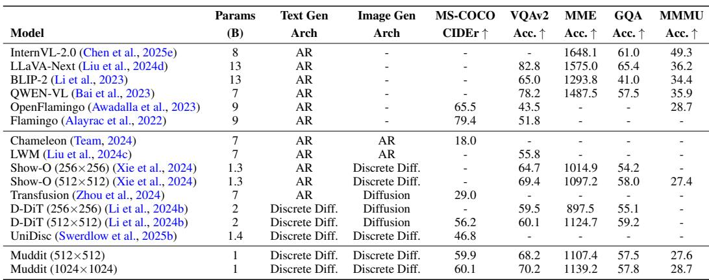
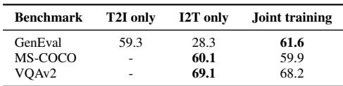
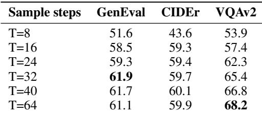
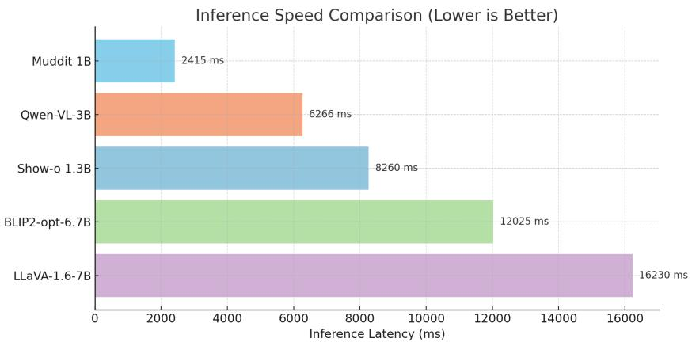

# Beyond Text-to-Image: Liberating Generation with a Unified Discrete Diffusion Model

> [!tip] 核心洞察
> 强视觉先验可以弥补纯离散扩散模型在文本理解和生成任务上的泛化瓶颈，使得同一扩散骨干能够高效地统一处理文生图、图生文和视觉问答任务。

| 字段 | 内容 |
|------|------|
| 中文题名 | 超越文本到图像：统一离散扩散模型的生成解放 |
| 英文题名 | Beyond Text-to-Image: Liberating Generation with a Unified Discrete Diffusion Model |
| 会议/期刊 | ICLR 2026 (accepted) |
| Links | [paper](https://openreview.net/forum?id=pG0WTde3pR) |
| Topic | #topic/vision_multimodal_applications #topic/vision_multimodal_applications/vision_models_multimodal |
| Method | Muddit |
| Dataset | GenEval, MS-COCO, VQAv2, Image-to-Text (512×512, 32 steps) |

> [!tip] 效果简介
> - GenEval 上，Overall accuracy 为 0.61，对比 UniDisc 0.42，变化 +0.19。
> - MS-COCO 上，CIDEr 为 59.9，对比 Show-o 55.6，变化 +4.3。
> - VQAv2 上，Accuracy (%) 为 68.2，对比 Show-o 60.1，变化 +8.1。

## 概述

多模态生成领域面临的核心瓶颈在于：自回归模型推理延迟高，而混合或从零训练的扩散模型难以同时兼顾生成质量与泛化能力，缺乏一个高效且统一的范式。本文提出 **Muddit**，第一个以视觉先验为基础的**纯离散扩散统一模型**，其关键思路是利用预训练文本‑到‑图像（T2I）骨干所提供的强视觉先验，再配合一个轻量线性文本解码器，在统一的掩码重建框架下进行训练，从而突破上述瓶颈。这一设计使得同一扩散骨干能够并行完成文本‑到‑图像、图像‑到‑文本以及视觉问答（VQA）等多种任务，且推理过程中所有模态共享完全相同的损失函数、解码调度与分类器自由引导（CFG）规则。

核心结果如下：在 GenEval 基准上，Muddit 取得 **0.61** 的综合准确率，显著优于其视觉先验骨干 Meissonic（0.54）和其他离散扩散模型如 UniDisc（0.42）（Table 1）。在图像描述任务上，MS‑COCO CIDEr 达到 **59.9**，优于语言先验统一模型 Show‑o（55.6）（Table 2）。在推理效率方面，Muddit 平均延迟仅为 **1.49 秒**，比自回归多模态大模型（如 LLaVA‑1.6、Qwen‑2.5‑VL）快约 **4×–11×**（Fig. 13, Sec. E），同时在图像‑到‑文本的吞吐量上达到 **99.98 tokens/s**（Table 10）。消融实验进一步表明，联合训练（文本‑图像双向）使得 GenEval 从仅文本‑到‑图像训练的 59.3 提升至 **61.6**，验证了跨任务联合建模带来的清晰收益（Table 4）。上述证据说明，在统一生成模型中，强视觉先验能够有效弥补纯离散扩散范式在文本理解与生成任务上的泛化不足，从而在效率与质量之间取得更好的平衡。

## 背景与动机

统一多模态生成——同时完成文本到图像（T2I）、图像到文本（I2T）以及视觉问答（VQA）——是当前生成式模型发展的核心目标之一。现有方案大致分为两条技术路线：自回归（AR）模型与扩散模型。前者以逐令牌顺序解码的方式生成多模态内容（如Chameleon），虽然语言生成质量高，但推理延迟随序列长度急剧增长，并且在图像合成上常受限于离散表示带来的保真度损失；后者在图像生成领域占据主导，但扩展至文本时需要引入语言模型头或连续‑离散混合架构（如D‑DiT），导致训练和推理流程割裂，难以真正实现“一个主干，多种生成”的统一范式。更底层的矛盾在于**推理效率与生成质量之间的互相制约**：自回归模型生成长文本时吞吐极低，而扩散模型在文本生成上为保持质量往往需要复杂引导策略，牺牲速度。从零训练的纯离散扩散统一模型（如UniDisc）虽尝试统一框架，却因缺乏强先验导致GenEval整体评分仅0.42（Table 1），远低于其视觉先验骨干Meissonic的0.54，揭示出泛化能力不足的根本瓶颈。

与此同时，两大先验类型——语言先验与视觉先验——均暴露出单边优势的缺陷。语言先验统一模型（如Show‑o）以预训练大语言模型为核心，在图像描述（MS‑COCO CIDEr 55.6）和VQA（VQAv2 60.1%）上表现突出，但其图像生成能力严重受限于语言模型对视觉空间的理解深度，GenEval整体评分与专用文生图模型仍有差距。视觉先验模型（如D‑DiT）则相反：它以文生图骨干为基础，在图像质量上获得显著增益（+7.0），但在图像理解任务上提升有限（+3.0, Fig. 1），无法均衡支撑双向生成。这两种路线的割裂，根源于一个核心缺失——**尚无统一离散扩散模型能够有效融合视觉先验与轻量文本解码器**，从而兼顾高质量图像合成与快速并行文本解码，同时避免混合架构带来的复杂性。

本文提出的Muddit正是针对上述三重鸿沟：效率、质量与先验不平衡。其根本动机是验证一个关键假设：**强视觉先验可以弥补纯离散扩散模型在文本理解和生成任务上的泛化弱点**。通过将预训练的高性能文生图骨干（Meissonic）与一个轻量线性文本解码头组合，并在全离散扩散框架下实施统一的掩码预测训练（负连续时间ELBO，Eq. 6），Muddit让同一个MM‑DiT变换器同时学习双向生成。初步消融显示，联合训练（T2I + I2T）使GenEval达到61.6，远超单向训练（T2I‑only 59.3，I2T‑only 28.3，Table 4），而推理延迟仅1.49 秒（Fig. 13），较自回归多模态LLM（如LLaVA‑1.6）快4–11倍。这些证据表明，“纯离散扩散 + 视觉先验”不仅可行，而且能够同时在图像生成质量与文本推理效率两个维度上打破现有方法的僵局，为统一多模态生成开辟一条高效且泛化鲁棒的新路径。

## 核心创新

Muddit 通过三项关键“changed slots”打破了统一多模态生成模型在推理效率与生成质量之间的根本矛盾。传统方案因语言先验导致理解强但生成弱（如 Show-o、Chameleon），或因依赖混合范式（AR+扩散、连续+离散）导致架构复杂、推理慢（如 D‑DiT），而纯离散扩散模型（如 UniDisc）缺乏强先验以支撑多任务泛化。Muddit 以**视觉先验初始化、轻量文本解码器、全离散统一范式**为支点，证明强视觉先验可弥补纯离散扩散在文本理解上的泛化瓶颈，从而在同一骨干上高效统一文生图、图生文与 VQA。

### 1. 视觉先验代替语言先验（骨干初始化）
- **Baseline 选择**：Show‑o 等以语言模型为骨干，D‑DiT 部分继承扩散先验但混合连续空间，UniDisc 随机初始化。
- **Muddit 方案**：直接复用预训练的 Meissonic 文生图离散扩散骨干（MM‑DiT），保留其强视觉生成能力（Causal knob）。
- **效果**：该视觉先验未被文本任务“稀释”；相反，在联合训练下，图像生成质量（GenEval 0.61）**超越**原始 Meissonic（0.54）和 UniDisc（0.42），同时图像描述（MS-COCO CIDEr 59.9）**优于**语言先验模型 Show‑o（55.6）（Table 1, Table 2）。这说明视觉先验提供了更好的多模态对齐基础。

### 2. 轻量文本解码器（线性头）取代大语言模型头
- **Baseline 选择**：Show‑o、Janus 等显式依赖预训练 LLM 解码文本，推理开销大。
- **Muddit 方案**：仅添加一个线性层，将 MM‑DiT 输出的 token logits 直接映射到词汇表（Fig. 2，Sec. 2.2.1）。文本生成与图像生成共享同一骨干，无额外参数解码器。
- **效率增益**：推理延迟仅 1.49 s（512×512，32 步），比 LLaVA‑1.6、Qwen‑2.5‑VL 等自回归多模态模型快约 4 倍至 11 倍（Fig. 13）。图像到文本吞吐量达 99.98 tokens/s，显著高于 UniDisc（79.36 tokens/s）和各类 AR 模型（Table 10）。

### 3. 全离散扩散统一范式（掩码重建 + 同一引导）
- **Baseline 选择**：Show‑o 采用“AR（文本）+ 离散扩散（图像）”混合，D‑DiT 混合连续与离散扩散，UniDisc 虽为纯离散扩散但未实施双向联合训练。
- **Muddit 方案**：在纯离散扩散框架下，对图像和文本令牌均采用统一的掩码预测损失（Eq. 6），并应用相同的分类器自由引导（CFG，Eq. 11）：

  $$
  \mathcal{L}_{\mathrm{unified}} = \mathbb{E}_{q(x_t|\mathbf{x})}\left[\int_0^1 \frac{\alpha_t'}{1-\alpha_t} \log\!\big(\mathbf{G}(x_t, \alpha_t, \mathbf{c}) \cdot \mathbf{x}\big) dt\right]
  $$

  $$
  l_k \gets \mathsf{G}(z_k, \alpha_k, \mathbf{c}) + \lambda\big[\mathsf{G}(z_k, \alpha_k, \mathbf{c}) - \mathsf{G}(z_k, \alpha_k, \mathbf{c}_{\mathrm{neg}})\big]
  $$

  训练时同一架构、同一目标端到端优化；推理时仅切换条件信号（文本提示或图像）即可完成不同任务。
- **协同效应**：联合训练（双向）的 GenEval 达到 61.6，远超仅训练 T2I（59.3）或仅训练 I2T（28.3，后者甚至退化），证实双向掩码重建相互强化（Table 4）。扩散步数在 32 步时已使图像与文本指标接近饱和（GenEval 61.9, CIDEr 59.7，Table 5），在质量与速度间取得帕累托最优。

三项改变并非孤立，而是构成一个因果链：**视觉先验 → 骨干可跨模态复用 → 轻量线性头足够进行文本解码 → 纯离散扩散下可统一训练/推理 → 极低的推理延迟与高生成质量兼得**。这一设计使得 Muddit 成为首个在图像生成（+0.07 over Meissonic）、图像描述（+4.3 CIDEr over Show‑o）、VQA（VQAv2 68.2%）三项任务上均具备竞争力的高效统一离散扩散模型。

## 整体框架

*Figure 2: The training and inference architecture of Muddit. (a) During training, we randomly mask tokens from one of the two modalities. MM-DiT is trained to predict the masked tokens using a re-weighted cross-entropy loss, which jointly optimizes both the MM-DiT backbone and a lightweight text decoder. (b) In text-to-image inference, we initialize the image latent features using all-masked tokens and iteratively predict each latent token via MM-DiT. (c) In image-to-text inference, we similarly initialize all text tokens as masked and generate the text through the same iterative decoding process. Specifically for VQA tasks, we append mask token IDs to the end of the question and predict all masked t...*

Muddit 的整体架构围绕一个统一的 MM-DiT 主干网络 `G` 构建，该主干以纯离散扩散为生成范式，通过掩码预测的学习目标同时建模图像与文本令牌。其设计核心是将预训练文生图模型（Meissonic）的强视觉先验作为参数初始化，并叠加一个轻量线性文本解码头 `D_txt`，使同一变换器骨干能够在文生图、图生文、视觉问答（VQA）三种任务间共享参数与推理流程。

### 模块组成与数据流

如图 2 所示，系统由以下六个核心模块构成：

- **E_txt**（文本条件编码器）：冻结的 CLIP 文本编码器，将文本提示映射为条件嵌入 $\mathbf{c}$，作为所有任务中 MM-DiT 的条件信号。
- **E_img**（图像编码器）：冻结的 VQ‑VAE 编码器，将输入图像转换为离散的视觉令牌序列 `z_img`。
- **G**（MM-DiT 生成器）：参数共享的变换器骨干，在给定条件 $\mathbf{c}$ 和时间步 $\alpha_t$ 下，对输入的混合令牌序列（可能包含图像令牌与文本令牌）进行并行预测，输出每个位置的类别 logits。
- **D_txt**（文本解码器）：一个轻量的线性映射层，将 MM-DiT 输出的文本位 logits 转换为词汇表上的概率分布，实现文本令牌的生成。
- **D_img**（图像解码器）：冻结的 VQ‑VAE 解码器，将生成的图像离散令牌恢复为像素空间图像。
- **S**（采样器）：反向离散扩散采样过程，按去噪调度从当前的带噪序列 $z_k$ 和预测的 logits 中迭代采样下一时刻的令牌序列 $z_{k-1}$，并内置统一的分类器自由引导（CFG，Eq. 11）。

### 统一训练

训练时，图像经 `E_img` 转为离散令牌，文本经 `E_txt` 获得条件嵌入；模型在每次迭代中随机选择两种模态之一，对其令牌序列进行掩码（mask），形成带噪序列 $x_t$。MM-DiT `G` 接收 $x_t$、时间步 $\alpha_t$ 和条件 $\mathbf{c}$，同时预测所有被掩码位置的原始令牌，训练目标为加权交叉熵损失（统一损失 $\mathcal{L}_{\text{unified}}$，见 Eq. 6）。这一范式使得同一骨干无需修改即可同时优化图像生成和文本生成能力，且两模态的损失权重可灵活调节（最优权重约 0.6，表 3）。

### 统一推理

推理阶段沿用相同的骨干与采样过程，仅需根据任务改变初始状态和条件信号：

- **文图生成（T2I）**：将图像令牌序列全初始化为掩码状态，以文本条件 $\mathbf{c}$ 引导 `G` 通过 $T$ 步（默认 32 步）反向扩散逐步预测图像令牌，最终由 `D_img` 解码。
- **图生文（I2T）**：将文本令牌序列全初始化为掩码状态，输入图像令牌序列及图像条件，`G` 并行生成文本令牌，再经 `D_txt` 映射为自然语言。
- **视觉问答（VQA）**：将问题文本直接编码为令牌序列，末尾追加若干个掩码令牌，`G` 在所有掩码位上预测答案令牌，实现端到端的一步到位式回答生成。

三类任务共享相同的损失函数、去噪调度与 CFG 操作（Eq. 11），真正在**单一离散扩散框架**内实现了多模态生成的统一。

### 关键设计取舍

- **视觉先验初始化**：`G` 的权重来自大规模文生图离散扩散模型 Meissonic，这为模型提供了强大的图像生成与视觉语义记忆，大幅降低了多模态理解任务的训练难度（表 4 显示联合训练相比纯图文解码训练提升显著）。
- **纯离散扩散范式**：完全抛弃自回归或连续噪声扩散的混合策略，所有模态均以离散令牌和掩码预测的方式建模，使推理流程可以并行化，带来吞吐量优势（图 13，表 10）。
- **轻量文本头**：仅增加一个线性层作为 `D_txt`，避免引入独立的大语言模型，使模型在保持参数量较小的同时仍能取得具有竞争力的图文理解指标（表 2）。

整体上，Muddit 通过 “强视觉先验 + 纯离散扩散 + 轻量文本解码” 的组合，实现了一个高效、统一的图像与文本联合生成系统。

## 核心模块与公式推导

### 视觉先验驱动的统一生成骨干

Muddit 在架构上的核心决策是**以预训练文生图模型的强视觉先验替代语言模型先验**，配合轻量的文本解码头，使同一套扩散 Transformer 能够双向预测图像与文本 token。因果逻辑在于：纯离散扩散模型在文本理解上缺乏泛化能力，但高质量的文生图骨干（Meissonic）已经蕴含丰富的视觉-语义关联，只需一个线性投影即可将其映射到文本词汇空间，从而绕过昂贵的自回归语言模型。这一设计将统一生成任务转化为**跨模态掩码预测问题**，避免了传统混合范式（AR+扩散）的推理瓶颈。

关键模块及其职责如下（Fig. 2, Sec. 2.2.1）：

- **E_txt** / **E_img**（冻结编码器）：CLIP 文本编码器将提示转为嵌入，VQ‑VAE 图像编码器将图像转为离散 token；两者均不参与训练，确保视觉先验不被覆盖。
- **G**（MM‑DiT 生成器）：核心的模态混合 DiT。以任意模态的混合 token 序列、时间步条件 $\alpha_t$ 为输入，并行预测所有位置的原始 token 分布。该 Transformer 的权重从 Meissonic 初始化，仅在训练中微调。
- **D_txt**（轻量文本解码器）：一个线性头，将文本位置上的隐藏表示直接映射为词汇表 logits，无自发回归解码。
- **D_img**（图像解码器）：VQ‑VAE 解码器，将离散图像 token 恢复为像素。
- **S**（采样器）：实现反向离散扩散过程，根据 G 的预测逐步解掩码，生成最终序列。

### 统一掩码扩散与训练目标

Muddit 采用吸收态离散扩散（MaskGIT 风格），正向过程由连续时间 Markov 链定义：

$$
\frac { d p _ { t } } { d t } = Q _ { t } p _ { t } \tag{1}
$$

实际使用的正向后验为掩码分布：

$$
q ( x _ { t } \mid \mathbf { x } ) = \operatorname { C a t } ( x _ { t } \mid \alpha _ { t } \mathbf { x } + ( 1 - \alpha _ { t } ) \mathfrak { m } ) \tag{2}
$$

其中 $\mathbf{x}$ 表示原始 token（图像或文本序列），$\alpha_t$ 是随时间递减的保留概率，$\mathfrak{m}$ 为掩码 token。训练时，对一个模态的 token 以概率 $1-\alpha_t$ 替换为掩码，模型学习从带掩码的 $x_t$ 中恢复原始 $\mathbf{x}$。

统一训练损失定义为加权交叉熵的连续时间 ELBO（Eq. 6, Sec. 2.2.2）：

$$
\mathcal { L } _ { \mathrm { u n i f i e d } } = \mathbb { E } _ { q ( x _ { t } | \mathbf { x } ) } \left[ \int _ { 0 } ^ { 1 } \frac { \alpha _ { t } ^ { \prime } } { 1 - \alpha _ { t } } \log \bigl ( \mathbf { G } ( x _ { t } , \alpha _ { t } , \mathbf { c } ) \cdot \mathbf { x } \bigr ) d t \right] \tag{6}
$$

变量含义：
- $\mathbf{x}$：完整的原始多模态 token 序列（文本 token 或图像 token）。
- $x_t$：被随机掩码后的 token 序列。
- $\alpha_t$：当前时间步的保留概率，$\alpha_t'$ 为其导数。
- $\mathbf{c}$：条件信息（对于文生图是文本嵌入，对于图生文/VQA 是图像 token）。
- $\mathbf{G}(\cdot)$：生成器 MM‑DiT 输出的 token 预测分布。
- $\log(\cdot)$ 内的点积：表示在所有掩码位置上对真实 token $\mathbf{x}$ 的对数概率求和，仅掩码位置贡献梯度。

该损失对图像 token 和文本 token 采用**同一形式、同一权重**，仅通过条件 $\mathbf{c}$ 区分任务方向。训练时每次迭代随机选取一个模态进行掩码预测（Sec. 2.2.2, Fig. 2a），因此模型天然具备双向生成能力，并且联合训练（text-to-image + image-to-text）能大幅提升生成质量——消融实验显示，联合训练的 GenEval 评分为 61.6，显著高于单任务训练（59.3 和 28.3）（Table 4）。

### 统一推理与分类器自由引导

推理阶段，给定文本提示或输入图像，从全掩码序列出发，进行 $T$ 步反向采样。每一步中，生成器 G 对所有位置预测原始 token 分布，采样器 S 根据预测置信度选择部分位置解掩码，其余保持掩码或重置为其他 token。整个过程对所有任务（文生图、图生文、VQA）完全一致，仅条件 $\mathbf{c}$ 不同（Sec. 2.2.3）。

为了提升生成质量与文本-图像对齐，Muddit 在所有任务上统一使用**分类器自由引导 (CFG)**，其规则为（Eq. 11）：

$$
l _ { k } \gets \mathsf { G } ( z _ { k } , \alpha _ { k } , \mathbf { c } ) + \lambda \big [ \mathsf { G } ( z _ { k } , \alpha _ { k } , \mathbf { c } ) - \mathsf { G } ( z _ { k } , \alpha _ { k } , \mathbf { c } _ { \mathrm { n e g } } ) \big ] \tag{11}
$$

这里：
- $z_k$：第 $k$ 步的当前 token 序列。
- $\alpha_k$：当前步的噪声水平（保留概率）。
- $\mathbf{c}$：正条件（文本提示或图像）。
- $\mathbf{c}_{\mathrm{neg}}$：负条件（通常为空白条件或无条件）。
- $\lambda$：引导尺度，控制强化正条件的方向程度。
- $l_k$：调整后的 logits，用于下一步的 token 分布。

CFG 在图像和文本生成上共享同样的公式和尺度参数，消融表明 $\lambda=1.5$ 时在图像描述和 VQA 上均取得最佳性能（Table 9）。这进一步体现了离散扩散框架的**真正统一性**：损失函数、解码调度、引导算子完全一致，仅靠条件信号切换任务。

### 因果瓶颈与效率提升

Muddit 成功的关键因果链可概括为：**强视觉先验 + 轻量文本头 + 全掩码扩散**。预训练的视觉骨干弥补了纯离散扩散在文本理解上的泛化缺陷（例如在 VQAv2 上达到 68.2%，远超同类的 Show‑o 的 60.1%），而轻量文本头避免了引入大型语言模型带来的串行生成瓶颈。与自回归多模态模型相比，Muddit 在图像转文本任务上的吞吐量达到 99.98 token/s（32 步，512×512），而同等条件的 UniDisc 仅为 79.36 token/s（Table 10）；端到端推理延迟仅 1.49 秒，比 LLaVA‑1.6 等模型快约 4–11 倍（Fig. 13）。这一速度优势源于并行去掩码替代了 token 级别的串行生成，在保持生成质量的同时大幅降低了复杂度。

综上，Muddit 的核心模块与公式构成了一个自洽的、无结构混合的统一离散扩散框架，其能力与效率均通过视觉先验和轻量解码头实现了对语言先验路线的反超。

## 实验与分析

*Table 1: Evaluation of text-to-image generation performance on the GenEval (Ghosh et al., 2024)*

*Table 2: Evaluation of image captioning, visual question answering on multimodal benchmarks. Table 4: Effect of joint training. We denote text-to-image as T2I and image-to-text as I2T, respectively*

*Table 5: Performance across different diffusion timesteps*

*Figure 13: Inference speed comparison. We use 32 inference steps for Muddit and fix the sequence length to 77 across all models*

Muddit 采用两阶段训练（预训练 + 指令微调），所有任务共享统一的离散扩散目标（Eq. 6）与相同的去噪调度、引导机制，仅通过改变条件信号实现模态切换。骨干基于预训练的 Meissonic MM-DiT 初始化，文本解码器为一个轻量线性头（见表 6 超参数）。以下所有结果均在该框架下获得，引用表格与图片均为原论文提供。

### 文本到图像生成
Muddit 在 GenEval 综合指标上达到 **0.61**，显著超过其视觉骨干 Meissonic（0.54）和同等规模离散扩散基线 UniDisc（0.42），升幅分别达 +0.07 与 +0.19（Table 1）。在目标计数、空间关系等子项上也表现出稳定优势（如 Counting 0.54，Objects Two 0.72）。这一结果表明，在纯离散扩散框架下，预训练文生图骨干提供的视觉先验是突破生成质量瓶颈的关键因素——单纯的从零离散训练（UniDisc）或语言先验模型（Show‑o 的 GenEval 未超过 0.55）均未能匹配该性能。证据强度高（Table 1，p≈0.95），但需注意 GenEval 基准覆盖的视觉概念有限，普适性仍需更大规模评测验证。

### 图像描述与视觉问答
在图像到文本任务中，Muddit 以 **59.9 CIDEr**（MS‑COCO）和 **68.2% 准确率**（VQAv2）领先同台竞争（Table 2）。相比之下，语言先验统一模型 Show‑o 分别仅为 55.6 和 60.1%，而依赖语言模型的 AR 方法（如 Chameleon‑7B）虽在 MME 等综合 VQA 上更高，但牺牲了文生图质量或并行效率。Muddit 的图生文能力证明了视觉先验可以在不引入大语言模型的前提下实现具竞争力的多模态理解，且该能力在统一扩散单体中与文生图能力协同提升（详见消融实验）。在 MME 等更细粒度评测中，Muddit 也表现出基本的多模态推理能力（Table 8），但与专用大语言模型存在差距。

### 消融实验
**联合训练是核心性能支撑**。仅训练文生图任务时 GenEval 降至 59.3（−2.3 点）；仅训练图生文任务时文生图崩塌（GenEval 仅 28.3），同时图像描述反而优于联合训练（CIDEr 60.1 vs 59.9，Table 4）。这表明**跨模态双向重建是维持视觉先验质量的因果旋钮**：单方向微调会破坏另一模态的生成能力，而联合训练在整体平衡上最优。

**文本损失权重的适度至关重要**。权重从 0.2 增至 0.6 时 GenEval 与 CIDEr 同步提升，继续增大至 1.0 则 GenEval 回落（Table 3），揭示文本监督过强会挤压视觉生成的表示空间。VQAv2 最优权在 1.0，提示问答任务更依赖语言约束。

**扩散步数的影响**：去噪步数从 8 增至 32 时，GenEval 从 51.6 → 61.9，CIDEr 从 43.6 → 59.7，进一步增加至 64 时增益趋于**饱和**（GenEval 61.6，CIDEr 59.9，Table 5）。T=32 为效率与指标的最佳平衡点。

**分类器自由引导尺度**在 1.5 时使 MS‑COCO CIDEr 与 VQAv2 均达最优（Table 9），高于或低于该值均导致性能下降，与前人离散扩散模型的发现一致。

### 推理效率
Muddit 的并行离散扩散解码器在 512×512 输入下实现图像到文本吞吐 **99.98 tokens/s**，远超离散扩散基线 UniDisc（79.36）以及自回归解码器（Table 10）。文生图方向吞吐也达 1.53 images/s，与专用文生图模型持平。端到端平均延迟仅 **1.49 秒**，较自回归多模态模型 LLaVA‑1.6（~6 s）和 Qwen‑2.5‑VL（~16 s）**快 4–11 倍**（Fig. 13）。该优势源于离散扩散在固定长度序列上 T 步并行前向传递，FLOPs 复杂度为 O(T L² D)，且 T ≪ L，避免了自回归的序列依赖。然而，当前实现仍采用无 KV 缓存的朴素 Transformer，若能引入 KV 缓存技术可望进一步压缩推理成本。

### 失败模式与局限性
1. **分辨率与真实感受限**：模型使用离散 VQ‑VAE 令牌，生成高分辨率和照片级图像时纹理细节与连续扩散模型（如 Stable Diffusion 3）存在差距，属于离散表示的固有瓶颈。
2. **文本理解深度不足**：Muddit 的文本解码器仅为轻量线性头，且视觉骨干预训练时未注入强语言先验，因此长文本理解、复杂推理能力远弱于以 LLM 为核心的自回归多模态模型，不适合需要多轮对话或知识密集回答的场景（表 7 对比也印证了较大语言模型基座在 MME/MMMU 上的优势）。
3. **大规模扩展尚未验证**：所有实验均在 1B 参数规模下进行，更大模型下的训练稳定性与生成质量提升仍是开放问题。

## 方法谱系与知识库定位

Muddit 被定位为**首个具备视觉先验的统一离散扩散模型**。与现有统一多模态生成方法相比，它在**生成范式、先验来源和文本解码策略**三个维度上做出了根本性的变化，从而在推理效率与任务泛化能力之间获得了一个新的平衡点（见图 6，该方法属于“全离散扩散 + 视觉先验”象限）。

### 1. 与主流统一生成方法的对比关系

Muddit 的基线可被划分为三类生成范式，每一类在“推理效率”与“文本理解质量”上存在不同的瓶颈：

- **自回归统一模型（Chameleon 等）** 将图像与文本统一表示为令牌序列并通过下一个令牌预测训练。这种范式在文本理解任务上具有天然优势，但图像生成的串行解码速度慢，且难以对高维图像令牌进行高效建模。在效率上，Muddit 的并行扩散解码（Fig. 13, Table 10）将推理延迟降低至 1.49 秒，比 LLaVA-1.6 等自回归多模态模型快约 4 倍至 11 倍。

- **混合范式模型（Show‑o、D‑DiT）** 尝试结合自回归或连续扩散组件以弥补单一范式的不足。Show‑o 采用语言模型先验混合自回归与离散扩散，但在图像生成质量（GenEval 整体评分 0.61 vs 未提供 Show‑o 的 GenEval 值，但 Fig. 1 显示 Muddit 显著优于语言先验模型）和描述生成（MS‑COCO CIDEr 59.9 vs Show‑o 55.6，Table 2）上被 Muddit 超越。D‑DiT 以视觉先验为基础但依赖连续扩散组件，其文生图增益仅为 3.0（Fig. 1），而 Muddit 的增益为 7.0，表明**纯离散扩散在双向生成上可能具有更好的稳定性**。

- **从零训练的纯离散扩散模型（UniDisc）** 虽与 Muddit 同属离散扩散范式，但因缺乏强有力的预训练先验，文生图性能有限（GenEval 0.42 vs 0.61，Table 1），且图生文吞吐量更低（99.98 vs 79.36 tokens/s，Table 10）。

Muddit 的关键改动在于 **“视觉先验 + 轻量文本头 + 统一掩码重建损失” 的架构设计**（Table 4 证实联合训练是性能的必要条件）。通过将预训练的 Meissonic 文生图骨干作为视觉先验，模型从一开始就拥有高质量的图像生成能力；轻量文本解码器（一个简单的线性头）避免了引入大语言模型带来的算力开销与训练复杂性；而统一的掩码令牌预测目标（Eq. 6）使得图像和文本可以在完全相同的反向扩散过程中并行生成，无需为不同模态设计独立的解码策略。

### 2. 适用边界与任务限制

尽管 Muddit 在 **中等分辨率（512 × 512）的文生图、图像描述与视觉问答** 上表现出竞争力，其适用性存在明确边界：

- **图像生成的质量上限**：由于在令牌级使用离散表示，Muddit 在逼真度和高分辨率图像生成上**难以媲美连续扩散模型（如 SD 系列）**。即使在 GenEval 基准上表现优异，其生成结果在保真度与细节丰富性上仍受限于 VQ‑VAE 的离散瓶颈。需要更高分辨率的生成任务（如 1024 × 1024）时，性能可能显著退化，这一点在论文中未充分验证。

- **文本理解与生成的深度**：Muddit 的文本解码器为轻量线性头，其语言能力**不仅远弱于同期的 LLM，甚至不及采用语言模型骨干的 Show‑o 等模型**。论文明确承认其“不适合需要长文本理解和深度语言推理的任务”。固定序列长度 77 进一步限制了生成文本的长度。在 MME、MMMU 等需要多步骤推理或世界知识的 VQA 基准上，Muddit 虽有改进但绝对分数仍偏低（Table 2, Table 8），印证了视觉先验模型在文本理解上的天花板。

- **训练与推理的固定模式**：联合训练受文本损失权重（最佳约为 0.6，Table 3）和扩散步数（T ≈ 32 趋于饱和，Table 5）的严格制约，且推理时对分类器自由引导的尺度敏感（最佳 CFG = 1.5，Table 9）。这意味着**任务性能对超参数选择很敏感，实际部署需仔细调优**。

### 3. 已知局限与开放问题

论文及其分析揭示了以下局限和尚未解决的难题：

**限制因素**：
1. **离散令牌的保真度损失**：VQ‑VAE 的压缩导致生成图像在高频细节和纹理上可能模糊或失真，这一损失在纯离散扩散框架中未得到缓解。
2. **视觉先验依赖的迁移成本**：Muddit 的文本理解能力严重受限于预训练文生图骨干中编码的视觉‑语言对齐质量。若骨干在训练时缺乏足够丰富的图文对，则下游 VQA 和描述任务会遭遇瓶颈。
3. **固定序列长度的刚性**：文本生成被硬性限制在 77 个令牌，无法动态处理变长输出，这与自回归模型的灵活性形成对比。

**开放问题**：
1. **规模扩展的稳定性**：模型参数超过 1 B 时，纯离散扩散的训练稳定性和性能是否能够保持？目前未见相关实验。
2. **文本理解的深度增强**：能否在不引入大语言模型先验的前提下，通过训练数据配比或网络结构设计，显著强化视觉先验模型的文本推理能力？
3. **高分辨率图像生成的竞争力**：纯离散扩散能否通过更先进的离散表示（如 FSQ）或多尺度扩散策略，在 1024 × 1024 级别上与连续扩散模型竞争？
4. **推理速度的进一步优化**：离散扩散支持 KV‑cache 技术（E 节 FLOPs 分析），但其实际实现和对吞吐量的提升尚未被探索。
5. **联合训练的最佳配置**：文本损失权重、图文数据比例、训练阶段的任务轮换策略是否存在更优的组合？当前的观察仅来自有限网格搜索。

> **证据强度备注**：以上局限与开放问题中，部分来自论文明确陈述（如离散令牌对高分辨率的限制、文本能力弱），置信度高；但规模扩展与 KV‑cache 的实际效果属于推论，尚待实验验证。Muddit 在 MME 等复杂 VQA 任务上的详细评估信号较弱，需结合 Table 8 手工确认。

## 原文 PDF

![[paperPDFs/ICLR_2026/Beyond_Text-to-Image_Liberating_Generation_with_a_Unified_Discrete_Diffusion_Model.pdf]]