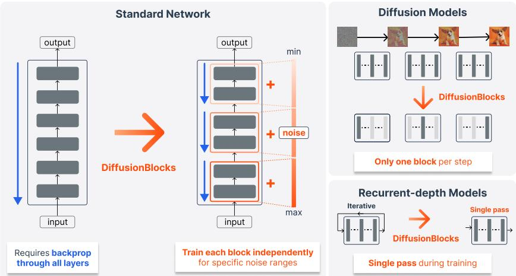
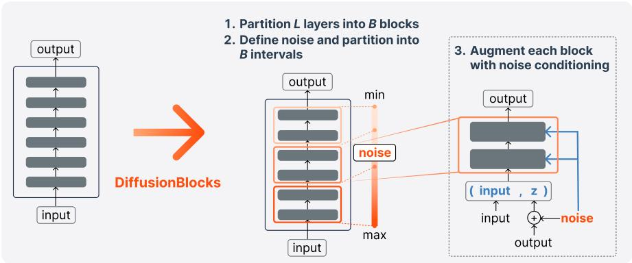
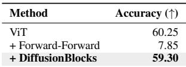
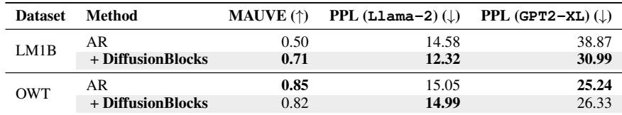

# DiffusionBlocks Block-wise Neural Network Training via Diffusion Interpretation

> [!tip] 核心洞察
> 残差网络的逐层更新可以解释为扩散模型中的去噪步骤，因为残差连接天然对应于从噪声状态到干净状态的逐步细化，从而使每个块能够使用扩散式得分匹配损失独立训练成为可能。

| 字段 | 内容 |
|------|------|
| 中文题名 | DiffusionBlocks：基于扩散解释的逐块神经网络训练 |
| 英文题名 | DiffusionBlocks Block-wise Neural Network Training via Diffusion Interpretation |
| 会议/期刊 | ICLR 2026 (accepted) |
| Links | [paper](https://openreview.net/forum?id=pwVSmK71cS) / [code](https://github.com/SakanaAI/DiffusionBlocks) |
| Topic | #topic/generative_models_diffusion #topic/generative_models_diffusion/algorithms |
| Method | DiffusionBlocks：将残差网络划分为块，为每个块分配噪声尺度，并使用扩散式去噪损失独立训练每个块 |
| Dataset | ImageNet-1K, CIFAR-100, Tiny-ImageNet, Pythia |

> [!tip] 效果简介
> - 在 ImageNet-1K、CIFAR-100 和 Tiny-ImageNet 上，DiffusionBlocks 的准确率与端到端训练相当，同时显著降低了训练内存。
> - 在 Pythia/One Billion Word 文本生成任务上，困惑度与端到端训练可比。
> - 消融实验表明，移除噪声调度会降低逐块训练质量。

## 背景与动机

训练深度神经网络通常依赖端到端反向传播，这需要存储所有中间激活值，导致内存开销随网络深度线性增长。这一瓶颈限制了模型规模的扩展，尤其是在资源受限的场景下。

现有逐块训练方法（如贪婪逐层训练）试图通过将网络分解为独立训练的模块来缓解内存压力，但它们通常依赖启发式的局部损失函数（如重建损失或分类损失），缺乏理论上的原则性解释。这些方法往往在性能上落后于端到端训练，且难以统一适用于图像和文本等多种模态。

DiffusionBlocks 的核心动机是：能否为逐块训练提供一个理论上有依据的局部目标，使得每个块可以独立优化，同时保持与端到端训练相当的性能？

## 核心创新

核心洞察：残差网络的逐层更新可以解释为扩散模型中的去噪步骤，因为残差连接天然对应于从噪声状态到干净状态的逐步细化，从而使每个块能够使用扩散式得分匹配损失独立训练成为可能。

这一洞察将逐块训练从启发式局部损失提升为有理论基础的扩散过程：每个块学习预测添加的噪声，其目标函数来自得分匹配，而非任务特定的代理损失。这使得 DiffusionBlocks 能够在不牺牲端到端质量的前提下，实现内存高效的块级训练，并自然适用于图像分类、图像生成和文本生成等多种任务。

## 整体框架

DiffusionBlocks 的整体框架如图 1 所示。它将一个 L 层的残差网络划分为 B 个块，每个块包含若干连续层。训练时，每个块被赋予一个特定的噪声尺度，并独立地以去噪得分匹配为目标进行优化。推理时，块按顺序应用，从噪声输入逐步去噪得到最终输出。

框架包含三个核心模块：
1. **块划分（Block Partitioning）**：将 L 层网络划分为 B 个块，划分策略可以是均匀划分或等概率划分（基于噪声分布）。
2. **噪声调度（Noise Scheduling）**：为每个块分配一个噪声尺度 σ_b，通常遵循对数正态分布，使得块间噪声水平平滑过渡。
3. **逐块去噪训练（Block-wise Denoising Training）**：每个块独立训练，最小化其预测噪声与真实噪声之间的均方误差。

*Figure 1 (pipeline): Overview of DiffusionBlocks. Left: Standard networks require backpropagation through all layers. Center: DiffusionBlocks partitions networks into blocks, each trained independently to denoise within assigned noise ranges. Right: Applications. For diffusion models (top), inference requires only the relevant block per denoising step. For recurrent-depth models (bottom), our framework replaces iterative training with single-pass training, eliminating the computational overhead of backpropagation through time*

*Figure 2 (pipeline): 3-step conversion of a standard neural network to DiffusionBlocks at training phase. Step 1: Partition L layers into B blocks. Step 2: Define noise distribution p _ { \sigma } (e.g., log-normal) and partition the range [ \sigma _ { \mathrm { m i n } } , \sigma _ { \mathrm { m a x } } ] into B intervals \{ [ \sigma _ { b } , \sigma _ { b - 1 } ] \} _ { b = 1 } ^ { B } . , assigning each block a specific noise range (Section 3.3). Step 3: Augment blocks with noise conditioning: extend input to x˜ = \left( \mathbf { x } , \mathbf { z } _ { \sigma } \right) where { \bf z } _ { \sigma } = { \bf y } + \sigma \epsilon { \bf \delta } , and incorporate noise-level conditioning (e.g., via AdaLN). Then, each block is trained independently from other blocks to predict target y within its assigned noise range*

## 核心模块与公式推导

**1. 块划分与噪声调度**

给定一个 L 层残差网络，将其划分为 B 个块，每个块包含一组连续层。噪声调度为每个块 b 分配一个噪声尺度 σ_b，通常从对数正态分布 p(σ) 中通过等概率划分得到（如图 4 所示）。噪声尺度决定了该块训练时输入状态的噪声水平。

**2. 逐块去噪损失**

对于块 b，其输入状态为 x_b，目标状态为 x_{b+1}（即下一块的输入）。在训练时，向 x_{b+1} 添加高斯噪声得到噪声版本 \tilde{x}_{b+1} = x_{b+1} + \sigma_b \epsilon，其中 \epsilon \sim \mathcal{N}(0, I)。块 b 学习一个去噪函数 f_b(\tilde{x}_{b+1}) 来预测添加的噪声 \epsilon。损失函数为：

\[ \mathcal{L}_b = \mathbb{E}_{x_{b+1}, \epsilon, \sigma_b} \left[ \| f_b(\tilde{x}_{b+1}) - \epsilon \|^2 \right] \]

总损失为所有块损失之和：\mathcal{L} = \sum_{b=1}^B \mathcal{L}_b。

**3. 推理过程**

推理时，块按顺序应用。从初始噪声状态 x_1 开始，每个块 b 执行去噪步骤：x_{b+1} = x_b - \sigma_b f_b(x_b)，逐步得到干净输出。这与扩散模型的逆过程类似，但块的数量 B 远小于典型扩散步数，从而降低了推理成本。

## 实验与分析

DiffusionBlocks 在图像分类、图像生成和文本生成任务上进行了评估。

**图像分类**：在 CIFAR-100 上，使用 ViT 架构，DiffusionBlocks 达到了与端到端训练相当的准确率，同时每次仅训练 4 层（见表 1）。在 ImageNet-1K 和 Tiny-ImageNet 上，结果同样一致（见表 9）。

**图像生成**：在 DiT 架构上，DiffusionBlocks 在 CIFAR-10 和 ImageNet 上取得了与端到端训练可比的 FID 和 IS 分数（见表 8、表 10）。

**文本生成**：在自回归 Transformer（Pythia）和循环深度模型上，DiffusionBlocks 保持了与端到端训练相当的困惑度（见表 4、表 5）。在 One Billion Word 基准上，B=4 时达到最佳性能（见表 11）。

**消融实验**：移除噪声调度会显著降低逐块训练质量，验证了噪声调度在框架中的关键作用。

**效率分析**：DiffusionBlocks 的训练内存随块数 B 线性减少，推理时由于块数远小于典型扩散步数，计算成本也低于标准扩散模型（见表 12）。

*Table 1 (result): ViT results on CIFAR-100. DiffusionBlocks achieves comparable accuracy while training only 4 layers at a time, outperforming Forward-Forward algorithm. Table 2: DiT results for image generation. FID is computed on both training and test splits (train / test). DiffusionBlocks achieves comparable scores while reducing training memory and inference cost by 3×. Table 3: Masked diffusion model (MDM) results on text8. DiffusionBlocks improves BPC while training with 3× less memory through masking schedule partitioning*

*Table 4 (result): Autoregressive (AR) transformer results for text generation. DiffusionBlocks maintains generation quality with 4× memory reduction on both LM1B and Openwebtext (OWT) datasets*

## 方法谱系与知识库定位

DiffusionBlocks 属于逐块训练方法家族，其核心创新在于将残差网络的逐块更新解释为扩散去噪过程，从而为局部训练提供了原则性的得分匹配目标。

与现有方法的关系：
- **端到端反向传播**：DiffusionBlocks 替代了全局反向传播，将训练过程分解为独立块的去噪优化，显著降低内存需求。
- **贪婪逐层训练**：DiffusionBlocks 提供了理论更完备的局部损失（得分匹配），而非启发式损失，从而在多种任务上匹配端到端性能。
- **NoProp**：DiffusionBlocks 与 NoProp 相比，具有连续时间公式化和逐层训练的优势（见表 6）。

DiffusionBlocks 改变了训练流程这一关键槽位：从联合反向传播替换为独立块级去噪训练。其新增组件包括块划分和噪声调度。该方法适用于图像和文本模态，覆盖分类、生成等任务。

未来工作可探索更优的噪声调度策略、块划分方式，以及将 DiffusionBlocks 扩展到更多架构（如卷积网络、Transformer 变体）。

## 原文 PDF

![[paperPDFs/ICLR_2026/DiffusionBlocks_Block_wise_Neural_Network_Training_via_Diffusion_Interpretation.pdf]]
