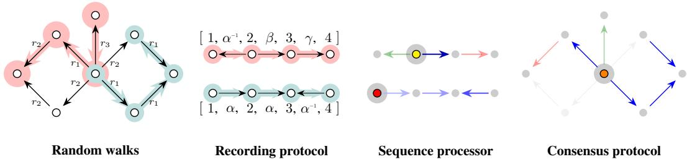
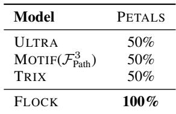
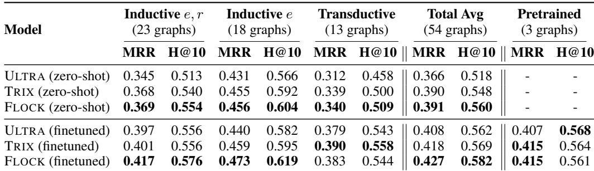
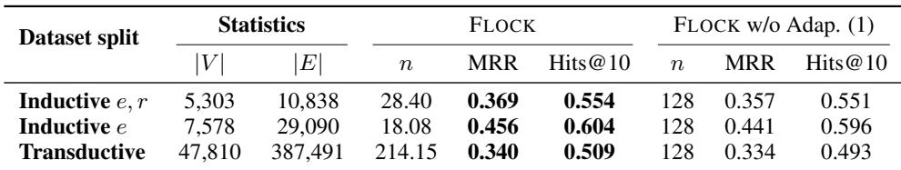
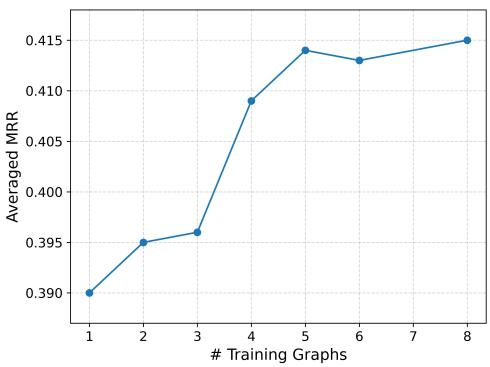

# Flock A Knowledge Graph Foundation Model via Learning on Random Walks

> [!tip] 核心洞察
> 概率性节点-关系等变性（Probabilistic Node-Relation Equivariance）能够替代确定性等变性，因为它在分布意义上保持等变性，同时通过推理时的结构化随机性打破对称性，从而使KGFM成为通用逼近器成为可能。

| 字段 | 内容 |
|------|------|
| 中文题名 | FLOCK：基于随机游走学习的知识图谱基础模型 |
| 英文题名 | Flock A Knowledge Graph Foundation Model via Learning on Random Walks |
| 会议/期刊 | ICLR 2026 (accepted) |
| Links | [paper](https://openreview.net/forum?id=1cGOCIOKQd) / [code](https://github.com/jw9730/flock) |
| Topic | #topic/generative_models_diffusion #topic/generative_models_diffusion/graph_neural_networks |
| Method | 基于随机游走序列编码的概率性节点-关系等变模型 |
| Dataset | 54 KGs, PETALS |

> [!tip] 效果简介
> - FLOCK在PETALS诊断数据集上达到100%准确率，而所有基线方法（ULTRA、TRIX、MOTIF）仅达到50%。
> - 在54个知识图谱的零样本实体预测中，FLOCK平均MRR达0.391，Hits@10达0.560，均超越SOTA。
> - 在54个知识图谱的零样本关系预测中，FLOCK平均MRR达0.881，Hits@1达0.817，显著领先。

## 背景与动机

知识图谱（KG）中的零样本链接预测要求模型泛化到训练时未见过的实体和关系。现有知识图谱基础模型（KGFM），如ULTRA、TRIX、MOTIF和InGram，均采用确定性节点-关系等变性作为归纳偏置。然而，确定性等变性存在根本性的表达能力瓶颈：它强制要求结构同构但语义不同的关系（例如“喜欢”与“不喜欢”）具有相同的表示。如图1所示，在一个《星球大战》角色关系图中，若仅从图结构看，like与dislike关系完全对称，确定性等变模型无法区分它们。这一限制导致模型在需要区分语义对立关系的任务上表现不佳。因此，核心瓶颈在于：如何在保留跨KG泛化所需的等变归纳偏置的同时，突破确定性等变带来的表达力天花板。

## 核心创新

核心洞察：概率性节点-关系等变性（Probabilistic Node-Relation Equivariance）能够替代确定性等变性，因为它在分布意义上保持等变性，同时通过推理时的结构化随机性打破对称性，从而使KGFM成为通用逼近器成为可能。

具体而言，FLOCK放弃了传统的两阶段消息传递架构，转而采用随机游走序列编码。通过从查询节点出发采样多条随机游走，对游走序列进行匿名化记录，并用双向GRU处理这些序列，FLOCK能够捕获节点和关系的局部结构上下文。由于每次推理时随机游走的采样结果不同，模型在保持等变性的同时获得了区分结构同构但语义不同关系的能力。论文通过命题4.1证明FLOCK是等变链接级函数的通用逼近器，这是现有KGFM所不具备的理论保证。

## 整体框架

*Figure 2: An overview. In each updating step, FLOCK (1) samples random walks on the KG (two walks indicated by red and teal, respectively), (2) anonymizes the encountered nodes and relations via a recording protocol (for each walk, nodes are anonymized as 1 , 2 , \ldots . and relations as \alpha , \beta , \ldots ) , and (3) feeds the sequences in a sequence processor to compute node and relation representations. (4) A consensus protocol then pools them back to the original KG’s nodes and relations*

FLOCK的整体框架如图2所示，包含五个核心模块：

1. **随机游走采样器**：对于每个查询（头实体、关系、尾实体），从查询节点出发采样多条无回溯的均匀随机游走，游走长度和数量可自适应调整。
2. **记录函数**：将每条随机游走转换为匿名化序列，序列中节点和关系被替换为它们在当前游走中的位置索引和类型标记，从而消除对具体节点/关系ID的依赖。
3. **序列处理器**：使用双向GRU处理匿名化序列，生成每个位置的隐藏状态。
4. **共识协议**：通过多头注意力池化机制，从多条游走的隐藏状态中聚合出节点和关系的更新量。
5. **更新步骤**：将聚合得到的更新量加到当前节点/关系嵌入上，迭代执行I步以逐步精化表示。

整个流程在推理时重复多次（集成），最终取平均预测结果。

## 核心模块与公式推导

**自适应游走数量**：为适应不同规模的目标KG，FLOCK根据图大小动态调整基础游走数量：
$$n = n_{train} \times \text{harmonic mean}(|V|/|V|_{train}, |E|/|E|_{train})$$
其中$n_{train}$是预训练时的游走数量，$|V|$和$|E|$分别是节点数和边数。该公式确保在更大图上采样更多游走以保持覆盖。

**记录函数**：给定一条随机游走$\eta = (v_0, r_1, v_1, r_2, \ldots, v_l)$，记录函数$w$将其编码为匿名化序列：
$$w: \eta \mapsto \mathbf{z} = (1, \mathbf{v}(v_0), \mathbf{1}_h(v_0)) \text{xrightarrow}{\alpha, \mathbf{r}(r_1), \mathbf{1}_r(r_1)} (2, \mathbf{v}(v_1), \mathbf{1}_h(v_1)) \text{xrightarrow}{\beta, \mathbf{r}(r_2), \mathbf{1}_r(r_2)} \cdots$$
其中$\mathbf{v}(\cdot)$和$\mathbf{r}(\cdot)$是当前嵌入，$\mathbf{1}_h(\cdot)$和$\mathbf{1}_r(\cdot)$是类型指示向量，$\alpha, \beta$等是位置编码。该函数完全匿名化节点和关系，使模型不依赖具体ID。

**随机游走转移概率**：采用二阶马尔可夫过程定义无回溯随机游走：
$$\mathbb{P}(V_{i+2}=v|V_{i+1}=w,V_i=u) = \begin{cases} \frac{1}{\deg(w)-1} & \text{if } v \neq u \\ 0 & \text{if } v = u \end{cases}$$
即禁止立即回溯到上一个节点，这避免了游走陷入局部循环。

**概率逼近保证**：FLOCK以高概率逼近任意等变链接级函数：
$$\mathbb{P}(|\varphi(G)((h,r,t)) - X_\theta(G,(h,r,?))(t)| < \epsilon) > 1 - \delta$$
该公式表明，通过增加游走数量和集成次数，FLOCK可以任意精度逼近目标函数，这是其通用逼近能力的理论基石。

## 实验与分析

**主要结果**：FLOCK在54个知识图谱的零样本实体预测和关系预测任务上均取得SOTA。
*Table 1: PETALS accuracies*

显示，在实体预测中，FLOCK的平均MRR为0.391（TRIX: 0.390, ULTRA: 0.366），Hits@10为0.560（TRIX: 0.548, ULTRA: 0.518）。在关系预测中优势更显著：MRR达0.881（TRIX: 0.792, ULTRA: 0.724），Hits@1达0.817（TRIX: 0.687, ULTRA: 0.613）。

**PETALS诊断数据集**：
*Table 2: Average entity prediction MRR and Hits@10 over 54 KGs from distinct domains*

显示FLOCK达到100%准确率，而所有基线（ULTRA、TRIX、MOTIF）仅50%，验证了FLOCK区分结构同构但语义不同关系的能力。

**消融研究**：
*Table 4: Ablation study of adaptive test-time walks with zero-shot entity prediction task. We show the average number of entities |V |, triples |E|, base walks n, MRR, and Hits@10*

揭示了关键设计选择的影响：自适应游走数量在所有数据划分上提升MRR；无回溯策略将直推式划分MRR从0.334提升至0.360；游走长度128为最优；多样起点策略提升所有划分性能；GRU优于Transformer（MRR 0.395 vs 0.359）；加权共识协议将MRR从0.387提升至0.395。

**缩放分析**：
*Figure 4: (a) Zero-shot MRR vs. #pretraining graphs*

展示了FLOCK的预训练和测试时缩放行为。随着预训练图数量增加，零样本MRR持续提升；增加集成预测数量也带来稳定的性能增益，表明FLOCK具有良好的可扩展性。

**计算成本**：FLOCK参数量为801,969，单批次训练时间1.3秒，GPU内存占用27.89 GB，高于基线方法但仍在可接受范围内。

## 方法谱系与知识库定位

FLOCK属于知识图谱基础模型（KGFM）谱系，其直接父系为ULTRA和TRIX。与这些方法相比，FLOCK在三个关键槽位上进行了根本性替换：

- **架构**：从两阶段消息传递（先编码关系再编码节点）替换为单阶段随机游走序列编码（GRU）。
- **推理策略**：从确定性前向传播替换为随机游走采样与集成的随机性前向传播。
- **数据流水线**：从子图提取或全图消息传递替换为随机游走采样与匿名化记录协议。

FLOCK引入的新机制包括：均匀无回溯随机游走、匿名化记录函数、双向GRU序列处理器、以及多头注意力共识池化协议。这些机制共同实现了概率性节点-关系等变性这一新的归纳偏置。

在知识库中，FLOCK应被创建为M__Method节点，与以下节点建立边：belongs_to_task指向Zero-shot Link Prediction；modifies_slot指向Probabilistic Node-Relation Equivariance和Random Walk Sequence Encoding；compares_against指向ULTRA、TRIX、MOTIF和InGram；evaluates_on指向PETALS；uses_dataset指向FB15k-237、WN18RR和CoDEx Medium。

未来工作可沿以下方向展开：探索更高效的随机游走采样策略以降低计算成本；将FLOCK扩展到超大规模KG；研究概率性等变性与图神经网络其他归纳偏置的结合。

## 原文 PDF

![[paperPDFs/ICLR_2026/Flock_A_Knowledge_Graph_Foundation_Model_via_Learning_on_Random_Walks.pdf]]
