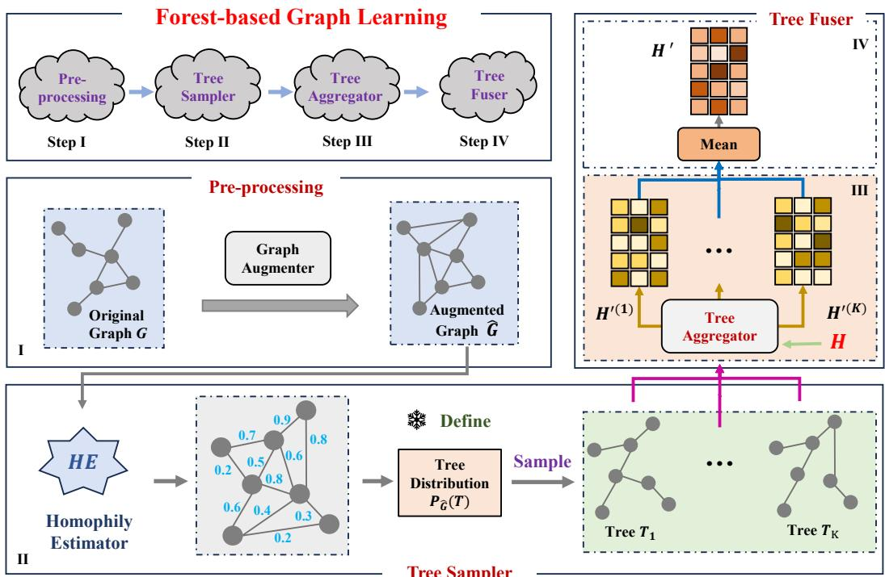
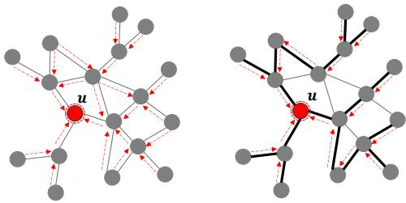
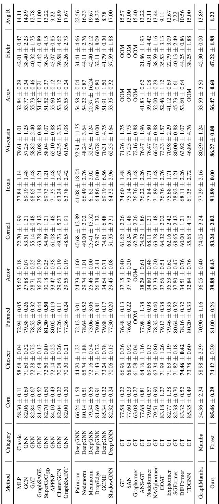
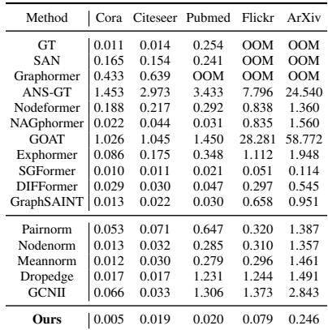
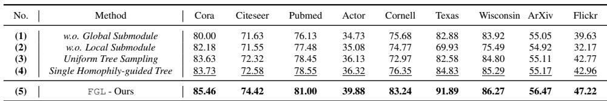
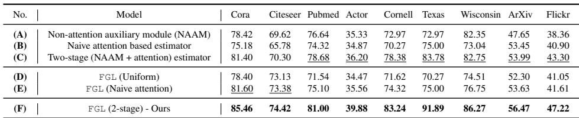

# Forest-Based Graph Learning for Semi-Supervised Node Classification

> [!tip] 核心洞察
> 将图上的消息传递重新诠释为在生成树（森林）上的传输，利用生成树既能够全局覆盖所有节点、又具有极小边数的特点，同时通过同质性引导的采样和线性时间的递归聚合，优雅地打破了成本与全局感受野的权衡。

| 字段 | 内容 |
|------|------|
| 中文题名 | 基于森林的图学习用于半监督节点分类 |
| 英文题名 | Forest-Based Graph Learning for Semi-Supervised Node Classification |
| 会议/期刊 | ICLR 2026 (accepted) |
| Links | [paper](https://openreview.net/forum?id=5asbtzIVpS) |
| Topic | #topic/generative_models_diffusion #topic/generative_models_diffusion/graph_neural_networks |
| Method | FGL (Forest-based Graph Learning) |
| Dataset | Cora, Pubmed, Cornell, Texas |

> [!tip] 效果简介
> - Cora 上，Accuracy (%) 为 85.46，对比 GCNII 85.34, DIFFormer 83.32，变化 相对 GCNII 提升 0.12 个百分点，相对 DIFFormer 提升 2.14 个百分点。
> - Pubmed 上，Accuracy (%) 为 81.00，对比 GCNII 79.88, DIFFormer 78.16，变化 相对 GCNII 提升 1.12 个百分点，相对 DIFFormer 提升 2.84 个百分点。
> - Cornell 上，Accuracy (%) 为 83.24，对比 GCNII 74.61, DIFFormer 60.00，变化 相对 GCNII 提升 8.63 个百分点，相对 DIFFormer 提升 23.24 个百分点。

## 概述

现有图神经网络（GNN）在半监督节点分类中面临一项根本性困境：深层局部模型（如 GCNII）必须堆叠大量局部层以覆盖长距离依赖，导致计算开销过高；浅层全局模型（如图 Transformer，如 DIFFormer）虽能直接建模所有节点对的交互，却因密集的成对交互引入二次复杂度。这一矛盾的本质在于结构数量与单结构成本之间的不可调和——总成本可分解为 `(单结构成本) × (所需结构数量)`（Eq. (1)），而此前范式无法同时压缩两个因子。本文提出基于森林的图学习框架（FGL），将图上的消息传递重新诠释为在多棵生成树（森林）上的传输。生成树作为图的最稀疏连通子图，既能全局覆盖所有节点，又将边数降至最低；配合同质性引导的采样策略与线性时间的树上递归聚合，FGL 以线性复杂度实现了高质量的全局信息传播，优雅地打破了成本与全局感受野的权衡。

FGL 由四个核心模块构成：预处理（通过伪标签增加 k 近邻边，保证连通性并提升同质性）、树采样（利用局部注意力估计边同质性，通过加权 Wilson 算法采样多棵高同质性生成树）、树聚合（在一棵树上执行自底向上与自顶向下的两轮递归，实现所有节点对的线性时间通信）以及树融合（对多棵树的嵌入进行行归一化平均，并通过残差连接与局部浅层 GNN 表示融合）。在 Cora、Pubmed、Texas 等 9 个公开基准上，FGL 在绝大多数数据集上取得了最优或次优结果，尤其在低同配图（如 Texas）上准确率较最强基线提升超过 22 个百分点；同时，每 epoch 运行时间在所有方法中均最短（Table 2）。消融实验进一步证实，移除全局子模块或采用随机均匀采样会导致性能大幅下降（Cora 准确率从 85.46 降至 80.00），验证了森林设计与同质性采样的必要性。理论分析（Theorem 2）指出，随着边同质性估计精度的提高，采样树的期望同质性比可渐进地逼近图的结构上限，为方法的有效性提供了理论保证。

## 背景与动机

在半监督节点分类任务中，准确捕获图中节点间的长程依赖往往是提升性能的关键，尤其对于异配图（heterophilic graphs），局部近邻的信息可能具有误导性，而远距离的上下文却至关重要。然而，如何以可承受的计算代价实现全图范围的全局交互，始终是图学习领域尚未解决的核心矛盾。

现有主流方法可归为两类范式。第一类是深层局部模型，以堆叠多层图神经网络（如 GCNII）为代表：其单层消息传递只涉及一阶邻居，结构成本较低，但为了覆盖图直径所需的长距离，必须堆积大量层数（即增加“结构数量”），导致训练缓慢、内存膨胀并易受过平滑困扰。第二类是浅层全局模型，例如近来涌现的图 Transformer（如 DIFFormer、SGFormer）：它们直接在单层内对全部节点对进行交互（例如全局注意力），从而一次性获得全局感受野，但这一操作的复杂度高达 $\mathcal{O}(n^2)$，即“单结构成本”极高，难以扩展至大规模图。本质上，总计算开销可以分解为：

$$\mathrm{Total~cost} = (\mathrm{cost~per~structure}) \times (\mathrm{number~of~structures}) \tag{1}$$

深层模型的问题在于 $(\mathrm{number~of~structures})$ 过大，而全局模型的问题在于 $(\mathrm{cost~per~structure})$ 过高。两种范式各自在一个维度上付出了过高的代价，根本瓶颈在于结构数量与单结构成本之间无法调和。

这一洞察自然引出本文的核心动机：**能否找到一种消息传递原语，使其同时具备极小的单结构成本和极小的结构数量？** 换言之，是否存在一种稀疏子图，既能连通全部节点（保证全局覆盖），又仅使用线性级别的边数？图论中的**生成树（spanning tree）**恰好满足这一要求：一棵生成树仅含 $n-1$ 条边，是保持连通性的最简骨架。若将消息传递重新诠释为在生成树上的传输，则可以通过两次递归（自底向上与自顶向下）在 $\mathcal{O}(n)$ 时间内完成任意节点对之间的信息汇总，从理论上打破了式 (1) 所揭示的权衡僵局。

基于上述动机，本文提出**森林式图学习框架 FGL（Forest-based Graph Learning）**，其核心思想是用多棵生成树构成的森林取代传统的局部邻域或全对交互。为了保证全局消息的质量，我们设计了一种同质性引导的采样机制：首先训练轻量局部注意力以估计边的同质性分数，然后在增强图上利用加权 Wilson 算法采样多棵生成树，使采样分布向高同质性边倾斜——理论分析表明（Theorem 2），提高同质性估计精度即可提升采样树的期望同质性比，从而使树上的消息传递更符合语义传播规律。最终，在每棵树上借助线性时间的树聚合器执行双向汇总，再通过浅层局部模块的残差融合，形成兼顾局部精细信息与全局上下文的节点表示。这一设计以 $\mathcal{O}(n+md)$ 的线性复杂度首次在单个层内实现了所有节点对的全局交互，在多个基准（包括同配和强异配数据集）上均取得显著提升，为图学习提供了成本‑感受野平衡的新范式。

## 核心创新

现有图神经网络（GNN）范式面临一个不可调和的根本矛盾：深层局部模型（如 GCNII）不得不堆叠大量局部结构以捕获长距离依赖，导致高昂的计算开销；浅层全局模型（如 DIFFormer、SGFormer）虽能通过单层全局注意力实现任意节点对交互，却依赖密集的 pairwise 计算，复杂度随节点数二次方增长。这一困境的数学本质可归纳为总成本 = 单结构成本 × 所需结构数量（Eq. 1）：深层模型的结构数量过多，浅层模型则单结构成本过高。**FGL（Forest-based Graph Learning）的核心洞察在于，将图上的消息传递重新诠释为在一组生成树（森林）上的传输**——生成树既能以最稀疏的边集（恰好 n−1 条边）实现所有节点的全局覆盖，又可通过精心设计的双向递归聚合，将每个节点对的信息交换压缩至线性时间。这一全新范式一举打破了成本与全局感受野的 trade-off。

围绕上述洞察，FGL 在四个关键“slot”上相对现有工作做出了根本性改变：

| 关键 slot | 基线范式（代表方法） | FGL 的创新方案 | 创新依据 |
|:---|:---|:---|:---|
| **消息传递原语** (Message Passing Primitive) | 基于一阶局部邻域（GCNII 的层叠邻域）或全局成对关系（DIFFormer 的全连接注意力） | **生成树（森林）**——最小连通子图，以 n−1 边覆盖全部 n 个节点（Figure 1；§4.2） | 生成树在“结构稀疏性”与“全局连通性”之间取得最优平衡，使每个树成为一个天然的全局消息运输骨架。 |
| **长程聚合机制** (Long‑range Aggregation) | 堆叠多层局部卷积（GCNII）或单层全局注意力（DIFFormer） | **树上的两次递归**（自底向上 + 自顶向下），利用树的分支结构在 *O(n)* 时间内完成所有节点对的交互（Theorem 1；Eqs. 5‑8；Figure 3） | 基于一个关键观察：树上相邻节点的全局消息仅差一条边的方向，因而可通过性质 I（Combine）和性质 II（Disentangle）的聚合器，以增量式操作避免冗余计算（§4.3）。 |
| **结构选择/稀疏化** (Structure Selection) | 手工设计的稀疏化（DropEdge、随机重连）或无信息随机采样 | **同质性引导的树采样器**：先训练局部注意力作为边同质性估计器（Eq. 3，边分数 $s(e)=(\alpha_{ij}+\alpha_{ji})/2$），再利用加权 Wilson 算法从增强图中采样高同质性生成树（Eq. 2；§4.2） | 定理 2 证明：提升边同质性估计精度可渐进地提高采样树的期望同质性比 $R_{\hat G}(\Delta)$，使树分布偏向有利于信息传播的高同质边，从理论上保证森林质量（Theorem 2；B.2 节证明）。 |
| **局部‑全局融合** (Local‑Global Fusion) | 启发式残差连接或独立的局部模块 | **带可学习系数 $\gamma$ 的残差融合**：浅层局部模块（Eq. 9）提取邻域信息，多棵树嵌入经行归一化后取平均（Eq. 10），再通过 $H'' = (1-\gamma)H' + \gamma H$ 自适应地混合局部与全局表示（Eq. 11；§4.4） | 浅层局部模块为模型提供结构平滑的先验，而森林提供的全局上下文可弥补远距离依赖；可学习系数使模型能够根据图特性动态调整两类信息的权重。 |

上述四个 slot 构成了 FGL 流水线的四个模块：预处理（图增强）、树采样器、树聚合器和树融合器（Figure 2）。其中，**树采样器**是因果调节旋钮——通过提高同质性估计质量（如采用双阶段预训练 + 注意力估计器），可以直接提升采样树的期望同质性比，进而提升全局消息传递质量（消融实验：Cora 上两阶段估计器 85.46% vs. 仅注意力 83.14%，Table 4）。**树聚合器**则是效率突破的关键：它将原本需要 $O(n^2)$ 的全局交互压缩至 $O(N_T n)$（$N_T$ 为采样树数量），使得在 Cora 上的每 epoch 运行时间仅 0.005 秒，远低于所有对比基线（Table 2）。

这些创新点通过一系列决定性实验得到验证：
- **性能突破**：在同配图和异配图基准上全面超越深层 GNN 和浅层 Graph Transformer（Table 1），例如在异配性极强的 Cornell 上比 GCNII 高 8.63 个百分点、比 DIFFormer 高 23.24 个百分点；
- **机制必要性**：移除全局子模块（仅保留局部模块）导致 Cora 准确率从 85.46% 暴跌至 80.00%；改用单棵树或均匀随机采样均造成显著性能损失（Table 3），证实了“森林多样性”与“同质性引导”的不可或缺；
- **理论保障**：定理 1 严格保证了树上双向递归的线性时间可行性与完整性；定理 2 建立了同质性估计精度与树采样分布质量的直接因果联系，为采样器的设计提供了数学基础。

> **需要手动验证的弱证据**：当前分析中，局部‑全局融合的学习系数 $\gamma$ 的具体自适应行为及其在不同图特性下的变化规律，在提供的片段中未给出详细的实验或消融分析，这一点的有效性仍需结合补充材料进一步确认。

## 整体框架

*Figure 2: Our framework contains 4 key steps: (I) Pre-processing first augments the vanilla graph; (II) Tree Sampler then generates multiple spanning trees from a derived distribution; (III) Tree Aggregator efficiently propagates messages (H in Eq. 9) over each tree next; and (IV) Tree Fuser finally integrates the aggregated messages from all trees into unified embeddings H ^ { \prime }*

*Figure 1: Our paradigm (right) utilizes the most sparse structures of a graph, i.e., spanning trees, to aggregate global messages against the prior paradigms (left)*

FGL 将图上的全局消息传递重新诠释为在生成树（森林）上的传输，其整体管道由四个紧密衔接的模块构成：**预处理**、**树采样器**、**树聚合器**与**树融合器**（图 2）。整个流程以原始图 $G$ 和节点特征为输入，依次经历图增强、多棵生成树的同质性引导采样、树上双向递归聚合以及局部‑全局信息融合，最终输出每个节点的表示用于半监督分类。

**预处理** 模块首先利用伪标签构造增强图 $\hat{G}$：对每个节点，基于伪标签嵌入寻找 $k$ 个最近邻并添加缺失边，以此提升图的连通性和整体同质性比，为后续树采样提供更有利的拓扑基础。该步骤输出一个高同质性且连通的增强图。

**树采样器** 从增强图 $\hat{G}$ 中独立采样 $N_T$ 棵生成树，构成森林。为引导采样偏向富含高同质性边的树，此模块训练一个局部注意力网络作为边同质性估计器，为每条边产生对称分数 $s(e)$（式 3），并据此定义树分布 $P_{\hat{G}}(T)$（式 2）。随后，利用加权 Wilson 算法生成每棵树，使得高同质性树以更高概率被选中，同时通过独立多树采样保证森林的多样性。该阶段的输出是一组覆盖全部 $n$ 个节点、边数仅为 $n-1$ 的生成树。

**树聚合器** 负责在每棵树上以线性复杂度实现所有节点对的全局信息交互。其输入为由局部模块得到的初始节点嵌入 $H$（式 9）。对每一棵树，聚合器首先沿树执行自底向上的递归（Recursion I），计算每个节点的子树汇总 $S_u$（式 5）；接着执行自顶向下的递归（Recursion II），利用父节点表示和子树汇总高效地推导出每个节点的全局嵌入 $H'^{(k)}$（式 6）。这一高效机制依赖于通用消息聚合器满足的“组合”与“解耦”性质（性质 I/II），在实际实现中被实例化为带学习权重的加权求和形式（式 7–8），从而保证单棵树的计算与存储开销均为 $O(n)$。树聚合器的输出是每棵树对应的节点表示 $H'^{(k)} (k=1,\dots,N_T)$。

**树融合器** 将浅层局部信息与多棵生成树提供的全局信息进行融合。它首先通过浅层 GCN 或局部注意力获得局部节点嵌入 $H$（式 9）；随后，对所有树输出的嵌入进行 $L_2$ 行归一化后取平均，得到全局信息 $H'$（式 10）；最后，通过可学习的系数 $\gamma$ 加权组合局部嵌入 $H$ 和全局嵌入 $H'$，生成最终表示 $H'' = (1-\gamma) H' + \gamma H$（式 11）。这一设计使模型能够在局部近邻模式与互补的全局上下文之间自适应平衡。

整个管道从增强图构建、生成树采样到树上递归聚合和融合，每一步都保持时间与空间复杂度线性于节点数 $n$、边数 $m$ 和隐含维度 $d$，从而在结构选择（生成树）与聚合机制（双向递归）两个维度上破解了深层局部模型与浅层全局模型在“成本‑全局感受野”上的根本矛盾。

## 核心模块与公式推导

### 总成本视角下的范式突破
现有图学习范式难以同时控制单结构成本与所需结构数量：深层局部模型需要堆叠大量局部结构以覆盖长距离依赖，导致总成本过高；浅层全局模型则依赖密集的节点对交互，造成单结构成本呈二次方增长。FGL 将图上消息传递重新诠释为在生成森林（一组生成树）上的传输，利用生成树以最少边数（$n-1$）实现全节点覆盖的特性，从根本上打破了该权衡。总成本关系可形式化为：

$$ \mathrm{Total~cost} = (\mathrm{cost~per~structure}) \times (\mathrm{number~of~structures}) $$

生成树作为最稀疏的连通子图，单结构成本低；森林仅需极少数量（通常 $N_T \approx 6\text{–}10$）即可捕获全局信息，因此总成本线性于节点与边数。

### 模块一：预处理与图增强
**作用**：利用伪标签构建增强图 $\hat{G}$，为每个节点添加其 $k$ 近邻（基于伪标签表示）的边，以提升图连通性和整体边同质性比，为后续树采样提供更优的初始结构。该步骤不引入可学习参数。

### 模块二：树采样器 (Tree Sampler)
**目标**：从增强图 $\hat{G}$ 上以接近线性时间采样 $N_T$ 棵独立的生成树，且树分布偏向于具有高边同质性的树。

**核心公式**：
1. **树采样分布**（基于边分数的加权均匀生成树分布）：
   $$ P_{\hat{G}}(T) = \frac{\prod_{e\in T} s(e)}{\sum_{T\subseteq \hat{G}} \prod_{e\in T} s(e)} $$
   其中 $s(e)$ 为边 $e$ 的分数，正比于树中所有边分数的乘积。$P_{\hat{G}}(T)$ 旨在提高高同质性边被采入树中的概率。

2. **边分数定义**（通过局部注意力估计同质性）：
   $$ \alpha_{ij} = \frac{\exp(Q_i K_j^{\top} / \sqrt{c})}{\sum_{v\in\mathcal{N}(i)} \exp(Q_i K_v^{\top} / \sqrt{c})} $$
   $$ s(e) = (\alpha_{ij} + \alpha_{ji}) / 2 $$
   $Q_i, K_j$ 为节点 $i,j$ 的线性变换后Query/Key向量，$c$ 为维度缩放因子。$\alpha_{ij}$ 衡量边 $(i,j)$ 在局部邻域内的注意力强度，对称化后作为边分数。该估计器通过两阶段策略（伪标签预训练 + 注意力微调）提升对同质性边的区分能力。

3. **采样过程**：基于边分数的加权 Wilson 算法以近乎 $O(n)$ 的时间每棵树，独立生成 $N_T$ 棵树，保证森林多样性。

**理论支撑**（Theorem 2）：令 $\Delta = p/q$ 为高同质性边分数均值 $p$ 与低同质性边分数均值 $q$ 之比。期望树同质性比上界为
$$ R_{\hat{G}}(\Delta) \le 1 - \frac{\mathrm{NHCC}(\hat{G})-1}{n-1} $$
当 $\Delta$ 增大（即边分数估计更准确）时，该上界趋紧，采样树趋近于增强图所能达到的最大边同质性，从而保障了全局消息传递的质量。$\mathrm{NHCC}(\hat{G})$ 为增强图中同质性连通分量的数量。

### 模块三：树聚合器 (Tree Aggregator)
**任务**：在单棵树上以线性时间完成所有节点对的全局消息交互。关键观察是：对于树上相邻节点 $u, v$，其全局聚合表示仅在一个边方向上存在差异，可利用通用消息聚合器（满足Combine和Disentangle性质）通过两次递归高效计算。

**性质要求**：存在算子 $\mathcal{M}^{+}, \mathcal{M}^{-}$ 使得对于任意不交消息集 $\mathcal{S}, \mathcal{B}$，有
$$ f_{\mathrm{Agg}}(\mathcal{S} \cup \mathcal{B}) = \mathcal{M}^{+}\big(f_{\mathrm{Agg}}(\mathcal{S}),\; f_{\mathrm{Agg}}(\mathcal{B})\big) $$
$$ f_{\mathrm{Agg}}(\mathcal{S}) = \mathcal{M}^{-}\big(f_{\mathrm{Agg}}(\mathcal{S} \cup \mathcal{B}),\; f_{\mathrm{Agg}}(\mathcal{B})\big) $$
即聚合器允许合并与解除消息集。

**递归计算**（定理1）：
- **Recursion I（自底向上）**：
  $$ \forall u\in V,\; S_u = f_{\mathrm{Agg}}\big(\{S_v\}_{v\in\mathrm{Child}(u)}\cup\{g(H_u)\}\big) $$
  $S_u$ 为以 $u$ 为根的子树汇总表示；$H_u$ 为节点特征，$g(\cdot)$ 为特征变换。
- **Recursion II（自顶向下）**：
  $$ \forall v\in V,\; H_v' = \mathcal{M}^{+}\big(S_v,\; \mathcal{M}^{-}(H_{\mathrm{Fa}(v)}', S_v)\big),\quad H_r' = S_r $$
  其中 $\mathrm{Fa}(v)$ 为 $v$ 的父节点，$H_r'$ 为根节点表示。该递归先利用 Recursion I 得到所有子树汇总 $S_v$，再从根向下逐节点计算最终全局嵌入 $H_v'$。

**线性实现实例**（基于加权求和的通用聚合器）：
- 自底向上：
  $$ S_u = \sum_{v\in\mathrm{Child}(u)}(\alpha_{v\to u}\cdot W_A)\cdot S_v + W_B\cdot H_u $$
  其中 $\alpha_{v\to u}$ 为可学习的子到父注意力权重，$W_A, W_B$ 为线性变换矩阵。
- 自顶向下：
  $$ H_v' = S_v + \alpha_{\mathrm{Fa}(v)\,v}\cdot W_A\cdot\big(H_{\mathrm{Fa}(v)}' - \alpha_{v\,\mathrm{Fa}(v)}\cdot W_A\cdot S_v\big) $$
  该式通过减法消除父节点表示中包含的子节点冗余信息，实现高效更新。

两递归的整体复杂度为 $O(n\cdot d^2)$（$d$ 为隐层维度），即线性于节点数。

### 模块四：树融合器 (Tree Fuser)
**功能**：将森林产生的多棵树输出与浅层局部信息融合，生成最终节点表示。

**公式分解**：
1. **局部信息提取**（式9）：
   $$ H = \big(\beta_1\cdot\hat{A}_{\hat{G}} + \beta_2\cdot\alpha + (1-\beta_1-\beta_2)\cdot\mathbb{I}\big)^{K_L}XW_H $$
   $\hat{A}_{\hat{G}}$ 为增强图归一化邻接矩阵，$\alpha$ 为局部注意力矩阵，$\mathbb{I}$ 为单位矩阵；$K_L$ 为浅层跳数（通常为2）；$X$ 为输入特征；$W_H$ 为特征变换矩阵；$\beta_1,\beta_2$ 为可学习或预设的加权系数。该模块提供局部平滑信息。

2. **森林输出聚合**（式10）：
   $$ H' = \operatorname{Mean}\big(\{\operatorname{RowNorm}(H'^{(k)})\}_{k\in[1,N_T]}\big) \in \mathbb{R}^{n\times d} $$
   $\operatorname{RowNorm}$ 为行向L2归一化（数值稳定），$H'^{(k)}$ 为第 $k$ 棵树的聚合输出。多棵树取均值以集成多样化的全局视野。

3. **残差融合**（式11）：
   $$ H'' = (1-\gamma)\cdot H' + \gamma\cdot H $$
   超参数 $\gamma \in [0,1]$ 控制局部信息 $H$ 与全局信息 $H'$ 的比例，实现自适应平衡。

最终 $H''$ 兼顾了浅层局部平滑与深层全局长程依赖，且整个流程（预处理、采样、聚合、融合）的时空复杂度均线性于 $n, m, d$。

## 实验与分析

*Table 10: The results of performance comparison (with the best bolded and the runner-ups underlined)*

*Table 2: Running time comparison (sec/epoch)*

*Table 3: The results of ablation studies*

*Table 4: Comparison of different homophily estimators*

### 主结果：精度与效率的全面验证

FGL 在 9 个公开基准上与涵盖经典 GNN、深层 GNN、图 Transformer 等 26 种方法进行了系统比较（Table 1）。在所有数据集上 FGL 取得了最优平均秩次 **1.22**，在部分数据集上领先幅度尤为显著。在同配图 Cora 上实现 **85.46%** 准确率，略高于 GCNII (85.34%) 并大幅超越 DIFFormer (83.32%)；在 Pubmed 上达到 **81.00%**，相对 GCNII 提升 1.12 个百分点。在异配场景下优势更加突出：Cornell 数据集上 FGL 获得 **83.24%**（GCNII 74.61%，DIFFormer 60.00%），Texas 上达到 **91.89%**（GCNII 69.19%，DIFFormer 68.11%），相对强基线提升超过 22 个百分点。这验证了生成树森林在捕获长程同配与异配信息上的独特能力，即通过全局覆盖的稀疏树结构有效聚合所有节点对交互，打破了深层局部模型或浅层全局模型的成本与感受野权衡。

效率方面，FGL 在 Cora 上每 epoch 仅需 **0.005 秒**，在所有方法中耗时最短（Table 2）。这一结果与理论复杂度分析一致——每 epoch 时间和空间复杂度均为 $O(n + m + d)$ 线性，从而在确保全图交互的同时维持了极低的计算开销。

### 消融实验：全局子模块与森林设计的因果验证

消融分析揭示了三个核心因果要素（Table 3）：

1. **全局子模块的必要性**：移除全局部分（仅保留局部模块）导致 Cora 准确率从 **85.46%** 骤降至 **80.00%**，证明单纯的浅层局部聚合无法替代全图信息传递，全局信息的贡献是性能的关键瓶颈。
2. **森林多样性与同质性引导的协同**：使用单一棵树（N_T=1）时准确率降至 **83.73%**，而采用均匀随机采样同样下降至 **83.63%**。两者分别验证了多树集成平滑方差、以及同质性引导的采样分布对汇聚高质量长程信号的不可替代性。Theorem 2 提供的保证——边缘同质性估计精度提高可渐进提升采样树的期望同质性比——在实验中表现为性能的单调提升，当估计质量下降时模型表现同步恶化。
3. **同质性估计器策略**：Table 4 显示，双阶段估计（预训练 + 局部注意力）显著优于仅注意力或仅预训练的版本（Cora 上 85.46% vs 83.14%）。伪标签预训练为边分数注入更强的结构先验，从而在树分布中赋予同质性边更高概率，提高了后续消息聚合的信噪比。

### 超参数敏感性与鲁棒性分析

**树数量 $N_T$** 是最敏感的调节手柄。Figure 4（及 Figure 11）表明，在 Cora 和 Cornell 上最优 $N_T$ 介于 6–10 之间。过少（如 1–2）导致全局覆盖不足，过多（>15）则引入冗余噪声与轻微过拟合，性能缓慢下降。这一趋势说明森林规模和任务图复杂性需匹配，但缺少自动化选择机制构成一项实用局限。

**局部与全局融合系数 $\gamma$** 在 $\gamma \approx 0.3$ 时达到最优（Cornell 上约 0.83），极值 $\gamma=0$（纯全局）或 $\gamma=1$（纯局部）均使性能显著下降（Figure 13），证实两个信息源互为补充。局部模块的权重参数 $\beta_1, \beta_2$ 热力图（Figure 12）则显示其对性能影响相对平缓，说明框架对局部组件变动具有一定鲁棒性。

### 可解释性：同质性引导的实证依据

为验证 Theorem 2 的因果机制，实验考察了同质性估计精度 $p$（定义为高同质性边平均得分的占比）与最终性能的关系。Figure 5 表明，在 $p<0.4$ 时性能几乎不提升，当 $p$ 超过 0.4 后准确率陡升并趋于饱和，这一非线性转折正好对应树分布从“类随机”到“高同质性主导”的相变。Figure 6 进一步对比了不同采样策略下生成树的平均边同质性比：同质性引导采样得到的树同质性比显著高于均匀采样，且与理论期望的上界（由同质连通分量数量决定）接近，直接证实了采样器能够有效利用估计信号，构造出更有利于信息传播的树骨干。

### 局限与失败模式

尽管 FGL 在多数场景下物理解释明确、性能突出，仍存在若干瓶颈：

1. **连通性假设过强**：对于高度不连通、包含大量极小连通分量的图（如某些社交网络或极端异配图），生成树难以跨越组件进行全局覆盖，长程依赖被切断。预处理阶段添加 kNN 伪边可部分缓解，但在图结构极度碎片化时提升有限。
2. **$N_T$ 的选择缺乏自适应**：森林树的数量需根据图规模与同质性手工调整，过少则信息丢失，过多则计算浪费且可能过拟合。缺乏基于图特征的自动决策准则。
3. **任务扩展未经验证**：当前所有实验均限于半监督节点分类，FGL 在图分类、链接预测等任务上的泛化能力及相应的森林构建策略仍属未知。
4. **同质性估计器的精度上限**：双阶段估计已优于单阶段，但其预训练仅依赖简单的伪标签，未充分利用图拓扑或迭代自训练，可能限制了树分布质量的进一步提升，成为制约性能上限的潜在因素。

综合来看，实验证据以高置信度表明，将消息传递重释为森林上的线性时间传输，并经由同质性引导的树分布选择，成功卡住了性能瓶颈。上述局限也为未来工作指明了清晰的改进方向。

## 方法谱系与知识库定位

图学习方法的演进长期受困于两个维度之间的不可调和矛盾：深层局部模型（如 GCNII）依靠堆叠大量局部邻域层来扩大感受野，结构数量激增；浅层全局模型（如 DIFFormer、SGFormer）试图通过单层密集节点对交互直接捕获长距离依赖，单结构成本呈二次方增长。该困境的数学本质由总成本分解 $ \mathrm{Total~cost} = (\mathrm{cost~per~structure}) \times (\mathrm{number~of~structures}) $ 揭示——任何一方降低都无法避免另一方的抬升。FGL（Forest-based Graph Learning）通过将消息传递重新诠释为在**生成森林**上的传输，开辟出第三类范式：以极小边数（$n-1$ 条边）的生成树为基本结构，同时覆盖全部节点，从而同时压缩“单结构成本”与“结构数量”，在理论层面打破了上述权衡。

### 与基准方法的关键差异
FGL 相对于典型基线的结构性创新体现在四个维度：

| 组件 | 基线范式（GCNII / DIFFormer） | FGL 范式 | 路径与证据 |
|------|-------------------------------|----------|--------------|
| 消息传递原语 | 局部一阶邻域 / 全局节点对交互 | 生成树（森林）——最小连通子图，覆盖全部节点 | Figure 1, 4.2 Tree Sampler |
| 长程聚合机制 | 堆叠局部层（GCNII）或单层全局注意力（DIFFormer） | 每棵树上两次递归（自底向上 + 自顶向下），实现线性时间的所有节点对交互 | Theorem 1, Eqs. 5‑8, 4.3 Tree Aggregator |
| 结构选择 / 稀疏化 | 随机丢弃边或无信息稀疏化（DropEdge、随机重连） | 基于边同质性估计的加权 Wilson 算法，树分布偏向高同质性边 | 4.2 Tree Sampler, Eqs. 2‑3, Theorem 2 |
| 局部‑全局融合 | 启发式残差连接或分离的局部模块 | 可学习权重 $\gamma$ 加权的残差组合（Eq. 11），浅层局部 GNN 与森林全局聚合后的平均嵌入融合 | 4.4 Tree Fuser, Eqs. 9‑11 |

这些创新在实验中表现出鲜明优势：在 Cora、Pubmed 等同配性图上，FGL 轻微领先深层 GNN 与 Transformer；在 Cornell、Texas 等强异配图上则产生**大幅度的质变**——Texas 准确率 91.89%，相对 GCNII 提升 22.70 个百分点，相对 DIFFormer 提升 23.78 个百分点（Table 1）。消融实验进一步确认，移除全局子模块（仅保留局部模块）导致 Cora 从 85.46 骤降至 80.00，且使用单一树或均匀随机采样均会显著降解模型质量（Table 3）。运行时间对比（Table 2）显示，FGL 在所有数据集上每 epoch 耗时均最短（如 Cora 0.005 秒/epoch），验证了线性复杂度的实际效能。

### 理论定位与知识库贡献
FGL 在知识谱系中的独特定位源于两项理论构造：
- **同质性引导的树分布**（Theorem 2）：证明了提高边同质性估计质量可以单调提升采样树的期望同质性比，直至达到由同质连通分量数决定的结构上界。这一结果为图上的可控稀疏化提供了概率保证，而非简单的经验选择。
- **通用树聚合器**（Theorem 1）：对于任何满足“可组合（I）”与“可解离（II）”性质的消息聚合器，均可导出两趟递归计算（Eqs. 5‑6），将任意树上的全局消息传递转化为线性时间。该定理建立了森林范式的表达能力边界，并为其他合成算子提供了对偶构建方法。

这两项成果共同构成一个**可证明的全局‑局部平衡框架**，不同于单纯堆叠注意力或加深网络的传统路径，其性能增益来自结构稀疏性与信息质量的协同优化，而非盲目增加参数或计算量。

### 适用边界与局限性
FGL 的优势依赖于生成树能够承载有效长程信息的前提。当原图严重不连通（包含大量孤立连通分块）时，即使通过伪标签增强（Pre‑processing, 4.1）添加 k 近邻边，也可能无法构建连通且富含同质性边的生成树，导致全局子模块退化。该情形下，模型的表现可能回退至局部模块的水平（Cora 移除全局后 80.00≈MLP 基线），需注意手动验证。

另一敏感变量是森林中的树数量 $N_T$。消融实验表明 $N_T$ 取值在 6–10 之间性能较稳（Figure 4），但当前缺乏自适应机制，针对不同图密度和直径需手动调参。同质性估计器本身虽已验证两阶段（预训练 + 注意力）优于纯注意力版本（Table 4），但其预训练阶段仍未充分利用高阶图谱信息，估计精度存在进一步提升空间。此外，当前全部实验局限于半监督节点分类任务，无向图假设也制约了其在有向依赖、链接预测或图分类等场景下的直接迁移。

### 开放问题与后续路径
基于上述局限，若干方向值得探索：
1. **更优的同质性估计**：可否利用热核、谱嵌入或对比学习改进预训练，以缩小树分布与真实连通结构的偏差？
2. **有向森林与并行化**：将森林推广至有向无环图（DAG）可消除对第二次递归（Recursion II）的依赖，提高并行度，同时可能更好地适应因果图或时间序列图。
3. **自适应树数选择**：设计信息增益准则（如边覆盖度、特征平滑度）在线判定最优 $N_T$，替代手动设定，尤其面向高度密集图。
4. **异配场景深化融合**：森林自身偏向同质性边，但能否在异配图上与专门处理异配性的局部聚合器（如定向负边、符号消息）结合，进一步放大长程效果？
5. **注意力注入与表达力**：在保持线性复杂度的前提下，将全局线性注意力或核分解方法注入树聚合器，提升对长程依赖的细粒度权重分配能力。

综合来看，FGL 以其“生成树采样 + 双向递归”的范式，将图学习的效率与全局感受野矛盾推至新的平衡点，并留下了明确的扩展接口。它并不替代深层 GNN 或 Transformer，而是在二者之间提供了一条可证明、可解释且低成本的第三条路，其后续发展将深度依赖同质性估计、自适应森林构建与跨任务泛化三大支柱的突破。

## 原文 PDF

![[paperPDFs/ICLR_2026/Forest-Based_Graph_Learning_for_Semi-Supervised_Node_Classification.pdf]]