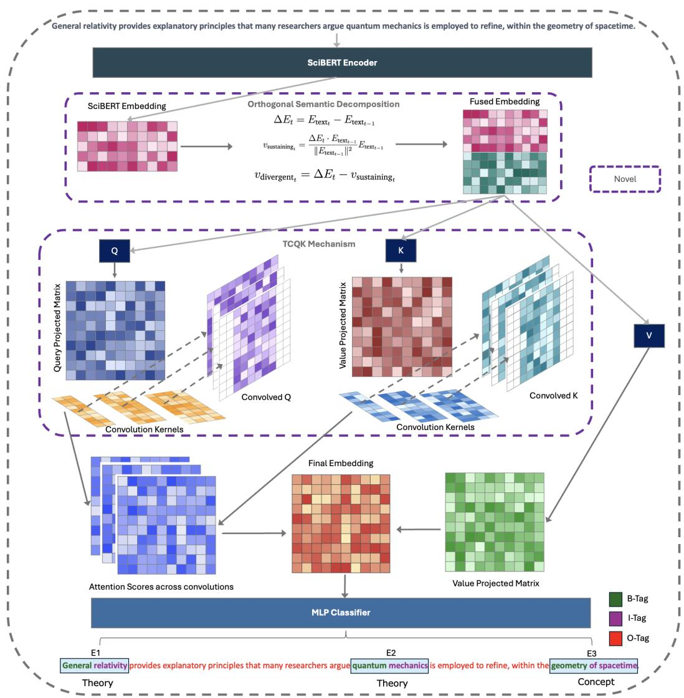
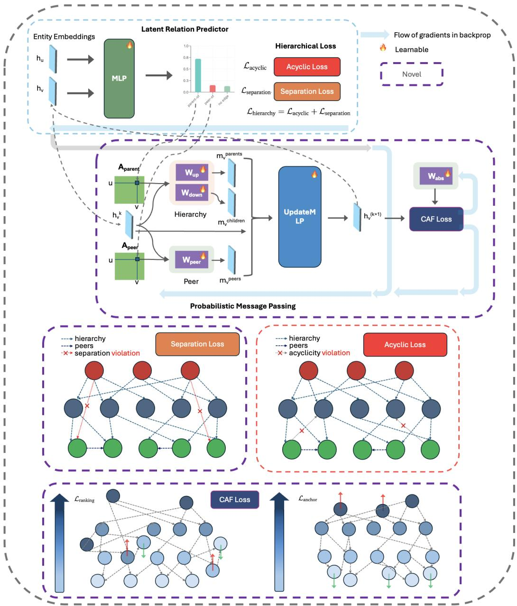
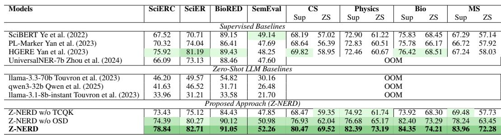
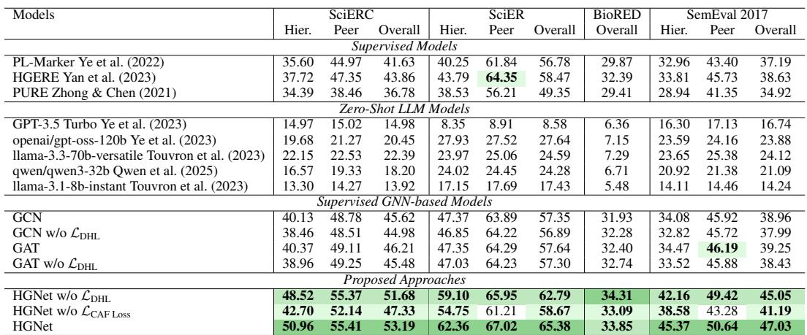
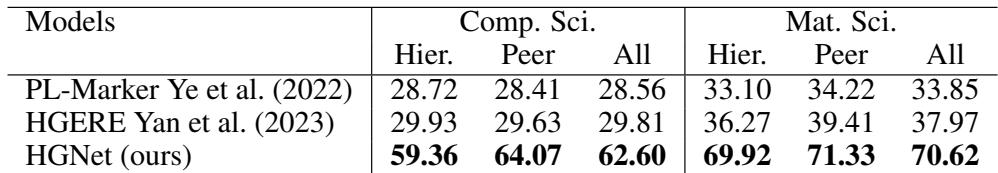
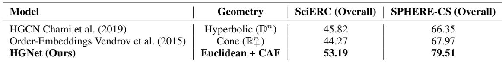

# HGNet: Scalable Foundation Model for Automated Knowledge Graph Generation from Scientific Literature

> [!tip] 核心洞察
> 将自注意力泛化为稀疏实体图上的多通道层次消息传递，并在欧氏空间中引入可学习的抽象场向量，使模型能够捕捉科学概念之间的深层抽象层次，而非仅仅依赖表面共现，从而实现轻量、零样本、全局一致的层次知识图谱构建。

| 字段 | 内容 |
|------|------|
| 中文题名 | HGNet：面向科学文献自动知识图谱生成的可扩展基础模型 |
| 英文题名 | HGNet: Scalable Foundation Model for Automated Knowledge Graph Generation from Scientific Literature |
| 会议/期刊 | ICLR 2026 (accepted) |
| Links | [paper](https://openreview.net/forum?id=NWd53rltx8) |
| Topic | #topic/generative_models_diffusion #topic/generative_models_diffusion/graph_neural_networks |
| Method | HGNet（包含 Z-NERD 零样本实体识别和 HGNet 层次关系抽取） |
| Dataset | SciERC, SciER, BioRED, SemEval (supervised NER), SPHERE (zero-shot NER), SciERC, SciER, BioRED, SemEval (supervised RE), SPHERE (zero-shot RE) |

> [!tip] 效果简介
> - SciERC, SciER, BioRED, SemEval (supervised NER) 上，NER F1 为 Z-NERD，对比 best supervised model (e.g., HGERE)，变化 +8.08% (平均)。
> - SPHERE (zero-shot NER) 上，NER F1 为 Z-NERD，对比 best zero-shot model，变化 +10.76%。
> - SciERC, SciER, BioRED, SemEval (supervised RE) 上，Rel+ F1 为 HGNet，对比 best supervised model (e.g., HGERE)，变化 +5.99%。

## 概述

科学文献知识图谱的自动化构建面临几个相互关联的瓶颈：第一，长多词实体的边界识别极易碎片化；第二，模型在见与未见的科学领域间的泛化能力不足；第三，现有方法普遍忽略概念间的层次化关系（如父-子-对等），仅将其视为扁平的二元关系；第四，缺乏对图谱全局逻辑一致性（如无环性）的显式约束，导致抽取结果的可信度低。这些问题使得传统流水线式系统或通用大语言模型在跨领域、零样本场景下难以可靠工作。

HGNet 将问题分解为两个协同阶段——零样本命名实体识别（Z-NERD）与层次化关系抽取（HGNet），并通过三项关键机制从根本上改变了信息流动方式：（1）**正交语义分解（OSD）**将相邻词嵌入的变化向量拆分为延续分量与发散分量，以领域不变的方式捕捉语义转折信号，赋予模型零样本实体发现能力；（2）**多尺度 TCQK 注意力**将自注意力头分组为不同核大小的一维卷积，使各头专门捕获不同长度的 n-gram 模式，显著改善多词实体的边界识别；（3）**层次化三通道消息传递**将全连接图替换为基于父、子、对等关系的稀疏图，并在可微层次损失（DHL）与连续抽象场损失（CAF）的联合约束下，保证生成的知识图谱形成有向无环结构，且概念沿抽象轴有序排列。这一设计实质上将标准自注意力泛化为层次化图神经网络，在保持轻量级的同时引入了全局结构先验。

实验结果验证了以上机制的效力：Z-NERD 在 SciERC、SciER、BioRED、SemEval 等 8 个 NER 基准上均取得最高 F1 分数，平均超越先前最佳监督模型 **8.08%**，在零样本 SPHERE 域上更提升 **10.76%** （Table 1）；HGNet 在对应的四个 RE 基准上整体 Rel+ F1 平均改进 **5.99%**，零样本场景下提升达 **26.20%**（Tables 2–4）。消融研究进一步表明，移除多尺度 TCQK 导致 BioRED 上 NER F1 从 91.05 骤降至 84.43，剥离 OSD 则使跨域 F1 大幅跌落；而删除可微层次损失或抽象场损失均使关系抽取的 Rel+ F1 显著下降，证实了层次约束与抽象场正则化的必要性。在推理效率方面，HGNet 以 293M 参数实现 14.6 doc/s 的吞吐量，优于 PL-Marker 等监督基线，且具备良好的跨领域零样本迁移能力。

综上，HGNet 以正交语义分解与多尺度注意力解决实体识别的长序列与泛化难题，以层次消息传递和结构化损失保证图谱的逻辑一致性与抽象序，为大规模科学文献的自动知识图谱生成提供了一套端到端的基准方法。

## 背景与动机

科学文献的爆炸式增长使得自动构建知识图谱成为加速科学发现的重要途径。然而，当前自动化方法面临四大核心瓶颈，严重制约图谱质量与可靠性：

1. **长多词实体识别碎片化**：科学实体常由多个单词组成（如“transformer-based language model”），现有模型难以准确捕获其完整边界，导致实体被错误切分或遗漏；
2. **领域泛化能力薄弱**：多数监督模型仅在训练域内有效，跨领域或零样本场景下性能急剧退化，无法适应科学的多元性；
3. **层次化关系被忽略**：知识图谱中普遍存在父子、组成等层次关系，但主流关系抽取方法仅建模平面对等关系，缺乏对方向性依赖的刻画；
4. **全局逻辑一致性缺失**：现有系统未在训练中强制无环性、抽象排序等结构约束，导致生成图谱出现循环或层次错乱，降低可信度。

已有基线方法（如 PL-Marker、HGERE）仍高度依赖监督信号，且缺乏对语义转折与层次结构的显式建模；而大语言模型（如 Llama-3-8B）在科学文本中亦表现不佳，难以捕捉领域不变的实体边界。这些缺口推动了对一种轻量、零样本、全局一致且能捕捉层次抽象的基础模型的需求。

为应对上述挑战，本文提出 **HGNet**（Hierarchical Graph Network），其动机是通过以下机制突破瓶颈：
- **正交语义分解（OSD）** 从相邻词嵌入的变化中分离出语义转折分量，提供领域无关的实体边界指示；
- **多尺度 TCQK 注意力** 为不同注意力头配置不同卷积核，显式捕获多词实体的 n-gram 模式；
- **层次化三通道消息传递** 在潜在关系图上分别沿父→子、子→父和对等方向传递消息，建模方向性关系；
- **可微层次损失（DHL）与连续抽象场损失（CAF）** 联合约束图谱的无环性和沿抽象轴的有序排列，保障全局逻辑一致性。

通过这些设计，HGNet 能够在监督与零样本场景下自动构建高质量、层次分明且逻辑自洽的科学知识图谱。

## 核心创新

HGNet 框架（含零样本实体识别器 Z‑NERD 和层次关系抽取器 HGNet）围绕科学知识图谱构建的四大瓶颈——长多词实体碎片化、领域泛化弱、层次关系被忽略以及全局逻辑一致性缺失——进行了四项结构性改进。相对监督基线（PL‑Marker, HGERE, SciBERT+GCN）和零样本大模型（Llama‑3‑8B, UniversalNER‑7b），这些改进构成了可验证的因果链条。

### 1. 正交语义分解（OSD）——输入词嵌入增强
**改变了什么**：将纯上下文嵌入 $E_{\mathrm{text}_t}$ 替换为拼接正交发散分量 $v_{\mathrm{divergent}_t}$。
**原理**：把相邻词嵌入的变化向量分解为“延续分量”（沿前词方向的投影）和“发散分量”（正交残差，公式 $v_{\mathrm{divergent}_t} = \Delta E_t - v_{\mathrm{sustaining}_t}$）。后者天然捕捉语义转折——新概念引入时变化剧烈——从而提供不依赖领域的实体边界信号（Hypothesis 3.1 被图 2 中边界 token 的高“正交语义速度”所证实）。
**证据**：消融 OSD 后，在零样本 CS 域上 NER F1 从 69.52 降至 63.72（Table 1）；监督场景下同样普遍下降。该信号无需学习，是模型跨领域泛化的关键。

### 2. 多尺度 TCQK 注意力——自注意力机制替换
**改变了什么**：从标准缩放点积注意力变为按头分组的卷积感知注意力：$\mathbf{Q}_{\mathrm{conv}, h}=C_g(\mathbf{Q}_h)$, $\mathbf{K}_{\mathrm{conv}, h}=C_g(\mathbf{K}_h)$。
**原理**：将注意力头分成 $G$ 组，每组分配不同核大小的一维卷积，迫使各组头专门捕获特定长度的 n‑gram 模式（Eq. 3）。这使得多词实体（如“deep convolutional neural network”）的边界得到连贯感知，根除传统注意力导致的碎片化。
**证据**：移除 TCQK 后 BioRED 的 NER F1 从 91.05 骤降至 84.43（Table 1），印证了显式 n‑gram 偏置对长实体识别的不可或缺性。

### 3. 层次化三通道消息传递——关系图消息传递
**改变了什么**：从无差别的统一图聚合变为父、子、对等三条概率加权消息通道。
**原理**：先预测实体对的关系类型概率 $P_{uv}$（Eq. 4），然后分别沿 parent‑of、child‑of、peer‑of 方向聚合邻居信息，用拼接更新节点嵌入（Eq. 5）。三个通道显式建模了科学概念间层次关系的方向性，克服了常规 GNN 同质化聚合的瓶颈。
**证据**：HGNet 在 SciERC、SPHERE‑CS 等所有 RE 基准上的 Rel+ F1 平均提升 5.99%（Table 2, 3），并大幅超越 GCN、GAT 等标准 GNN 变体（Table 8）。三通道传递是层次关系准确提取的核心结构。

### 4. 双重几何正则化——层次约束与抽象场
**改变了什么**：从无显式层次约束变为联合施加可微层次损失（DHL）与连续抽象场损失（CAF）。
**原理**：
- **DHL** 通过 $\mathcal{L}_{\mathrm{acyclic}} = \mathrm{tr}( e^{A_{\mathrm{parent}} \circ A_{\mathrm{parent}}} ) - d$ 惩罚有向循环，并附加跨层捷径损失；强制父关系图形成有向无环图。
- **CAF** 引入可学抽象场向量 $w_{\mathrm{abs}}$，定义抽象得分 $\hat{y}_{abs}(v) = h_v \cdot w_{\mathrm{abs}}$，并采用排序损失强制父实体得分高于子实体（Eq. 11）。这使得嵌入空间本身具备几何化的层次顺序。
**证据**：单独去除 DHL 或 CAF 均使 Rel+ F1 显著下降（Table 2, 3 “w/o L_DHL”“w/o L_CAF”）。更重要的是，在几何基线对比中，HGNet 的欧氏抽象场方案远优于 Hyperbolic GCN 和 Order‑Embeddings（Table 8），验证了可学习抽象轴正则化的优越性。

上述四个改进并非孤立叠加，而构成协同体系：正交分解为多尺度注意力提供领域无关的转折先验；三通道消息传递利用这一高质量实体图；双重几何损失则从图结构和向量空间两个角度共同强化层次表示。跨域零样本 RE 高达 26.20% 的提升（Table 4）以及全面的消融实验持续证实了这些创新点的因果贡献。

## 整体框架

*Figure 6: Main figure explaining the proposed Z-NERD algorithm. For TCQK, multi-head for each convolution has been shown as single head for simplicity. B refers to begin entity, I refers to inside entity and O refers to outside entity*

*Figure 7: Main figure of proposed HGNet illustrating all proposed components. For clarity, we omit Lregression, since it is simply a regression loss applied over the graph topology, similar in nature to standard losses such as mean squared error or binary cross entropy*

HGNet 的整体框架由两个依次串联的核心阶段构成：**Z‑NERD** 负责零样本命名实体识别，**HGNet** 负责层次关系抽取，二者共同完成从原始科学文本到层次知识图谱的端到端构建。框架概览在图 6 和图 7 中分别呈现了两阶段的详细架构与数据流向。

### 阶段一：零样本实体识别（Z‑NERD）

Z‑NERD 以原始科学文本为输入，通过预训练语言模型（如 SciBERT）获得逐词上下文嵌入。为捕捉领域不变的实体边界信号，该阶段引入 **正交语义分解（OSD）**：将相邻词嵌入的变化向量分解为沿前一词方向的延续分量和与之正交的发散分量，后者作为语义转折特征拼接到词嵌入中（式 1–2），有效标记新概念的引入。
随后，**多尺度 TCQK 注意力**将 Transformer 的注意力头按不同卷积核大小分组，对 Query 和 Key 施加一维卷积（式 3），使各头分别聚焦于不同长度的 n‑gram 模式，从而准确识别科学文献中常见的多词复杂实体。Z‑NERD 输出实体提及及其类型标签，天然支持零样本跨域迁移，无需目标领域标注即可工作。

### 阶段二：层次关系抽取（HGNet）

在获得实体提及后，HGNet 为每对实体预测关系类型的概率分布（式 4），构成一个带权有向潜在关系图。在此基础上，HGNet 执行 **层次化三通道消息传递**：每个节点分别接收来自 **父节点、子节点和对等节点** 的消息，并与自身状态拼接后通过更新 MLP 生成结构感知的实体表示（式 5），显式建模概念间的方向性语义关联。

为保证图谱的逻辑一致性与抽象有序性，HGNet 引入了两项正则化损失：

- **可微层次损失（DHL）**：通过无环性损失（基于邻接矩阵的矩阵指数迹，惩罚有向环）和分离损失（惩罚跨层捷径），强制父关系子图逼近有向无环图（式 10）。
- **连续抽象场损失（CAF）**：在欧氏空间中学习一个单位抽象向量，将实体嵌入的投影作为抽象分数，并约束“部分–整体”关系中父实体的抽象分数大于子实体（式 11），使所有概念沿同一根抽象轴有序排列。

最终的总损失为关系抽取的交叉熵损失与上述两项正则化损失的加权和（式 12），驱动模型在保持关系分类精度的同时，内在地满足层次结构的几何约束。

### 框架特性

两阶段可独立使用，但 HGNet 框架将其串联，形成一个轻量、可零样本的层次知识图谱生成管线：输入自然语言科学文本，经过 Z‑NERD 抽取实体，再由 HGNet 推理出实体间的层次关系，最终输出一个有向无环、沿抽象轴整齐排列的层次知识图谱。这种设计使模型能够在不依赖大规模标注的情况下，实现跨领域、全局一致的层次知识构建。

## 核心模块与公式推导

HGNet 采用两阶段流水线：**Z‑NERD** 负责领域无关的零样本命名实体识别，**HGNet** 在图结构上进行层次化关系抽取。以下分述各阶段的关键模块、对应公式及其设计动机。

### 正交语义分解 (Orthogonal Semantic Decomposition)
Z‑NERD 的核心假设是：文本中语义“转折”——即新概念被引入的时刻——能够作为实体边界的领域无关信号。为此，OSD 将相邻词嵌入的变化量 $\Delta E_t$ 分解为延续分量和发散分量。

$$\begin{aligned}
v_{\mathrm{sustaining}_t} &= \frac{\Delta E_t \cdot E_{\mathrm{text}_{t-1}}}{\|E_{\mathrm{text}_{t-1}}\|^2}\, E_{\mathrm{text}_{t-1}} \\
v_{\mathrm{divergent}_t} &= \Delta E_t - v_{\mathrm{sustaining}_t}
\end{aligned}$$

- **$v_{\mathrm{sustaining}_t}$**：变化在前一词方向上的投影，表示语义延续或细化。
- **$v_{\mathrm{divergent}_t}$**：与前一词方向正交的残差，捕获新语义单元的引入。

将发散分量 $v_{\mathrm{divergent}_t}$ 拼接到上下文嵌入中，使模型具有领域不变的实体边界感知能力。消融实验中移除 OSD 使 CS 监督设置下 NER‑F1 从 80.47 跌至 76.93，零样本场景下降更加显著，验证了该信号的有效性。

### 多尺度 TCQK 注意力
科学文献中普遍存在长多词实体（如 *“high‑temperature superconducting cuprates”*），标准自注意力难以稳定地捕捉完整实体边界。TCQK 机制将 $H$ 个注意力头均分为 $G$ 组，每组分配一个核大小为 $k_g$ 的一维卷积 $C_g$，对 Query 和 Key 矩阵进行卷积处理：

$$\mathbf{Q}_{\mathrm{conv}, h}=C_g(\mathbf{Q}_h);\quad \mathbf{K}_{\mathrm{conv}, h}=C_g(\mathbf{K}_h)$$

不同头因此偏爱特定长度的 n‑gram 模式，形成显式多尺度感知。消融实验显示，移除 TCQK 后 BioRED 上的 NER‑F1 由 91.05 锐减至 84.43，证实其对多词实体识别的必要性。

### 层次化消息传递
HGNet 首先利用实体对特征预测潜在关系类型的概率：

$$P_{uv} = \operatorname{softmax}\bigl( \mathrm{MLP}( [ h_u \| h_v ] ) \bigr)$$

随后在图神经网络中引入**父、子、对等**三类独立的消息传递通道，为每个节点汇聚不同语义的上下文信息：

$$\mathbf{h}_v^{(k+1)} = \mathrm{UpdateMLP}\bigl( [\,\mathbf{h}_v^{(k)} \;\| \; \mathbf{m}_v^{\mathrm{parents}} \;\| \; \mathbf{m}_v^{\mathrm{children}} \;\|\; \mathbf{m}_v^{\mathrm{peers}}\, ] \bigr)$$

这一设计显式编码了科学知识图谱中层次关系的方向性，避免了传统图网络将父子与同层级边混为一体的问题。

### 可微层次损失 (Differentiable Hierarchy Loss, DHL)
为使抽取的关系结构在逻辑上层次一致，DHL 通过两个可微正则项惩罚有向环和跨层捷径：

$$\mathcal{L}_{\mathrm{hierarchy}} = \lambda_{\mathrm{acyclic}} \mathcal{L}_{\mathrm{acyclic}} + \lambda_{\mathrm{separation}} \mathcal{L}_{\mathrm{separation}}$$

其中无环性损失利用父关系邻接矩阵 $A_{\mathrm{parent}}$ 的矩阵指数迹来严格杜绝循环：

$$\mathcal{L}_{\mathrm{acyclic}} = \operatorname{tr}\!\bigl(e^{A_{\mathrm{parent}}\,\circ\,A_{\mathrm{parent}}}\bigr) - d$$

移除 DHL 会显著降低 Rel+ F1，表明显式的层次约束对图谱质量至关重要。

### 连续抽象场损失 (Continuum Abstraction Field, CAF)
CAF 在嵌入空间中引入一个可学习的抽象轴单位向量 $w_{\mathrm{abs}}$，将概念的层次性编码为其在该轴上的投影值（抽象得分）。对于 part‑of 类型的关系边 $(c,p)$（子‑父），施加排序损失：

$$\mathcal{L}_{\mathrm{ranking}} = \frac{1}{|\mathcal{E}_{\mathrm{part\text{-}of}}|}\sum_{(c,p)\in\mathcal{E}_{\mathrm{part\text{-}of}}} \max\!\bigl(0,\,(h_c - h_p)\cdot w_{\mathrm{abs}} + \delta\bigr)$$

这强制父实体沿抽象轴位于子实体右侧，从而形成全局有序的抽象层次。消融证实去除 CAF 后层次关系抽取性能大幅衰退，说明几何有序性对层次推理不可或缺。

### 联合优化目标
最终总损失是将关系抽取主任务损失与两类结构正则化项加权求和：

$$\mathcal{L}_{\mathrm{Total}} = \mathcal{L}_{\mathrm{RE}} + \lambda_1 \mathcal{L}_{\mathrm{hierarchy}} + \lambda_2 \mathcal{L}_{\mathrm{caf}}$$

该联合目标协同优化关系分类、图谱无环性以及概念的抽象几何排布，使得 HGNet 在常规监督与零‑样本场景下均能取得领先性能（平均 RE‑F1 提升 5.99%，零‑样本提升 26.20%）。

## 实验与分析

*Table 1: F1 scores (%) of different models on NER benchmarks. SPHERE: CS, Physics, Bio, MS report both supervised (Sup) and zero-shot (ZS) results. OSD refers to orthogonal semantic decomposition. Z-NERD w/o OSD and w/o TCQK refer to ablations*

*Table 2: Rel+ F1 scores (%) of different models on SciERC, SciER, BioRED, and SemEval 2017 for two relation types (Hierarchical and Peer), along with overall F1 across all relation types. For BioRED, which only has Peer relations, the overall score equals the peer score. The same entity prediction method is used across models for fair comparison. All values are rounded to two decimals*

*Table 4: Zero-shot Rel+ F1 (%) when trained on Physics+Biology and evaluated on Comp. Sci. and Mat. Sci. datasets. Due to the expensive nature of these experiments, we only tested our zero-shot performance on the best performing state-of-the-art models in our previous experiments*

*Table 8: Comparison against Geometric Baselines (Rel+ F1 %). HGNet outperforms non-Euclidean methods on both standard and large-scale hierarchical datasets*

### 一、主要实验结果

#### 1.1 命名实体识别 (NER)
Z-NERD 在包含 SciERC、SciER、BioRED、SemEval 以及 SPHERE 的四个科学子领域（CS、Physics、Biology、MS）共计 8 个基准上，均取得了最高的实体 F1 分数。在监督设置下，Z-NERD 的平均 F1 较此前最优监督模型（如 HGERE）提升 **8.08%**；在零样本 SPHERE 跨域测试上，该优势进一步扩大至 **10.76%**（Table 1）。尤其在 BioRED 这类包含大量长多词实体的数据集上，Z-NERD 的 F1 达到 91.05%，而移除多尺度 TCQK 后则骤降至 84.43%，初步揭示显式 n‑gram 偏置对长实体识别的决定性作用。

#### 1.2 关系抽取 (RE)
HGNet 在 SciERC、SciER、BioRED、SemEval 四个关系抽取基准上，Hier‑/Peer‑Rel+ F1 均为最佳，综合 Rel+ F1 **平均提升 5.99%**（Table 2、3）。在更具挑战性的零样本跨域场景中（以 Physics+Bio 训练，评估 CS 和 Material Science），HGNet 的 Rel+ F1 提升幅度高达 **26.20%**（Table 4），远超 PL‑Marker 和 HGERE 等强基线。即便与 3‑shot CoT 提示的 Llama‑3‑8B 相比（SciERC 上仅 19.45 Rel+ F1），HGNet 仍以 53.19 的分数展现绝对优势（Table 9），表明结构化层次推理仍是当前大模型的短板。

### 二、消融与分析

#### 2.1 正交语义分解 (OSD) 与多尺度 TCQK 的贡献
从 Table 1 的消融行可见，移除 OSD 后，Z‑NERD 在 CS 监督设置下 F1 由 80.47 降至 76.93，零样本场景降幅更为显著；移除多尺度 TCQK 后，BioRED 上 NER F1 从 91.05 暴降至 84.43。这表明：
- **OSD 提供的语义转折信号是领域泛化的核心**——其正交发散分量 $v_{\mathrm{divergent}_t}$ 能够不依赖领域特定词表地标记新概念引入处，缺乏该信号将导致跨域能力严重退化。
- **多尺度 TCQK 的卷积核分组机制**通过强制注意力头分别捕获短/长 n‑gram 模式，解决了标准自注意力对长实体碎片化的问题；一旦移除，长多词实体的边界检测能力即大幅下滑。

#### 2.2 层次正则化损失的效用
在 HGNet 中，独立移除可微层次损失 ($\mathcal{L}_{\mathrm{hierarchy}}$) 或连续抽象场损失 ($\mathcal{L}_{\mathrm{caf}}$) 均使各数据集的 Rel+ F1 产生清晰下降（Table 2、3），其中 DHL 的消融影响尤为突出。这直接证明：
- **无环性约束**（$\mathcal{L}_{\mathrm{acyclic}} = \mathrm{tr}(e^{A_{\mathrm{parent}}\circ A_{\mathrm{parent}}}) - d$）有效抑制了“父→子”关系中的循环和跨层捷径，是构建逻辑一致层次图的前提。
- **连续抽象场损失**通过对 “part‑of” 边施加排序约束 $\mathcal{L}_{\mathrm{ranking}}$，强制所有实体沿可学习抽象轴有序排列，使嵌入空间内在地携带层次深度信息，而非仅依赖共现统计。

#### 2.3 几何基线与消息传递模式的对比
Table 8 将 HGNet 与常用层次建模几何基线进行对比：在 SciERC 上，HGNet（Euclidean + CAF）Rel+ F1 为 53.19，显著高于 Hyperbolic GCN（45.82）和 Order‑Embeddings（44.27）。这说明 **在欧氏空间中显式引入抽象场向量 $w_{\mathrm{abs}}$ 的排序约束，比单纯使用非欧嵌入空间更能捕捉科学概念的抽象层次**。此外，标准 GNN 变体（GCN、GAT）在层次关系上明显弱于 HGNet（Table 2、3），验证了父、子、对等多通道概率消息传递对层次结构感知的必要性。

#### 2.4 效率与可扩展性
参数分解表（Table 11）显示，HGNet 全流水线总参数量约 293M，主要分布于双 SciBERT 编码器（约 219M）以及 8 头 TCQK 卷积层（约 42M）。在单张 A30 GPU 上，其吞吐量可达 14.6 文档/秒，显存占用仅 10.5 GB（Table 10），远优于同规模 LLM（Llama‑3‑70B 超出显存限制、8B 推理缓慢），并以极低的额外资源开销实现了强零样本泛化。

### 三、失败模式与局限

1. **OSD 失效场景**：正交语义分解依赖连续词向量变化的方向突变来标识新概念引入，对于高度结构化或无流畅叙述的文本（如纯表格、列表型科学条目），词向量变化可能不具备清晰的语义转折，导致实体边界信号减弱，进而使 Z‑NERD 的零样本性能退化（Table 1 中 OSD 消融即为佐证）。
2. **无环性损失的可扩展性风险**：DHL 中的矩阵指数 $e^{A_{\mathrm{parent}}\circ A_{\mathrm{parent}}}$ 在大图上需借助 Krylov 子空间近似，其引入的误差和计算开销尚未在大规模全局知识图谱上得到充分验证。
3. **模态单一性**：当前框架仅处理纯文本，未整合科学论文中广泛存在的图表、公式等多模态线索，因此在完整论文的知识图谱构建中可能丢失大量结构化信息。
4. **动态更新与公平性**：模型设计未涉及知识图谱的动态增量更新机制；同时，论文虽未进行社会偏见评估，但通过多领域跨域实验间接显示了领域公平性——这在一定程度缓解但未彻底消除应用上的公平性顾虑。

## 方法谱系与知识库定位

### 与先前方法的关系及变革要点

科学知识图谱自动构建面临长多词实体识别碎片化、领域泛化能力弱、层次关系被忽视以及全局逻辑一致性缺失等核心瓶颈。现有监督方法（如 PL‑Marker、HGERE）依赖领域内标注数据，在零样本场景下性能急剧下降；轻量图网络基线（SciBERT+GCN）缺乏层次化归纳偏置；而大语言模型基线（Llama‑3‑8B、UniversalNER‑7b）尽管具有零样本潜力，却难以显式捕获严格的有向无环层次结构（Table 2 vs. Table 9，Llama‑3‑8B 在 RE 上 Rel+ F1 仅为 19.45‑25.18）。HGNet 通过四个关键机制的系统性引入完成了对基线方法的质变，其因果链如下。

**1. 输入信号的领域不变化（正交语义分解 OSD）**
基线仅使用上下文嵌入，导致词表示中混杂领域特有的统计模式。HGNet 将相邻词嵌入的变化向量分解为延续与发散两个正交分量（Eq. 1‑2），将发散分量的“语义转折”信号作为领域无关的前导信息注入后续编码器。该设计使 Z‑NERD 的零样本能力从根本上获得提升：移除 OSD 后，在 CS 监督设置下 NER F1 从 80.47 降至 76.93，零样本场景下降幅度更加明显（Table 1）。OSD 的本质是将信息提取的重心从“词是什么”转向“词如何改变”，从而切断过时的领域捷径。

**2. 注意力机制的 n‑gram 感知化（多尺度 TCQK 注意力）**
标准缩放点积注意力对局部连贯性不敏感，导致长实体跨多个 token 时断开。HGNet 按头分组，对不同组施加不同核大小的一维卷积来处理 Q 和 K（Eq. 3），强制各组头分别捕获特定长度的 n‑gram 模式。移除 TCQK 后，BioRED 上 NER F1 从 91.05 暴跌至 84.43（Table 1），证明该显式偏置对多词实体边界的锁定至关重要。

**3. 图消息传递的层次通道化（三通道概率消息传递 GNN）**
基线 GNN 采用统一的无差别消息聚合，无法区分父→子、子→父与对等之间的结构语义差异。HGNet 将潜在关系概率矩阵（Eq. 4）按“父、子、对等”三条通道分别生成消息，再通过 UpdateMLP 融合（Eq. 5）。消融实验表明，标准 GCN/GAT 和双曲、顺序嵌入等几何基线均显著弱于 HGNet（Table 8），而移除层次通道等同于回归到无结构的消息池，直接导致关系抽取性能退化。

**4. 结构正则化的可微代数化（DHL 与 CAF 损失）**
先前方法对图谱的层次一致性缺乏显式监督。HGNet 引入可微层次损失（DHL，Eq. 10），通过矩阵指数迹惩罚父关系邻接矩阵中的循环及跨层捷径，同时分离损失防止不合法直连边；连续抽象场损失（CAF，Eq. 11‑12）将实体嵌入在可学习的抽象轴上的正交投影与层次顺序对齐。移除任一损失项均造成 Rel+ F1 的显著下滑（Tables 2, 3），证实全局无环性与抽象几何有序性是高质量层次图谱的必要前提。

综合来看，HGNet 并非单一模块的修补，而是将自注意力、图消息传递与欧氏空间代数约束重新定义为层次感知的联合系统。核心思想在于：**将自注意力泛化为三通道层次消息传递，同时在欧氏空间内植入抽象场向量，从而在轻量模型上实现可扩展的零样本全局一致层次图谱构建。** 这一范式与使用巨大参数规模的 LLM 形成互补——HGNet 通过因果结构归纳偏置取得高效性和可解释性，而非依赖黑箱式指令遵循。

### 适用边界与现存局限

**领域迁移的隐边界**
实证中 HGNet 在 CS、物理、生物、材料等科学子域的跨域零样本迁移表现强势（Table 4，Rel+ F1 平均提升 26.20%），但复杂交叉领域仍存在挑战：以 SciERC 为目标的零样本迁移（Table 7）仅获得 46.55 Rel+ F1，低于已适配的 HGERE，提示当目标域的关系标注体系与源域差异过大时，抽象场向量和层次损失仍无法完全弥合语义缺口。目前尚未在非科学文体（如新闻、法律、临床文本）进行验证，OSD 依赖的“语义转折”模式在叙事性文本中可能被稀释，领域泛化边界尚不明确。

**前序模块的鲁棒性依赖**
Z‑NERD 的 OSD 建立在连续词嵌入变化之上，突显了前序分词与嵌入质量的强依赖性。若所用语言模型（如 SciBERT）对特定实体词表覆盖不足，或文本中存在大量非标准缩略、公式插入，正交分量的估计噪声将向上游扩散。实验中消融 OSD 导致的性能陡降（Table 1）部分反映了这一脆弱性，但论文并未测试更换编码器（如直接接入通用 LLM 的嵌入层）对信号稳定性的影响。

**计算可扩展性的未验证部分**
DHL 的无环性约束依赖矩阵指数迹计算 $\mathrm{tr}(e^{A_{\text{parent}}\circ A_{\text{parent}}})$ 及其梯度。尽管附录 A.7 中提及 Krylov 子空间方法和随机迹估计器可降低复杂度，但未给出百万级实体图的需求分析与近似误差边界。在实际部署中，层次损失的计算可能成为批训练中的速率瓶颈，需在生产框架下进一步设计截断策略。

**关系类型预设的僵化性**
三通道（父、子、对等）设计覆盖了大部分常规层次关系，但科学知识中普遍存在多种非层次语义关联（如因果、时序、条件、对比）。强行将此类关系归类为“对等”或忽略将丢失关键信息，且当前的通道划分固定于架构中，未见动态关系类型推理机制。

**合成‑检测循环的分布偏移**
SPHERE 数据集通过“从全局图谱生成文本再反向标注”的管道构建（A.3），导致训练样本隐含生成模型的偏好。尽管这种设计保障了大规模监督信号，但真实科学文本中的语言不规则性、隐含关系表述并未充分暴露。模型可能捕捉到合成管道的“捷径”，而非真正的语义构建规律，这一风险限制了对自然出版物的直接应用。

**社会与公平维度**
论文缺乏对社会偏见、有害内容生成或特定群体公平性的评估。虽然跨域性能验证了领域公平性，但该公平性是技术性的，并不涵盖对性别、种族、代际等社会属性的考量。在涉及人类参与的研究文献（如社会科学、医学）中，图谱隐含的社会刻板印象可能被传播，对此仍需后续审查。

### 开放问题方向

- **多模态知识融合**：静态文本中的链接实体常与图表、公式紧密互动。如何将视觉和结构模态纳入层次图构建，以形成模态统一的科学知识抽象？
- **动态知识的增量学习**：科学知识持续演进，当前方法假设静态文集。需要发展在不遗忘旧知识的前提下融合新文献的增量式图更新机制，并保证层次逻辑的一致性继续维持。
- **句法‑语义联合过滤**：在关系抽取前利用依赖解析或成分树筛除不可能关联的实体对，有望减少误报并提升对远距离跨句关系的召回。目前 HGNet 尚未探索此类融合，可能成为精度提升的补丁。
- **抽象几何的精细对齐**：抽象分数分布（Fig. 3）的领域间形态差异暗示当前损失函数对全局有序性的约束仍可强化。对比学习或基于树距离的排序损失可望将抽象轴塑造得更接近理想指数衰减，从而提高层次召回率。
- **大规模可扩展性的严格验证**：提供 Krylov 近似在不同图规模下的守恒性分析与计算成本曲线，确立 DHL 在实际工业级知识图谱构建中的可用性边界。
- **跨语言与低资源拓展**：当前基于英文科学语料的构建范式能否借助多语言基础模型迁移至低资源语言，需验证 OSD 的语义转折跨语言鲁棒性及抽象场向量在跨语言条件下的语义一致性。
- **与检索增强生成 (RAG) 的协同**：以 HGNet 构建的结构化科学知识图谱作为外部知识库供 LLM 检索，可能进一步改善 LLM 在复杂推理任务中的事实准确性与逻辑性，该方向尚未被探索。

以上开放问题均对应目前方法链中的薄弱环节，回答它们将实质性推动科学知识图谱构建从高效基座走向鲁棒、公平、多模态的认知基础设施。

## 原文 PDF

![[paperPDFs/ICLR_2026/HGNet_Scalable_Foundation_Model_for_Automated_Knowledge_Graph_Generation_from_Scientific_Literature.pdf]]