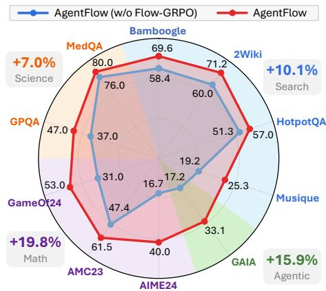
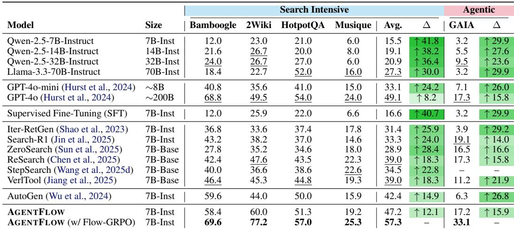
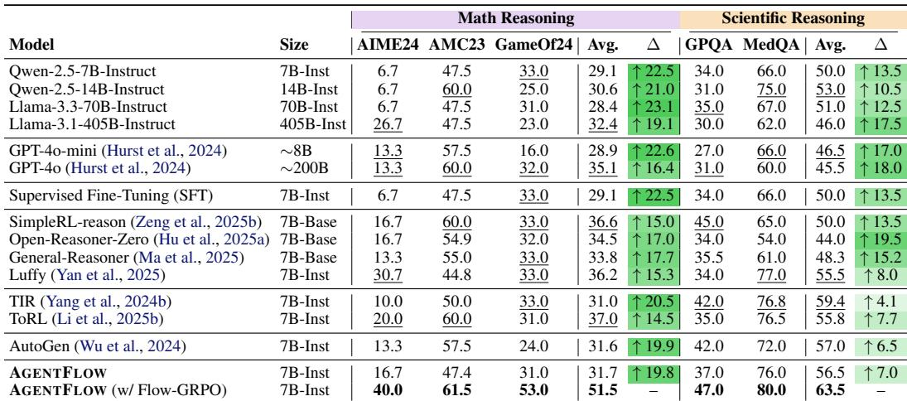
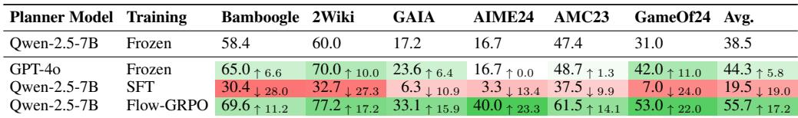
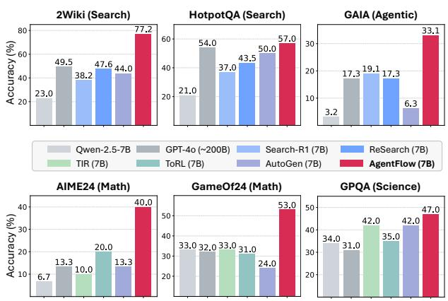
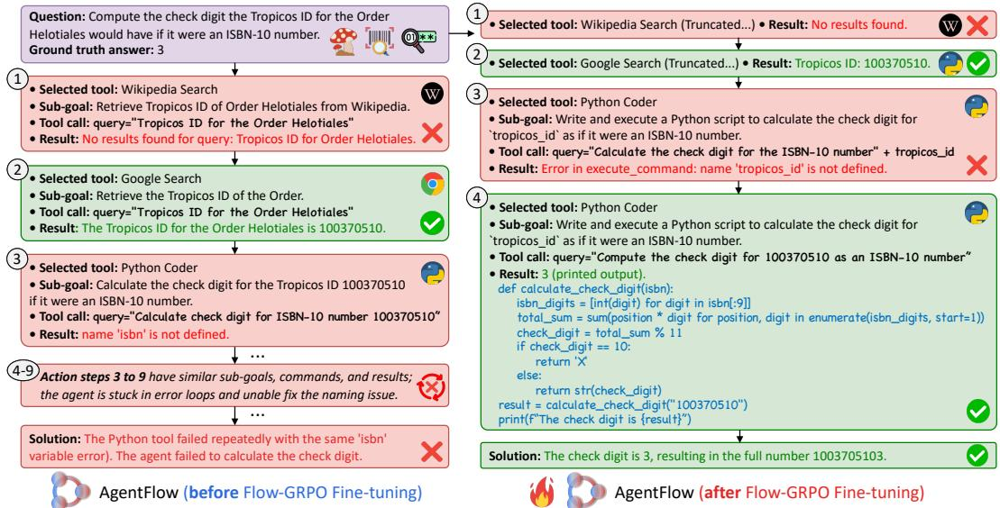

# In-the-Flow Agentic System Optimization for Effective Planning and Tool Use

> [!tip] 核心洞察
> 通过将多轮交互分解为共享全局成功信号的独立单步优化，配合组归一化降低方差，使智能体系统能够在仅依靠稀疏最终奖励的情况下，高效学习长程规划与工具协调策略。

| 字段 | 内容 |
|------|------|
| 中文题名 | 流程内智能体系统优化以实现有效规划与工具使用 |
| 英文题名 | In-the-Flow Agentic System Optimization for Effective Planning and Tool Use |
| 会议/期刊 | ICLR 2026 (accepted) |
| Links | [paper](https://openreview.net/forum?id=Mf5AleTUVK) |
| Topic | #topic/reinforcement_learning_planning_agents #topic/reinforcement_learning_planning_agents/multi_agent |
| Method | AGENTFLOW |
| Dataset | Search-intensive avg. (Bamboogle, 2Wiki, HotpotQA, Musique), Agentic (GAIA), Math Reasoning avg. (AIME24, AMC23, GameOf24), Scientific Reasoning avg. (GPQA, MedQA) |

> [!tip] 效果简介
> - Search-intensive avg. (Bamboogle, 2Wiki, HotpotQA, Musique) 上，Accuracy 为 57.3%，对比 42.4% (AutoGen)，变化 +14.9%。
> - Agentic (GAIA) 上，Accuracy 为 33.1%，对比 19.1% (Search-R1)，变化 +14.0%。
> - Math Reasoning avg. (AIME24, AMC23, GameOf24) 上，Accuracy 为 51.5%，对比 37.0% (ToRL)，变化 +14.5%。

## 概述

现有大型语言模型在工具增强推理中存在两大范式瓶颈：整体式工具集成强化学习（如 Search-R1、TIR）在长序列多步交互下因稀疏奖励和信用分配困难导致训练不稳定；而训练自由的多智能体系统（如 AutoGen）依赖静态提示，无法在动态执行回路中自适应优化规划策略。如何在多轮工具调用中实现高效的在线信用分配与稳定策略更新，是提升智能体长程规划与工具协调能力的关键挑战。

本文提出 **AGENTFLOW**，一种可训练的流程内智能体系统。系统由四个模块——**Action Planner**、**Tool Executor**、**Execution Verifier** 和 **Solution Generator**——通过可演化的共享记忆协调，仅规划器参与训练。核心优化算法 **Flow-GRPO** 将单一轨迹的最终验证奖励广播至每一个动作步，并借助同组轨迹归一化优势显著降低方差，从而将多轮信用分配转化为一系列可处理的单步策略更新。该机制在仅依赖稀疏最终奖励的条件下，使规划器能够高效学习长距离规划与自适应工具选择。

主要结果：
- **在线训练的必要性**：Flow-GRPO 在 6 个基准上使冻结规划器准确率平均提升 **17.2 个百分点**，而离线 SFT 反而造成 19.0 个百分点的下降（Table 3）。
- **多任务全面领先**：以 7B 骨干的 AGENTFLOW 在搜索、智能体、数学和科学推理四类任务上分别超越最强专用基线 **+14.9%、+14.0%、+14.5% 和 +4.1%**，且整体性能优于 GPT-4o（Table 1、Table 2）。
- **质性能力涌现**：经过 Flow-GRPO 训练的规划器展现出自适应工具偏好切换与自修复能力，能够在失败后主动探索新的解题路径（Figure 5、Figure 8）。

## 背景与动机

大型语言模型（LLM）在复杂推理任务中的成功，越来越多地依赖于外部工具的辅助。然而，当前将 LLM 与工具结合的两类主流范式均面临显著瓶颈。

- **单体工具集成推理模型**（如 Search-R1、ReSearch、TIR、ToRL 等）将推理链与工具调用交替编织在单一自回归策略中，通过强化学习（RL）直接优化。这种设计将长序列下的多步推理、工具调用和终止信号压缩到一个策略内，导致**训练极不稳定**：轨迹长度随工具调用次数线性增长，而仅最终答案正确性提供的稀疏奖励使得信用分配（credit assignment）高度困难，模型往往难以分辨哪些步骤或工具选择对成功真正关键。
- **免训练多智能体系统**（如 AutoGen）虽然通过解耦的模块（规划器、执行器等）提供结构化协作，但各模块通常由冻结的 LLM 和提示工程驱动，**完全缺乏在线训练能力**。它们无法在与环境交互的实时反馈中调整自身的规划或工具选择策略，因此在动态、需要自适应长程协作的场景下表现受限。

上述两类方法的根本瓶颈可以归结为：**现有方案要么面临长程稀疏奖励下的不稳定单策略优化，要么完全放弃训练机会，无法在流程中自适应学习**。这意味着，即便智能体系统具备正确的模块划分，若不能在其真实运行回路中根据最终结果持续优化关键模块（尤其是规划器），系统的整体能力将停留在预训练或提示设计的上限。

本文的核心动机正是弥合这一鸿沟：**我们探索在智能体系统内部的实际多轮交互流程中，直接对规划策略进行在线强化学习**。直观上，智能体系统每轮的动作（子目标、工具选择）均服务于同一最终目标的求解；因此，将最终的轨迹级奖励广播到每一个动作，在形式上可将原本难以优化的全局多轮目标等价转化为一系列可处理的单步局部更新。结合组归一化优势以降低方差，就能使规划器在仅有稀疏最终奖励的条件下，稳定地学会长程规划与工具协调策略。

这一思路不仅解决了单体 RL 中的训练困难，也克服了传统智能体系统无法从经验中进化的缺陷。如 **Figure 3** 所示，现有两大范式各有优势与局限，而本文提出的 AGENTFLOW 框架借助 Flow-GRPO 算法首次将流程内训练引入模块化智能体系统，通过只训练规划器并利用确定性模块（执行器、验证器、生成器）的协作，在保持系统稳定性的同时赋予其自适应优化的能力。后续实验（**Table 3**）将验证：在线流程内训练带来的规划能力提升显著超越离线 SFT（甚至 SFT 会导致性能倒退），而案例研究（**Figure 5**）则进一步揭示训练后的规划器能够从失败中自修复，主动切换解决路径——这正是传统提示工程所无法实现的。

## 核心创新

现有的工具增强推理方法面临两个主要瓶颈：单策略交织思考与工具调用的范式在长序列和多工具环境下训练不稳定，难以处理稀疏奖励和信用分配；而基于提示工程的智能体系统无法在线适应动态交互，缺乏自优化能力。AGENTFLOW 围绕三个关键维度进行了根本性变革，通过 **流程内在线训练（Flow-GRPO）**、**广播式信用分配**与**解耦模块化架构**，实现了显著提升。

**训练范式的转变：从离线模仿到在线流程优化。**
传统方法依赖离线监督微调（SFT）或冻结的提示模板，而 AGENTFLOW 将规划器的优化直接嵌入多轮交互回路，根据真实的执行结果在线更新。这一改变将训练与推理环境对齐，避免了离线 SFT 带来的性能退化。实验表明，Flow-GRPO 在线训练使规划器准确率平均提高 17.2 个百分点，而相同的离线 SFT 反而导致 19.0 个百分点的下降（Table 3），验证了流内训练的必要性。

**信用分配的革新：全局奖励广播与组归一化。**
多轮强化学习固有的信用分配难题被转化为一系列可处理的单步更新。Flow-GRPO 将轨迹级最终验证奖励广播至每一个动作，使得所有步骤共享同一成功信号，并借助组归一化优势函数降低方差（Eq. 4, Eq. 7）。理论证明该广播等价于最大化期望单步局部目标（§B.2），从而在仅依赖稀疏最终奖励的情况下实现稳定优化。

**系统架构的解耦：四模块协同与可训练规划器。**
不同于单策略模型将推理与工具调用交叉生成，AGENTFLOW 将系统拆分为四个专业化模块：规划器、执行器、验证器和生成器，通过确定性演化记忆协调（Figure 2, §3.1）。其中只有规划器经过 Flow-GRPO 训练，其余模块保持冻结，这既降低了训练复杂度，又保留了各模块的独立能力。这种解耦设计使规划器能够专注于子目标生成与工具选择，从而在搜索、智能体、数学和科学四类任务上相较于最强专用基线分别取得 14.9%、14.0%、14.5% 和 4.1% 的绝对优势（Table 1, Table 2），并且 7B 模型在多个任务上超过 GPT-4o。

**自适应能力的涌现。**
Flow-GRPO 训练后，规划器展现出强自适应行为：案例研究表明，经过训练的智能体能够在失败后主动切换至全新解决路径，而未训练版本则陷入重复错误（Figure 5）。此外，工具使用分布发生显著改变，例如在 MedQA 上 Wikipedia Search 调用比例从 0% 升至 59.8%，而 Google Search 则从 66.2% 降至 10.9%，体现出模型根据任务需求动态选择最优工具的能力（Figure 8）。这些结果表明，所提创新不仅提升了基准分数，更赋予了系统在开放环境下的自修复与自适应策略。

## 整体框架

AGENTFLOW 是一个可训练的在流程内（in-the-flow）智能体系统，通过四个专用模块的协同与共享演化记忆（evolving memory）来解决需要长程规划与多工具推理的任务。系统接收一个查询 $q$，在一个固定的工具集 $K$ 的支撑下进行多轮交互，最终输出答案 $o$。其核心思路是将智能体的规划器直接嵌入多轮执行回路中进行在线策略优化，从而在真实交互轨迹上学习自适应规划与工具协调能力。

系统由四个模块构成：

- **动作规划器（Action Planner）**：可训练的策略模型 $\pi_\theta$。根据查询 $q$、工具集 $K$ 以及当前记忆 $M^t$，决定下一步的子目标并选择要调用的工具，产生动作 $a^t$。该模块是整个系统中唯一可训练的部分，是优化的核心。
- **工具执行器（Tool Executor）**：确定性模块 $\mathcal{E}$，根据规划器的动作 $a^t$ 调用对应工具，并返回执行结果 $e^t$。
- **执行验证器（Execution Verifier）**：确定性模块 $\mathcal{V}$，评估当前的记忆和查询是否已经足够解决问题，输出一个信号 $v^t$ 指示"终止"（STOP）或"继续"（CONTINUE）。
- **答案生成器（Solution Generator）**：确定性模块 $\mathcal{G}$，当验证器发出终止信号时，它根据最终的累积记忆 $M^T$ 生成最终答案 $o$。

整个多轮过程可以被形式化为一个概率生成过程（式 (2)）：每一步的动作、执行结果和验证信号以条件概率依次生成，规划器策略 $\pi_\theta$ 在每个时间步根据记忆和工具集进行响应。这四个模块通过共享的演化记忆 $M^t$ 和固定工具集 $K$ 紧密耦合，形成一个闭环的"规划—执行—验证—累积"流（参见 Figure 2 的状态转换示意）。

在线训练采用 Flow-GRPO（Flow-based Group Refined Policy Optimization）。关键设计是将多轮强化学习转化为一系列可处理的单步策略更新：同一轨迹中所有动作均共享基于最终答案正确性的全局奖励（式 (4)），从而将稀疏的轨迹级奖励广播至每一个推理步骤；同时，通过组归一化优势（group-normalized advantage）降低方差，实现稳定的信用分配。Flow-GRPO 直接在系统运行回路中对规划器进行在线优化，其他模块（执行器、验证器、生成器）保持冻结。这种在流程内训练的方式使得规划器能够根据工具调用、验证信号和记忆更新的实际动态自主调整行为，避免了离线监督微调与执行环境脱节带来的严重性能退化（例如离线 SFT 使平均准确率下降 19.0 个百分点，而在线 Flow-GRPO 提升 17.2 个百分点，见 Table 3）。

## 核心模块与公式推导

AGENTFLOW 将智能体系统形式化为一个由四个专用模块构成、通过共享演化记忆 $M$ 和工具集 $K$ 协同工作的可训练框架：
- **Action Planner（动作规划器）**：根据查询 $q$、当前记忆 $M^t$ 和工具信息，输出子目标与工具选择动作 $a^t$。该策略 $\pi_\theta$ 是唯一可训练模块。
- **Tool Executor（工具执行器）**：接收 $a^t$，调用指定工具并返回执行结果 $e^t$。
- **Execution Verifier（执行验证器）**：判断当前记忆是否足以求解，输出终止/继续信号 $v^t$。
- **Solution Generator（答案生成器）**：当验证器发出终止信号后，基于累积记忆 $M^T$ 生成最终答案 $o$。

整个多轮交互的联合生成过程由 Eq. (2) 刻画：

$$
p_{\theta}\Big(\{a^t, e^t, v^t\}_{t=1}^{T}, o \mid q, K\Big) = \left[\prod_{t=1}^{T} \pi_{\theta}\big(a^t \mid q, K, M^t\big)\, \mathcal{E}(e^t \mid a^t, K)\, \mathcal{V}(v^t \mid q, e^t, M^t)\right] \mathcal{G}(o \mid q, M^{T}),
$$

其中 $M^{t+1}$ 由上一轮记忆、动作、执行结果和验证信号确定性更新得到。该分解将复杂的多工具长程推理显式建模为规划器决策序列，为后续在线策略优化提供了必要的概率结构。

若直接最大化轨迹级期望回报 $\mathcal{I}(\theta)=\mathbb{E}_{\tau\sim\pi_\theta}[R(\tau)]$，会面临稀疏奖励与信用分配的严峻挑战：单条轨迹仅获得一个基于最终答案正确性的验证信号 $\bar{R}(o,q,y^*)$，而规划器的每一轮动作贡献难以区分，导致训练不稳定。Flow-GRPO 的核心思路是将这一全局多轮优化问题转化为一连串可处理的单步更新。它首先通过 **奖励广播（reward broadcast）** 将轨迹级奖励直接赋予每一轮动作：

$$
r = R(a^t) = \bar{R}(o, q, y^*), \quad \forall t = 1,\dots,T.
$$

随后，在采样一组 $G$ 条轨迹后，Flow-GRPO 在 token 级别最小化以下裁剪目标（Eq. 5）：

$$
\begin{aligned}
\mathcal{T}_{\mathrm{flow-GRPO}}(\theta) = \mathbb{E}_{(q,y^*)\sim\mathcal{D},\{\tau_i\}_{i=1}^{G}\sim\pi_{\theta_{\mathrm{old}}}}\Bigg[ \frac{1}{G}\sum_{i=1}^{G}\frac{1}{T_i}\sum_{t=1}^{T_i}\frac{1}{|a_i^t|}\sum_{j=1}^{|a_i^t|} \min\Big\{&\rho_{i,j}^t A_i^t,\; \mathrm{clip}(\rho_{i,j}^t, 1-\epsilon, 1+\epsilon)A_i^t\Big\} \\
 &\quad -\beta\,\mathbb{D}_{\mathrm{KL}}(\pi_{\theta} \parallel \pi_{\mathrm{ref}})\Bigg],
\end{aligned}
$$

其中 $\rho_{i,j}^t = \pi_{\theta}(a_{i,j}^t\mid s_i^t,\dots)/\pi_{\theta_{\mathrm{old}}}(a_{i,j}^t\mid s_i^t,\dots)$ 为 token 级新旧策略概率比，$\epsilon$ 为 PPO 裁剪系数，$\beta$ 控制对固定参考策略 $\pi_{\mathrm{ref}}$ 的 KL 散度惩罚。该目标在保留 PPO 稳定性的同时，将信用分配的核心依赖浓缩在优势函数 $A_i^t$ 上。

Flow-GRPO 使用 **组归一化优势（group-normalized advantage）** 进一步降低方差并强化跨轨迹的信用比较（Eq. 7）：

$$
A_i^t = \frac{\bar{R}(o_i, q, y^*) - \mathrm{mean}\left(\{\bar{R}(o_k, q, y^*)\}_{k=1}^{G}\right)}{\mathrm{std}\left(\{\bar{R}(o_k, q, y^*)\}_{k=1}^{G}\right)}.
$$

对同一查询采样的 $G$ 条轨迹，所有轮次内的全部 token 共享同一个基于最终答案奖励经组级标准化得到的优势值。这意味着：一条高质量轨迹中的每一个动作都会被整体正向强化，而低质量轨迹中的动作则被整体抑制，从而在不引入逐步奖励工程的前提下，实现了对长程决策的有效信用分配。

上述设计保证了 Flow-GRPO 的优化过程具有严格的单调改进性质（Theorem B.3），并成功将多轮智能体系统的在线训练稳定在单一规划器的 token 级更新上。消融实验（Table 3）直接验证了这种"流程内训练"的必要性：Flow-GRPO 使规划器平均准确率提升 17.2 个百分点，而离线 SFT 反而导致 19.0% 的下降，说明信用分配与在线交互环境紧密耦合，必须在真实执行回路中同时进行探索和策略更新。

## 实验与分析

*Table 1: Accuracy comparison on search-intensive and agentic tasks. 7B-Base refers to Qwen-2.5-7B-Base and 7B-Inst refers to Qwen-2.5-7B-Instruct. AutoGen and our AGENTFLOW method are agentic systems, which use Qwen-2.5-7B-Instruct for the LLM-powered agents and tools for fair comparison. We visualize the gains of AGENTFLOW to the each baseline in the ∆ columns*

*Table 2: Accuracy comparison of mathematical and scientific reasoning tasks*

*Table 3: Performance comparison of AGENTFLOW across different training methods*

*Figure 1: Left: Performance of AGENTFLOW with a 7B-scale backbone before and after Flow-GRPO tuning across ten diverse reasoning benchmarks. Flow-GRPO substantially improves performance by enhancing planning quality and tool-calling reliability. Right: AGENTFLOW achieves consistent gains over top baselines, including base LLMs, tool-integrated RL models, and trainingfree agentic systems. All 7B results use Qwen2.5-7B-Base/Instruct as the backbone and tools*

*Figure 5: One case study example. Initially failed with repetitive errors (left), AGENTFLOW, trained with Flow-GRPO, explores a new solution pathway at turn 4 after two failed attempts (right)*

本节围绕「流程内训练」这一核心机制展开：系统仅接收基于最终答案正确性的稀疏轨迹级奖励，却需要通过多轮工具交互学习有效规划。我们首先汇总 10 个基准上的主结果，然后通过消融实验揭示训练策略、回合预算、工具后端的因果效应，最后结合案例与局限分析讨论失败模式与自适应能力的来源。

### 主结果：跨领域显著提升，7B 规模超越 GPT-4o

在搜索密集（Bamboogle, 2Wiki, HotpotQA, Musique）、智能体（GAIA）、数学推理（AIME24, AMC23, GameOf24）和科学推理（GPQA, MedQA）四类任务上，经过 Flow-GRPO 训练的 AGENTFLOW（7B 骨干）均大幅优于所有对比基线。关键数值如下：

- **搜索密集**：平均准确率 57.3%，较训练免费智能体系统 AutoGen 提升 14.9%（Table 1）。
- **智能体**：GAIA 准确率 33.1%，较工具集成强化学习模型 Search-R1 提升 14.0%（Table 1）。
- **数学推理**：平均 51.5%，较工具代码模型 ToRL 提升 14.5%，其中 AIME24 准确率 40.0%，领先于不调用工具的推理模型 Luffy（30.7%）（Table 2）。
- **科学推理**：平均 63.5%，较 TIR 提升 4.1%（Table 2）。

更值得注意的是，AGENTFLOW（7B）在所有领域均超过未经过特别训练的 GPT-4o（Table 1, Table 2），例如在搜索密集任务上高出 8.2%，在数学推理上高出 16.4%。这一结果挑战了"小模型必须依赖更大容量方能胜过私有模型"的假设，其根本原因在于 **Flow-GRPO 将轨迹级奖励广播至每一步动作**（Eq. 4），使长程规划的可信分配变得可处理，从而在仅靠稀疏成功信号的前提下高效优化规划器策略。

性能增益并非来自工具或 LLM 容量的单点强化，而是规划质量的系统性提升：在 Figure 1 的左图中，未经训练的 AGENTFLOW 已经受益于模块化设计，但 Flow-GRPO 调优使准确率再获大幅跃升，表明 **在线交互中动态适应工具调用与子目标分解能力** 是核心杠杆。

### 消融实验：训练策略、回合预算、工具后端的因果效应

| 消融变量 | 关键发现 | 锚点 |
|----------|----------|------|
| 训练策略（冻结 vs SFT vs Flow-GRPO） | Flow-GRPO 在线训练使规划器平均准确率提升 **+17.2** 个百分点，而离线 SFT 反而导致 **−19.0** 个百分点下降 | Table 3 |
| 最大推理轮数 $T_{\max}$ | 从 3 增至 10 时，所有基准准确率单调提升，平均轮数同步增加（Table 4） | Figure 7, Table 4 |
| 工具后端（Qwen2.5-7B-Instruct→GPT-4o） | GAIA、AMC23、HotpotQA 上分别获得 +1.0%、+6.0%、+13.0% 的增益 | Figure 10 |
| 工具选择偏好 | 训练后 2Wiki 的 Google Search 调用比例增加 42.0%，MedQA 的 Wikipedia Search 从 0% 升至 59.8% | Figure 8 |

**训练策略的因果分析**（Table 3）：离线 SFT 利用历史正确轨迹进行监督训练，却使准确率大幅退化。原因是 SFT 将静态数据中的行为模式不加检验地灌输，而这些模式在真实工具交互中高度不确定，导致策略依赖过时或错误的先验。与此相反，Flow-GRPO 在系统运行回路中直接采样轨迹并将全局成功信号广播至各步，迫使规划器学会根据实际工具返回和验证信号调整策略。这一差异验证了「**流程内训练（in-the-flow）**」的必要性：在长程、多工具条件下，仅靠最终结果无法分解出正确步骤的启发式分配，而广播奖励配合组归一化优势（Eq. 7）将多轮更新转化为等价于单步局部目标的优化（§3.2，附录 B.2），从而实现稳定且高效的在线信用分配。

**回合预算的影响**（Figure 7, Table 4）：增加最大允许轮数直接扩展了可探索的规划空间。在 $T_{\max}=10$ 时达到饱和，与 7B 模型的计算能力匹配。更长的回合不仅允许更细致的检索与验证（如 GAIA 任务），还赋予了规划器在初步尝试失败后重试并切换工具的机会——这正是后续案例中展现的自修复能力的基础。

**工具后端升级**（Figure 10）：当工具 LLM 从 Qwen2.5-7B-Instruct 换为 GPT-4o 后，AGENTFLOW 的整体准确率进一步提升。这表明 Flow-GRPO 训练出的规划器可以在不改变自身参数的情况下，充分利用更强大的执行器，呈现「规划-执行解耦」的良好扩展性。

**工具选择演化**（Figure 8）：训练前，规划器倾向于单一、固定的工具使用模式；训练后，不同领域的关键工具调用比例发生显著且合理的变化。例如 2Wiki 需要更广的网络检索，Google Search 调用急剧上升；而 MedQA 的专业医学问题则从 Google Search 转向权威的 Wikipedia Search。这一自适应行为并非来自显式的奖励塑形，而是**广播奖励将任务整体的成功压力自然地传递至每一步工具选择**，驱动策略学习到与下游任务需求匹配的检索行为。

### 失败模式与局限性

尽管 Flow-GRPO 在多数基准上实现突破，其成功边界与典型失败模式可通过案例研究和系统假设被揭示。

**案例中的失败与自修复**（Figure 5）：给出一项涉及多步搜索的百科类问题，未经训练的规划器在第一次调用搜索工具返回不完整结果后，反复执行相同或信息增益极低的调用，陷入"重复错误"循环，最终判定失败。而经过 Flow-GRPO 训练的规划器，在同样初始失败后，于第 4 轮主动切换至一条全新的求解路径（如更换搜索关键词、尝试不同工具），最终获得正确答案。这表明**未训练的规划器缺乏依据工具反馈修正策略的元认知能力**，而广播奖励驱动的在线训练等效于迫使规划器在每个状态上最大化期望最终成功概率，从而习得"当记忆未能满足求解条件时大幅改换动作"的鲁棒策略。

**结构性局限**：当前设计仅训练 Action Planner，执行器、验证器、生成器保持冻结，可能束缚系统在复杂开放环境中的适应性。其次，训练假设问题可被分解为顺序子目标，对需要高度并行规划的任务（如多工具同时调用再汇总）可能产生次优解。此外，训练和评估均限定于五种固定工具，未验证在动态工具集或全新工具下的泛化能力，在实际部署中可能出现工具选择错配。最后，奖励函数由 LLM 裁判（GPT-4o）自动判定，虽然设计了标准化比对流程（附录 E.3），仍存在奖励黑客或被偏置的风险，尤其当规范匹配规则不足以覆盖的开放问答场景时。

### 图表核心结论汇总

| 图表 | 核心结论 |
|------|----------|
| Figure 1 | 训练前/后性能对比表明 Flow-GRPO 是规划器大幅提升的关键驱动力；7B 模型全面超越 GPT-4o。 |
| Table 1, Table 2 | 在搜索、智能体、数学、科学四领域分别超越最强专用基线 14.9%/14.0%/14.5%/4.1%。 |
| Table 3 | 离线 SFT 导致性能崩溃（−19.0%），而 Flow-GRPO 在线训练实现 +17.2% 提升，验证流程内训练的必要性。 |
| Figure 7, Table 4 | 最大轮数从 3 增至 10 单调提升准确率，表明长程规划空间的有效利用是增益的重要来源。 |
| Figure 8 | Flow-GRPO 驱动工具选择策略发生质变，不同领域自发涌现出专业化工具使用模式。 |
| Figure 10 | 工具能力提升可被规划器有效吸收，展现规划-执行解耦的扩展优势。 |
| Figure 5 | 训练后规划器具备自修复能力，能够在失败后主动探索新路径；未训练策略则陷入重复错误。 |

整体而言，实验证据一致支持核心因果机制：**通过广播最终奖励和组归一化优势，Flow-GRPO 把稀疏、长程的多轮信策分配转化为可处理的单步优化**，使智能体系统能够在实际工具交互中自主学习规划与协调策略，从而在多个复杂推理基准上实现跨领域、跨规模的性能跃升。

## 方法谱系与知识库定位

### 与 baseline 和 follow-up 工作的关系

AGENTFLOW 定位为**可训练、流程内优化的多模块智能体系统**，其设计直接回应了当前工具增强推理的两类主导范式所暴露的瓶颈。

- **与单体工具集成推理模型（monolithic tool-integrated RL models）的对比**
  现有工作，如 Search-R1、ReSearch、VerlTool（搜索工具）和 TIR、ToRL（代码执行工具），均将工具调用与思维过程交织在单一策略的同一次生成中（如 `<think> … <tool call>`）。这类方法的致命弱点是：**长序列、多工具轨迹的训练信噪比极低**——稀疏的最终奖励难以沿着数十步的动作序列反向传播，导致信用分配困难、训练不稳定。AGENTFLOW 通过**将多轮交互分解为独立规划步的显式马尔可夫决策过程**（Eq. 2），并借助 Flow-GRPO 将轨迹级的唯一最终奖励**广播至每一步**（Eq. 4），结合组归一化优势（Eq. 7）降低方差，从而将棘手的多轮优化转化为一系列可控的单步策略更新。实验表明，这种架构与训练策略的组合在搜索、智能体、数学和科学四类任务上分别超越最强单体基线 **14.9%、14.0%、14.5% 和 4.1%**（Table 1, Table 2），7B 骨干甚至优于未经额外训练的 GPT-4o。

- **与训练无损智能体系统（training-free agentic systems）的对比**
  以 AutoGen 为代表的工作通过提示工程与手工逻辑编排多个冻结模块，虽能在简单场景工作，但**缺乏从环境反馈中在线学习的能力**，面对动态交互、反复试错的任务时性能严重受限。AGENTFLOW 直接在其固有的**多轮运行回路内对规划器（Action Planner）进行策略在线的强化学习**，使系统能够根据真实工具调用结果、验证器信号和记忆演化自适应地调整规划与工具选择策略。Table 3 的消融实验提供了铁证：离线 SFT 导致平均准确率**下降 19.0%**，而 Flow-GRPO 在线训练带来 **17.2% 的提升**，说明脱离执行环境的监督信号非但无益，反而造成灾难性干扰。

- **与无工具推理 LLM 的对比**
  纯推理增强模型（如 SimpleRL-reason、Luffy）仅依靠思维链训练，未能利用外部知识库与代码执行带来的**事实查证与计算能力**。AGENTFLOW 集成了网页搜索、维基搜索及代码执行等五种工具，并通过 Flow-GRPO **自适应地调整工具调用偏好**——例如训练后 2Wiki 中 Google Search 调用比例增加 42.0%，MedQA 中 Wikipedia Search 从 0% 骤升至 59.8%（Figure 8）。这种对工具可获性的高效利用是纯推理模型无法企及的。

综上，AGENTFLOW 与现有工作的谱系位置可概括为：**它将单体模型的训练不稳定问题通过模块化与流程内强化学习转化为每步可优化的局部问题，同时为静态的智能体系统注入了基于最终奖励函数的在线自适应能力**，在方法空间上占据了"可训练、可闭环演化的智能体系统"这一空白区域。

### 适用边界与假设

尽管效果显著，AGENTFLOW 目前基于以下明确假设与设计约束：

- **顺序子目标分解假设**：系统将推理过程建模为"规划器 → 执行器 → 验证器 → 生成器"的**顺序多轮流程**（Figure 2）。对于需要高度并行规划、多路搜索或实时多目标协调的任务，当前顺序化框架可能无法高效覆盖。
- **固定工具集假设**：整个训练与评测均基于预定义的五个工具（网页搜索、维基搜索、计算器等）。**未知工具出现时的动态扩展或工具学习能力未被验证**，因此在开放式或实时变化的工具生态中可能失效。
- **仅规划器可训练的设计约束**：执行器、验证器与生成器均以 Qwen2.5-7B-Instruct 冻结，系统的整体适应性受限于此。若其他模块存在系统性失误，规划器可能被迫学习"对抗性"策略以补偿，而非全部模块协同进化。
- **对环境交互的高度依赖**：在线训练必须运行完整的智能体 rollout，涉及实际工具调用与验证器信号，其计算开销远大于纯文本的离线训练。这在预算敏感或工具 API 受限的场景下可能构成障碍。
- **奖励函数的潜在偏置**：训练依赖 LLM-as-judge（GPT-4o）的最终答案判别（详见 §E.3），即便采用两步"分析-判定"范式，仍存在**奖励黑客行为**风险（即系统学会生成符合法官偏好但实际错误的答案）。

### 局限

- 只有 Action Planner 接受训练，其他模块冻结，**限制了系统端到端的适应性**；例如执行器对工具 API 的误用可能无法通过规划器完全修正。
- **固定工具集下的训练无法应对工具本身演化或新增工具**，实际部署中可能需要重新训练或引入适应机制。
- LLM 裁判的奖励信号可能**引入系统性偏置或导致奖励黑客**；尽管论文提供了组归一化来提高鲁棒性，但未对奖励函数的校准与一致性进行严格敏感性分析。
- 当前实验**限于 7B 骨干规模**；虽然 Figure 12 显示 3B→7B 的提升趋势，但更大的模型（如 70B+）在 Flow-GRPO 下的训练稳定性、收敛速度及计算开销尚未报告。
- 轨迹级奖励广播虽然简化了信用分配，但可能导致**"搭便车"问题**：某些劣质动作可能因同次尝试中的优秀动作而获得正向梯度，长期可能稀释有效策略的信号。

### 开放问题

- **动态工具集的扩展与工具学习**：能否在工具集变化时零镜头泛化？是否可能对工具执行器进行联合微调以适应规划器的决策？
- **多模块协同在线训练**：若能同时微调验证器和生成器，系统是否能在闭环中实现更强的自我修复与策略自适应？这要求设计面向多模块的、结构化的信用分配机制。
- **更大规模骨干上的可扩展性**：在 70B 甚至 100B+ 模型上，Flow-GRPO 的训练开销与 KL 惩罚系数 β 等超参数的调优规律如何？是否需要新的方差缩减技术？
- **更精细的信用分配机制**：未来可探索引入状态依赖的奖励塑造或动态痕迹分配，以缓解广播式奖励可能带来的信号衰减与搭便车效应，并与理论上的单调改进保证（Theorem B.3）进行结合。
- **最优超参数的普适性**：KL 惩罚系数 β、PPO 裁剪参数 ε、组大小 G 的最佳取值是否随任务类型和工具复杂度变化？需要更系统的分析以提供实用的调参指南。

上述开放问题直接指向 AGENTFLOW 从当前"规划器在线训练"走向"全模块协同进化、适应开放工具生态"的下一步演进路径。

## 原文 PDF

![[paperPDFs/ICLR_2026/In-the-Flow_Agentic_System_Optimization_for_Effective_Planning_and_Tool_Use.pdf]]
