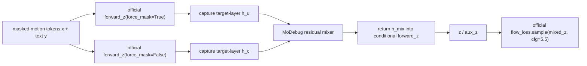
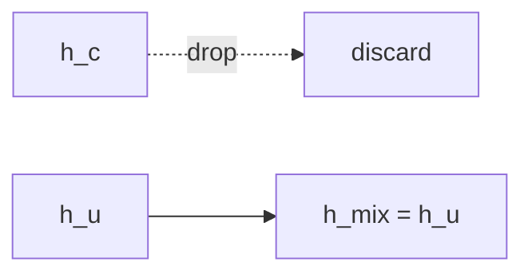
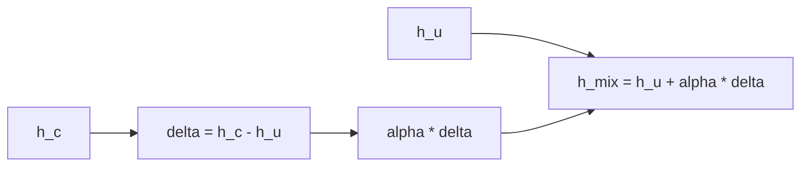
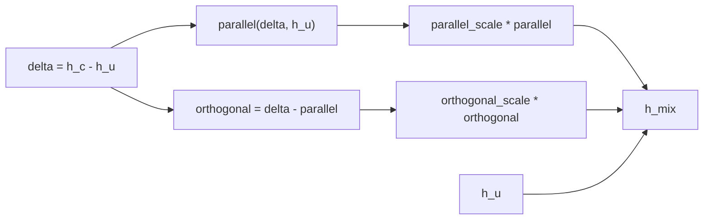
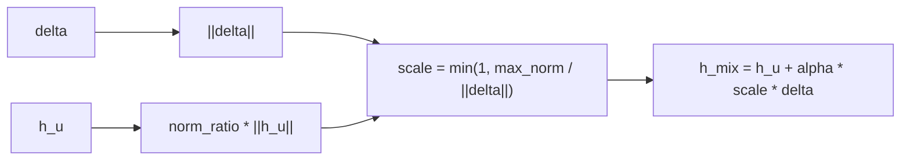
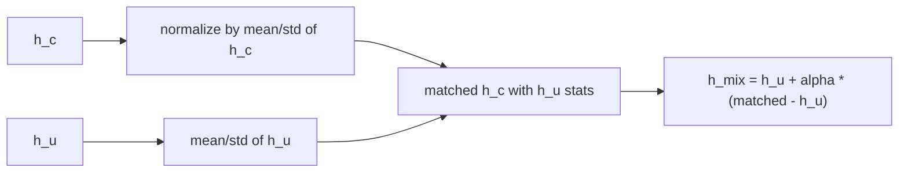
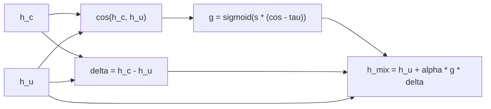

# 2026-06-12 MoDebug CFG 机制复盘

> [!abstract] 当前结论
> MoDebug 现在只在 MoLingo 单 baseline 上推进，不动 MotionCLR。L15 `CFG_CA` replacement 的 harmful failure 已被复现：`FID_TMR 7.7003 / Top1 0.7240 / Matching 15.7381`，而 L10 replacement 接近 baseline。2026-06-13 复核后，`discrepancy_gate` 不再作为主机制通过：L15 same-alpha 对比中 fixed residual 在 FID/Matching 上支配或接近支配 gate，gate trace 也更像 fixed scaling。新增 gate-negative 复核完成后，fixed residual a0.9 的 3-seed mean 为 `FID_TMR 3.3841 / Matching 14.8116`，明显强于 APG `4.8224 / 15.3383` 和 norm clamp `5.1222 / 15.4098`。L11-L14 replacement continuity 显示从 L11 到 L14 逐步变差，L14 已出现 pre-collapse，但 L15 才是 cliff collapse。当前可写结论应收缩为：training-free residual scaling 可把 L15 failure 拉回 baseline 附近，adaptive cosine gate 的独立必要性未成立；下一步应做机制探针解释 late-layer boundary，而不是继续 gate 网格或扩 MotionCLR。

---

## 0. 2026-06-13 P0/P1 完成复核

本轮复核使用 4090 双卡 2026-06-12 的 P0/P1/tail 结果，以及 2026-06-13 的 gate-negative / replace continuity 补充结果。轻量汇总已抓回本地：

```text
/data/Life Me/ResearchWY Vault/artifacts/remote4090_motion/modebug_4090_20260612_results_l15_pareto/queue_summary.jsonl
/data/Life Me/ResearchWY Vault/artifacts/remote4090_motion/modebug_4090_20260612_results_layer_sanity/queue_summary.jsonl
/data/Life Me/ResearchWY Vault/artifacts/remote4090_motion/modebug_4090_20260612_results_l13_continuity/queue_summary.jsonl
/data/Life Me/ResearchWY Vault/artifacts/remote4090_motion/modebug_4090_20260612_results_l11_l10_continuity/queue_summary.jsonl
/data/Life Me/ResearchWY Vault/artifacts/remote4090_motion/modebug_4090_20260612_results_gate_trace_summary2/summary_20260613_manifest_gate_trace.jsonl
/data/Life Me/ResearchWY Vault/artifacts/remote4090_motion/modebug_4090_20260613_gate_negative_replace_gpu0/queue_summary.jsonl
/data/Life Me/ResearchWY Vault/artifacts/remote4090_motion/modebug_4090_20260613_gate_negative_replace_gpu1/queue_summary.jsonl
```

远端审计源：

```text
service = 4090 / user-SYS-7049GP-TRT
remote root = /data/public/ripemangobox/Motion
gate trace summary = /data/public/ripemangobox/Motion/experiments/MoDebug/logs/summary_20260613_manifest_gate_trace.jsonl
```

### 0.1 P0 L15 same-alpha Pareto

| Run | Layer | Mechanism | Alpha | Seed | FID_TMR ↓ | Top1 ↑ | Top2 ↑ | Top3 ↑ | Matching ↓ | 判定 |
|---|---:|---|---:|---:|---:|---:|---:|---:|---:|---|
| baseline / residual a1.0 | 15 | residual_gate | 1.0 | 3407 | 3.5944 | 0.7753 | 0.9026 | 0.9402 | 14.7401 | baseline-equivalent |
| discrepancy a0.7 | 15 | discrepancy_gate | 0.7 | 3407 | 3.6363 | 0.7714 | 0.8948 | 0.9345 | 14.9149 | 被 fixed a0.7 支配 |
| residual a0.7 | 15 | residual_gate | 0.7 | 3407 | 3.5382 | 0.7710 | 0.8969 | 0.9375 | 14.8838 | fixed 更好 |
| discrepancy a0.8 | 15 | discrepancy_gate | 0.8 | 3407 | 3.5451 | 0.7701 | 0.8976 | 0.9380 | 14.8592 | 单点不支撑 gate |
| discrepancy a0.9 | 15 | discrepancy_gate | 0.9 | 3407 | 3.5009 | 0.7753 | 0.8985 | 0.9389 | 14.8095 | 被 fixed a0.9 支配 |
| residual a0.9 | 15 | residual_gate | 0.9 | 3407 | 3.4843 | 0.7740 | 0.9010 | 0.9384 | 14.7835 | 新 P0 最强 fixed 点 |

same-alpha 结论：

- alpha 0.7：gate 相对 fixed 的 `dFID=+0.0981 / dMatching=+0.0310`，二者都是更差方向。
- alpha 0.9：gate 相对 fixed 的 `dFID=+0.0166 / dMatching=+0.0260`，仍是更差方向。
- 新 6 个 P0 点的 FID/Matching 非支配点只有 `residual_gate_a090` 和 `residual_gate_a100`，没有 `discrepancy_gate`。

### 0.2 Gate trace 机制量

| Run                  | Layer | Alpha | gate mean | gate min | gate max | input residual norm | output residual norm | 解释                  |
| -------------------- | ----: | ----: | --------: | -------: | -------: | ------------------: | -------------------: | ------------------- |
| discrepancy a0.7     |    15 |   0.7 |    0.9027 |   0.6696 |   0.9523 |              2.1575 |               1.2255 | 近似 fixed alpha 0.63 |
| discrepancy a0.8     |    15 |   0.8 |    0.9038 |   0.6696 |   0.9539 |              2.1439 |               1.3928 | 近似 fixed alpha 0.72 |
| discrepancy a0.9     |    15 |   0.9 |    0.9048 |   0.6696 |   0.9551 |              2.1311 |               1.5582 | 近似 fixed alpha 0.81 |
| L11 discrepancy a1.0 |    11 |   1.0 |    0.9687 |   0.7293 |   0.9992 |              1.8813 |               1.5599 | 接近 fixed alpha 0.83 |
| L12 discrepancy a1.0 |    12 |   1.0 |    0.9692 |   0.7355 |   0.9990 |              1.8109 |               1.5150 | 接近 fixed alpha 0.84 |
| L13 discrepancy a1.0 |    13 |   1.0 |    0.9639 |   0.7520 |   0.9970 |              1.8387 |               1.5496 | 接近 fixed alpha 0.84 |
| L14 discrepancy a1.0 |    14 |   1.0 |    0.9553 |   0.7374 |   0.9923 |              1.8249 |               1.5433 | 接近 fixed alpha 0.85 |

判读：

- 当前 cosine agreement gate 没有表现出强动态筛选；多数 token/step 上 gate 接近 1。
- L15 gate 更低，但主要效果仍可由 fixed residual scale 解释。
- 因此 `discrepancy_gate` 更像诊断器或隐式 alpha，而不是已成立的核心修复机制。

### 0.3 P1 layer continuity

| Layer |           discrepancy a1.0 FID_TMR ↓ |     discrepancy a1.0 Matching ↓ |           residual a0.8 FID_TMR ↓ |            residual a0.8 Matching ↓ | 判读                                                          |
| ----: | -----------------------------------: | ------------------------------: | --------------------------------: | ----------------------------------: | ----------------------------------------------------------- |
|    10 |                                    - |                               - |                            3.5829 |                             14.7353 | safe fixed endpoint                                         |
|    11 |                               3.5457 |                         14.7302 |                            3.5684 |                             14.7417 | near baseline                                               |
|    12 |                               3.5707 |                         14.7436 |                            3.5705 |                             14.7512 | near baseline                                               |
|    13 |                               3.6427 |                         14.7542 |                            3.5773 |                             14.7739 | no clear gate advantage                                     |
|    14 |                               3.5670 |                         14.7580 |                            3.5246 |                             14.7876 | fixed has lower FID, worse Matching                         |
|    15 | 3.4913 single / 3.4661±0.0806 4-seed | 14.7726 single / 14.7515±0.0161 | 3.4553 old a0.8 / 3.4843 new a0.9 | 14.8324 old a0.8 / 14.7835 new a0.9 | residual scaling recovers failure; gate not uniquely needed |

当前 P1 说明 residual/gated repair 在 L10-L15 大多接近 baseline，不足以解释为什么 L15 `replace` 会崩。为补齐这个缺口，2026-06-13 追加了 L11-L14 的 `replace` continuity。

### 0.4 P0 gate-negative controls 完成

2026-06-13 追加 seed 3408/3409 后，APG 和 norm clamp 都没有提供 fixed residual scaling 之外的更优点。所有新增 manifest 均满足 `failures = []` 和 `mixer_applied = 6850`。

| Mechanism           | Seeds          | FID_TMR mean ↓ | Top1 mean ↑ | Top2 mean ↑ | Top3 mean ↑ | Matching mean ↓ | 判定       |
| ------------------- | -------------- | -------------: | ----------: | ----------: | ----------: | --------------: | -------- |
| fixed residual a0.9 | 3407/3408/3409 |         3.3841 |      0.7683 |      0.8964 |      0.9370 |         14.8116 | 当前最强简单修复 |
| APG `o0.25/p1.0`    | 3407/3408/3409 |         4.8224 |      0.7451 |      0.8800 |      0.9236 |         15.3383 | 负控失败     |
| norm clamp `r0.5`   | 3407/3408/3409 |         5.1222 |      0.7385 |      0.8763 |      0.9206 |         15.4098 | 负控失败     |

判读：

- APG 与 norm clamp 在 FID、Matching、TopK 上都显著弱于 fixed residual a0.9。
- 这支持“现有局部 training-free 门控或投影策略不如 fixed residual scaling”的保守结论。
- `discrepancy_gate`、APG、norm clamp 都不应继续包装为正机制主线；后续若要重启 gate，必须先有新的机制量，而不是继续调 alpha / tau / slope。

### 0.5 L11-L14 replace continuity 完成

新增 L11-L14 replacement 使用同一 official evaluator、seed 3407，并与已有 L10 safe endpoint 和 L15 collapse endpoint 对齐。

| Layer | Run               | FID_TMR ↓ | Top1 ↑ | Top2 ↑ | Top3 ↑ | Matching ↓ | dFID vs baseline | dMatching vs baseline | 判读               |
| ----: | ----------------- | --------: | -----: | -----: | -----: | ---------: | ---------------: | --------------------: | ---------------- |
|     - | baseline constant |    3.5944 | 0.7755 | 0.9026 | 0.9402 |    14.7401 |           0.0000 |                0.0000 | baseline         |
|    10 | replace current   |    3.6466 | 0.7676 | 0.9010 | 0.9418 |    14.7573 |          +0.0522 |               +0.0172 | safe endpoint    |
|    11 | replace current   |    3.6253 | 0.7726 | 0.9019 | 0.9400 |    14.8100 |          +0.0309 |               +0.0699 | near baseline    |
|    12 | replace current   |    3.6739 | 0.7671 | 0.8978 | 0.9366 |    14.8572 |          +0.0795 |               +0.1171 | mild degradation |
|    13 | replace current   |    3.7322 | 0.7696 | 0.8994 | 0.9382 |    14.9009 |          +0.1378 |               +0.1608 | mild degradation |
|    14 | replace current   |    3.9497 | 0.7550 | 0.8889 | 0.9307 |    15.1405 |          +0.3553 |               +0.4004 | pre-collapse     |
|    15 | replace current   |    7.7003 | 0.7240 | 0.8691 | 0.9165 |    15.7381 |          +4.1059 |               +0.9980 | collapse target  |

判读：

- L11-L13 不是 collapse，整体仍在 baseline 附近小幅变差。
- L14 已出现明确 pre-collapse：FID 和 Matching 都比 L11-L13 差一截，TopK 也同步下降。
- L15 仍是 cliff collapse，因此不能写成“L15 完全孤立特殊层”；更稳妥的叙事是 late-layer replacement sensitivity 从 L14 开始显性化，L15 是最强 failure endpoint。
- 后续机制探针应优先解释 L14 到 L15 的 cliff，而不是再扩大 L15 上的 gate 超参搜索。

### 0.6 DS max 严格复核

2026-06-13 DS max 结论：

- P0 从“弱通过，带保留”下调为 **adaptive gate 独立价值未通过**。
- 当前可写的是 L15 harmful replacement 与 training-free residual scaling recovery；不能写 cosine discrepancy gate 是核心机制。
- gate trace 支持“退化为 fixed scaling”的解释，继续 tau/slope sweep 只是在找另一个线性系数，没有机制优先级。
- DS 当时建议的两个最高优先级已完成：APG / norm clamp 负控支持 fixed scaling 主线，L11-L14 `replace` continuity 显示 L14 pre-collapse 与 L15 cliff。

---

## 1. 决策

### 1.1 当前只做 MoLingo

本阶段明确只在 MoLingo 上摸透机制，不动 MotionCLR。

原因：

- MoLingo 已经给出清晰 target/control：L15 `CFG_CA` 崩坏，L10 control 接近 baseline。
- 当前正信号来自 MoLingo 的同一 official evaluator，最需要补的是 residual scaling 反证、replacement 层边界和机制探针，而不是跨模型迁移。
- MotionCLR 会引入结构、指标协议和实现差异；在 L15 机制没有强通过前，迁移会稀释判断。

当前目标不是证明“所有 motion model 都有效”，而是证明：

```text
MoLingo L15 的 harmful CFG_CA failure
  是否能被 cond-uncond attention residual mixer 稳定修复
  以及 harmful replacement 是否来自 late-layer 连续趋势或 L15-specific 边界。
```

### 1.2 旧路线处理

旧版笔记中的路线不删除，但优先级重排：

| 方向 | 当前处理 | 理由 |
|---|---|---|
| CFG scalar schedule / LIG / C2FG-like sweep | 降级为附录 | 不直接触碰 L15 branch residual，不能解释当前 failure |
| APG / orthogonal projection | 负控复核 | 追加 seed 检查它是否仍弱于 fixed residual scaling |
| norm clamp | 负控复核 | 追加 seed 检查过度压制 residual 是否稳定伤害指标 |
| stat match | 辅助消融 | 有恢复但不够强 |
| fixed residual gate | 当前主对照 | `alpha=0.9` same-alpha 已经支配或接近支配 `discrepancy_gate` |
| trainable adapter / LoRA gate | P1 | 当前机制仍是 training-free evaluator intervention |
| body-part / temporal routing | analysis backlog | 先做评估切片，不作为第一阶段模块 |
| MotionCLR 迁移 | 暂停 | 等 MoLingo 单 baseline 机制强通过后再启动 |

---

## 2. 实验完成情况与溯源

远端服务：

```text
service = 4090 / user-SYS-7049GP-TRT
remote root = /data/public/ripemangobox/Motion
evaluator = MoLingo official MS evaluator
```

4090 双卡 2026-06-12 P0/P1/tail 队列已完成。14 个 intervention official eval manifest 均满足：

```text
failures = []
mixer_checks.applied = 6850
official evaluator = MoLingo MS evaluator
cfg = 5.5
acc = 3
sample_steps = 32
repeat = 1
```

> [!note] Baseline 溯源说明
> 本轮对照 baseline 使用 4090 上 `p0_cfg_schedule_smoke_20260611/molingo_gpu1/baseline_constant`。manifest 里 `cuda_visible_devices=1`，但进程内 `gpu_id=0`，这是 CUDA device remapping 的正常结果。

### 2.1 Baseline 与 target/control

| Run | Service | Artifact path | Layer | Mechanism | FID_TMR ↓ | Top1 ↑ | Top2 ↑ | Top3 ↑ | Matching ↓ | 判定 |
|---|---|---|---:|---|---:|---:|---:|---:|---:|---|
| MoLingo baseline constant | 4090/GPU1 | `/data/public/ripemangobox/Motion/experiments/MoDebug/p0_cfg_schedule_smoke_20260611/molingo_gpu1/baseline_constant` | - | no intervention | 3.5944 | 0.7755 | 0.9026 | 0.9402 | 14.7401 | baseline |
| L15 replace current | 4090/GPU1 | `/data/public/ripemangobox/Motion/experiments/MoDebug/molingo/mechanism_candidates/p1_molingo_l10_l15_core_controls_gpu1_20260611/l15_replace_current` | 15 | cond CA replaced by uncond CA | 7.7003 | 0.7240 | 0.8691 | 0.9165 | 15.7381 | harmful target 复现 |
| L10 replace current | 4090/GPU1 | `/data/public/ripemangobox/Motion/experiments/MoDebug/molingo/mechanism_candidates/p1_molingo_l10_l15_core_controls_gpu1_20260611/l10_replace_current` | 10 | cond CA replaced by uncond CA | 3.6466 | 0.7676 | 0.9010 | 0.9418 | 14.7573 | safe-layer control |
| L10 discrepancy gate | 4090/GPU1 | `/data/public/ripemangobox/Motion/experiments/MoDebug/molingo/mechanism_candidates/p1_molingo_l10_l15_core_controls_gpu1_20260611/l10_discrepancy_gate_t000_s800` | 10 | agreement-gated residual | 3.5788 | 0.7724 | 0.9003 | 0.9425 | 14.7298 | 不伤害 L10 |

解释：

- L15 是当前 MoLingo 的明确风险层；当前代码重跑仍显著崩坏，排除了 evaluator 版本漂移。
- L10 replacement 接近 baseline，L10 discrepancy gate 也没有明显伤害，支持 failure 的层特异性。
- 这条证据链支持继续深挖 MoLingo L15，而不是先跨模型。

### 2.2 L15 机制筛选

| Run                          | Service   | Artifact path                                                                                                                                         | Mechanism                         | Seeds | FID_TMR ↓ | Top1 ↑ | Top2 ↑ | Top3 ↑ | Matching ↓ | 判定       |
| ---------------------------- | --------- | ----------------------------------------------------------------------------------------------------------------------------------------------------- | --------------------------------- | ----: | ------: | -----: | -----: | -----: | -------: | -------- |
| MoLingo baseline constant    | 4090/GPU1 | `/data/public/ripemangobox/Motion/experiments/MoDebug/p0_cfg_schedule_smoke_20260611/molingo_gpu1/baseline_constant`                                  | no intervention                   |     1 |  3.5944 | 0.7755 | 0.9026 | 0.9402 |  14.7401 | baseline |
| `apg_orthogonal`             | 4090/GPU0 | `/data/public/ripemangobox/Motion/experiments/MoDebug/molingo/mechanism_candidates/p1_molingo_l15_mechanism_gpu0_20260611/lapcfg_apg_o025_p100`       | orthogonal residual damping       |     1 |  4.9260 | 0.7514 | 0.8878 | 0.9266 |  15.2923 | 失败对照     |
| `norm_clamp_r050`            | 4090/GPU0 | `/data/public/ripemangobox/Motion/experiments/MoDebug/molingo/mechanism_candidates/p1_molingo_l15_mechanism_gpu0_20260611/norm_clamp_r050`            | residual norm clamp               |     1 |  5.1447 | 0.7443 | 0.8841 | 0.9268 |  15.3603 | 失败对照     |
| `stat_match_a100`            | 4090/GPU1 | `/data/public/ripemangobox/Motion/experiments/MoDebug/molingo/mechanism_candidates/p1_molingo_l15_mechanism_gpu1_20260611/stat_match_a100`            | cond statistics matched to uncond |     1 |  4.0815 | 0.7564 | 0.8882 | 0.9300 |  15.1564 | 弱恢复      |
| `residual_gate_a050`         | 4090/GPU1 | `/data/public/ripemangobox/Motion/experiments/MoDebug/molingo/mechanism_candidates/p1_molingo_l15_mechanism_gpu1_20260611/residual_gate_a050`         | fixed residual scale 0.5          |     1 |  3.8694 | 0.7671 | 0.8942 | 0.9332 |  15.0113 | 有效但不够强   |
| `discrepancy_gate_t000_s800` | 4090/GPU1 | `/data/public/ripemangobox/Motion/experiments/MoDebug/molingo/mechanism_candidates/p1_molingo_l15_mechanism_gpu1_20260611/discrepancy_gate_t000_s800` | agreement-gated residual          |     1 |  3.4913 | 0.7767 | 0.9001 | 0.9411 |  14.7726 | 单次强正信号   |

关键观察：

- `discrepancy_gate_t000_s800` 单次结果恢复 L15 failure，并接近或略优于 baseline FID。
- APG、norm clamp、stat match 都不能作为当前主线。
- fixed residual gate 本身有效，后续必须把“门控贡献”和“缩放贡献”拆开。

### 2.3 L15 discrepancy gate 多 seed

| Run                          | Service   | Artifact path                                                                                                                                                    |    Seed |       FID_TMR ↓ |          Top1 ↑ |          Top2 ↑ |          Top3 ↑ |       Matching ↓ |
| ---------------------------- | --------- | ---------------------------------------------------------------------------------------------------------------------------------------------------------------- | ------: | ------------: | ------------: | ------------: | ------------: | -------------: |
| MoLingo baseline constant    | 4090/GPU1 | `/data/public/ripemangobox/Motion/experiments/MoDebug/p0_cfg_schedule_smoke_20260611/molingo_gpu1/baseline_constant`                                             |    3407 |        3.5944 |        0.7755 |        0.9026 |        0.9402 |        14.7401 |
| `discrepancy_gate_t000_s800` | 4090/GPU1 | `/data/public/ripemangobox/Motion/experiments/MoDebug/molingo/mechanism_candidates/p1_molingo_l15_mechanism_gpu1_20260611/discrepancy_gate_t000_s800`            |    3407 |        3.4913 |        0.7767 |        0.9001 |        0.9411 |        14.7726 |
| `discrepancy_gate_seed42`    | 4090/GPU0 | `/data/public/ripemangobox/Motion/experiments/MoDebug/molingo/mechanism_candidates/p1_molingo_l15_discrepancy_validation_gpu0_20260611/discrepancy_gate_seed42`  |      42 |        3.5455 |        0.7651 |        0.8942 |        0.9386 |        14.7562 |
| `discrepancy_gate_seed123`   | 4090/GPU0 | `/data/public/ripemangobox/Motion/experiments/MoDebug/molingo/mechanism_candidates/p1_molingo_l15_discrepancy_validation_gpu0_20260611/discrepancy_gate_seed123` |     123 |        3.3313 |        0.7710 |        0.9033 |        0.9446 |        14.7278 |
| `discrepancy_gate_seed456`   | 4090/GPU0 | `/data/public/ripemangobox/Motion/experiments/MoDebug/molingo/mechanism_candidates/p1_molingo_l15_discrepancy_validation_gpu0_20260611/discrepancy_gate_seed456` |     456 |        3.4964 |        0.7733 |        0.8996 |        0.9382 |        14.7493 |
| Discrepancy mean ± std       | aggregate | queue summaries above                                                                                                                                            | 4 seeds | 3.4661±0.0806 | 0.7715±0.0042 | 0.8993±0.0033 | 0.9406±0.0025 | 14.7515±0.0161 |

相对 baseline：

| Metric | Baseline | Discrepancy 4-seed mean | Delta | Better |
|---|---:|---:|---:|---|
| FID_TMR ↓ | 3.5944 | 3.4661 | -0.1283 | lower |
| Top1 ↑ | 0.7755 | 0.7715 | -0.0040 | higher |
| Top2 ↑ | 0.9026 | 0.8993 | -0.0033 | higher |
| Top3 ↑ | 0.9402 | 0.9406 | +0.0004 | higher |
| Matching ↓ | 14.7401 | 14.7515 | +0.0114 | lower |

判读：

- FID 稳定优于 baseline，Top1/Top2 轻微下降，Top3 持平，Matching 基本持平。
- 这是历史弱正结果；2026-06-13 same-alpha Pareto 和 gate trace 已经把它下调为“可恢复 failure，但不能证明 adaptive gate 独立必要性”。

### 2.4 Fixed residual attenuation 对照

| Run                       | Service   | Artifact path                                                                                                                                              | Mechanism            | Alpha | Seed | FID_TMR ↓ | Top1 ↑ | Top2 ↑ | Top3 ↑ | Matching ↓ |
| ------------------------- | --------- | ---------------------------------------------------------------------------------------------------------------------------------------------------------- | -------------------- | ----: | ---: | ------: | -----: | -----: | -----: | -------: |
| MoLingo baseline constant | 4090/GPU1 | `/data/public/ripemangobox/Motion/experiments/MoDebug/p0_cfg_schedule_smoke_20260611/molingo_gpu1/baseline_constant`                                       | no intervention      |     - | 3407 |  3.5944 | 0.7755 | 0.9026 | 0.9402 |  14.7401 |
| `residual_gate_a080`      | 4090/GPU0 | `/data/public/ripemangobox/Motion/experiments/MoDebug/molingo/mechanism_candidates/p1_molingo_l15_discrepancy_validation_gpu0_20260611/residual_gate_a080` | fixed residual scale |   0.8 | 3407 |  3.4553 | 0.7705 | 0.8974 | 0.9380 |  14.8324 |
| `residual_gate_a060`      | 4090/GPU0 | `/data/public/ripemangobox/Motion/experiments/MoDebug/molingo/mechanism_candidates/p1_molingo_l15_discrepancy_validation_gpu0_20260611/residual_gate_a060` | fixed residual scale |   0.6 | 3407 |  3.6743 | 0.7708 | 0.8971 | 0.9386 |  14.9349 |
| `residual_gate_a050`      | 4090/GPU1 | `/data/public/ripemangobox/Motion/experiments/MoDebug/molingo/mechanism_candidates/p1_molingo_l15_mechanism_gpu1_20260611/residual_gate_a050`              | fixed residual scale |   0.5 | 3407 |  3.8694 | 0.7671 | 0.8942 | 0.9332 |  15.0113 |
| `residual_gate_a040`      | 4090/GPU0 | `/data/public/ripemangobox/Motion/experiments/MoDebug/molingo/mechanism_candidates/p1_molingo_l15_discrepancy_validation_gpu0_20260611/residual_gate_a040` | fixed residual scale |   0.4 | 3407 |  4.1917 | 0.7600 | 0.8903 | 0.9318 |  15.1041 |

DS max 的严格判断：

- `residual_gate_a080` 的 FID 3.4553 与 discrepancy 4-seed mean 3.4661 非常接近，甚至单点更低。
- 因此不能声称 `discrepancy_gate` 在所有指标上优于 fixed residual。
- 但 `residual_gate_a080` 的 Matching 14.8324 明显差于 discrepancy 4-seed mean 14.7515，当时留下了 Pareto 疑问。
- 2026-06-13 追加同 alpha 对比后，`discrepancy_gate` 没有给出 fixed residual 不能达到的非支配点；当前更强解释是 fixed residual scaling。

---

## 3. 当前机制与实现解释

### 3.1 `h_c` 与 `h_u` 到底是什么

`h_c` 和 `h_u` 不是 MoLingo official 代码里的变量名，而是 MoDebug 为了描述 hook 捕获的 target-layer attention output 引入的记号。

MoLingo official `forward_with_cfg` 做两次 `forward_z`：

```python
z = self.forward_z(x, y, key_padding_mask, force_mask=False)
aux_z = self.forward_z(x, y, key_padding_mask, force_mask=True)
mixed_z = torch.cat([z, aux_z], dim=0)
sampled_token_latent = self.flow_loss.sample(mixed_z, cfg)
```

对应 MoLingo official 路径：

```text
/data/public/ripemangobox/Motion/MoLingo/mogen/models/molingo/molingo.py
forward_z: lines 145-156
forward_with_cfg: lines 190-209
```

MoDebug 的记号：

- `h_c`：MoLingo official `forward_z(..., force_mask=False)` 这条 conditional path 在 target layer 的 `multihead_attn` output。
- `h_u`：MoLingo official `forward_z(..., force_mask=True)` 这条 unconditional path 在 target layer 的 `multihead_attn` output。`force_mask=True` 会让 `mask_text` 把文本替换成 dummy null prompt。
- `z` / `aux_z` 是 MoLingo official 返回的最终 transformer latent；`h_c` / `h_u` 是 MoDebug hook 在中间层截获的 attention output。

因此，“gate 用 `h_c` 与 `h_u` 的 cosine agreement”准确含义是：MoDebug 在 MoLingo official cond/uncond 两条 `forward_z` 路径的同一层 cross-attention output 上计算相似度。

### 3.2 共同插入点

当前不改 MoLingo 主模型权重，只在 MoDebug evaluator 中 patch `forward_with_cfg`。

代码路径：

- 本地：`linkedCodebases/MoDebug/modebug/molingo/scripts/trace1_full_eval_attention_intervention.py`
- 远端：`/data/public/ripemangobox/Motion/experiments/MoDebug/molingo/scripts/trace1_full_eval_attention_intervention.py`

共同流程图：



核心 hook 代码：

```python
aux_z = model.forward_z(x, y, key_padding_mask, force_mask=True)
z = model.forward_z(x, y, key_padding_mask, force_mask=False)
mixed_output, gate = _mix_cfg_attention_residual(cond_output, uncond, mixer_config)
sampled_token_latent = model.flow_loss.sample(mixed_z, cfg)
```

### 3.3 当前 P0 公式

对 layer `l` 的 attention output：

```text
d = h_c - h_u
g = sigmoid(s * (cos(h_c, h_u) - tau))
h_mix = h_u + alpha * g * d
```

当前配置：

```text
layer = 15
alpha = 1.0
tau = 0.0
s = 8.0
cfg = 5.5
acc = 3
sample_steps = 32
repeat = 1
```

当前直觉：

- 当 cond/uncond 分支在该层方向一致时，保留更多 residual。
- 当分支方向冲突时，抑制 residual，避免 L15 attention output 把后续 flow-space CFG 推离有效 motion manifold。
- 这比固定 residual scale 更可解释，但是否更必要还没被同 alpha 多 seed 消融证明。

### 3.4 各 variant 的实现解释

#### 3.4.1 `replace`

文字解释：

`replace` 是最强破坏性 control。它不保留 conditional branch 的 target-layer attention output，而是直接把 `h_c` 换成 `h_u`。如果某层的文本条件很关键，这个操作会明显伤害结果；L15 replace 崩坏正是当前 target evidence。

图示：



核心代码：

```python
if mixer == "replace":
    return uncond, gate
```

#### 3.4.2 `residual_gate`

文字解释：

`residual_gate` 名字里有 gate，但当前实现其实是 fixed residual scale。它先算 conditional 与 unconditional 的差 `delta = h_c - h_u`，再按固定 `alpha` 放回去。`alpha=1` 等价于回到 `h_c`，`alpha=0` 等价于 `h_u`。

图示：



核心代码：

```python
delta = cond - uncond
if mixer == "residual_gate":
    return uncond + alpha * delta, gate
```

#### 3.4.3 `apg_orthogonal`

文字解释：

`apg_orthogonal` 把 residual `delta` 分解成相对 `h_u` 的 parallel 分量和 orthogonal 分量，再分别缩放。本轮 `lapcfg_apg_o025_p100` 使用 `parallel_scale=1.0`、`orthogonal_scale=0.25`，相当于保留平行分量、压低正交分量。结果不理想，说明这种几何投影没有修复 L15 failure。

图示：



核心代码：

```python
parallel = _project_parallel(delta, uncond)
orthogonal = delta - parallel
repaired = config["orthogonal_scale"] * orthogonal + config["parallel_scale"] * parallel
return uncond + alpha * repaired, gate
```

#### 3.4.4 `norm_clamp`

文字解释：

`norm_clamp` 限制 residual 的范数，不让 `delta` 大于 `norm_ratio * ||h_u||`。本轮 `norm_ratio=0.5`，压制很强，结果 FID/Top1 都差，说明“把 residual 变小”本身不是充分修复机制。

图示：



核心代码：

```python
delta_norm = torch.linalg.vector_norm(delta.float(), dim=-1, keepdim=True).clamp_min(1e-6)
ref_norm = torch.linalg.vector_norm(uncond.float(), dim=-1, keepdim=True).clamp_min(1e-6)
max_norm = config["norm_ratio"] * ref_norm
scale = torch.minimum(torch.ones_like(delta_norm), max_norm / delta_norm).to(delta.dtype)
return uncond + alpha * delta * scale, scale
```

#### 3.4.5 `stat_match`

文字解释：

`stat_match` 不直接保留 `h_c`，而是把 `h_c` 在最后一维的均值/方差变换到 `h_u` 的统计范围，再与 `h_u` 做 residual。它可以看成“保留 conditional 的相对形状，但匹配 unconditional 的统计尺度”。本轮有恢复但不够强。

图示：



核心代码：

```python
matched = (cond - cond_mean) / cond_std * uncond_std + uncond_mean
return uncond + alpha * (matched - uncond), gate
```

#### 3.4.6 `discrepancy_gate`

文字解释：

`discrepancy_gate` 是当前 P0。它用 `h_c` 与 `h_u` 的 cosine similarity 得到 token-level gate：方向越一致，gate 越接近 1，保留更多 conditional residual；方向越冲突，gate 越接近 0，抑制 residual。它不是用 text-motion error，也不是训练出来的 gate。

图示：



核心代码：

```python
gate = _cosine_gate(cond, uncond, threshold, slope)
return uncond + alpha * gate * delta, gate
```

---

## 4. P0 判定

### 4.1 当前结论

DS max 复盘结论：

```text
P0 gate 独立价值未通过；residual scaling recovery 成立，adaptive discrepancy gate 降级。
```

通过部分：

- L15 harmful intervention 被当前代码稳定复现。
- L10 control 不崩，L10 discrepancy gate 不伤害。
- L15 discrepancy gate / residual gate 都能把 harmful failure 拉回 baseline 附近。
- 所有 manifest 无 failure，hook 确实执行。

降级部分：

- Same-alpha 对比中，`discrepancy_gate` 没有提供 fixed residual 不能达到的 FID/Matching 点。
- Gate trace 显示 cosine gate 多数时候接近常数缩放：L15 约 `0.903-0.905`，L11-L14 约 `0.955-0.969`。
- 因此当前 cosine gate 更像隐式 alpha 或诊断器，不是已经成立的动态门控机制。
- L11-L14 `replace` continuity 已显示 L14 pre-collapse 与 L15 cliff，但还没有机制探针解释 cliff 来源。
- 仍是 training-free evaluator intervention，不是训练好的模型模块。

### 4.2 修订后的成功判据

`discrepancy_gate` 暂停作为主线；若未来要重新进入，必须满足：

1. 同 alpha 对比下，gated residual 在 FID-Matching Pareto 上提供 fixed residual 不能同时达到的点。
2. Gate trace 不能退化为近似常数缩放；需要解释哪些 token/step 被抑制以及为什么。
3. 跨层 sanity 不显示“只有单一偶然层有效且无法解释”的模式。
4. manifest 继续满足 `mixer_checks.applied > 0` 且 `failures = []`。

失败或降级条件：

- fixed residual 在同 alpha、多 seed Pareto 上全面支配 discrepancy gate。
- L15 gate 对 Matching 或 retrieval 指标产生稳定负影响。
- 层 sanity 显示当前现象只是无法解释的单点偶然。
- gate trace 只表现为近似 fixed alpha。

---

## 5. 可写 claim 与禁止 claim

### 5.1 现在可以写

- 在 MoLingo official eval 上，L15 `CFG_CA` attention replacement 是清晰 harmful intervention，而 L10 replacement 接近 baseline。
- Training-free cross-attention cond/uncond residual scaling 可以显著修复 L15 harmful intervention。
- `discrepancy_gate` 可作为诊断器或一个 recovery variant，但当前恢复效果可由 fixed residual scaling 解释。
- Gate trace 显示当前 cosine agreement gate 主要接近固定缩放，提示需要寻找更真实的 harmful residual 机制量。
- 在 MoLingo 单 baseline 机制强通过前，不应该扩展 MotionCLR。

### 5.2 现在不能写

- 不能写“已经证明该方法优于 MoLingo baseline 的所有指标”。Top1/Top2 仍轻微下降。
- 不能写“discrepancy_gate 全面优于 fixed residual”。`residual_gate_a080` 的 FID 很强。
- 不能写“cosine agreement 是有效动态门控”。当前 gate trace 不支持。
- 不能写“解决了 motion diffusion 的通用 CFG 问题”。当前只验证 MoLingo。
- 不能写“MotionCLR 也会有效”。本阶段明确不动 MotionCLR。
- 不能写“layer 15 选择来自理论推导”。当前是实验证据导向。
- 不能写“learnable adapter 已验证”。当前机制是 training-free evaluator intervention。

---

## 6. 下一步最小实验

2026-06-13 追加 DS max 复核后，`same-alpha gated vs fixed` 已完成且不支持 gate；随后完成的 gate-negative controls 也显示 APG / norm clamp 明显弱于 fixed residual a0.9。L11-L14 `replace` continuity 已补齐，显示 L14 pre-collapse 与 L15 cliff。baseline 多 seed 仍是最终可信度补强，不是当前机制发现阻塞项；tau/slope sweep 降级，因为 gate 已近似固定缩放。当前最快收敛结论的是机制探针：解释 fixed scaling 为什么恢复，以及 L14 到 L15 的 replacement cliff 来自什么可测量差异。

| 优先级 | 实验 | 最小设置 | 理由 | Go/Stop 判据 |
| --: | --- | --- | --- | --- |
| Done | L15 gate-negative controls | fixed residual a0.9、APG `o0.25/p1.0`、norm clamp `r0.5`；新增 seeds 3408/3409，并与已有 seed3407 合并 | 判断 discrepancy gate 失败是否是单一 gate 偶然，还是现有局部 training-free 门控整体弱于 fixed scaling | Stop：APG/norm/discrepancy 均弱于或不优于 fixed，门控类路线降级 |
| Done | L11-L14 replace continuity | L11/L12/L13/L14 使用 `cfg_residual_mixer=replace`，seed 3407；对照已有 L10 replace safe 和 L15 replace collapse | 直接定位 harmful replacement 是 late-layer 连续趋势还是 L15-specific 特殊层；这是 ICLR 机制叙事比继续调参更核心的证据 | 结果：L14 pre-collapse，L15 cliff collapse |
| P0 | 机制探针实现 | 记录 attention entropy、cond/uncond attention divergence、token-level hidden agreement、residual norm/gate histogram | 当前脚本只有 residual norm/gate mean，不能充分解释 L14→L15 cliff 和 fixed scaling recovery | Go：机制量能解释 L14/L15 差异；Stop：机制量无区分度则回到现象论文或换目标 |
| P3 | Baseline 多 seed 统计稳健性 | Baseline constant；seed 42/123/456/3407 | 最终论文统计补强，但不决定当前核心机制走向 | 核心方向敲定后再补 |

执行纪律：

- 不扩 MotionCLR。
- 不先跑大规模 tau/slope 网格。
- 不把 baseline 多 seed 当作当前阻塞项；它是最终可信度补强，不是机制发现判定。

### 6.1 当前双卡实验服务的机制问题

2026-06-13 与 DS 严肃复核后的定位，已按新增结果更新：

| 实验 | 真实目的 | 结果假设 | 反证路径 | 注意事项 |
|---|---|---|---|---|
| P0 L15 gate-negative controls | 判断现有局部 training-free 门控是否整体不如 fixed residual scaling | APG/norm/discrepancy 不能跨 seed 超过 fixed a0.9 | 已完成；APG/norm 明显更差，fixed residual a0.9 保留主对照 | 当前不再包装为 adaptive gate 成功实验 |
| P1 replace continuity | 绘制 harmful replacement 的层空间边界，判断 L15-specific 还是 late-layer trend | L11-L15 出现连续恶化、可解释拐点，或 L15 明确异常 | 已完成；L11-L13 near/mild，L14 pre-collapse，L15 cliff | 比继续 tau/slope sweep 更服务机制发现 |
| L10/L11-L14 residual endpoints | 给 residual scaling 提供 safe-layer endpoint | L10-L14 fixed residual 不明显伤害 | 若中间层 fixed 也伤害，则说明 fixed residual 整体不稳，需要重写层解释 | 已基本完成，下一步不优先 |

### 6.2 为什么现在补 L11-L14 replace

此前 L12/L14 的 first-pass sparse sanity 只覆盖 residual/gated repair，不能解释 L15 `replace` 为什么崩。2026-06-13 已直接补齐 L11-L14 `replace`，用同一机制对照 L10 safe endpoint 和 L15 collapse。

```text
已有 replace 端点: L10, L15
已完成 replace: L11, L12, L13, L14
最终 replace 层覆盖: L10, L11, L12, L13, L14, L15
```

L11-L14 不再作为“可选填表”，而是已经把 sparse sanity 升级为 harmful replacement 的连续层边界：L14 开始明显劣化，L15 是 cliff collapse。

### 6.3 下一阶段机制发现与验证

当前 evaluator 已记录 residual norm、gate mean 和 hook/mixer audit，但没有保存 attention map entropy、cond/uncond attention map KL、逐 token hidden agreement 等机制探针。因此 P0/P1 只能支持现象定位与反证，不能直接作为最终机理证明。

当前 P0/P1 完成后，不继续加 alpha 网格；优先启动 unified diagnostic run：

1. 固定代表配置：baseline、`residual_gate alpha=0.8`、`discrepancy_gate alpha=1.0`。
2. 覆盖连续层：L10-L15；必要时加 L9 作为 lower-late control。
3. 记录机制量：cond/uncond target-layer output cosine、residual norm、gate distribution、若代码允许则记录 cross-attention entropy / cond-uncond attention divergence。
4. 关联分析：用这些机制量解释 FID / Matching / TopK 的层间变化，而不是只报告最终表格。
5. 触发多 seed：若单 seed 中机制量与指标变化存在稳定相关，再对关键层和关键配置补 3 seeds。

ICLR 级别的核心叙事应是：发现 MoLingo late-layer CFG cross-attention residual 的 harmful pattern，提出可测的机制指标解释何时有害，再说明 fixed scaling 为什么能恢复，以及 adaptive gate 目前为什么只应作为诊断器或负结果记录。

---

## 7. 多路线 backlog

这些路线保留，但不占当前 P0。

| 路线                                 | 当前状态             | 重新进入条件                              |
| ---------------------------------- | ---------------- | ----------------------------------- |
| APG / TCFG-style projection        | 负控失败             | 除非有新机制量解释，否则不再做更细 projection 变体     |
| CFG schedule / LIG / C2FG-like     | 附录路线             | 若 branch-level 机制成立后，作为正交消融         |
| Trainable residual adapter         | P2               | 若 fixed scaling 稳定但缺少动态解释，可训练小 gate |
| Attention energy / PAG / SEG style | P2               | 若需要构造更强 negative branch，再考虑         |
| Body-part / temporal routing       | analysis backlog | 先作为评估切片，不作为第一阶段模块                   |
| MotionCLR migration                | 暂停               | MoLingo 单 baseline 机制强通过后再启动        |

---

## 8. 实验产物索引

已完成：

```text
/data/public/ripemangobox/Motion/experiments/MoDebug/p0_cfg_schedule_smoke_20260611/molingo_gpu1/baseline_constant
/data/public/ripemangobox/Motion/experiments/MoDebug/molingo/mechanism_candidates/p1_molingo_l15_mechanism_gpu0_20260611
/data/public/ripemangobox/Motion/experiments/MoDebug/molingo/mechanism_candidates/p1_molingo_l15_mechanism_gpu1_20260611
/data/public/ripemangobox/Motion/experiments/MoDebug/molingo/mechanism_candidates/p1_molingo_l15_discrepancy_validation_gpu0_20260611
/data/public/ripemangobox/Motion/experiments/MoDebug/molingo/mechanism_candidates/p1_molingo_l10_l15_core_controls_gpu1_20260611
```

对应日志：

```text
/data/public/ripemangobox/Motion/experiments/MoDebug/logs/modebug_molingo_l15_discrepancy_val_gpu0_20260611.log
/data/public/ripemangobox/Motion/experiments/MoDebug/logs/modebug_molingo_l10_l15_controls_gpu1_20260611.log
```

已完成并纳入 2026-06-13 复核：

```text
service = 4090 / user-SYS-7049GP-TRT
P0 session = modebug_molingo_l15_pareto_gap_gpu0_20260612
P0 log = /data/public/ripemangobox/Motion/experiments/MoDebug/logs/modebug_molingo_l15_pareto_gap_gpu0_20260612.log
P0 output = /data/public/ripemangobox/Motion/experiments/MoDebug/molingo/mechanism_candidates/p1_molingo_l15_pareto_gap_gpu0_20260612
P0 command = /data/public/ripemangobox/Motion/experiments/MoDebug/molingo/commands/run_l15_pareto_gap_gpu0.sh
P0 queue = L15 discrepancy_gate alpha 0.7/0.8/0.9 + residual_gate alpha 0.7/0.9/1.0, seed 3407

P1 session = modebug_molingo_layer_sanity_gpu1_20260612
P1 log = /data/public/ripemangobox/Motion/experiments/MoDebug/logs/modebug_molingo_layer_sanity_gpu1_20260612.log
P1 output = /data/public/ripemangobox/Motion/experiments/MoDebug/molingo/mechanism_candidates/p1_molingo_layer_sanity_gpu1_20260612
P1 command = /data/public/ripemangobox/Motion/experiments/MoDebug/molingo/commands/run_layer_sanity_gpu1.sh
P1 queue = L12/L14 x discrepancy_gate alpha 1.0 and residual_gate alpha 0.8, seed 3407

P1 continuity split reason = balance dual-GPU tail workload; do not leave all 5 continuity runs on GPU1

GPU0 tail session = modebug_molingo_l13_after_p0_gpu0_20260612
GPU0 tail log = /data/public/ripemangobox/Motion/experiments/MoDebug/logs/modebug_molingo_l13_after_p0_gpu0_20260612.log
GPU0 tail output = /data/public/ripemangobox/Motion/experiments/MoDebug/molingo/mechanism_candidates/p1_molingo_layer_continuity_l13_gpu0_20260612
GPU0 tail command = /data/public/ripemangobox/Motion/experiments/MoDebug/molingo/commands/run_layer_continuity_l13_gpu0.sh
GPU0 tail queue = L13 x discrepancy_gate alpha 1.0 and residual_gate alpha 0.8; waits for P0 queue to finish before using GPU0

GPU1 tail session = modebug_molingo_l11_l10_after_p1_gpu1_20260612
GPU1 tail log = /data/public/ripemangobox/Motion/experiments/MoDebug/logs/modebug_molingo_l11_l10_after_p1_gpu1_20260612.log
GPU1 tail output = /data/public/ripemangobox/Motion/experiments/MoDebug/molingo/mechanism_candidates/p1_molingo_layer_continuity_l11_l10_gpu1_20260612
GPU1 tail command = /data/public/ripemangobox/Motion/experiments/MoDebug/molingo/commands/run_layer_continuity_l11_l10_gpu1.sh
GPU1 tail queue = L11 x discrepancy_gate alpha 1.0 and residual_gate alpha 0.8, then L10 residual_gate alpha 0.8; waits for P1 main queue to finish before using GPU1
```

已完成并纳入 2026-06-13 gate-negative / replace continuity 复核：

```text
service = 4090 / user-SYS-7049GP-TRT
GPU0 session = modebug_molingo_gate_negative_replace_gpu0_20260613
GPU0 log = /data/public/ripemangobox/Motion/experiments/MoDebug/logs/modebug_molingo_gate_negative_replace_gpu0_20260613_retry.log
GPU0 output = /data/public/ripemangobox/Motion/experiments/MoDebug/molingo/mechanism_candidates/p1_molingo_gate_negative_replace_gpu0_20260613
GPU0 command = /data/public/ripemangobox/Motion/experiments/MoDebug/molingo/commands/run_gate_negative_replace_gpu0_20260613.sh
GPU0 queue = fixed_a090_seed3408, apg_o025_p100_seed3408, norm_clamp_r050_seed3408, replace_l11_seed3407, replace_l12_seed3407
GPU0 local summary = /data/Life Me/ResearchWY Vault/artifacts/remote4090_motion/modebug_4090_20260613_gate_negative_replace_gpu0/queue_summary.jsonl

GPU1 session = modebug_molingo_gate_negative_replace_gpu1_20260613
GPU1 log = /data/public/ripemangobox/Motion/experiments/MoDebug/logs/modebug_molingo_gate_negative_replace_gpu1_20260613_retry.log
GPU1 output = /data/public/ripemangobox/Motion/experiments/MoDebug/molingo/mechanism_candidates/p1_molingo_gate_negative_replace_gpu1_20260613
GPU1 command = /data/public/ripemangobox/Motion/experiments/MoDebug/molingo/commands/run_gate_negative_replace_gpu1_20260613.sh
GPU1 queue = fixed_a090_seed3409, apg_o025_p100_seed3409, norm_clamp_r050_seed3409, replace_l13_seed3407, replace_l14_seed3407
GPU1 local summary = /data/Life Me/ResearchWY Vault/artifacts/remote4090_motion/modebug_4090_20260613_gate_negative_replace_gpu1/queue_summary.jsonl
```

实现文件：

```text
local: linkedCodebases/MoDebug/modebug/molingo/scripts/trace1_full_eval_attention_intervention.py
remote: /data/public/ripemangobox/Motion/experiments/MoDebug/molingo/scripts/trace1_full_eval_attention_intervention.py
official MoLingo: /data/public/ripemangobox/Motion/MoLingo/mogen/models/molingo/molingo.py
```

---

## 9. DS 严格复盘摘要

2026-06-13 DS max 复盘结论：

- P0 从 **弱通过，带保留** 下调为 **adaptive gate 独立价值未通过**。
- 当前可以写：MoLingo L15 上 harmful replacement 存在，training-free residual scaling 能恢复到 baseline 附近。
- 当前不能写：cosine discrepancy gate 是核心机制或有效动态门控。
- Gate trace 支持“退化为 fixed scaling”的解释；继续 tau/slope sweep 没有机制优先级。
- L15 gate-negative controls 已完成：fixed residual a0.9 明显强于 APG 和 norm clamp。
- L11-L14 `replace` continuity 已完成：L14 出现 pre-collapse，L15 是 cliff collapse。
- 下一步应做 L14/L15 机制探针，而不是继续 gate 超参网格。

---

## 10. 当前一句话版本

MoDebug 在 MoLingo 上已经确认 L15 `CFG_CA` replacement 是 harmful failure，training-free fixed residual scaling 能把它拉回 baseline 附近；但 cosine `discrepancy_gate`、APG 和 norm clamp 的独立机制价值均未通过，L11-L14 `replace` continuity 显示 L14 pre-collapse 与 L15 cliff，因此主线应收缩为“fixed scaling recovery + late-layer replacement boundary”，下一步做机制探针而不是继续 gate 调参或扩 MotionCLR。
