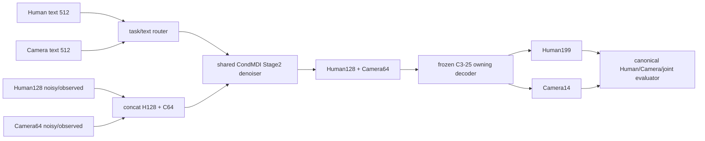
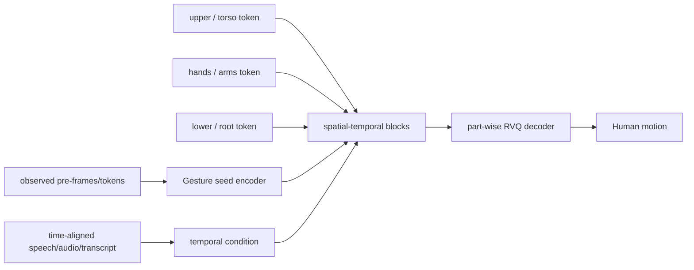
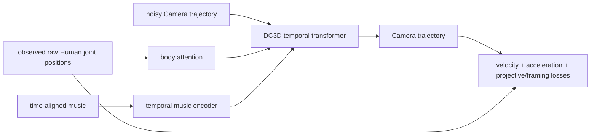
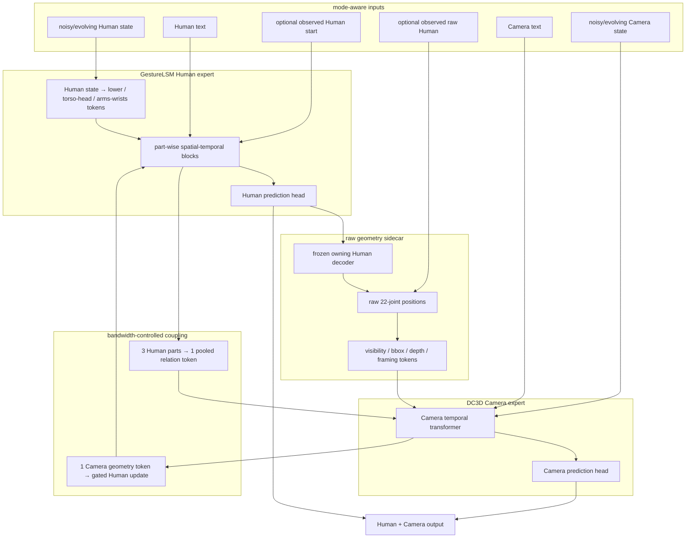
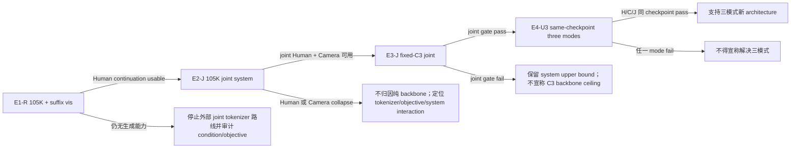

# StoryMotion GestureLSM × DC3D Joint Dual-Expert Design

> [!abstract]
> 本页是新的 joint architecture 因果轴。它不把 GestureLSM full system
> 称为 backbone 单变量，也不把 observed-Human Camera completion 称为
> joint generation。旧 E1/E2/E3 completion screens 仅保留为历史诊断；
> 新 optimizer 顺序是 E1 observed-start Human → E2 external-tokenizer
> joint → E3 fixed-C3 joint → E4 same-checkpoint Unified-3。

## 1. 当前判断

已有结果只说明：

- GestureLSM 三部分 RVQ Stage1 能重建 Pulp Human，因而 Human tokenizer
  并非“完全无法工作”。
- 旧 E1 Stage2 把 GestureLSM 的 `seed` 错当成随机种子或缺失条件并置零；
  native 语义其实是序列开头若干已观测 frame/token。旧 105K 因此不能关闭
  GestureLSM 的时序生成上限。
- 旧 E2 与 E3 是 observed-Human Camera completion。它们能诊断 Camera
  branch，但不产生 joint 或 Human 生成结论。
- 旧 E3 只把 C3 Human128 latent 作为条件，未保留 DC3D 的 raw-body
  attention、投影几何与几何损失，所以“DC3D topology 已失败”的归因过强。
- 旧 E4 的单 Human token 使 GestureLSM 的 spatial body-part bias 退化，
  不应直接启动 optimizer。

因此当前仍没有资格宣称“Stage2 backbone 能力上限不足”。更准确的工作假设是：
Human body topology、Camera projective geometry、任务条件与 joint latent
topology 的组合不匹配。

## 2. 原有 STM pipeline

这个 pipeline 的优点是三模式共享同一表示与 checkpoint；弱点是 Human 与
Camera 先被压成同一序列通道，body-part topology 与 raw projective geometry
都要由共享 denoiser 隐式恢复。Direct-C 中 clean observed Human 又可能形成
shortcut，而 joint 中没有 clean Human 可依赖。

## 3. 外部系统原始能力与旧适配损失

### 3.1 GestureLSM

旧 E1 保留了三个 part token 与 spatial-temporal blocks，却把 `pre_frames`
置零，并用一个全局 Human text embedding 重复到所有时间步。它测试的是
“无起始状态、无时间对齐语音条件的 GestureLSM 变体”，不是 native
temporal generation。

### 3.2 DanceCamera3D

旧 E3 保留了 DC3D 风格的 temporal transformer，但条件是 Human128 latent，
并移除了 raw-body attention、projective geometry 与 DC3D auxiliary losses。
它只能说明该精简 topology 在固定 C3 Direct-C boundary 上存在
geometry–semantics trade-off。

## 4. 新 joint dual-expert pipeline

### 4.1 Human 分块与带宽约束

Human expert 内部保留 `lower`、`torso_head`、`arms_wrists` 三个 token，
但不把三个高维 token 原样倾倒给 Camera expert。跨专家接口固定为每个时间步：

- 一个由三部分 attention-pooling 得到的 Human relation token；
- 一个 Camera/projective geometry token；
- 双向 cross-attention 各只接收对方一个 token；
- Camera → Human 使用零初始化 gate，避免早期 Camera gradient 破坏 Human；
- Human 与 Camera loss 分别按有效 scalar 数归一化，再显式设 branch weight。

这样 Human 内部仍有 body-part 保真能力，而 joint coupling 的 token 数和通道宽度
不会因 Human 有三个 part 而天然压制 Camera。

### 4.2 raw Human geometry sidecar

Direct-C 使用 observed Pulp raw Human positions，不再以 Human latent 代替。
joint 模式没有 GT Human 可作为部署条件，因此使用当前 Human expert 的
`x0` 估计，经 frozen owning decoder 得到 Human199，再确定性转成 raw 22-joint
positions。DC3D body attention 与 projective/framing loss只消费这些 raw
positions。

为避免 teacher-forcing shortcut：

1. 前 20% 训练使用线性退火的 GT/predicted raw geometry mixing；
2. 20% 之后 joint rows 只使用 predicted raw geometry；
3. Direct-C rows 始终使用 declared observed raw Human；
4. projective loss 对 Human raw sidecar `stop-gradient`，只更新 Camera expert；
5. Human-Camera 反向协调由显式 gated cross-attention 完成，而不是让 Camera
   loss 直接拉坏 Human decoder manifold。

这项 mixing schedule 属于 E2 system design；E3 固定 C3 时必须原样保持，不能
在比较中重新调节。

### 4.3 时间条件

GestureLSM 的 speech/audio 与 DC3D 的 music 都是时间对齐输入；Pulp 只有
Human text 与 Camera text，不能伪造逐帧 speech/music。首版使用：

- 原始 512D Human/Camera text；
- learned temporal queries 与相对时间位置编码；
- text cross-attention，而不是把同一个 embedding 当成真实逐帧音频；
- 明确记录 speech/music 被移除并由 text 替换。

因此新模型保留“面向时序条件设计”的 topology，但不声称拥有原数据没有的
时间标注。

### 4.4 `observed_start` 与随机种子

`observed_start` 是序列的前 `K` 个真实 frame/token，不是 RNG seed。

- E1 使用首 4 个 latent frame，即首 16 个 raw frame，生成并评分后缀；
- E1 是 temporal continuation，不是 Direct-H free generation；
- Direct-H 与 joint free generation 不允许读取 GT `observed_start`，改用
  learned BOS/start-state token；
- 若产品模式允许用户给定开头动作，则另报 continuation，不与 free generation
  混表；
- RNG seed 只控制 noise 与复现性，字段名固定为 `random_seed`。

## 5. 三模式是否需要不同架构

三种模式需要不同的输入 clamp、source trust 与 branch activation，但不应使用
三个互不相关的 checkpoint。

| mode | Human expert | Camera expert | raw geometry source | output |
| --- | --- | --- | --- | --- |
| Direct-H | active；无 GT start | masked，不向 Human 注入 Camera latent | generated Human，仅供非评分 sidecar | Human |
| Direct-C | observed Human clamped | active | observed raw Human positions | Camera |
| joint parallel | active | active | evolving Human `x0` 经 frozen decoder 得到 raw joints | Human + Camera |

第一项架构验证从 joint 开始，因为 completion 的 clean observed source 可能掩盖
关系学习。最终 E4 仍必须在同一 checkpoint 中联合训练并平行评价 Direct-H、
Direct-C、joint；joint-only checkpoint 不能称为三模式模型。

## 6. 串行部署实验

### E1-R — corrected G-SYS-H observed-start generation

- 保持三部分 30K RVQ、Human text adapter、shortcut/flow objective 与 105K
  exposure；
- 首 4 latent frame 作为 observed start，禁止零填；
- fresh `0→105K`，TensorBoard，21K/42K/63K/84K/105K checkpoint；
- 只在 105K 做 N=512 suffix metrics、fixed pairs、anonymous/no-reference vis；
- 不做 5K/10K quality gate。

继续条件：105K 可视化出现稳定、连贯、非静止的后缀生成，且 suffix decoded
geometry 与 latent loss 方向一致。停止条件：non-finite、contract 失败，或
105K 仍无可辨认时序生成能力。

### E2-J — external-tokenizer GestureLSM × DC3D joint system control

- Human 端使用 E1 三部分 RVQ 与 GestureLSM expert；
- Camera 端使用 raw Camera14、DC3D temporal/body/projective expert；
- 输入 Human text + Camera text，输出 Human199 + Camera14；
- joint rows 不给 GT Human；raw geometry 来自 evolving Human prediction；
- tokenizer、objective、condition、backbone 都变化，属于 system-level control。

fresh `0→105K`，joint sample exposure 与 mainline joint rows显式记录。只评价
105K joint parallel。若 Human physical quality 或 Camera framing 任一明显
崩溃，则不进入 E3；若出现联合可控性，再固定 C3 representation。

### E3-J — fixed-C3 joint dual-expert architecture

- 冻结 C3-25 Stage1 checkpoint、cache、normalization 与 owning decoder；
- Human128 通过三个显式 projection 得到 part tokens；这三个 projection 的
  参数量、初始化与 token mapping 写入 contract；
- Camera64 使用 DC3D expert；
- raw Human geometry 由 frozen C3 Human decoder产生；
- 保持 STM START_X、noise schedule、sampler、split 与 total sample exposure；
- 首个 optimizer run 从 joint parallel 开始，不从 Direct-C completion 开始。

E3 是 DC3D-inspired new joint architecture，不称作原生 DC3D，也不是纯
backbone 单变量，因为 body-part projection 与 raw-geometry sidecar 同时改变。
通过条件是 joint Human 与 Camera gate 同时非劣，且 framing/projective
diagnostics 改善。

### E4-U3 — same-checkpoint dual-expert Unified-3

- 复用通过 E3 的 architecture，不再新增 topology；
- fresh 105K，从 step 0 联合采样三种任务，默认 exposure 为 joint 60%、
  Direct-H 20%、Direct-C 20%；
- Direct-H 使用 learned BOS，不读取 observed Human；
- Direct-C clamp observed raw Human；
- joint 两边自由生成；
- task router、loss normalization 与 cross-bandwidth 在 optimizer 前冻结。

最终资格要求同一 105K checkpoint 的 Direct-H、Direct-C 与 joint parallel
全部 formal audit。若 joint 通过但 Direct-H 未通过，仍不能宣称解决 Human
blocker；若 Direct-C 通过，只证明 Camera completion。

## 7. 公平性矩阵

| axis | E1-R | E2-J | E3-J | E4-U3 |
| --- | --- | --- | --- | --- |
| Stage1 | GestureLSM part RVQ | GestureLSM part RVQ + raw Camera14 | fixed C3-25 H128+C64 | fixed C3-25 H128+C64 |
| Human topology | native 3-part | native 3-part | 3 learned projections from H128 | same as E3 |
| Camera topology | none | DC3D raw/projective | DC3D raw/projective | same as E3 |
| objective | shortcut/velocity | system joint losses | STM START_X + declared geometry auxiliaries | same as E3 |
| condition | Human text + observed start | Human text + Camera text | Human text + Camera text | mode-routed texts |
| primary mode | Human continuation | joint | joint | Direct-H + Direct-C + joint |
| causal claim | Human system generatability | full-system upper bound | fixed-C3 joint architecture | three-mode checkpoint |

## 8. 预注册与执行约束

每个 optimizer run 在启动前都必须：

1. 建立独立 `experiment_contract.json`，记录 raw/latent shapes、条件来源、
   GT/predicted geometry schedule、参数量、sample exposure、GPU 与环境；
2. 通过 import/forward/backward、`is_causal is False`、one-batch overfit、
   decoder round-trip、32-sample deterministic generation、metric I/O 与
   no-optimizer contract audit；
3. 启用 run-local TensorBoard；
4. 至少保存 20%/40%/60%/80%/100% checkpoint；
5. 只在 105K 或预注册的合理训练量 endpoint 做质量评价；
6. 保留旧 run/checkpoint/log，不覆盖、不复用、不把短评测升级为 evidence。

## 9. 决策边界

在 E4 正式闭合前，v8.1C C3-25 seed17 Stage1 与 Unified-3 105K 继续是 STM
mainline。
