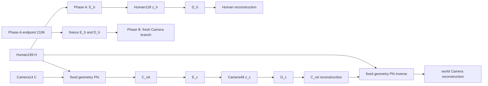

# StoryMotion v10 Human-relative Camera Training Contract

> [!abstract] Durable contract
> 本页是v10架构、Stage1／Stage2训练顺序、推理模式与A/B/C gate的durable owner。原始任务书与执行快照保留在 [[2026-07-29_full_re]]；正式数值只见 [[StoryMotion-valid-metric-ledger]]，artifact身份只见 [[Storymotion-exp-sha]]，当前是否继续只见 [[current]]。

## 1. 范围与术语

v10只生成两个随机变量：独立Human128与显式Human-relative Camera48。它删除v9的`interaction16`生成目标、learned Camera conditioner与读取Human latent的Camera decoder。所有StoryMotion Stage1／Stage2 tokenizer和Transformer均必须满足`is_causal=false`；Camera路径不得更新或改变Human路径。

### 1.1 Stage1是两个顺序phase



Phase A先独立完成Human-only训练：

$$
z_h=E_h(H)\in\mathbb{R}^{128},
\qquad
\hat H=D_h(z_h).
$$

Phase B只训练新的Camera branch：

$$
C_{\mathrm{rel}}=\Phi(H,C),
\qquad
z_c=E_c(C_{\mathrm{rel}})\in\mathbb{R}^{48},
\qquad
\hat C_{\mathrm{rel}}=D_c(z_c).
$$

训练顺序固定为：

1. Phase A：Human-only，本地`1–210K`；
2. 从exact Phase-A `step_210000.pt`加载`E_h,D_h`；
3. 永久冻结`E_h,D_h`，fresh初始化`E_c,D_c`与Camera optimizer；
4. Phase B：Camera-only，本地`1–210K`；
5. 不运行Phase C Human–Camera joint fine-tuning。

这与v9 Pulp-only Stage1不同。v9依次训练Human Phase A、`interaction16 + conditioned-Camera48` Phase B，再以Phase C联合微调到`636K`；v10只复用Phase-A Human owner，重新训练独立relative-Camera Phase B。v10不是`F_HC(z_h,z_c)`式joint latent fusion，也没有`z_{hc}`。

### 1.2 v10 Human teacher为什么不能复用v9

v9与v10 Human teacher使用相同的`ViMoGenLightFlow`拓扑、shifted-flow objective、训练schedule与`105K`预算；差异不在flow实现，而在它们各自拥有的Human latent坐标系：

| teacher | Stage1 Human owner | cache / normalization boundary | transfer decision |
| --- | --- | --- | --- |
| v9 teacher | Phase-C `636K`后的`E_h,D_h` | v9 raw Human128 cache与对应train-only full-cov statistics | 只属于v9 |
| v10 teacher | exact Phase-A `210K`的`E_h,D_h` | 从Phase-A owner重建的raw Human128 cache与对应train-only full-cov statistics | v10必须fresh训练 |

Human128维数相同不代表tensor或whitened坐标相同。逐权重与fixed-128 latent审计已经否定两者exact equivalence，正式差分只见 [[StoryMotion-valid-metric-ledger#5.6 v9／v10 Human teacher owner非等价审计]]，artifact身份只见 [[Storymotion-exp-sha#4. v10 Phase-A Human 与 Human-relative Camera 前置实验]]。因此直接复用v9 teacher会让flow权重作用于错误的latent normalization；只有owner、raw cache与statistics逐元素一致时才允许复用。

### 1.3 Stage2不是单一“parallel／cascade”二选一

Stage2概率分解为：

$$
z_h\sim p(z_h\mid T_H),
\qquad
z_c\sim p(z_c\mid z_h,T_C).
$$

因此Human始终不依赖Camera。联合推理有两种求解方式：

- sequential joint：先把Human完整生成到$z_h^0$，固定该条件后再把Camera从噪声生成到$z_c^0$；这是严格三角分解下的correctness baseline与默认joint模式；
- synchronous joint：Human与Camera state交错更新，Camera每一步读取stop-gradient predicted-clean Human；这是近似交错solver，不得声称与sequential严格等价。

## 2. 显式几何变换

令Human root world位置为$p_h(t)$，yaw-only heading frame为$R_h(t)$；Camera center为$p_c(t)$，Camera-to-world旋转为$R_c(t)$。在已审计的Camera-to-world约定下：

$$
p_{\mathrm{rel}}(t)=R_h(t)^\top\bigl(p_c(t)-p_h(t)\bigr),
$$

$$
R_{\mathrm{rel}}(t)=R_h(t)^\top R_c(t).
$$

逆变换为：

$$
p_c(t)=p_h(t)+R_h(t)p_{\mathrm{rel}}(t),
$$

$$
R_c(t)=R_h(t)R_{\mathrm{rel}}(t).
$$

约束：

- 只使用Human yaw／heading；world up固定，root pitch／roll不进入Camera reference frame；
- heading做unwrap、连续性处理，并覆盖低速、躺卧、原地旋转与$-\pi/\pi$跨越；
- FOV保持内参量；relative速度由变换后的pose重新差分，禁止复制world velocity；
- 网络旋转输入使用continuous 6D；round-trip与评测回到rotation matrix并计算geodesic error；
- `PhiInverse(H, Phi(H, C))`、共同world平移／yaw不变性、true-length mask、旋转约定与Human零梯度均须单测。

Stage1 reconstruction用GT Human执行逆变换；Direct-C用observed Human；sequential与synchronous joint最终都用生成Human。`D_c`只读$z_c$。

## 3. Stage1 objective与cache

v10修正版Phase-B objective为：

$$
\mathcal{L}_{C,\mathrm{stage1}}
=
\mathcal{L}_{\mathrm{relative\ recon}}
+\mathcal{L}_{\mathrm{relative\ temporal}}
+0.1\mathcal{L}_{\mathrm{rotation\ geodesic}}
+0.1\mathcal{L}_{\mathrm{fixed\ projective\ framing}}.
$$

fixed-projective framing从GT Human与target／decoded Camera执行同一固定投影，四维feature为`2*(screen_center-0.5)`、`log1p(screen_scale)`与可微`soft_outscreen_ratio`；softness固定为`20.0`，target与Human geometry均detach。它没有learned framing head，也不读取Human latent，因此只向`E_c,D_c`反传。hard out-ratio与zero-visible仍只作报告；`Out`的三种口径见 [[StoryMotion-metric-computation-io]]。

从v9迁移到本objective的边界是：

1. v9 Phase B的Camera reconstruction迁为relative-Camera reconstruction；
2. v9 Phase B的Camera temporal difference迁为relative-Camera temporal；
3. v9 Phase B与Phase C共用的`0.1 * framing`迁为上述fixed-projective framing；Phase C没有额外Camera loss，只是在相同Camera loss外再加入Human objective；
4. v9的`1e-4 * interaction_energy`不迁移，因为v10已删除`interaction16`；
5. v9 Phase C的Human reconstruction／temporal／yaw／root项不迁移，因为v10 Phase B的定义就是永久冻结`E_h,D_h`；
6. `0.1 * rotation_geodesic`是v10相对v9保留的附加几何约束。

旧run只包含前三项中的relative reconstruction、relative temporal与rotation geodesic，未对framing反传。其`210K` endpoint和pure4,053数值继续作为历史diagnostic保存，但不再是cache候选；修正版不得resume旧checkpoint或optimizer，必须从exact Phase-A `210K`父权重fresh开始。

新cache为：

$$
[z_h,z_c]\in\mathbb{R}^{176\times T'},
\qquad
z_h\in\mathbb{R}^{128\times T'},
\qquad
z_c\in\mathbb{R}^{48\times T'}.
$$

- 每条sequence按true length独立编码，$T'=\lceil T/4\rceil$；
- Human128与Camera48分别使用train-only normalization，eval只复用train statistics；
- Human cache只有与Phase-A owner逐元素一致才可复用；
- Camera48重新计算z-score与full-covariance statistics；
- cache保存sample/text IDs、raw/latent length及全部mutable-boundary identity；
- 旧192D、interaction16、Camera64、旧Camera normalization与旧optimizer state均fail-close不兼容。

## 4. Protected-H Stage2

Human flow沿用同一`ViMoGenLightFlow`实现，只读Human text。Camera flow输出Camera48，并包含Camera self-attention、Camera-text cross-attention、Human-context cross-attention与time-modulated FFN；不存在Camera-to-Human attention或gradient。

四种Camera route为：

| route | Human context | reliability $q_h$ | target |
| --- | --- | ---: | --- |
| `OBSERVED_H` | GT／observed Human latent | 1 | same GT Camera48 |
| `TF_INTERMEDIATE_H` | frozen Human flow的一步predicted-clean，stop-gradient | $(1-\sigma_h)^\gamma$ | same GT Camera48 |
| `GENERATED_FINAL_H` | 完整Human sampler endpoint，stop-gradient | 1 | same GT Camera48 |
| `ROLLOUT_INTERMEDIATE_H` | frozen Human ODE rollout predicted-clean，stop-gradient | $(1-\sigma_h)^\gamma$ | same GT Camera48 |

默认$\gamma=1$。$q_h$进入AdaLN/time condition并门控Human cross-attention residual；不得直接缩放Human context tensor。generated-final与rollout context由离线cache保存seed、sigma、quality flag与Human checkpoint identity。

每个Camera optimizer step总batch为128，四route从step 1同时出现：

$$
\mathcal L_C
=\frac{64}{128}\mathcal L_{\mathrm{obs}}
+\frac{40}{128}\mathcal L_{\mathrm{tf}}
+\frac{12}{128}\mathcal L_{\mathrm{gen}}
+\frac{12}{128}\mathcal L_{\mathrm{rollout}}.
$$

route内先取mean，再按比例聚合；随后只执行一次Camera backward、clip、optimizer step和EMA update。Human flow永久冻结。第一版只使用whitened Camera48 masked shifted-flow velocity MSE，不叠加geometry auxiliary、PCGrad、route-specific adapter或多Camera head。

### 4.1 Human CFG support是Camera启动前边界

当前实现与配置把离线`GENERATED_FINAL_H`／`ROLLOUT_INTERMEDIATE_H` cache以及A/B/C eval的Human CFG都固定为`1.0`。这只与“sequential joint也固定Human CFG1”的部署合同严格匹配；若正式候选同时包含Human CFG3，就不能用CFG1 cache训练后直接把sequential Human改成CFG3并视为matched。

v9不能作为“Camera已在完整CFG1 Human generation上训练”的先例：v9 Direct-C使用observed／GT Human，HC route只在noisy GT-Human上执行一次frozen conditional forward并取predicted-clean；它代数上接近conditional scale1的单步估计，但不是完整CFG1 Euler rollout，也不含累计Human generation error。v9完整Human sampling只用于不进入Camera loss的exact-regression monitor；正式joint inference则使用Human CFG3。

Stage2 Camera contract生成前必须二选一并写入immutable contract：

1. CFG1-only：保留当前单cache，所有sequential／synchronous Human eval也固定CFG1；
2. CFG1+CFG3 robustness：只为`GENERATED_FINAL_H`与`ROLLOUT_INTERMEDIATE_H`建立matched CFG1／CFG3双cache，在这两类route内离散均衡采样，并逐样本保存`human_cfg_scale`、sampler seed、snapshot sigma、checkpoint／decoder／cache SHA。`OBSERVED_H`没有CFG，`TF_INTERMEDIATE_H`仍是noisy-GT单步conditional predicted-clean，不伪装成完整rollout。

首个因果实验不采用连续随机CFG区间，也不同时新增CFG embedding；先用离散`{1,3}`隔离context-support问题。若单一Camera flow仍不能覆盖两端，再把显式CFG scalar conditioning作为下一条独立架构轴。A/B/C必须分别在同一Human CFG内matched；Direct-C不因Human CFG改变，因为它只读observed Human。

## 5. 四个推理入口

| entry | Human source | Camera source / condition | exactness boundary |
| --- | --- | --- | --- |
| Direct-H | Human text → complete Human sample | none | Camera module/text/noise不得进入图 |
| Direct-C | observed Human | Camera text + `OBSERVED_H` | 用observed Human执行$\Phi^{-1}$ |
| sequential joint | 先完整生成Human | 固定final Human后完整生成Camera | 默认joint correctness baseline |
| synchronous joint | Human与Camera均从noise开始 | 每步读取stop-gradient predicted-clean Human | Camera不得改变Human solver；与Direct-H Human逐元素一致 |

相同Human initial noise与sampler下，Direct-H、sequential和synchronous的最终Human必须满足`max_abs == 0.0`。synchronous只是一种效率／耦合近似；若它差于sequential，正式模式保留sequential。

## 6. 训练与A/B/C gate

Stage2 Camera先运行`5e-5`与`1e-4`两条matched `10K` LR screen；除LR外，batch、noise、dropout与context trace完全相同。胜者才可续到`105K`。每`1K`保存raw/EMA checkpoint、四route fixed loss、Human exact regression、gradient/update norm与non-finite state。

同一first-128 cohort先比较：

- A：GT-H Direct-C；
- B：sequential joint；
- C：synchronous joint。

候选再做first-512 confirmation。A/B/C固定Human/Camera text、两路initial noise、solver、steps、CFG、ordered IDs与seed；B/C共享Human initial noise且最终Human exact。解释顺序固定为：

1. A优于B：generated-final Human context shift；
2. B优于C：evolving synchronous context额外退化；
3. A/B/C都差：回到Camera representation、flow optimization与latent objective；
4. B接近A、C差：sequential作为正式joint模式；
5. B/C都接近A：四route exposure与relative representation获得支持。

## 7. 当前执行状态

> [!warning] 当前边界
> exact Phase-A Human owner与同owner的Human-text-only teacher `105K`已经闭合。旧三项objective的Phase-B `210K`及pure4,053 endpoint审计只保留历史diagnostic；补齐fixed-projective framing后的fresh Phase-B已完成contract、真实数据preflight、冻结Human回归与预注册first-128 `30K` smoke，五个核心轴逐项通过且Human exact，并已从exact `30K` checkpoint在同run续训至`210K`。当前优先级已切换到[[2026-07-29_storymotion-v11-v9-owner-stage2-three-mode-rescue-contract|v11 Stage2-only rescue]]；v10修正版formal endpoint、cache与Camera Stage2暂停但未判失败。

旧`207K`选择artifact保留，但其framing轴曾把raw joint-out occupancy误当lower-is-better error；旧final `210K`同样保留数值，不再作为Stage1 cache候选。只有已到达`210K`的修正版完成pure4,053 formal audit后，才能重新产生候选endpoint。该更正不构成跨版本promotion。

以下项目尚未训练或评测，不能标作通过或失败：

1. 已到达`210K`的修正版Phase-B pure4,053 formal endpoint audit；
2. 修正版endpoint的新176D train/eval cache与Camera full-covariance statistics；
3. 四route Camera flow两条`10K` LR screen；
4. Camera `105K` continuation；
5. GT-H Direct-C、sequential joint与synchronous joint A/B/C；
6. 完整v10 Unified-3 promotion audit。

自2026-07-31起，v11 C0-LAT／C0-GEO共同mainline取代C3-25；这不改变v10的未闭合边界。v10 Human teacher只关闭Human prerequisite，它没有Camera输出，不能外推Camera或joint能力。

## 8. 数据与claim边界

数据应满足：

$$
p(H,C\mid T_H,T_C)=p(H\mid T_H)p(C\mid H,T_C).
$$

数据审计只flag Camera caption新增Human动作、Human／Camera语义冲突、Camera caption主体动作污染与长度不一致；第一版不自动删除。数据清洗必须独立版本化，不能与representation或generator变更合并归因。

可以写“v10 Human teacher prerequisite已闭合，修正版Stage1 Phase-B已通过preflight与30K smoke，并在同run续训至210K”。不能把旧三项loss `210K`写成修正版endpoint或cache候选，也不能写“v10 Camera flow／Direct-C／joint已通过或失败”“Stage1 reconstruction等价于Stage2 generation”“v10已替换C3-25”，不能把root-aligned MPJPE称为local-pose error。

## 9. Web GPT外部评审Prompt（2026-07-29）

> [!warning] Transport snapshot，不是第二份证据账本
> 下列内容用于一次性复制给外部Web GPT。精确数值的唯一canonical owner仍是[[StoryMotion-valid-metric-ledger]]；run、checkpoint、cache与artifact身份仍由[[Storymotion-exp-sha]]拥有。外部意见只能形成假设与实验建议，不能覆盖本合同或ledger中的本地实证。

```text
你是一名严格但公平的生成式人体运动／相机联合生成研究评审。请只根据下列“已验证本地事实”做因果审计，并在需要外部资料时只引用论文、官方代码或官方文档等一手来源。不要把视觉印象、训练loss或跨版本非matched数字提升为formal结论。

【评审目标】
1. 判断v10相对v9的Stage2 Human teacher退化，是否可以归因于“v10少了Phase C对Human的小LR额外训练量”；
2. 区分训练量、joint exposure、latent owner／normalization／cache变化等混杂因素；
3. 决定v10 sequential Human→Camera训练应锁定Human CFG1，还是对完整generated／rollout context采用离散CFG {1,3}双支持；
4. 在最多3个核心实验内给出可证伪的最小实验矩阵。

【系统不变量与当前状态】
- StoryMotion Stage1／Stage2必须使用non-causal tokenizer；主线representation仍是v8.1C C3-25 seed17。v10目前只是diagnostic候选，尚无修正版Camera endpoint、Stage2 Camera、Direct-C或joint结果。
- v10 Stage2默认sequential joint：先把Human从noise完整生成到H0，再固定H0生成Camera到C0。synchronous parallel只是额外A/B/C诊断，不是默认gate。
- Direct-H只读取Human text；Direct-C读取observed Human与Camera text；Camera不得向Human回传梯度。

【v9 Stage1 owner】
- Phase A，step 1–210K：Human-only。
- Phase B，step 210001–420K：冻结Eh、Dh，只训练Camera／interaction／framing。
- Phase C，step 420001–636K：joint fine-tune；Human LR为Camera LR的0.1倍，anchor:joint采样约3:7。
- v9 Stage2 Human teacher拥有Phase-C 636K的Human latent owner，而不是Phase-A 210K owner。

【v10 Stage1 owner】
- Human owner严格等于Phase-A 210K；Phase B永久冻结Eh、Dh。
- Camera改为独立Human-relative Camera48；旧三项loss版本漏掉framing反传，已失去cache候选资格。
- 修正版Phase B加入fixed-projective framing，从exact Phase-A 210K fresh训练；已通过真实数据preflight与30K smoke，目前在同run续训到210K，尚未形成formal endpoint。
- 因此，v10没有v9 Phase C中的Human小LR更新，也没有Phase C joint exposure；Camera训练量和Camera objective／representation也与v9不同。

【v9／v10 Human teacher matched事实】
- 两者使用同一ViMoGenLightFlow拓扑：71,870,080参数、shifted-flow objective、batch 128、相同optimizer／LR／EMA配方，都训练105K。
- 区别在Stage1 latent owner及其cache／train-only normalization statistics。first-128 owner audit显示10/10 Human tensors改变，371,712/371,712元素非零差异，mean absolute delta 0.216329，max absolute delta 2.286326。
- 所以“区别就在Stage1 owner边界”有支持；但该边界同时包含Phase C额外训练量、joint objective/exposure、latent geometry、cache与normalization，不能在没有matched ablation时把它们视为同一原因。

【N=512、Euler50、seed17 matched Human teacher诊断】
字段顺序：FDTMR, TMR, HCov, density, precision, recall, R@1/R@2/R@3, MM, global MPJPE, root-aligned MPJPE, root ADE/FDE。
- v9 CFG1：165.403, 17.967, 0.8205, 0.9157, 0.9042, 0.7677, 0.1777/0.2832/0.3574, 49.6630, 0.7544, 0.2288, 0.6680/1.0879。
- v10 CFG1：149.537, 17.454, 0.8323, 0.9139, 0.9022, 0.7911, 0.1445/0.2461/0.3223, 49.8109, 0.7718, 0.2287, 0.6882/1.1121。
- v9 CFG3：156.577, 19.097, 0.8317, 0.9142, 0.9140, 0.7676, 0.1797/0.3027/0.3926, 49.2351, 0.8615, 0.2373, 0.7729/1.2616。
- v10 CFG3：159.831, 18.424, 0.8144, 0.8502, 0.8942, 0.7855, 0.1641/0.2754/0.3574, 49.5155, 0.8951, 0.2375, 0.8061/1.2720。
- v9 CFG1旧evaluator没有输出integrated yaw，禁止插值或虚构该字段。
- fixed8六路盲看中v9整体更自然，但N=8只能做案例定位，不能代替总体证据。
- matched CFG3下，v9在上述多数质量／检索／几何字段胜过v10；CFG1则是mixed：v10的FDTMR、TMR、coverage较好，但v9的retrieval与多数global/root trajectory字段较好。
- v10 CFG3相对自身CFG1改善TMR、retrieval与幅度，却恶化FDTMR、coverage与global/root geometry；因此CFG不是单调增益，也不能单独解释v9-v10差异。

【v9 Camera阶段究竟使用什么Human context】
- Direct-C读取observed／GT Human，没有Human CFG。
- HC route从noisy GT Human做一次frozen conditional forward，取stop-gradient predicted-clean Human。它在代数上接近conditional scale1的单步估计，但不是完整CFG1 Euler/free rollout，也没有累计Human生成误差。
- Camera阶段唯一完整Human generation是CFG3 exact-regression monitor，不进入Camera loss；正式joint parallel inference使用Human CFG3。
- 该train/inference exposure mismatch可以解释joint相对Direct-C的附加退化，但不能解释observed-H Direct-C本身失败。

【v10 Planned Camera context support】
- 每个Camera batch 128：64 observed、40 teacher-forced intermediate、12 generated-final、12 rollout-intermediate。Human始终冻结并stop-gradient。
- 当前实现的generated-final／rollout cache与A/B/C eval都固定Human CFG1。
- 若正式sequential inference使用Human CFG3，则这是实际distribution shift。
- 两个候选合同：
  A. CFG1-only：训练cache和所有sequential／synchronous Human eval都锁定CFG1。
  B. CFG1+CFG3 robustness：只对generated-final与rollout-intermediate建立matched CFG1／CFG3双cache，并在这两route内离散均衡采样；observed route无CFG，teacher-forced单步route不伪装成完整rollout。
- 第一轮不要同时引入连续随机CFG范围与CFG scalar embedding；先用离散{1,3}隔离context-support轴。只有单一Camera flow不能覆盖两端时，才把显式CFG conditioning作为下一条独立架构轴。

【你必须回答】
A. 把每个判断标成“已支持事实／强推断／尚未证明”，禁止用P0、pass、fail等容易误读为已完成实验的标签。
B. 能否敲定“v10退化就是少了Phase C Human小LR额外训练量”？若不能，列出不可忽略的混杂因素，并给出优先级与可证伪条件。
C. 设计最小Stage1 ablation，分别隔离：额外Human update数量、Phase-C joint exposure/objective、latent owner/cache/statistics。说明每条实验从哪个checkpoint启动、冻结哪些参数、训练多少step、用哪个decoder/cache。
D. 在CFG1-only与离散CFG {1,3}双cache中做选择；说明选择依赖的最终部署CFG、为何teacher-forced route是否需要guidance，以及何时才需要显式CFG scalar conditioning。
E. 给出最多3个核心实验的精确表格：causal question、唯一改变项、matched controls、N与seed、screen→formal gate、stop/go标准、能证伪哪个假设。优先选择能同时减少最多不确定性的实验。
F. 指出即使fixed8视觉上v9更好，也仍然不能成立的结论。
G. 若引用外部资料，外部依据与本地证据分栏；只用一手来源，并清楚标出哪些结论是你根据来源做的推断。

【输出格式】
1. 一段结论摘要；
2. 一个因果图或有序假设列表；
3. 最多3行核心实验表；
4. CFG合同建议；
5. 每个主结论的falsifier；
6. 最后列出“当前绝对不能宣称的事项”。
```
