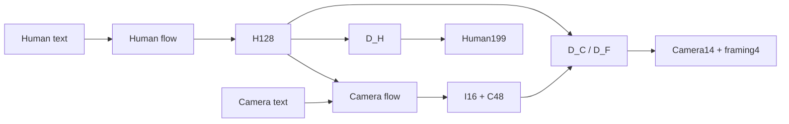

# StoryMotion codebase deconstruction

> [!important] 本页对应当前单版本源码，不再解释历史 `experiments/`
> 3090 的 `linkedCodebases/StoryMotion/` 现只保留 Pulp-only Stage1 owner 与 C0-LAT
> frozen-Human Stage2；没有 `experiments/`、runs、checkpoint、cache、dataset、log、render、
> rescue 或旧版本备份。历史实验身份和正式数字分别只在 [[version_family]] 与
> [[StoryMotion-valid-metric-ledger]] 追溯。
> 4090／5090随后完成的observed-Human route controls与fully independent H/C Stage1使用各自
> immutable实验worktree；它们不会被回灌成3090 release core中的第二套实现。

本页是实现地图，不复制指标表。指标定义与 I/O 见
[[StoryMotion-metric-computation-io]]，当前论文决策见 [[current]]，ICLR 证据缺口见
[[StoryMotion-iclr-reliability]]。

## 1. 一句话理解

StoryMotion 不是“同时从噪声联合生成 Human 与 Camera”。它先建立一个 **Camera-free 的
Human latent/decoder 通路**，再冻结已经具备 text-to-Human 能力的 Human flow，只训练
Camera flow 去完成：

$$
t_H \rightarrow z_H,\qquad (z_H,t_C)\rightarrow z_{I,C},
$$

其中 $z_H\in\mathbb{R}^{128}$，$z_{I,C}=[z_I;z_C]\in\mathbb{R}^{64}$。最终 Stage1
owner 用 $D_H(z_H)$ 解码 Human，用 $D_C(z_H,z_I,z_C)$ 解码 Camera。

> [!important] 核心贡献所在
> “Human-preserving”由两个硬边界共同实现：Stage1 的 Human decoder 只读 H128；Stage2
> Camera optimizer 不拥有 Human 参数。Human generation 不是 Camera training 的副产品，
> 而是先完成并冻结的 capability。



## 2. 当前源码边界

目录入口是 [README](../../../linkedCodebases/StoryMotion/README.md)；唯一配置是
[mainline.yaml](../../../linkedCodebases/StoryMotion/configs/mainline.yaml)。核心实现分为：

| 目录 | 当前唯一职责 |
| --- | --- |
| `storymotion/stage1/` | non-causal Human199 + Camera14 → H128 + I16 + C48 及 owning decoders |
| `storymotion/stage2/` | Human flow、fixed-H Camera flow、cache、text、三模式 routing |
| `storymotion/training/` | Stage1 phase step 与 C0-LAT Camera optimizer-local step |
| `storymotion/eval/` | reconstruction 与 screen/projective metric primitives |
| `configs/mainline.yaml` | 唯一受支持的尺寸、endpoint、objective 与推理模式 |
| `docs/experiment-contract.md` | formal run 必须绑定的 provenance schema |

`v9`／`v11` 字样仍可出现在 checkpoint/cache 的 architecture ID 中；这是已有 artifact 的
不可变 schema 标识，不代表本地还保留多套实现。

> [!warning] 当前还不是完整开源复现包
> 本地树已经是 release-oriented 的单实现布局，但只提供模型、cache、routing、loss 和
> optimizer-local step。历史长训 harness 与 official pure4,053 evaluator 没有直接复制；
> 在公开前仍需把 contract materialization、checkpoint/EMA/RNG resume、正式 evaluator 和
> dataset bridge 作为无版本 CLI 接回这套 library。当前源码可用于理解和单步验证，不能仅凭
> `python` 命令宣称端到端复现 formal ledger。

## 3. 张量与数据合同

### 3.1 Stage1 feature space

唯一 feature contract 是
`pulpmotion_official_normalized_human199_joint_camera14`：

- Human：`[B,T,199]`；
- Camera：`[B,T,14]`；
- latent：下采样 4 倍，最大 75 帧；布局严格为 `human128+interaction16+camera48`；
- valid mask：raw frame 与 latent frame 都必须排除 padding；
- normalization：只允许 train split owner 的统计。

当前单版本树从“已经按合同物化的 normalized batch”开始，不再保留多版 raw-data adapter。
原始 manifest 到 normalized Human199/Camera14 的公开 dataset bridge 是 release 前尚需补回的
工程项，不是新的科研实验。

### 3.2 Stage2 cache space

[cache.py](../../../linkedCodebases/StoryMotion/storymotion/stage2/cache.py) 只接受
`[N,192,75]`：前 128 维是 Human，后 64 维是 I16+C48。处理顺序为：

1. per-channel z-score；
2. H128 与 Camera64 分支各自做 train-only full-covariance whitening；
3. invalid latent frame 重新置零；
4. loader 检查 `is_causal=false`、latent order、维度与 ordered sample IDs。

这意味着“同一数值 tensor”并不足以替代 cache identity。Stage1 checkpoint、owning decoder、
train stats、ordered IDs、mask policy 与 cache hash 必须一起匹配。

## 4. Stage1：Human anchor 与 paired Camera support

> [!important] 核心代码
> [HumanAnchorInteractionResidualAE](../../../linkedCodebases/StoryMotion/storymotion/stage1/model.py)
> 是唯一 Stage1 owner；尺寸和 phase endpoint 由
> [experiment_invariants.py](../../../linkedCodebases/StoryMotion/storymotion/experiment_invariants.py)
> 固定，不能由 run script 手填另一套值。

### 4.1 编码与解码

[model.py](../../../linkedCodebases/StoryMotion/storymotion/stage1/model.py) 的结构是：

- $E_H(H)\rightarrow z_H$：Human encoder 只读 Human199；
- $E_I(H,C)\rightarrow z_I$：interaction encoder 读取 paired H-C；
- $E_C(C)\rightarrow z_C^0$，再由 `camera_conditioner([z_H,z_I,z_C^0])` 得到最终 C48；
- $D_H(z_H)\rightarrow\hat H$；
- $D_C([z_H,z_I,z_C])\rightarrow\hat C$；
- $D_F([z_H,z_I,z_C])\rightarrow$ center-x/y、log-scale、out-of-frame ratio。

卷积 encoder 通过 stride 4 一次下采样；decoder 通过 transpose convolution 恢复时间长度。
所有模块都是 non-causal，没有 temporal causal tokenizer。

### 4.2 为什么自由替换尚不成立

Human decoder 的确与 Camera 解耦，但 Camera 端并未完全独立：I16 由 `(H,C)` 编码，C48
还经过 `[H,I,C]` conditioner，Camera/framing decoder 同样读取 `[H,I,C]`。因此当前支持的
是 paired support 上的 Human-preserving generation，不是任意 Human latent 与 Camera
program 的零样本拼接。

这也解释了为什么“从 Stage1 起独立 Encodec-H / Encodec-C”不是一个干净的核心 ablation：
它会同时更改 representation、decoder support、参数量、normalization 与 Stage2 interface。
该系统后来经用户单独授权完成fresh 105K／210K、pure4,053与latent audit，只形成secondary
native-system Stage1 boundary；它不进入protected-asymmetry核心消融，未授权Stage2 cascade，也不改变
本地唯一owner。正式证据见ledger §6.9。

### 4.3 三阶段优化

[steps.py](../../../linkedCodebases/StoryMotion/storymotion/training/steps.py) 调用 Stage1 的
phase loss；[model.py](../../../linkedCodebases/StoryMotion/storymotion/stage1/model.py) 定义冻结
与参数组：

| phase | optimizer steps | trainable path | loss |
| --- | ---: | --- | --- |
| A | 210K | Human encoder/decoder | Human recon + velocity + `0.001 yaw` + `0.003 root` |
| B | 210K | interaction/Camera/framing | Camera recon + velocity + `0.1 framing` + `1e-4 interaction energy` |
| C | 216K | 两侧共同更新；Human LR = 0.1× | Human total + Camera total |

Phase C 是 Stage1 paired reconstruction refinement，不是 Stage2 joint-parallel generation。

## 5. Stage2 Human：先建立并冻结 capability

[human_flow.py](../../../linkedCodebases/StoryMotion/storymotion/stage2/human_flow.py) 是
text-conditioned non-causal shifted-flow Transformer：

- input/output：`[B,128,75]`；
- width 512、12 blocks、8 heads、FFN multiplier 4；
- motion self-attention + Human-text cross-attention；
- timestep 通过 zero-init modulation 注入；
- Human-text dropout 0.1，支持 CFG；
- flow shift 为 5，$\sigma(u)=5u/(1+4u)$；
- target velocity 是 $\epsilon-z_H$，loss 只聚合 valid latent frames。

正式 owner 在 optimizer `105K`。Camera model 构建时必须 strict-load Human state、检查
`global_step=105000` 与 `is_causal=false`，随后 `requires_grad_(False)` 且置为 eval。

## 6. Stage2 Camera：C0-LAT

> [!important] 核心代码
> [dual_stream.py](../../../linkedCodebases/StoryMotion/storymotion/stage2/dual_stream.py)
> 定义 Camera Transformer；
> [camera_flow.py](../../../linkedCodebases/StoryMotion/storymotion/stage2/camera_flow.py)
> 定义 exact initialization、LAT objective、EMA 与 sampler；
> [steps.py](../../../linkedCodebases/StoryMotion/storymotion/training/steps.py)
> 确保 optimizer step 只使用 observed Human 且 Human 永久冻结。

### 6.1 Camera Transformer

Camera input 是 noisy Camera64；每个 block 依次执行：

1. Camera temporal self-attention；
2. Camera-text cross-attention；
3. fixed Human128 cross-attention；
4. feed-forward；
5. valid-mask 清零。

Human-attention output projection 与最终 velocity head 使用 zero initialization。mainline
固定 `camera_text_drop_prob=0`、`human_context_drop_prob=0`，因此 Camera sampler只计算一次
fully conditional velocity，不存在四路 Camera CFG。

### 6.2 exact initialization 与保护边界

`build_camera_model` 从 Human `105K` checkpoint strict-load `human.*`，并载入 Camera initial
state；唯一允许缺失的是新增的 `source_embedding.weight`，且它必须逐元素为零。随后：

- Human 参数全部冻结；
- Camera optimizer 只拥有 `model.camera.parameters()`；
- loss 内的 Human context再次 `.detach()`；
- 任一 causal module、Human trainable parameter 或 checkpoint endpoint 错误都 fail closed。

### 6.3 C0-LAT objective

对 clean Camera latent $c$、noise $\epsilon$ 和 shifted time $\sigma$：

$$
c_\sigma=(1-\sigma)c+\sigma\epsilon,\qquad
v^*=\epsilon-c,
$$

Camera Transformer 预测
$v_\theta(c_\sigma,t_C,z_H,\sigma)$，用 valid-mask 后的均方 flow loss 训练。C0 的
`camera_step` 只使用 observed/GT Human；C0-GEO decoded auxiliary 不在当前发布树中。

### 6.4 historical source-ID：C1路由适配，不是StoryMotion能力主张

当前 [training step](../../../linkedCodebases/StoryMotion/storymotion/training/steps.py) 的 C0
训练只给 observed-H source row；[routing.py](../../../linkedCodebases/StoryMotion/storymotion/stage2/routing.py)
却在 sequential 模式选择 generated-H source row。因为两行 embedding 都从零开始，未见过的
generated row 是否仍是正确 inference tag，取决于训练后 observed row 与零行的分离程度。

该paired replay已经完成：row0为nonzero而row1为exact zero；固定checkpoint、ordered IDs、
noise、Human与Camera text后切换row1→row0，全部formal样本的Camera latent及decoded output均改变，
Human exact。因此formal artifact继续有效，但row1不能被描述为“已训练的generated-H adaptation”，也
不能被描述成StoryMotion需要具备的“双来源匹配”能力。两行embedding源于共享C0／C1四臂实现：C1的
GT-H／teacher-final-H mixture需要route tag，C0并没有这一研究主张。诊断因此定位了historical C0的
冗余且output-sensitive实现变量，而不是核心factorization claim的缺口。2026-08-12授权的最小修正只在
C0 Camera Stage2删除source identity并fresh训练`105K`；v9 Stage1、decoder／cache／stats及Human teacher
全部复用和冻结。正式identity与数值只见ledger §3.21。

## 7. 三种正式推理接口

[routing.py](../../../linkedCodebases/StoryMotion/storymotion/stage2/routing.py) 是唯一 public
route owner：

| mode | required input | generated output | capability claim |
| --- | --- | --- | --- |
| Direct-H | Human text | Human latent → Human199 | Camera 添加后 Human generation 仍可用 |
| Direct-C | observed Human + Camera text | Camera64 → Camera14/framing | 给定 Human 的 Camera generation |
| sequential | Human text；随后 generated Human + Camera text | Human 与 Camera | Human-first asymmetric generation |

Camera sampling从 Gaussian Camera64 开始，沿与 Human 相同的 shifted-sigma schedule 做 50-step
explicit Euler；每步清零 padding。`generate_joint` 只保留 fail-closed exception，避免调用者
把旧 evolving-H joint-parallel 当成当前系统。

## 8. Decoder 与 evaluator

Stage2 输出必须先做 inverse whitening / inverse z-score，再切为 H128/I16/C48 并交回同一个
Stage1 owner：

- `D_H` 解码 Human199；
- `D_C` 解码 Camera14；
- `D_F` 解码 framing4；
- true length 裁切发生在 metric aggregation 之前。

[screen_projection.py](../../../linkedCodebases/StoryMotion/storymotion/eval/screen_projection.py)
实现 c2w/intrinsics 下的 joints projection、screen coordinate 与 framing primitives；
[per_sample_quality.py](../../../linkedCodebases/StoryMotion/storymotion/per_sample_quality.py)
组织逐样本 Human/Camera geometry 与 paired quality records。

当前本地树没有 official TMR/CLaTr callback orchestration 和 pure4,053 CLI，因此 formal 数字只能
引用已审计 artifact；不能用这里的 primitive smoke 重新计算后静默覆盖 ledger。

## 9. Contract 与 fail-closed

[contracts.py](../../../linkedCodebases/StoryMotion/storymotion/contracts.py) 和
[mainline.yaml](../../../linkedCodebases/StoryMotion/configs/mainline.yaml) 固定：

- Stage1 `636K`，H128/I16/C48；
- Human teacher `105K`；Camera `105K`；
- objective 仅 LAT；Human frozen；
- modes 仅 Direct-H、Direct-C、sequential；
- `joint_parallel=false`、`is_causal=false`。

正式 run 还必须按 [experiment-contract.md](../../../linkedCodebases/StoryMotion/docs/experiment-contract.md)
绑定 checkpoint/decoder/cache/stats/text/manifest/ordered-ID hashes、seed、sampler、batch、optimizer、
EMA、RNG、code/host/device 与 artifact manifest。配置错、进度停滞或缺失合同要求的 checkpoint
时，旧 run 只能保留为 invalid provenance；另建 run 从 step zero 开始。

## 10. 当前没有保留什么

| removed family | 原因 |
| --- | --- |
| C0-GEO、C1REL、HREL、no-I16 | 已完成的 objective/representation controls，不属于 operational release implementation |
| HT-FILM/HT-HX/HT-DR、framing、inpainting、multipair | 已关闭或 diagnostic mechanism axes |
| matched symmetric、joint-parallel/evolving-H | factorization control 或失败轴；当前路由 fail closed |
| H199 cascade / fully independent Encodec-H/C | 不属于release core；独立H/C Stage1后来作为secondary native-system完成formal audit，但仍改变整套representation/decoder且Stage2未授权；论文不主张latent-interface superiority |
| baseline implementations | baseline 应保持 native owner/repository，不能混进 StoryMotion implementation |
| runs/checkpoints/caches/logs/renders | artifact 层，不是发布源码；由 immutable run path 与 ledger 追溯 |

删除的是 3090 ignored mirror 中的重复源码/派生物，不是删除 4090/5090 上的 immutable run
artifact，也不改历史 run ID。

## 11. 最短阅读顺序

1. [mainline.yaml](../../../linkedCodebases/StoryMotion/configs/mainline.yaml)：先记住唯一尺寸和 endpoint；
2. [stage1/model.py](../../../linkedCodebases/StoryMotion/storymotion/stage1/model.py)：看 H/I/C 与三个 decoder；
3. [stage2/human_flow.py](../../../linkedCodebases/StoryMotion/storymotion/stage2/human_flow.py)：看 Human capability 如何形成；
4. [stage2/dual_stream.py](../../../linkedCodebases/StoryMotion/storymotion/stage2/dual_stream.py)：看 Camera 如何 cross-attend fixed H；
5. [stage2/camera_flow.py](../../../linkedCodebases/StoryMotion/storymotion/stage2/camera_flow.py)：看冻结、LAT 与 Euler sampler；
6. [stage2/routing.py](../../../linkedCodebases/StoryMotion/storymotion/stage2/routing.py)：看三模式如何组合；
7. [training/steps.py](../../../linkedCodebases/StoryMotion/storymotion/training/steps.py)：确认 optimizer ownership；
8. [contracts.py](../../../linkedCodebases/StoryMotion/storymotion/contracts.py)：确认错误配置如何拒绝。

## 12. Debug 索引

| symptom | first inspect | 判定 |
| --- | --- | --- |
| Human 在 Camera train 后变化 | `build_camera_model`、optimizer groups、`.detach()` | 任一 Human grad/parameter delta 都是 contract failure |
| latent shape/order 错 | `experiment_invariants.py`、`cache.py` | 只允许 192 = 128+16+48 与 75 latent frames |
| output scale 漂移 | cache stats 与 owning Stage1 decoder | stats/cache/decoder 必须同 owner |
| Direct-C 与 sequential 反转 | observed/generated Human、source row、same noise | 先做 paired source-ID replay，再谈机制 |
| padding 影响 loss/metric | raw/latent valid mask | padding 必须在 whitening、flow、decoder metric 全链路排除 |
| causal leakage | model/cache/contract assertions | StoryMotion Stage1/2 全部必须 `is_causal=false` |
| 误调用 joint mode | `routing.py` / `generate_joint` | 应立即报错，不允许静默退回旧实现 |
| formal 数字无法复现 | 缺失 public runner/evaluator bridge | 这是 release engineering gap，不是用 smoke 结果替代 formal artifact |

## 13. 验证与进一步阅读

本地 source smoke：

```bash
cd linkedCodebases/StoryMotion
python3 scripts/check_release.py
pytest -q
```

当前测试覆盖 mainline config、Stage1 latent shape、non-causal contract、joint-parallel
fail-closed，以及 Camera backward 不产生任何 Human gradient。完整 long-run/evaluator 回归仍需
在公开 CLI 接回后补齐。

- 当前方法与队列：[[current]]
- 版本/关闭事件：[[version_family]]
- 正式数字：[[StoryMotion-valid-metric-ledger]]
- ICLR claim-evidence QA：[[StoryMotion-iclr-reliability]]
- metric 定义：[[StoryMotion-metric-computation-io]]
- Paper A / DIRECT 边界：[[paper-boundary]]
