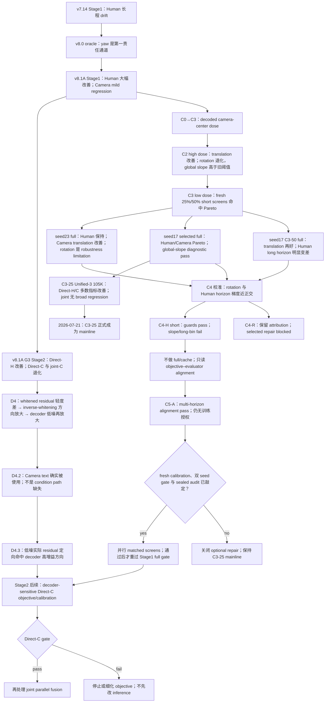

# StoryMotion Checkmate

> [!abstract] 一页裁决
> C3-25 seed17 已完成 Stage1 `636K` owning-decoder audit 与 Stage2 Unified-3 `105K` 三路 formal audit，形成 Human/Camera Pareto；Direct-H 与 Direct-C 多数指标击败 former mainline v7.38 L0，joint parallel 无 broad regression。global-slope 的旧阈值现为非阻塞 diagnostic，C3-25 判定通过并正式成为当前 Stage1/Stage2 mainline。原始 `26.302 mm/100f` 继续作为长程 limitation 报告。C3-50 证明更高 center dose 会伤害 Human horizon，C4-H/C5-B 未给出跨 seed 稳定 repair，因此这些轴关闭为 optional follow-up，不影响 mainline selection。seed23 Stage2 结果仍待 audit。

精确数值、四个长度 bin 与 hashes 只由 [[StoryMotion-valid-metric-ledger]] 维护；当前状态只看 [[current]]；本页只维护问题如何被验证、结论如何被收窄的因果脉络。

## 1. 先把 Stage1 与 Stage2 分开

- **Stage1** 是 joint human-camera tokenizer 的 representation/reconstruction：输入真实 Human+Camera，输出 latent，再由同一 checkpoint 的 decoder 重建。这里评价 Human yaw/root/MPJPE 与 Camera center/rotation。
- **Stage2** 是冻结 Stage1 后的 conditional diffusion generation：训练 Unified-3 在 latent space 生成 Direct-H、Direct-C 与 joint parallel，再逆各自 stats 并用 owning decoder 解码。
- Stage1 重建好不保证 Stage2 可生成。[[analysis/arxiv_2026/What_Matters_for_Diffusion_Friendly_Latent_Manifold_Prior_Aligned_Autoencoders_for_Latent_Diffusion]] 的相关启示是：reconstruction fidelity 与 diffusion-friendly continuity/semantic organization 是不同目标；StoryMotion 的 D4 给出了本任务自己的直接证据。

因此“v8.1A 的 Human 好、Camera 差”必须继续问：是 Stage1 reconstruction 本身差，还是 Stage2 没学会新 manifold，还是两者的误差方向相乘。当前答案是 **三者中前两层的 mixed signal，joint parallel 另叠加 fusion underfit**。

## 2. 名词、别名与实验层级

| 名称 | 所属阶段 | 实际含义 | 不能误解为 |
| --- | --- | --- | --- |
| v8.1A | Stage1 full；另有独立 Stage2 G3 child | human199 joint AE 加 decoded Human yaw/root geometry loss | 已晋级主线，或 Stage2 已完整优秀 |
| A10 | Stage1 short screen | v8.1A 配方的 `10,176`-step、center-weight=`0` matched comparator | 完整 v8.1A endpoint 的别名，或 Stage2 run |
| C0 | Stage1 calibration | 8 个真实 batch 的 camera-center gradient scale audit | 训练结果或质量排名 |
| C1 | Stage1 short screen | C0 所得高剂量 weight 的 `10,176`-step structural screen | full endpoint 或 promotion evidence |
| C2 | Stage1 full | C1 高剂量的 fresh `636K` endpoint | C3，或 Stage2 |
| C3-25 / C3-50 | Stage1 short/full dose arms | 分别使用 C1 weight 的 `25%/50%`；两者训练预算相同 | 只训练到 `25%/50%`，或只用对应比例数据 |
| G3 | Stage2 screen | v8.1A Unified-3 的 diagnostic-only `30K` 三模式评测 | Stage1 reconstruction，或 `105K` formal promotion |
| D4 | Stage2 read-only diagnostic | N64、one-step、Direct-C+GT-H 的 raw residual→inverse stats→owning decoder attribution | 新训练、full sampler 或 promotion |
| D4.2 | Stage2 read-only intervention | 在同 noise/`x_t` 下只打乱 Camera text，检查 condition reliance | C3 的子实验，或 Camera text 语义已经正确 |
| D4.3 | Stage2 read-only local sensitivity | 对 RMS-matched actual/random Camera residual 做 owning-decoder JVP/VJP | full Jacobian、full generation、Stage1 单独归因或 promotion |
| C4 calibration | Stage1 read-only gradient audit | 在 C3-25 parent 下测共享 encoder 每层范数/余弦并冻结两个独立小剂量 | 质量 screen、训练结果或允许同时开启两项 |
| C4-R / C4-H | Stage1 frozen attribution / completed fresh screen | 分别只加 decoded Camera rotation / last-valid Human yaw-root horizon；selected 结果只授权过 C4-H，且该 screen 已 fail | 同一个混合 treatment，C4-R 已获 selected 训练授权，或可从短筛 checkpoint续训 |
| C5-A | Stage1 read-only objective-alignment audit | 在 C3-25 trained endpoint 比较 old last-valid 与预注册 multi-horizon 的 evaluator correlation、shared-encoder gradient及 Camera conflict | 已训练的新模型、已冻结 fresh-init dose，或 short/full training authorization |

完整 run ID 与状态已逐行归入 [[current#1. 当前决策板]]。

## 3. fresh screen 到底随机了什么

**fresh** 的核心是“不继承旧状态”，不是“故意多随机几个条件”：

1. 新 run ID；不加载旧 model checkpoint。
2. optimizer 的 momentum/Adam moments、scheduler、AMP scaler 都从空状态开始；optimizer 本身不是随机初始化。
3. 把 Python、NumPy、PyTorch CPU/CUDA 与 DataLoader workers 的伪随机数发生器重置到声明 seed。RNG 即 random number generator state；它影响 model weight initialization、data shuffle、dropout、diffusion noise 与实际启用的 augmentation。
4. same-seed matched arms 固定相同 seed、数据、架构、batch、optimizer、steps 与 evaluator，使随机流尽量对齐；只改变预注册 treatment。CUDA kernel 和多 worker 调度不保证 bit-exact deterministic。

所以 fresh same-seed screen 回答的是：**排除 warm-start/旧 optimizer 污染后，这个 setting 在短预算是否给出方向一致的信号？** 它不独自证明跨 seed 稳定。seed23 A10/C3-25 matched screen 与 seed23 full 才提供第二 seed robustness evidence。

`25%/50%` 是 loss dose：C0 把 C1 weight 标定为 base+Human auxiliary gradient 的 `5%`；C3-25/C3-50 分别把该 weight 缩到 `25%/50%`，即约 `1.25%/2.5%` raw-center gradient dose。两条都完整训练 `8 epochs / 10,176 steps`。

## 4. Stage1 的问题如何被逐层关闭

### 4.1 从“长序列 AE 不行”收窄到 yaw

v7.14 的 root-aligned MPJPE 只去掉 root translation，不去掉 heading；此前把长程退化直接叫作 local-pose error 不准确。v8.0 oracle 只替换 yaw velocity 就把最长 bin 的 root/global error大幅拉回，而替换 local-joint channels 几乎不改变 owning SMPL decode。由此把首要假设从“换更深 AE/换 Stage2”收窄为“累计 yaw/root supervision 不足”。

### 4.2 v8.1A 证明 Human treatment 有效，但暴露 Camera trade-off

v8.1A 保持 human199、camera14、joint-AE、non-causal、数据和预算，仅增加 decoded yaw/root loss。它把 Human geometry 从 v7.14 的明显 drift 拉到一个强得多的区域，但 Camera reconstruction 有 mild regression，且 Human global slope仍高于旧阈值。结论不是“v8.1A 失败”，而是“Human treatment 成功；shared encoder 的 Camera Pareto 未闭合”。

### 4.3 为什么 C2 有效却不能用

camera14 的 translation 是速度积分路径；原 feature/velocity loss没有直接计价最终 camera center。C0/C1 表明 decoded center 是可干预责任通道；C2 high dose 也确实大幅降低 Cam-ADE/FDE。但它同时把 Camera rotation 与 Human global slope推坏，说明 shared trunk/latent 的多目标梯度预算失衡。继续放大 center loss只会优化已经改善的量，不会自动约束 rotation。

### 4.4 seed23 揭示双边界，seed17 selected 收窄为单边界

seed23 C3-25 full 在 `636K / 81.38M` 后仍保持 v8.1A 级 Human，并把 Camera translation 拉回；这排除了“C3 只在 10K 看起来好”的最简单解释。Human global slope `27.594 mm/100f` 按非阻塞政策记为 diagnostic pass；Camera rotation `0.776°` 保留为 robustness limitation。于是 center-only axis 已完成使命：

- 它证明 translation 可修；
- 它没有证明 rotation 可修；
- 它没有把 Human 长程 slope 压到旧阈值，但该项不再阻塞 mainline；
- 它不能继续用更多 center-weight sweep 代替缺失约束。

seed17 selected C3-25 随后完成同预算、同 seed owning-decoder audit：Human RA/global=`24.570/69.243 mm`，Camera ADE/FDE/rotation=`39.486/48.270 mm/0.705°`。它相对 seed17 v8.1A 同时保持或改善 Human、Camera translation 与 rotation；global slope 原始值 `26.302 mm/100f` 保留，但在修订政策下是非阻塞 diagnostic pass。结合后续 Stage2 `105K` formal evidence，该 endpoint 成为 mainline。seed23 的 rotation 边界没有在 selected seed17 重现，不能再把 C4-R 当作 selected-arm 必修项；C3-50 exploratory 只回答更高 center dose 的 trade-off attribution，不能覆盖 selected mainline。

C3-50 的 full-budget attribution 已给出答案：Camera ADE/FDE 比 selected 再改善 `7.8%/6.5%`，但 Human RA/global、root ADE/FDE、yaw 全部退化约 `4.0–5.9%`，最长 bin global 增加约 `26.2%`，global slope 增加约 `37.7%`；rotation=`0.718°` 仍过门。这排除“再加一点 center weight就能顺便修 slope”的解释，并把 C4-H 的作用定义得更清楚：它必须抵消独立的 Human long-horizon 缺口，而不是继续交换更多 Camera translation。

### 4.5 为什么 C4-H 没有进入 full

C4-H 固定 C3-25 的 seed、IDs、optimizer、预算与 evaluator，只增加经过 shared-encoder gradient 标定的 last-valid yaw/root horizon loss。结果不是训练崩坏：八项 Human/Camera `2%` guards 全部通过；但它要回答的两个 target 都反向变化，fixed-max global slope 与 `193+` global 相对 C3-25 分别改善 `−0.60%/−1.19%`。因此 gate fail 的含义很具体：**当前 last-valid endpoint surrogate 与 `1.25%` parent-gradient dose 没有在 matched short budget中产生正式 length-slope信号。**

这还不能区分“objective 选错”与“剂量/短预算不敏感”，所以不能直接得出“把 weight 调大”或“full 才会好”的结论。随后完成的 C5-A 只读诊断专门比较 old last-valid 与固定四锚点 multi-horizon 的 per-sample evaluator alignment、shared-encoder 梯度方向和 Camera conflict；它没有修改 checkpoint 或创建训练状态。

### 4.6 C5-A 关闭了什么，还没有关闭什么

C5-A 的 all/`193+` primary global-MPJPE alignment 都通过预注册 point-delta 与 paired-bootstrap CI 条件；multi-horizon 对 yaw、root ADE 也更强，对 overall root FDE 略弱。它的梯度更贴近 parent/Human geometry，与 Camera center/rotation 都近正交，且相对 current 的两个 Camera cosine guard 均通过。因此当前最强解释是：**C4-H 的 last-valid 单端点代理没有覆盖正式 evaluator 所计价的整段累计 drift；四个相对时域锚点更接近这个目标。**

这仍是 observation-at-trained-endpoint，不是 optimization causality。它没有说明 fresh initialization 上的梯度尺度，也没有证明 `10,176` steps 或 `636K` 后 formal slope 会下降；trained-endpoint 得出的候选 weight 不能直接搬到训练。更重要的是，pure4053 已被用于选择 surrogate，继续在同一集合上反复挑 treatment 会产生 adaptive evaluation leakage。所以下一步必须把“fresh-init/train-distribution dose calibration、至少两个 matched seed、冻结 short gate、独立 sealed audit set”作为一个整体先确认，而不是先开一张卡试起来。

## 5. Stage2 为什么会放大 v8.1A Camera 的不足

### 5.1 whitening 与逆变换谱是什么

Stage2 先对 latent 做 per-channel z-normalization，再对 Human/Camera branch 分别做 full-cov whitening：

$$
z_w=L^{-1}(z_{std}-\mu_{cov})
$$

逆变换是：

$$
z_{std}=Lz_w+\mu_{cov},\qquad z=\operatorname{diag}(\sigma)z_{std}+\mu
$$

对残差而言，Camera 的线性 inverse operator 为 $A=\operatorname{diag}(\sigma_c)L_c$。所谓 **whitening 逆变换谱**，是 $A$ 的 64 个 singular values：它回答一个单位 whitened residual 沿不同 latent 方向会被放大多少。它不是时间 Fourier spectrum。

v7.36 的 singular-value min/median/max 为 `0.073/0.205/3.329`，v8.1A 为 `0.078/0.209/3.219`；RMS gain 只从 `0.795` 到 `0.821`，condition 反而从 `45.626` 降到 `41.080`。所以 v8.1A 不是“全局 whitening 数值更病态”；真正的问题是 Stage2 residual 更集中落在它的高增益方向。

### 5.2 D4 的 raw→decoded 放大率

D4 比较的是 candidate/baseline **相对差距**在三层空间怎样变化，不是给 decoder 定义一个永久常数：

- `t=50`：whitened RMS `1.084×` → decoder-input RMS `1.214×` → Cam-ADE/FDE `1.550×/1.604×`；
- `t=500`：`1.022×` → `1.147×` → `1.207×/1.248×`；
- `t=950`：`1.037×` → `1.094×` → `1.054×/1.062×`，rotation 甚至反向改善。

因此 low-noise local correction 最容易撞上 decoder-sensitive directions；高噪 prior 不是唯一或首要崩坏点。把每段相对 gap再相除，inverse-whitening 贡献约 `1.119/1.122/1.055×`，decoder-input→Cam-ADE 约 `1.277/1.053/0.963×`。owning decoder 是非线性的，绝对 Cam-ADE/latent-RMS 还带单位，不能把这些数外推成通用 Jacobian 标量。

[[analysis/SIGGRAPH_ASIA_2023/GeoLatent_A_Geometric_Approach_to_Latent_Space_Design_for_Deformable_Shape_Generators]] 提供的相关机制视角是 decoder Jacobian/pullback metric；这里不直接照搬其 shape loss，但用局部敏感性 probe 衡量 StoryMotion decoder 是合理的下一步。

### 5.3 两个 owning decoder 分别是谁

- v7.36 使用 corrected v7.14 non-causal camera14 joint AE 的 `joint_ae_official_4090_gpu0_r2_last.pt`，SHA256=`91248bf440a4a5493a0f8b4994d6d36479fcaa221d331f6995a91ed1af8e7ce1`。
- v8.1A 使用它自己的 non-causal camera14 joint AE `v8_1a_joint_ae_yaw001_root003_seed17_4090g0_20260717_last.pt`，SHA256=`ac47c2191c44d6368a5468510975cefcf0efd1338b03ace50266830c344151f1`。

二者架构相同、learned weights/manifold 不同，都不是 Pulp released AE。**owning decoder** 的定义是：哪个 exact Stage1 checkpoint 生成 cache，就必须先逆该 cache自己的 train-only stats，再用该 checkpoint 的 decoder 解码；交叉 decoder 会把 representation error 与 decoder mismatch 混在一起。

### 5.4 为什么不是 condition path 或训练不足

- v8.1A Direct-C latent eval MSE 比 v7.36 低，但 formal Camera semantic/distribution/coverage 更差；平均 MSE 已下降却优化了错误代理。
- 两边 Camera exposure 都约 `5.12M`；简单延长 `30K→105K` 没有针对性。
- D4.2 在同 noise、同 `x_t` 下打乱 Camera text；aligned text 对 v8.1A 平均有益，condition effect也不一致弱于 baseline。故 condition 被使用，但响应方向与 manifold/decoder sensitivity 没被正确计价。
- joint parallel 的 Camera branch loss仍明显更高，所以 Direct-C 问题之外还有第二层 joint fusion/branch optimization 缺口。

这给出固定顺序：**先 Direct-C objective/representation handling，过门后再 joint fusion，最后才检查 inference**。

### 5.5 D4.3 如何把“decoder sensitive”从猜测变成方向性证据

D4 只能看到 candidate/baseline gap 在 inverse stats 与 owning decode 后继续变大；它不能排除“只是 residual 大一些”。D4.3 因而先把每个实际 Camera residual 归一到相同 RMS，再构造与它正交、同 RMS 的随机方向，在同一 decoder input 邻域做 JVP/VJP。结果仅在低噪 `t=50` 同时命中预注册的 candidate/baseline 与 actual/random center、rotation 条件；中高噪没有全局重复。

结论因此被严格限制为：**v8.1A 的 near-manifold Stage2 residual 方向，比等幅随机方向更容易撞上自身 owning decoder 的 Camera 高增益方向**。这支持后续 Direct-C decoder-sensitive objective，但不支持“整个 v8 manifold 全局病态”，也不能把责任只判给 Stage1 或只判给 Stage2。完整 JVP/VJP、replay envelope 与 stats serialization uncertainty 仍只由 [[StoryMotion-valid-metric-ledger#5.3 D4.3 owning-decoder direction sensitivity]] 维护。

## 6. 5090/4090 I/O 问题与处理

### 6.1 机械盘为什么会拖慢“计算密集”训练

GPU kernel 已经在执行时，HDD 不会降低 CUDA core 本身的算力；真正的拖累发生在 batch 边界。Stage1 每个 sample 随机读取多个小 `.npy/.txt`，两个 DataLoader 并发访问同一机械盘会产生 seek thrash、page-fault/I/O wait，下一 batch不能及时送入 GPU，于是 GPU 空转。若 checkpoint/log 也共享同盘，写入还会进一步争用。纯 compute job 或数据已在 page cache 的 job 受影响小得多。

首次 C3 双臂在 4090 HDD 上只有约 `0.412 step/s` 并停在 step `214`；这不是 loss 或 GPU 算力失败。完整 fast-tier manifest preflight 达到约 `1,874 samples/s`，而直接 HDD preflight 只有约 `64 samples/s`。

### 6.2 实际做了什么

没有跨服务器搬运 Pulp，也没有为此构建 Stage2 latent cache。两台机器本来各有完整 immutable Pulp source；处理方式是在**各自主机**的系统盘建立 Stage1 三类小文件的只读 read replica，并改写 run manifest：

- 4090：`/home/ripemangobox/storymotion_data_cache/pulpmotion_stage1_io_20260718`，系统盘是 NVMe；
- 5090：`/home/ripemangobox/storymotion_data_cache/pulpmotion_stage1_io_20260719`，系统盘是 Intel SATA SSD，不是 NVMe。

两边 `smpl_rifke`、`traj`、`intrinsics` 各有 `180,527` files；一个 manifest 的三类路径必须全部命中同一 fast tier，禁止 hybrid/HDD fallback。旧 run 或 manifest 名里的 `nvme` 只保留为不可变名字，不代表 5090 的真实硬件。后续规则已写入 StoryMotion `AGENTS.md`。

## 7. 结论是怎样一步步变窄的

1. **现象：** v7.14 Human 越长越差。**验证：** GT-channel oracle。**细化：** 主要是 cumulative yaw，而非笼统“local pose/64 crop/AE 深度”。
2. **处理：** v8.1A 加 yaw/root geometry。**结果：** Human 大幅改善、Camera mild regression。**细化：** shared representation Pareto，而非 Human treatment 无效。
3. **假设：** camera14 translation integration 缺直接监督。**验证：** C0 calibration→C1 short→C2 full。**结果：** center error可修，但 high dose伤 rotation/global slope。
4. **修正：** C3 低剂量 fresh screens。**结果：** 25%/50% 都在短预算保持 Human并改善 Camera；按规则选更小 25%。
5. **稳健性与复核：** seed23 matched screen→full 暴露 rotation/global-slope 双边界；seed17 selected full 则保持 translation Pareto、通过 rotation，只剩 global slope。**细化：** 停止 center-only sweep；selected repair 收敛为 Human horizon，rotation 只保留 attribution axis。
6. **Stage2 现象：** Direct-H 好、Direct-C/joint-C 差。**验证：** same-step G3、D4 raw residual、D4.2 text shuffle、D4.3 RMS-matched JVP/VJP。**细化：** 不是简单没用 Camera text，也不是只差训练步数；是低噪 sensitive-direction calibration，joint另有 fusion underfit。
7. **Stage1 未闭合项：** rotation 与 Human slope 是否同一梯度问题。**验证：** C4 shared-encoder per-layer norm/cosine。**细化：** 二者近正交，冻结互斥 C4-R/C4-H，而不是一个混合 loss。
8. **C4-H 干预：** last-valid horizon 是否能直接改善正式 slope。**验证：** same-seed `10,176`-step matched screen。**结果：** guards 全过但两个 target 都反向；不进 full。**细化：** 梯度尺度可分不等于 objective 对 evaluator 有效，先查 objective–metric alignment。
9. **C5-A 对齐：** multi-horizon 是否比 old last-valid 更贴近正式错误。**验证：** pure4053 per-sample Spearman/bootstrap + long-subset shared-encoder gradient guards。**结果：** primary 与 Camera guards 全过，overall root-FDE correlation略弱。**细化：** 支持 temporal-coverage mismatch 与 future-screen preregistration，不等于训练收益；引入 sealed audit 防止开发集自适应。
10. **部署旁路：** GPU 空转。**验证：** device topology、loader throughput、fast-tier retry。**细化：** HDD random-small-file contention，不是跨机数据缺失或模型失败。

## 8. 当前最小优化方案与确认点

三条 C3 full、D4.3、C4 gradient calibration、C4-H short screen 与 C5-A read-only audit 都已闭合。C3-50 证明 higher center dose 会加剧 Human horizon trade-off；C4-H 证明 old last-valid surrogate没有通过 short gate；C5-A 则把更有希望的替代项收窄为 fixed four-anchor multi-horizon。当前先暂停执行并确认整组方案：

1. **停止无证据的训练扩张：** 不续训 C4-H，不启动它的 5090 full，不放大 horizon weight；C4-R 继续 blocked，因为 selected rotation=`0.705°` 已过门。
2. **C5-A 已完成但不直接转训练：** 它只支持 four-anchor multi-horizon 的 future-screen preregistration。必须在 fresh initialization 与 train distribution 上重新标定 dose；trained endpoint 的 `0.008456624...` 不能视为冻结训练参数。
3. **成组短筛必要条件：** 至少两个 matched training seeds、同一 predeclared slope/`193+`/Pareto diagnostic，并在运行前冻结一个独立 sealed audit set。pure4053 只作 development screen；任何 screen checkpoint 都不续训。这约束后续 repair claim，不追溯否决 C3-25 mainline。
4. **三卡作为一个批次：** 4090 双卡用于两 seed fresh matched screens；5090 GPU0 先完成 read-only calibration/contract与 sealed-audit preflight，短筛双过后才获得一次 fresh full 资格。具体分工和 stop/go 条件须用户确认后执行，不能单独启动或监看某一 arm。
5. **Stage2 S-C objective：** 只有新的 Stage1 candidate 过 gate 后，做一个 Direct-C-only、decoder-sensitivity-aware residual/objective 单变量 short control；Direct-C 通过后才允许 joint parallel camera balance/fusion。

精确 C4 剂量、短筛阈值和 artifact hashes 只见 [[version_family#v8.1 命名解码与执行状态]] 与 [[StoryMotion-valid-metric-ledger]]。

## 9. 数据清洗与 SFT 为什么是可行但独立的轴

PulpMotion 同时存在两种数据风险：motion 物理问题与 caption-motion 语义错配。把 full dataset 作为 coverage pretraining parent、再在版本化 clean subset 上做小学习率 adaptation/SFT 是可行的，但 Stage1 与 Stage2 不能混叫 SFT：

- **Stage1 AE 不读取 caption。** 它只能在 physical-clean motions 上做 continuation，目标是降低不合理穿插、突跳、相机物理异常对 representation 的污染。必须配 matched raw-continuation control；一旦 Stage1 权重变化，就产生新的 owning decoder、cache 与完整 Stage1 gate，不能沿用旧 cache。
- **Stage2 才是 caption-pair SFT 的自然位置。** 固定已过 gate 的 Stage1/cache/full-data Stage2 parent，用 quarantined 后的 clean caption-motion pairs 做 matched clean-pair SFT；主要期望改善 text alignment、Direct-C condition response 与物理先验。它不能修复 Stage1 decoder 的高敏感方向，也不能替代 C4。
- **清洗必须 pair-level、可逆、可归因。** caption 错时隔离该 caption-motion pair，不删除整条 motion；保留 immutable parent manifest、reason code 与 physical-only/semantic-only attribution。clean-only 是第一控制，只有观察到遗忘再单列 raw replay，不能把 replay 与清洗收益混成一个结论。

因此当前顺序不变：先关闭 representation gate，再以固定 parent 分开比较 raw continuation 与 clean SFT。完整 manifest lineage、零/非零计数和启动 gate 只由 [[2026-07-17_storymotion-v8-2333-data-curation-plan]] 维护。
