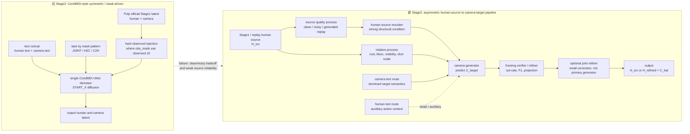

# StoryMotion Stage2 新旧架构与 2026-07-03 会话总结

> [!abstract] 结论
> 这轮会话完成了 Stage2 新架构实验的 full official eval、v7.2 joint fair eval 复核、Gradio compare 能力补齐、v7.2 可视化 loader 修复、diffusion/RF process 模块化与 clean CondMDI Stage2 + RF 训练启动。核心结论是：**非对称 H2C contract 有价值，但 MoLingo FullRF 或 RF 本身不是自动解法；下一步必须从 Gaussian noisy source 转向真实 generated replay source。**

## 0. 会话范围

本页整理的会话是：

```text
session_id: 019f269b-92fc-73e3-ad10-a230c3dabe86
file: /home/ripemangobox/.codex/sessions/2026/07/03/rollout-2026-07-03T14-12-37-019f269b-92fc-73e3-ad10-a230c3dabe86.jsonl
topic: StoryMotion Stage2 新架构 eval、MoLingo FullRF、RF 模块化、joint eval、vis 与 Gradio
```

用户原始目标包括：

- 找到前一天 StoryMotion 新架构 Stage2 设计会话。
- 对 MoLingo-style Stage2 backbone 与 Rectified Flow 相关实验进行 full official eval。
- 4090 / 5090 双向同步代码与 checkpoint。
- 若 5090 显存不满足公平 `bs64` eval，则通知并切换策略。
- 更新 metric 文档，明确每组实验目的、setting、实现差异和核心结论。
- 继续判断非对称架构是否有价值，并区分 MoLingo、CondMDI、RF 与任务 contract 的关系。
- 补齐 v7.2 joint eval、可视化、Gradio compare，以及 diffusion/RF 模块化。

## 1. 一句话裁决

| question | answer |
| --- | --- |
| 非对称 H2C 是否有价值 | 有。H2C minimal matched clean 与 matched noisy 都能达到强结果，说明 fixed human source to camera target 的任务定义可学习。 |
| MoLingo FullRF 是否解决 source reliability | 没有。clean-only 与 noisy-only 仍强烈分裂。 |
| 当前最好 checkpoint | `stage2_molingo_fullrf_h2c_v64_p2b_20260703`。它是 clean/noisy Gaussian source 下最好的 Pareto 折中。 |
| 是否可宣称 robust generated-source control | 不能。当前关键证据仍是 clean 与 Gaussian noisy `0.15`，缺 generated replay source。 |
| diffusion/RF 是否可模块化 | 可以。会话中已抽出 `CondMDIDiffusionProcess` 与 `RectifiedFlowProcess`，并接入 train / bridge / official eval。 |
| MoLingo 是否能像 CondMDI 一样直接替换 | 不能简单 drop-in。process 层可替换，但 H2C/JOINT/C2H 的 source contract、metadata、mask、relation、replay schedule 需要各自落实。 |

## 2. 新旧架构对比图



这个图要表达的关键点是：新方向不是把旧 denoiser 换成另一个同构 denoiser，而是把 **human source 作为强条件、camera 作为主生成目标**。`JOINT` 不是第一优先级的同权联合生成，而是可以由 human prior / H2C camera generator / optional joint refiner 组合出来。

### 2.1 三种模式的数据流

下面的数据流图把模型简化为输入输出，不表达完整模块实现。

```mermaid
flowchart TB
  subgraph JOINT["JOINT: text to human-camera pair"]
    J1["human text"] --> J3["human prior / generator"]
    J2["camera text"] --> J4["H2C camera generator"]
    J3 --> J5["H_hat as source"]
    J5 --> J4
    J4 --> J6["C_hat"]
    J5 --> J7["optional joint refiner"]
    J6 --> J7
    J7 --> J8["output: H_hat, C_hat"]
  end

  subgraph H2C["CAMERA COMPLETION / H2C: source human to camera"]
    C1["observed or replay human<br/>H_src"] --> C3["source quality + relation"]
    C2["camera text<br/>dominant"] --> C4["camera generator"]
    C5["human text<br/>auxiliary"] -.-> C4
    C3 --> C4
    C4 --> C6["output: H_src passthrough, C_hat"]
  end

  subgraph C2H["HUMAN COMPLETION / C2H: source camera to human"]
    H1["observed camera<br/>C_src"] --> H3["camera constraint / view context"]
    H2["human text<br/>dominant"] --> H4["human generator"]
    H5["camera text<br/>auxiliary"] -.-> H4
    H3 --> H4
    H4 --> H6["output: H_hat, C_src passthrough"]
  end
```



模式解释：

| mode | primary source | dominant text | generated target | asymmetry |
| --- | --- | --- | --- | --- |
| `JOINT` | none or sampled human prior | human text for human, camera text for camera | `H_hat, C_hat` | joint is composed through human prior then H2C camera generation, not a fully symmetric one-shot pair denoiser |
| `H2C` / camera completion | `H_src` | camera text | `C_hat` | main path: human source is strong structure, camera is target |
| `C2H` / human completion | `C_src` | human text | `H_hat` | auxiliary / diagnostic mirror; should not force exact parameter sharing with H2C |

## 3. 架构差异表

| 维度 | 旧架构 | 新方向 | 这轮证据 |
| --- | --- | --- | --- |
| 任务定义 | JOINT / H2C / C2H 主要靠 mask pattern 区分 | source-condition-target contract，H2C 明确固定 human source 并预测 camera | H2C minimal clean 与 noisy matched condition 都强，说明 contract 可学习 |
| observed source | hard injection，容易把 observed 当 clean truth | source encoder / metadata / trust / replay schedule | v7.2 E2-E6 与 CP 说明局部 gate 不足，需要更完整 source schedule |
| 文本角色 | human text 与 camera text concat 后容易被 shortcut 淹没 | H2C 中 camera text 为 dominant text，human text 为 auxiliary context | v7.2 text intervention 仍弱，说明仅加 router 不够 |
| human-camera 关系 | joint denoiser 内隐学习，容易同权竞争 | relation feature 显式进入 camera branch | E4/E6 比 E2/E3 更好，但仍弱于 clean anchor |
| denoiser backbone | CondMDI-style UNet | CondMDI 与 MoLingo-style 可作为不同 backbone | MoLingo FullRF 能跑通，但不是单独解法 |
| 生成过程 | diffusion / DDIM / START_X | diffusion 与 Rectified Flow 作为 process 层可替换 | 会话中已新增 process factory，并启动 clean CondMDI + RF 训练 |
| 鲁棒性证据 | 多为 clean 或 Gaussian noisy source | 必须加入 generated replay source | 当前最大缺口仍是 generated replay full eval |
| 可视化 | 旧 builder 假设已有 projection rows | 修复 loader 与 projection row 生成，支持 v7.2 可视化 | E2/E3/E4 已 `ok=6 failed=0`，E6 在会话末尾进行中 |

## 4. Full official eval 结果

### 4.1 Minimal H2C

口径：4090 full mixed test `10549` samples；official camera callback；`batch_size=64`；`seed=17`。

| model | train source | eval source | samples | FDCLaTr↓ | F1↑ | readout |
| --- | --- | --- | ---: | ---: | ---: | --- |
| H2C minimal clean | clean | clean | 10549 | 15.20 | 0.665 | clean anchor strong |
| H2C minimal clean | clean | noisy `0.15` | 10549 | 824.33 | 0.048 | noisy source collapse |
| H2C minimal noisy015 | noisy `0.15` | clean | 10549 | 1022.65 | 0.055 | clean source collapse |
| H2C minimal noisy015 | noisy `0.15` | noisy `0.15` | 10549 | 26.71 | 0.587 | matched noisy strong |

读数：H2C 非对称 contract 能学 matched condition，但 clean/noisy 分布迁移仍失败。它证明任务重定义有价值，不证明 robustness 已解决。

### 4.2 MoLingo FullRF H2C

口径：5090 checkpoint scp 到 4090 后，在 4090 full mixed `10549` / `bs64` / `seed17` 评估。

| model | train source | eval source | samples | FDCLaTr↓ | F1↑ | readout |
| --- | --- | --- | ---: | ---: | ---: | --- |
| MoLingo FullRF clean | clean | clean | 10549 | 18.59 | 0.651 | clean strong |
| MoLingo FullRF clean | clean | noisy `0.15` | 10549 | 625.57 | 0.124 | noisy collapse remains |
| MoLingo FullRF noisy015 | noisy `0.15` | clean | 10549 | 611.09 | 0.101 | clean collapse remains |
| MoLingo FullRF noisy015 | noisy `0.15` | noisy `0.15` | 10549 | 31.05 | 0.490 | matched noisy works |
| MoLingo FullRF p2b | mixed p2b | clean | 10549 | 22.67 | 0.590 | best clean/noisy compromise |
| MoLingo FullRF p2b | mixed p2b | noisy `0.15` | 10549 | 40.41 | 0.452 | robust but below matched anchors |

读数：MoLingo FullRF 相比 minimal H2C 没有消除 clean/noisy split；`p2b` 给出当前最好折中，但仍不能宣称 generated-source control。

### 4.3 v7.2 joint fair bs64 复核

会话中 4090 上 E2/E3 的 `bs64` joint eval 在约 `4928` records 处 OOM；随后停止并清理 4090 `bs32` partial。有效证据改用 5090 已完成的 fair `bs64` full joint JSON。

| experiment | samples | FDTMR↓ | FDCLaTr↓ | CLaTr↑ | F1↑ | readout |
| --- | ---: | ---: | ---: | ---: | ---: | --- |
| E2 SoftSource + TrustGate | 10549 | 208.81 | 147.53 | 18.74 | 0.228 | fair bs64 complete on 5090 |
| E3 Reliability FT | 10549 | 216.77 | 156.19 | 19.73 | 0.224 | fair bs64 complete on 5090 |
| E4 RelationSurrogate | 10549 | 199.29 | 106.45 | 23.22 | 0.272 | best v7.2 tradeoff among E2-E4 |
| E6 camera-safe FT | 10549 | 188.83 | 104.75 | 24.28 | 0.283 | joint slightly better than E4, camera clean still weak |

读数：E4/E6 在 joint 读数上优于 E2/E3，但仍不能替代 H2C/MoLingo p2b 的非对称证据。v7.2 局部补丁有作用，但没有解决 source reliability。

## 5. 实验结果证明了什么

当前结果不能写成“问题已经解决”，但可以写成“问题被部分解决，并且优化方向更明确”。

### 5.1 已经部分解决的部分

| claim | evidence | strength |
| --- | --- | --- |
| H2C 非对称任务定义是可学习的 | H2C minimal clean 在 clean source 达到 FDCLaTr `15.20` / F1 `0.665`；H2C minimal noisy015 在 noisy `0.15` source 达到 FDCLaTr `26.71` / F1 `0.587` | strong for matched source distribution |
| MoLingo FullRF + p2b 能缓解 clean/noisy 二选一 | p2b clean FDCLaTr `22.67` / F1 `0.590`，noisy `0.15` FDCLaTr `40.41` / F1 `0.452`；明显优于 clean-only 在 noisy 下的 collapse | moderate, because still Gaussian noisy only |
| v7.2 relation / camera-safe 方向比单纯 trust gate 更有效 | E4/E6 joint FDCLaTr `106.45` / `104.75`，优于 E2/E3 的 `147.53` / `156.19` | moderate, but still weak vs clean camera anchor |
| process 层可模块化 | diffusion/RF process factory 已接入训练、bridge、official eval；RF check 通过并启动 clean CondMDI + RF 训练 | engineering proof, not method proof |

这说明：旧问题中“camera branch 是否能在固定 human source 下学到有效 completion”这一部分已经被证明可行。也就是说，StoryMotion 不应该继续把主要矛盾表述为“模型没有能力生成 camera”，而应改成“模型还没有学会跨 source-quality 分布稳定读取 human source 并生成 camera”。

### 5.2 仍未解决的核心问题

| unresolved issue | evidence | implication |
| --- | --- | --- |
| clean/noisy source 分布迁移失败 | clean-trained H2C 在 noisy `0.15` 下 FDCLaTr `824.33`；noisy-trained H2C 在 clean 下 FDCLaTr `1022.65` | 单分布训练会形成强 specialization，不能直接作为 robust Stage2 |
| 换 backbone / RF 不自动解决 reliability | MoLingo FullRF clean 在 noisy 下 FDCLaTr `625.57`，noisy015 在 clean 下 FDCLaTr `611.09` | bottleneck 不只是 denoiser 形态或 sampling process |
| generated replay 尚未验证 | 当前关键正结果来自 clean 与 Gaussian noisy `0.15` | 不能外推到真实 Stage1 generated source |
| v7.2 局部补丁不足 | E4/E6 有改善，但 joint/camera 仍明显弱于 clean anchor | source schedule / replay / relation supervision 比单个 gate 更关键 |

因此更准确的结论是：

> 当前实验**部分解决了任务定义与 matched camera completion 的可行性问题**，并给出了明确优化方向；但还没有解决 robust source-conditioned camera control，尤其没有证明真实 generated-source 场景。

### 5.3 明确的优化方向

下一轮不应继续只堆局部 gate 或只换 RF，而应按下面顺序推进：

1. **generated replay source**：把真实 Stage1 生成误差作为训练 / eval 输入，而不是只用 Gaussian noisy source。
2. **统一 source schedule**：clean、noisy `0.15`、generated replay 必须同训同评，避免 clean-only / noisy-only specialization。
3. **p2b 作为起点**：以 `stage2_molingo_fullrf_h2c_v64_p2b_20260703` 作为当前 best Pareto anchor，检查 replay 是否仍保住两端。
4. **relation / projection supervision**：E4/E6 的相对收益说明 relation feature 有用；下一步应把 projection-derived visibility、bbox、shot scale、out-rate 更稳定地进入训练闭环。
5. **process 与 contract 解耦**：RF 只作为 process ablation；主变量应是 source contract、replay data、relation supervision 和 camera target path。

## 6. RF 模块化状态

会话中完成的 process 层实现：

- `linkedCodebases/StoryMotion/storymotion/stage2/processes.py`
  - `CondMDIDiffusionProcess`
  - `RectifiedFlowProcess`
  - `build_stage2_process`
- `linkedCodebases/StoryMotion/scripts/train_stage2_condmdi_pulp.py`
  - 新增 `--generative-process diffusion|rectified_flow`
  - 默认保持 `diffusion`
- `linkedCodebases/StoryMotion/scripts/storymotion_official_bridge_smoke.py`
  - 从 `meta.args.generative_process` 或 `meta.stage2_process` 恢复 process
- `linkedCodebases/StoryMotion/scripts/storymotion_official_full_eval.py`
  - diffusion 仍走旧 DDIM START_X sampler
  - RF 使用独立 Euler velocity sampler
  - output JSON 写入 `stage2_process`

验证状态：

| check | status | note |
| --- | --- | --- |
| 本地 `py_compile` | pass | 本机缺训练依赖，未做完整入口运行 |
| fake model semantic smoke | pass | diffusion loss、RF loss、RF sampler 都能跑 |
| 5090 `py_compile` | pass | 已同步到远端 |
| 5090 real cache RF check | pass | finite loss，output shape `[4, 192, 75]` |
| DeepSeek MCP review | unavailable | `deepseek-reasoner` / `deepseek-chat` 连续三次空响应，不能写作已审查通过 |

clean CondMDI Stage2 + RF 训练在会话末尾状态：

```text
remote: 5090
run_dir: runs/train/stage2/condmdi_stage2_rf_clean_20260703
log: logs/train_rf_20260703/condmdi_stage2_rf_clean_20260703.log
gpu: GPU0
cache: runs/train/stage2/pulp_official_full_mixed_20260611/cache_mixed_full_nw0_20260611_2110
steps: 82688
batch_size: 512
generative_process: rectified_flow
prediction_type: VELOCITY
```

会话最后记录：训练约到 `38600 / 82688`；RF eval coordinator 已挂起，等待训练结束后自动跑 camera / human / joint full eval。

## 7. 可视化与 Gradio 状态

会话中完成：

- Gradio 新增 Compare Runs tab，用 sample_id 对齐多 run。
- 5090 上 Gradio 脚本与 registry 同步完成。
- validate 能加载已有 4 个 registered run；`ffprobe not found` 只是视频探针缺依赖，不是 manifest 解析错误。
- 修复 v7.2 可视化 loader：旧 `render_bilateral_results.load_model` 不支持 v7.2 `task_embed/source_meta/gate`，已改成按 checkpoint meta 初始化。
- 修复普通 4x3 builder：补齐缺失 projection row 生成逻辑，避免只拼接但不生成基础 camera projection rows。
- E2 smoke 通过：`ok=1/1`，输出 `1920x1610`，首帧非空。
- E2/E3/E4 可视化完成：均 `ok=6 failed=0`。

会话末尾剩余：

| group | metric eval | vis | status at session end |
| --- | --- | --- | --- |
| v7.2 E2 | complete, 5090 bs64 full | complete | `ok=6 failed=0` |
| v7.2 E3 | complete, 5090 bs64 full | complete | `ok=6 failed=0` |
| v7.2 E4 | complete, 5090 bs64 full | complete | `ok=6 failed=0` |
| v7.2 E6 | complete, 5090 bs64 full | running | GPU1, estimated 10-15 min |
| H2C minimal | complete, 4090 full | missing | requires H2C-specific vis adapter |
| MoLingo FullRF H2C | complete, 4090 full | missing | requires H2C/FullRF-specific vis adapter |
| clean CondMDI Stage2 + RF | training, final eval pending | missing | eval coordinator waiting for training completion |

## 8. 当前应避免的错误表述

- 不要写“MoLingo FullRF 已解决 source reliability”。实际结果是 clean/noisy split 仍在。
- 不要把 `p2b` 写成最终主方法。它只是当前 clean/noisy Gaussian source 下最好的 Pareto checkpoint。
- 不要把 Gaussian noisy `0.15` 当作真实 Stage1 generated replay。下一步必须补 replay cache 与 replay eval。
- 不要把 RF process 模块化等同于非对称架构完成。RF 是 generative process，H2C/replay/relation/source metadata 是 task contract。
- 不要把 DeepSeek MCP 这轮写成已审查通过。会话事实是连续空响应。
- 不要混入 4090 OOM partial / bs32 eval。有效 v7.2 joint 证据来自 5090 fair bs64 JSON。

## 9. 下一步最短证据链

1. 固定 generated replay source cache。
2. 用同一 full mixed split 对 H2C minimal、MoLingo FullRF p2b、clean CondMDI + RF 做 replay source eval。
3. 把 clean / noisy `0.15` / generated replay 三类 source 放到同一 source schedule，避免单分布 matched 模型。
4. 补 H2C minimal 与 MoLingo FullRF H2C 可视化 adapter，至少覆盖 clean、noisy、p2b、replay 四类 case。
5. RF clean CondMDI 训练完成后，只先判断 RF process 是否保持 clean anchor，不直接宣称架构改进。
6. 若 `p2b` 在 generated replay 上仍保持可用，再考虑把 FullRF+p2b 提升为下一轮主线候选。

## 10. Evidence paths

```text
H2C minimal full official eval:
  /data/public/ripemangobox/Motion/StoryMotion/runs/eval/stage2/stage2_h2c_minimal_20260703/full

MoLingo FullRF H2C full official eval:
  /data/public/ripemangobox/Motion/StoryMotion/runs/eval/stage2/stage2_molingo_fullrf_h2c_20260703/full

MoLingo FullRF p2b checkpoint:
  /data/public/ripemangobox/Motion/StoryMotion/runs/train/stage2/stage2_molingo_fullrf_h2c_v64_p2b_20260703

v7.2 isolated eval root:
  /data/public/ripemangobox/Motion/StoryMotion_v72_20260702/runs/eval/stage2/v7_2

clean CondMDI Stage2 + RF:
  /data/public/ripemangobox/Motion/StoryMotion/runs/train/stage2/condmdi_stage2_rf_clean_20260703

Codex source session:
  /home/ripemangobox/.codex/sessions/2026/07/03/rollout-2026-07-03T14-12-37-019f269b-92fc-73e3-ad10-a230c3dabe86.jsonl
```
