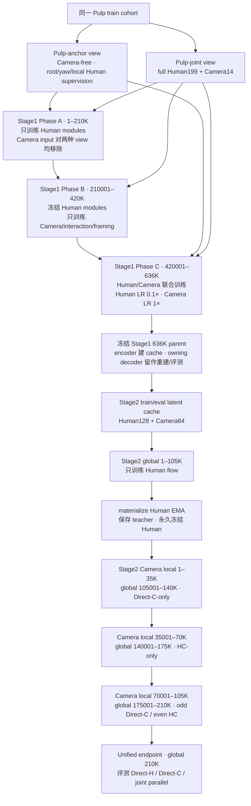
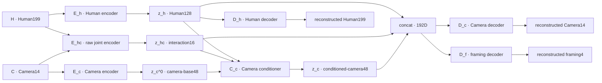
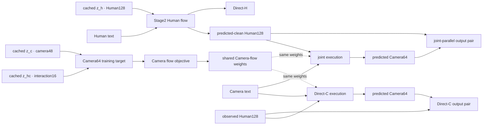

# StoryMotion v9 protected-H 三阶段实现与 Camera 失稳诊断

> [!abstract] 审计结论
> 当前主 run 已完整完成 Stage1 `636K`、Stage2 Human `105K` 与 Stage2 Camera `105K`，并闭合 Direct-H、Direct-C、joint parallel 的同一 first-512 cohort 正式评测。Direct-H 在 Camera 训练前后逐元素完全一致，说明 protected-H 路由有效。Camera 的失败不是主 run 训练未完成、batch size 偏小、BF16 异常或 decoder 加载错误；最强证据指向 Camera 三段 curriculum 的跨 route 遗忘、late instability 与共享 optimizer state 放大。paired-gradient probe 没有支持“持续负梯度冲突”作为已确认根因。P4 native oracle进一步直接测得 Camera48 是两路 decoded center／rotation的主误差源；joint 又叠加 generated-H context误差。该 run 是 non-causal redesign representation diagnostic，`promotion_eligible=false`，不替换 C3-25 mainline。

## 1. 范围与术语

本文同时存在三种不同层级的“阶段”，必须分开理解：

| 层级 | 实际数量 | 含义 |
| --- | ---: | --- |
| 端到端 pipeline | `3` | Stage1 representation → Stage2 Human teacher → Stage2 Camera/joint adaptation |
| Stage1 内部 phase | `3` | A：Human-only → B：Camera-only with frozen Human → C：Human/Camera joint fine-tune |
| Stage2 Camera 内部 subphase | `3` | Direct-C-only → HC-only → Direct-C/HC alternating |

> [!important] 当前 Stage2 的实际 Stage1 parent
> 是的，本页 Stage2 run 使用的是 **Pulp-only Stage1**：`stage1_hanchor_pulp_only_matched_r3_636k_seed17_4090g0_20260726` 的 `636K` checkpoint 与 owning decoder，而不是 mixed HumanML3D+Pulp arm。`Pulp-only` 表示训练样本全部来自 PulpMotion；它仍是 StoryMotion redesigned `human_anchor_interaction_residual_199_14_128_16_48_v1`，不是 PulpMotion 官方 autoencoder。精确 checkpoint／contract／cache 身份只见 [[Storymotion-exp-sha#1.1 Stage1 owner, Stage2 training, and cache]]。

Direct-H、Direct-C 与 joint parallel 是**评测／推理 mode**，不是上述三个训练阶段。完整正式数值只由 [[StoryMotion-valid-metric-ledger]] 持有；artifact、checkpoint、contract 与 record identity 只由 [[Storymotion-exp-sha]] 持有；字段语义见 [[StoryMotion-metric-computation-io]]。

### 1.1 端到端训练与冻结时间线



Stage1 的 `636K` 与 Stage2 的 global `210K` 是两套独立 optimizer-step 计数。Stage2 不继续更新 Stage1；它只消费由该冻结 Stage1 生成的 cache，并在正式评测时调用同一个 owning decoder。

### 1.2 Stage1 精确数据流

当前实现不是先独立得到两个最终 latent，再计算 `z_hc = F_hc(z_h,z_c)`。代码中的精确关系是：

`z_h = E_h(H)`

`z_hc = E_hc([H,C])`

`z_c^0 = E_c(C)`

`z_c = C_c([z_h,z_hc,z_c^0])`



因此，`Z_H = F_H(H)` 是正确的；若把 `F_C(C)` 记为 `z_c^0`，第二个式子也只对“Camera base”成立。`Z_HC = F_HC(Z_H,Z_C)` 不符合当前代码：interaction16 直接读取原始归一化输入 `[H,C]`，而最终 camera48 还要经过一次三路 conditioner。Stage2 的切片是 `Human128 = z_h` 与 `Camera64 = [z_hc,z_c]`。

### 1.3 Stage2 路由与 Stage1 的边界



Camera 从不回写 Human。这个严格三角拓扑是 Direct-H 能在 Camera 训练后保持 exact regression 的结构原因。

### 1.4 与 PulpMotion 官方 Stage1 的差异

“v9 H-anchor Pulp-only”中的 **Pulp-only 只描述数据来源和 matched arm**；它仍使用本页的 redesigned `human_anchor_interaction_residual_199_14_128_16_48_v1`，不是 PulpMotion 官方 autoencoder。两者不能简称成同一个 “Pulp Stage1”。

| 对照项 | v9 redesigned Stage1 | PulpMotion 官方 `mmardm_xy/xyz` Stage1 |
| --- | --- | --- |
| encoder 输入 | `E_h(H)`、`E_hc([H,C])`、`E_c(C)`，再对 Camera 做三路 conditioner | `AAMMARDM` 先把原始 `[C,H]` concat 后送入同一个 joint encoder |
| latent 布局 | `Human128 + interaction16 + camera48` | `camera64 + human128`；`xyz` 另加 `projection64` |
| Human 的硬隔离 | 有；`z_h` 在结构上不读取 Camera | 无同等硬保证；Human slice 来自读取 `[C,H]` 的 joint encoder |
| decoder ownership | Human decoder只读 `z_h`；Camera/framing decoder读完整 `192D` | Camera 与 Human decoder各读 joint-encoder输出中的对应 slice |
| 显式 interaction/framing | 独立 `interaction16`，framing是 decoder head | 无独立 `interaction16`；`xyz` 用独立 projection latent |

所以，本页 Stage1 与 PulpMotion 官方 Stage1 **有实质架构差异**，而且两者都不是 `z_hc = F_hc(z_h,z_c)` 这类“latent 后融合”结构。PulpMotion 仓库也保留了 `SplitAutoencoder` 类，但当前 official `mmardm_xy/xyz` 配置选择的是 `AlignedAutoencoder + AAMMARDM`，不能仅凭未启用类的存在推断实际图。对照依据为 commit `b81c7d95f451ed8728791c7b60f7b1f19503bf1a`；历史源码审计见 [[ideas/StoryMotion/archived/2026-06-10_pulp-stage1-continuous-stage2-generator-formal#2. Stage1 源码事实]]。

## 2. Stage1：Human-anchor interaction-residual AE

### 2.1 输入、latent 与 decoder ownership

代码 owner 是 `linkedCodebases/StoryMotion/experiments/stage1_human_anchor_residual/model.py`。模型 `HumanAnchorInteractionResidualAE` 显式断言 `is_causal is False`，输入是官方归一化的 Human199 与 Camera14，时间下采样率为 `4`：

- `z_h = E_h(H) ∈ R^128`，Human encoder 不接收 Camera，因此 Camera 扰动不能改变 `z_h`；
- `z_hc = E_hc([H,C]) ∈ R^16`，表示 Human–Camera interaction residual；
- `z_c^0 = E_c(C) ∈ R^48`，再由 `C_c([z_h,z_hc,z_c^0])` 得到最终 `z_c ∈ R^48`；
- Human decoder 只读取 `z_h`；Camera14 decoder 与 framing decoder 都读取 `[z_h,z_hc,z_c]`。

Stage2 使用 `z_h` 作为 Human128，并把 `[z_hc,z_c]` 合并成 Camera64。也就是说，Camera64 不是 standalone Camera latent：其中 `16` 维显式属于 interaction，最终 Camera decoder 仍依赖 Human128。

### 2.2 Pulp-only parent 的三阶段训练

Human objective 是 Human199 smooth-L1 reconstruction、temporal difference、累计 yaw 与 root trajectory 的组合：

`L_H = L_recon + L_velocity + 0.001 L_yaw + 0.003 L_root`。

Camera objective 是 Camera14 reconstruction、temporal difference、decoded framing target 与 interaction-energy regularization：

`L_C = L_recon + L_velocity + 0.1 L_framing + 1e-4 L_interaction-energy`。

当前 Stage2 parent 的 Pulp-only Stage1 **一共三个 phase，不是五个，也不是简单的 Human→Camera 两段**：

| version / run | Stage1 phase | Stage1 global step | trainable / frozen | Pulp role schedule | 当前 step 的 objective |
| --- | --- | ---: | --- | --- | --- |
| v9 H-anchor Pulp-only r3 | A · Human-only | `1–210K` | 训练 `E_h,D_h`；冻结 Camera/interaction/framing modules | anchor : joint = `4:1` | anchor step：`L_H(root_local)`；joint-role step：`L_H(full)`；两者都移除 Camera 输入 |
| v9 H-anchor Pulp-only r3 | B · Camera-only | `210001–420K` | 冻结 `E_h,D_h`；训练 `E_hc,E_c,C_c,D_c,D_f` | joint only | `L_C`；Camera branch 仍读取冻结 `E_h` 产生的 `z_h` condition |
| v9 H-anchor Pulp-only r3 | C · joint fine-tune | `420001–636K` | 两组都训练；Human LR `0.1×`，Camera LR `1×` | anchor : joint = `3:7` | anchor step：`L_H(root_local)` 且 `L_C=0`；joint step：`L_H(full)+L_C` |

这里的 `anchor` 与 `joint` 是**同一 ordered Pulp cohort 的两种 supervision view**，不是 Pulp 与 HumanML3D 两个数据域：anchor只保留 Camera-free root/yaw/local Human supervision，joint使用 full Human199 + Camera14。Phase A虽然按 `4:1` 访问两种 view，但代码对二者都移除 Camera输入，所以整个 Phase A只有 Human gradient；Phase B才首次优化 Camera相关模块；Phase C再恢复 Human更新，但把 Human LR降为 Camera的 `0.1×`。因此最准确的概括是：

`Human-only → Camera-only with frozen Human → low-LR Human + full-LR Camera joint fine-tune`。

完整 parent run 是 `stage1_hanchor_pulp_only_matched_r3_636k_seed17_4090g0_20260726`。其中 `r2` 只增加 audit-safe launcher，`r3` 只修正 TensorBoard中 `pulp_anchor`／`pulp_joint` 的 role label；二者都没有改变 architecture、loss、phase长度或冻结策略。三段均用 batch `128`、AdamW、base LR `5e-5`、每阶段 warmup `1K` 后 cosine 至 `1e-6`，seed `17`，fresh initialization。Pulp train 为 `162,760` samples，pure-test 为 `4,053` samples。该 Pulp-only checkpoint 的 Camera reconstruction floor 并未坍塌：其 Stage1 Camera center／rotation reconstruction 与 C3 同量级，完整 paired reconstruction 见 [[StoryMotion-valid-metric-ledger#6. Canonical Stage1 true-length paired reconstruction]]。因此 `2–3 m` 量级的 Stage2 Camera generation error 不能主要归因于 owning decoder 无法重建输入 latent。

## 3. Stage1 → Stage2 cache 与 text boundary

代码 owner 是 `stage2_protected_h_vimogen/build_cache.py` 与 `data.py`。

- 每个 sample 先按真实长度分桶，再单独通过 non-causal Stage1 encoder；不会把 future padding 编入 latent，也不是固定截取前 `64` 帧。
- cache tensor 为 `[N,192,75]`：前 `128` 维是 Human，后 `64` 维是 interaction16 + camera48；有效 latent 长度为 `ceil(raw_frames / 4)`。
- normalization 只从 exact train cache 估计：先逐通道 z-score，再分别在 Human128 与 Camera64 内做 full-covariance whitening，ridge 为 `1e-4`。eval 只能复用 train stats。
- Human 与 Camera 使用相互独立的 frozen CLIP sequence cache，text dim 均为 `512`。
- Camera caption 固定选 index `0`；train 中只有 `107 / 162,760` 个 sample 存在多 caption，且 random multi-caption augmentation 被显式关闭。它可能限制语言鲁棒性，但不足以解释当前大幅几何退化，也不是此次失稳的首因。

## 4. Stage2 Human teacher：protected Direct-H

### 4.1 模型与 flow objective

Human branch 是 `ViMoGenLightFlow`：`12` 层 full Transformer、width `512`、`8` heads、FF multiplier `4`、dropout `0.1`，共 `71,870,080` 个参数。每层包含 motion self-attention、CLIP-token cross-attention、time modulation 与 FFN；全路径 non-causal。

对 `u ~ Uniform(0,1)` 使用 shifted schedule：

`σ = 5u / (1 + 4u)`，`x_σ = (1-σ)x_0 + σε`，目标 velocity 为 `v* = ε - x_0`。

训练 loss 是有效 latent frame 上的 masked velocity MSE。text condition dropout 为 `0.1`，供 CFG unconditional branch 使用。

### 4.2 训练、固化与推理

- `105K` optimizer steps，BF16，micro/effective batch 均为 `128`，无 gradient accumulation；
- AdamW：LR `2e-4`，warmup `2K`，phase step `80K` 后乘 `0.1`，betas `(0.9,0.95)`，weight decay `0.01`，pre-clip threshold `1.0`；
- EMA decay `0.9999`；在 Human endpoint 把 EMA materialize 回 `model.human`，保存 teacher，再永久冻结 Human；
- Direct-H 从 Gaussian Human128 noise 出发，用 shifted-sigma Euler `50` steps、Human-text CFG `3.0` 生成。

Human teacher `105K` 与 final unified `210K` 的 Human parameter state、固定噪声 Direct-H 输出和正式 N=512 指标完全一致，max absolute regression 为 `0.0`。因此 Camera 失败没有污染 Human branch。

## 5. Stage2 Camera：Direct-C 与 joint 共用 branch

### 5.1 Camera Transformer

Camera branch 有 `84,491,072` 个参数，同样是 `12 × 512`、`8` heads、FF multiplier `4`、dropout `0.1`。每个 block 依次执行：

1. Camera64 self-attention；
2. Camera-caption cross-attention；
3. Human128 cross-attention；
4. time-modulated FFN。

Camera text 与 Human context 各自以 `0.1` 概率独立 dropout。Camera loss仍是 whitened Camera64 上的 shifted-flow velocity MSE；Stage2 没有 decoded Camera-center ADE/FDE、rotation geodesic、framing、projection 或 outscreen loss。

### 5.2 两种训练 context

- `C|H`：直接读取 clean observed Human128，`observed_human=true`，所有 `σ` 都使用 trust `1`。
- `HC`：先从 clean Human128 构造同一 `σ` 的 noisy Human；冻结的 Human flow只做一次 conditional forward，得到 stop-gradient predicted-clean context，再乘 `(1-σ)^γ`，当前 `γ=1`。

HC 训练使用的是“由 noisy ground-truth Human 得到的一步 `x_0` 预测”；joint 推理使用的却是“沿自由生成 ODE trajectory 得到的当前 `x_0` 预测”。训练 Human context 还是 conditional scale `1`，推理则来自 Human CFG `3`。这两处都是明确的 exposure mismatch。

### 5.3 Camera `105K` 子阶段与真实 task exposure

| version / run | Camera phase step | global step | route | route-specific steps |
| --- | ---: | ---: | --- | ---: |
| v9 protected-H / `v9_hanchor_protected_vimogen_u3_diag_seed17_4090g1_20260727` | `1–35K` | `105001–140K` | Direct-C specialist，只有 Camera given Human | `35K` Camera given Human |
| v9 protected-H / same run | `35001–70K` | `140001–175K` | triangular joint，只有 `HC` | `35K HC` |
| v9 protected-H / same run | `70001–105K` | `175001–210K` | odd Camera given Human / even `HC` | 各 `17.5K` |

Camera branch 的实际 run contract 是 micro／effective batch `128/128`、gradient accumulation `1`，总计 `105K × 128 = 13.44M` sample exposures，与 Human 总量一致；但每个 route 实际只有 `52.5K` optimizer steps，而且 `C|H` 在中间连续缺席 `35K`。同一个 Camera branch、AdamW state 与 EMA 从头贯穿三个子阶段，没有 optimizer reset、mode-specific adapter 或 mode-specific EMA。这里以 immutable run contract 为准；`32 × accumulation 4` 是 contract builder 被 execution schedule 覆盖前的 base template，不是本次实际训练设置。

### 5.4 三种正式生成路由

- **Direct-H**：只运行 Human branch；Camera parameter、caption 与 latent 均不进入计算图。
- **Direct-C**：固定 observed Human128，从 Camera64 Gaussian noise 运行 `50` 步 Euler。
- **joint parallel**：Human128 与 Camera64 分别从 Gaussian noise 初始化；每一步先计算 Human velocity与 predicted-clean Human，再让 Camera 读取该 context，随后并行更新两条 latent。Camera 永远不能反向影响 Human。

Camera CFG 计算四个 velocity：`v00` 为 text/Human 都 unconditional，`v10` 为仅 text，`v01` 为仅 Human，`v11` 为两者同时 conditional：

`v = v00 + s_t(v10-v00) + s_h(v01-v00) + s_r(v11-v10-v01+v00)`。

当前 `(s_t,s_h,s_r)=(3,1,1)`，代数上等价于：

`v = v11 + 2(v10-v00)`。

也就是说，额外放大的方向是**去掉 Human 后的 Camera-text CFG 方向**；Human main effect没有额外 guidance，Human 只保留在 baseline `v11` 与 interaction term中。当前没有 Camera CFG／relation scale sweep 来证明这个组合在 observed-H 或 generated-H context 下已经校准。

## 6. 正式结果说明

有效 eval roots 是 Human teacher、final Direct-H r2、final Direct-C 与 final joint-parallel r2；两个无结果的初始 Direct-H／joint attempt 不进入证据。共同协议为 first-512 pure-test、seed `17`、eval batch `32`、decode batch `1`、Euler `50`。三路 evaluator 实际发出的完整正式字段已统一放入 [[StoryMotion-valid-metric-ledger]]；本轮 v9 evaluator 未输出 integrated yaw，不补造该字段。

与同 first-512 C3 system endpoint 相比：

- v9 Direct-H 的 semantic/distribution signal明显更强，并在 Camera 训练后 exact 保持；这是 Human redesign + matched ViMoGen-light package 的成功侧。
- v9 Direct-C 在 FDCLaTr、CLaTr、coverage、caption、projective outscreen、Camera ADE/FDE 与 rotation 上全部大幅回退。观察到的 Human 是 GT context，因此不能把这次失败归咎于 generated-H exposure mismatch。
- v9 joint 的 Camera semantic 比自身 Direct-C 好，但 trajectory 与 rotation更差；Human 则与 Direct-H exact 相同。这是“语义可被 Human-text coupling部分挽回、几何仍失稳”的非 Pareto 结果。

Direct-C evaluator 下名为 `joint` 的 callback 读取的是 observed Human，不是 free joint generation；其中未启用的 projection distribution 字段为恒零，不得当成有效指标。

## 7. Camera 根因：事实 → 机制 → 可证伪预测

### 7.1 根因一：三段 curriculum 的灾难性遗忘与 late instability

这是当前证据最强、可标记为 **confirmed curriculum forgetting + late optimization instability** 的根因；“持续负梯度冲突”没有被确认。

固定 N=256 held-out corruption loss 在阶段边界呈现明确的来回遗忘：

| version / run | global step | active boundary | Direct-C fixed loss ↓ | HC fixed loss ↓ |
| --- | ---: | --- | ---: | ---: |
| v9 protected-H / current run | `140K` | Direct-C specialist 结束 | `0.6840` | `1.0331` |
| v9 protected-H / current run | `175K` | HC-only 结束 | `1.8622` | `0.8323` |
| v9 protected-H / current run | `185K` | alternating `10K` | `0.7371` | `0.8521` |
| v9 protected-H / current run | `210K` | final alternating endpoint | `1.5046` | `1.1232` |

纯 HC 训练改善 HC，却把 Direct-C 从 `0.6840` 破坏到 `1.8622`；重新引入 Direct-C 后曾恢复到 `0.7371`，但继续逐步交替最终让两者同时恶化。因此 `210K` 不是任何一个 route 的最佳 held-out endpoint。

用户指出的 TensorBoard 时间线成立，但可进一步收紧异常起点：

| global step / interval | observed signal | audit interpretation |
| --- | --- | --- |
| `140001–175000` | `loss/camera_train_C_H` 没有点；`loss/camera_train_HC` 连续写入 | 不是 event 丢写；curriculum 在该段只运行 `HC`，Camera given Human 的 train tag 按代码不会写入 |
| `175001–180000` | alternating 启动；grad median `0.471`、p90 `0.760`；HC fixed EMA 从 `0.8323` 首次反增到 `0.8362` | fixed HC 已先出现反转，梯度尚未进入全面爆炸 |
| `180001–182999` | 三个 1K window 的 grad median 为 `0.487 / 0.541 / 0.607` | 是抬升前兆，但把 `180K` 写成精确爆炸点会过度断言 |
| `183001–184999` | 1K window median 为 `1.516 / 1.390`，p90 为 `30.83 / 20.68`，超过 clip `1` 的比例为 `62.4% / 65.2%`；max `1,200 / 1,132` | 可审计的 sharp-instability onset；明确早于 LR 降阶 |
| `185000` | LR 从 `2e-4` 精确降到 `2e-5` | TensorBoard 横轴显示成约 `184.9K` 是显示分辨率；代码与 scalar 的切换点都是 `185000` |
| `185001–210000` | 两路 fixed EMA loss 与 stochastic train loss整体恶化 | 晚降 LR 未恢复已经形成的不稳定；final endpoint 被失败尾段主导 |

TensorBoard 的逐步值进一步闭合该机制：在 global `185001–210000` 的全部 `25K` 更新中，`clip_grad_norm_` 返回的裁剪前 total norm 每一步都大于 `1`，median 约 `247`、p90 约 `2,235`、max 约 `147,711`，其中约 `71.6%` 大于 `100`。按 route 拆分后，odd Direct-C 更新的 median／p90 约为 `793 / 3,852`，even HC 更新约为 `91.9 / 324.6`；两路仍是 `100%` 越过 clip threshold。这里的数值是**裁剪前** norm，训练仍为 finite，因此不能写成 NaN divergence；它表示尾段几乎每一步都被投影到 clip radius `1`。

训练 tag 本身是正确的：event file 中 `loss/camera_train_C_H` 与 `loss/camera_train_HC` 各有 `52,500` 点，只在自己的 active route 写入；两条 fixed-EMA tag则每次 eval 都同时计算。另有一个独立 logging blind spot：`train_log.jsonl` 每 `20` phase steps记录一次，在 alternating 段总落到 even `HC` step，因此 JSONL 看不到 odd Direct-C；不能用它代替逐步 TensorBoard 做 route attribution。

已确认的机制边界是：Direct-C 与 HC 对 Human-condition magnitude、source distribution和目标 optimum 的要求不同；同一 branch先分别适配，再在一个共享 AdamW momentum／variance state 上逐步交替。Direct-C 连续缺席 `35K` 后以 full LR 重新引入，这足以解释跨 route 遗忘；但 P2 matched replay 没有观察到持续负的 paired-gradient cosine，因此不能再把 optimizer ping-pong／持续 route conflict写成已确认的 sharp-instability 根因。LR 到 global `185K` 才从 `2e-4` 降到 `2e-5`，比 sharp onset晚约 `2K`；fresh moments 仍出现同一 late instability，而原 moments 会把它放大到 non-finite。EMA decay 为 `0.9999`，经历最后 `25K` 更新后，`185K` 以前状态的朴素残留权重只有 `0.9999^25000 ≈ 8.2%`，所以 final EMA 仍由劣化尾段主导。

> [!success] 最小可证伪实验
> 不重训，先用现有 immutable `140K`、`175K`、`189K` 与 `210K` snapshots，在同 first-512 contract下分别跑 Direct-C 与 joint。若 `140K` formal Direct-C、`175K` formal joint 或 `189K` compromise 显著优于 final，则 final checkpoint／curriculum 是主因；若所有 snapshot 的 decoded Camera 均同样差，才把首因继续下移到 latent objective／representation。这个实验必须保留 mode-specific结果，不能用单个加权分数选点。

> [!done] P0 snapshot 结论
> 保存的是精确 `step_140000.pt`、`step_175000.pt`、`step_189000.pt`，不是附近步数的替代 checkpoint。三点的 Direct-C／joint first-512 共六个补测均已完成，manifest状态为 `evaluated`；contract、checkpoint、owning decoder、ordered ID、seed、records、fixed samples与结果 SHA 均闭合，Human exact max-abs均为 `0.0`。`140K` 只是在 **v9 内部、相对 final** 明显健康的 Direct-C endpoint，不是整体 promotion endpoint；`175K` 呈现 joint semantic／caption改善与 Direct-C 遗忘；`189K` 是两路均避开 final collapse 的折中点，但不逐字段支配。decoded排序与 route-specific fixed loss大体同向而非严格单调。正式 metric只见 [[StoryMotion-valid-metric-ledger#3.7.1 v9 intermediate Camera snapshots]]；checkpoint与六组评测哈希只见 [[Storymotion-exp-sha#1.4 P0 intermediate snapshot formal eval]]。

#### P2 matched failure replay

从 immutable `175K` 创建两个隔离 run，固定 ordered batches、Camera／Human noise、sigma 与 dropout seed；共同的前 `8,898` 个 input trace逐行一致。唯一 planned difference 是加载原 AdamW moments或使用 fresh moments；两臂都复用同一 branch实现并保持 Human exact `0.0`。

| version / run | optimizer boundary | completed / final global | final available Direct-C / HC fixed loss ↓ | onset windows | stop |
| --- | --- | --- | ---: | --- | --- |
| v9 P2 / `v9_p2_replay175_original_moments_10k_seed17_4090g0_20260728` | original `175K` moments | `8,897 / 183897` | `0.7932 / 0.8480` at `183K` | `182001–183000`: median `0.612`、p90 `0.914`；随后迅速放大 | global `183898` non-finite gradient，guard stop |
| v9 P2 / `v9_p2_replay175_fresh_moments_10k_seed17_4090g1_20260728` | fresh AdamW moments | `10,000 / 185000` | `0.7478 / 0.8555` | `183001–184000`: p90 `12.71`、clip `37.1%`；`184001–185000`: p90 `35.93`、clip `66.9%` | 连续两个 bad windows，guard stop |

replay 在 `181K/183K` 前的 window median与原历史轨迹贴近，fresh arm 的 `185K` fixed loss也接近历史 `185K`，说明输入与动力学重放有效。原 moments在 global `183860/183880` 把 HC grad norm放大到约 `1.17e15/5.81e17`，最终 non-finite；fresh moments避免了这一灾难性放大，但没有消除 `183K` 后的底层不稳定。paired probes在 onset附近可出现负 cosine（例如 `183800`），但 pre-onset median仍为正，故“持续负 route conflict”被否定。相同 sigma没有异常极值，activation scale也未呈现原-moments单向更高；历史 moments改变了轨迹并充当放大器，但现有证据不能归结为某一个 scalar moment或单一 layer。

#### paired-gradient cosine 如何解释

记同一权重、同一 matched probe上的两路梯度为 `g_D` 与 `g_HC`。`cos(g_D,g_HC) > 0` 只表示**当前点的局部一阶方向对齐**：用梯度下降减小一路 loss 的无穷小更新，倾向于也减小另一路 loss；越接近 `1`，共享方向越强。接近 `0` 表示一阶近似下近乎正交；小于 `0` 才是直接的一阶方向冲突。

正 cosine 是窄意义的好信号，但不是“模型已经健康”或“完整训练一定成功”的质量指标：梯度 norm不平衡、两路 condition scale、曲率、有限步长、AdamW moments、EMA与跨 batch随机性仍可在 cosine为正时造成遗忘或爆炸。因此，本页的正结果只支持两点：没有证据为持续负 route conflict，P3 same-step aggregation在前 `10K` 不需要 PCGrad；它不证明 fixed loss 已进入健康区，也不外推完整 `105K` endpoint。

### 7.2 根因二：Direct-C 的 CFG／observed-H condition interface 未适配

这是直接作用于 Direct-C 的 **strong mechanism inference**。当前 `(3,1,1)` 公式额外放大 `v10-v00`，即“没有 Human 时”的 Camera-text方向；它不是给定 Human 后的 conditional text方向 `v11-v01`。final EMA 与 fixed8初始状态上的只读方向 probe显示，两者在 `σ=1/.8/.5/.2/.05` 时 cosine 只有约 `0.109 / 0.218 / 0.256 / 0.297 / 0.292`，说明这不是可以互换的 guidance direction。该 probe只作为 mechanism evidence，不是 population metric。

同一 fixed8 decoded diagnostic 也与用户在 Gradio 看到的现象一致：Direct-C 的 zero-visible frame约为 `46.96%`，joint约 `3.84%`，GT为 `0`；Direct-C Camera-center speed／acceleration也明显高于 GT 与 joint。正式 N=512 中 Direct-C outscreen同样高于 joint。两组证据共同说明“observed GT Human 应当天然更稳”没有在当前接口中成立。

给定-H text CFG可以写成 `v01 + 3(v11-v01)`；在现有四路分解中对应 `(s_t,s_h,s_r)=(3,1,3)`，而不是当前 `(3,1,1)`。另一个可测边界是 Direct-C 在所有 `σ` 都把 observed-H trust固定为 `1`，而 joint在高噪声区会衰减 Human context。

最小实验是在同一 checkpoint、同一 first-128 cohort与固定 Camera noise上预声明四臂：

1. `(1,1,1)`，无额外 guidance；
2. `(3,1,1)`，当前实现；
3. `(3,1,3)`，给定-H conditional-text guidance；
4. `(3,1,3)`，再对 observed-H high-noise trust做 `γ=0.5/1/2` screen。

只看 Camera semantic、ADE/rotation、outscreen与 zero-visible 的 Pareto，不用视觉挑单例。若当前方向不是问题，这些 inference-only arm应无法系统性改善 Camera。

> [!done] P1 inference-only 结论
> 在 `189K`、同 first-128 cohort与固定 noise上，Direct-C 的 `(3,1,3)` 相对当前 `(3,1,1)` 提高 CLaTr、outscreen、ADE/FDE与rotation，但牺牲 FDCLaTr、coverage与该小 cohort 的 caption F1，因此按 semantic／geometry tradeoff入选；observed-H trust `γ=0.5/1/2` 没有形成额外 Pareto win。joint 的 Human CFG `1` 在 first-128 多数 Camera字段优于 CFG `3`。两条胜出臂随后完成 matched first-512 confirmation：`p1_189k_direct_c_cfg313_n512_confirm_20260728` 得到 FDCLaTr `41.9031`、CLaTr `67.8098`、caption F1 `0.8297`、Out `0.1826`、ADE/FDE `2.1082/2.2319 m`、rotation `44.4394°`；相对同 `189K` 当前 sampler，它改善 CLaTr、caption F1、Out与三项 geometry，但牺牲 FDCLaTr和coverage。`p1_189k_joint_cfg311_hcfg1_n512_confirm_20260728` 得到 `42.7793`、`67.8906`、`0.8438`、`0.1805`、`3.0896/3.2700 m`、`74.4841°`；相对 Human CFG `3` 的同 `189K` formal row，除rotation外其余列出的字段改善。两者 ordered IDs、batch seeds、artifact SHA与Human exact `0.0` 均闭合。CFG修正有局部收益，但不是训练失稳根因，也不是对所有字段的免费改进。

### 7.3 根因三：Camera64 manifold 适配与 decoded geometry gate 缺失

这是 **confirmed contract gap / component-level direct diagnostic**。Stage1 确实训练过 Camera reconstruction、velocity与framing，但 Stage2 Camera只优化 whitened Camera64 velocity MSE。它没有约束：

- Camera center 的积分轨迹和 final displacement；
- rotation geodesic；
- Human–Camera projection、screen center／scale与 outscreen；
- interaction16 与 camera48 各自的可生成性或 off-manifold程度。

Camera14 是 FOV、相对 Human-root distance、rotation6D 与 translation velocity的组合；velocity decode需要沿时间累积。Camera decoder又同时依赖 Human128、interaction16与camera48。Stage2 却把 interaction16 + conditioned-camera48作为一个 Camera64整体生成，并在分支内 whitening后把 H–interaction–Camera manifold一致性全部交给 cross-attention学习。于是有限的 latent误差也可能被积分或 joint decoder放大，latent MSE下降不保证 decoded geometry下降。当前结果正符合这个预测：joint 的 Camera semantic优于 Direct-C，但 ADE/FDE、rotation反而更差。

component oracle已完成，见 [[#P4 native component-oracle first-128 screen]]：Camera48 swap在 Direct-C与joint上都大幅修复 center／rotation，interaction16单独 swap只有小幅三维收益且恶化 projective Out error，因此“interaction16 是主 bottleneck”被否定，Camera48生成误差成为当前主归因；GT Camera64仍优于单换 camera48，说明 interaction16具有互补作用。joint的 GT Camera64与 GT all192之间仍有明显 joint-center差距，进一步隔离出 generated-H context误差。该结果尚未测 train-manifold kNN，也未证明 long-run latent最优点与 geometry最优点错位，所以不能直接授权 owning-decoder geometry/framing auxiliary。

### 7.4 Joint 特有附加问题：Human context 的 teacher-forcing／CFG 分布偏移

这是 **strong mechanism inference**，主要解释 joint 比 Direct-C 更差的 Camera paired geometry，但不能解释 observed-H Direct-C 本身的失败。

训练 HC 每次从 GT Human构造 `x_σ`，只做一次 conditional Human forward；推理则从纯噪声开始，沿自身误差累积后的 ODE state反复得到 predicted-clean Human，并使用 CFG `3`。trust schedule只根据 `σ`，不知道 context error 的真实大小。于是 Camera 训练时看到的 Human context比推理时更接近 data manifold，且 guidance scale不同。

可证伪预测是：固定 Camera checkpoint、Camera text与初始 noise，只把 joint的 Human context改为训练同口径的 CFG `1`，或做 oracle noisy-GT one-step context diagnostic，Camera loss／geometry应改善；若完全不改善，该 mismatch就不是主因。正式 free-generation metric仍必须使用生成 Human，oracle只允许做 mechanism diagnostic。

### 7.5 次要边界：Camera caption diversity

Camera train caption固定使用 index `0`，random multi-caption augmentation关闭；这会限制语言条件鲁棒性。但只有约 `107 / 162,760` 个 train sample有多 caption，而且 matched C3使用同一 Pulp语义域却明显更强。因此它只保留为次要数据边界，不能取代上面的优化器、CFG与manifold机制。

## 8. 已排除的直觉与当前排序

| priority | candidate | current status | 证据边界 |
| ---: | --- | --- | --- |
| 1 | 三段 curriculum 遗忘、late instability与原 AdamW moments放大；final endpoint选错 | forgetting/endpoint confirmed；trigger narrowed | fixed held-out曲线反转；matched replay复现 onset，fresh moments仍失稳、原 moments放大至 non-finite；持续负 gradient cosine未获支持 |
| 2 | Direct-C 四路 CFG／observed-H trust未适配 | strong inference | 当前方向与给定-H text方向不等价且实测低对齐；fixed8与formal outscreen支持接口失稳 |
| 3 | interaction16 + camera48 manifold与 decoded geometry gate缺失 | contract gap confirmed；Camera48主误差 direct diagnostic | Stage1真实 latent可重建，但Stage2只优化whitened latent flow；P4 native oracle测得 camera48 residual与 ADE／rotation强相关，interaction16单换不是主修复 |
| 4 | HC predicted-clean Human 的 teacher-forcing／CFG exposure mismatch | strong inference | 代码路径明确不同；只解释 joint附加退化，不能解释 Direct-C |
| 5 | Camera caption diversity不足 | secondary | augmentation关闭，但多caption样本极少且同域C3明显更强 |
| 6 | BS、总训练量、BF16、cache/ID、owning decoder、Human污染 | ruled out as primary | Human 与 Camera 均为 micro/effective BS `128/128`、accumulation `1`；Camera总105K、BF16、boundary audit闭合、Direct-H exact `0.0` |

## 9. 修正措施与执行顺序

### 9.1 先保存因果信息，不立刻覆盖重训

1. 用 immutable `140K`、`175K`、`189K`、`210K` snapshots 在同 first-512、同 seed／noise／sampler 下并行跑 Direct-C 与 joint。`140K` 检验 Direct specialist 上限，`175K` 检验 HC specialist 与 Direct forgetting，`189K` 检验失稳早期折中点。
2. 在 `140K/175K/189K` 的固定 mini-batch 上分别计算 `g_direct`、`g_HC` 的 norm 与 cosine。若 alternating 后长期负 cosine，才把“objective gradient conflict”从强机制提升为直接测量；若 cosine为正但 norm同步暴涨，应优先查 condition scale／optimizer state。
3. final `210K` 不再作为 Camera 默认 endpoint。checkpoint selection必须同时保留两路 fixed-EMA loss与 decoded metric，不能用单个平均分掩盖一条 route退化。

### 9.2 首选训练修正：同一步 balanced objective

新的 clean Camera arm 从冻结的 `teacher.pt` 边界开始，使用 fresh Camera initialization lineage、fresh AdamW moments 与 fresh EMA；不要从失败的 `210K` optimizer state继续。删除 `35K Direct-only → 35K HC-only → step-wise alternating` 三段：

```text
each Camera optimizer step:
  64 Camera-given-H examples -> L_direct
  64 HC examples             -> L_HC
  L_camera = 0.5 L_direct + 0.5 L_HC
  one clip -> one optimizer.step -> one EMA update
```

这样 effective batch仍是 `128`，训练 `105K` steps时总 route-conditioned exposures仍是 `13.44M`，每路仍为 `6.72M`；改变的是两路梯度在**同一个** optimizer step内合成，不再让一个 route连续缺席 `35K`，也不再以相邻 full-batch update驱动 AdamW来回摆动。首选从第一步就 `0.5/0.5`；若需要 warm start，最多在首 `5K` 从 `0.75/0.25` 平滑到 `0.5/0.5`，任何时刻都不能把另一 route权重降为零。

先做 `10K` 小预算 LR screen：`5e-5` 与 `1e-4`，不要直接复用已失稳的 `2e-4`。选择标准是两路 fixed-EMA Pareto、rolling grad norm与 decoded fixed-set，不是最低单路 train loss；胜者再跑完整预算。一个低成本 rescue diagnostic 可以从 `185K` EMA weights重启、清空 optimizer moments并使用 `2e-5` balanced objective，但它只能回答“稳定点能否救回”，不能代替从 teacher boundary开始的 clean causal run。

#### P3 same-step balanced `10K` 结果

两条 arm都从 protected Human `teacher.pt`边界开始，使用 fresh AdamW、fresh Camera EMA、每步 `64 Direct-C + 64 HC`、同一 batch／noise／dropout trace、`2K` warmup与每 `1K` 双路 fixed eval。两条 replay input文件 byte-exact；每个窗口 Human fixed regression均为 `0.0`。

| version / run | LR | global115K Direct-C / HC fixed loss ↓ | final rolling-1K median / p90 / clip | paired-gradient cosine | decision |
| --- | ---: | ---: | ---: | --- | --- |
| v9 P3 / `v9_p3_balanced64x2_lr5e5_10k_seed17_4090g0_20260728` | `5e-5` | `2.0823 / 2.1869` | `0.799 / 1.126 / 19.3%` | `10/10` positive；min `0.507` | stable；被 `1e-4` 双路支配 |
| v9 P3 / `v9_p3_balanced64x2_lr1e4_10k_seed17_4090g1_20260728` | `1e-4` | `1.7185 / 1.8253` | `0.682 / 0.983 / 9.6%` | `10/10` positive；min `0.395` | global fixed-loss Pareto胜出；只做 decoded confirmation |

`1e-4` 的两路 fixed loss均连续下降且全部 guard window为 healthy，但仍明显高于 P0 的健康 route anchors（Direct-C `0.6840`、HC `0.8323`）。因此这项 screen只通过“same-step aggregation短程稳定”目标，没有通过“两路同 checkpoint进入健康区”。

选中 global `115K`、当前 sampler的 first-512 decoded confirmation为 screen evidence，不进入 formal metric ledger：

| version / run | mode | FDCLaTr ↓ | CLaTr ↑ | CCov ↑ | caption F1 ↑ | Out ↓ | ADE / FDE ↓ m | rotation ↓ deg | Human max-abs |
| --- | --- | ---: | ---: | ---: | ---: | ---: | ---: | ---: | ---: |
| v9 P3 / `p3_lr1e4_global115k_direct_c_n512_20260728` | Direct-C | 221.1197 | 38.7263 | 0.4718 | 0.3922 | 0.6802 | 2.5582 / 3.0326 | 57.2448 | 0.0 |
| v9 P3 / `p3_lr1e4_global115k_joint_parallel_n512_r2_20260728` | joint parallel | 238.6775 | 39.7519 | 0.4523 | 0.4154 | 0.7121 | 3.1044 / 3.9090 | 67.5701 | 0.0 |

Direct-C相对 v9 final只改善 FDCLaTr、CLaTr、ADE与rotation，却恶化 coverage、caption F1、Out与FDE；joint除ADE／rotation局部改善外，在主要 semantic、coverage、framing与FDE上总体更差。故“Direct-C与joint decoded Camera均优于 v9 final”的**预注册 `10K` continuation gate**失败，原 P3 screen止于 `10K`；这不是一个已经跑满 `105K` 的 endpoint，也不能写成“更长训练必然失败”。全部 paired cosine为正，PCGrad条件不成立；fixed loss仍高且未平台化，因此原 continuation path没有自动授权 full budget、component oracle或 geometry auxiliary。

> [!warning] Post-gate full-budget diagnostic，不回写原 gate
> 用户随后明确授权“4090双卡、长训优先”。因此另开两条从同一 `teacher.pt`重新初始化 Camera／AdamW／EMA 的 `105K` diagnostic：`v9_p3l_balanced64x2_lr1e4_full105k_postgate_seed17_4090g0_20260728` 与 `v9_p3l_balanced64x2_lr5e5_full105k_postgate_seed17_4090g1_20260728`。两臂共享 batch／noise／dropout trace，只改变 LR；每 `1K` 同时保存 snapshot、双路 fixed-EMA loss、Human exact regression与 paired-gradient probe。它们回答“`10K` 时是否仍只是 underfit、完整预算下哪条 LR 更优”，不把原 decoded continuation gate改写为通过，也不具备 promotion资格。只有完整训练稳定且 latent最优点与 decoded geometry最优点仍错位，才允许新开 geometry auxiliary。

### 9.3 把保护逻辑前移到训练中

- 两路 fixed-EMA held-out loss改为每 `1K` 同时计算；每 `1K` 保存 snapshot，最终由 Pareto gate选点而不是默认最后一步。
- 记录 `grad_norm_preclip`、clip fraction、update norm，以及固定 batch上的 `cos(g_direct,g_HC)`。本次 run 的 stable specialist p90低于 `0.81`；新 screen若 rolling-1K p90 `>10` 或 clip fraction `>50%` 连续两个 window，应自动停止并保留现场。本阈值是 failure-replay guard，不是跨架构永久标准。
- `train_log.jsonl` 每次记录两路 loss、各自 update count与 route exposure；不要继续用每 `20` step只命中 even `HC` 的采样方式。TensorBoard 同时写 route-active indicator，避免把合法空窗误读成 event缺失。
- 若 balanced objective下仍持续负 gradient cosine，再开独立 arm比较 PCGrad 与小型 mode-specific adapter；不要一开始同时改 curriculum、optimizer、adapter和geometry loss。

### 9.4 与 curriculum 正交的后续修正

1. **已完成：无训练 CFG/context screen**。固定 checkpoint与 noise，比较当前 `(3,1,1)`、无放大 `(1,1,1)`、给定-H conditional text `(3,1,3)`，以及 observed-H trust `γ=0.5/1/2`；joint另测 Human CFG `1 vs 3`。
2. **已完成：latent-to-geometry attribution**。做 interaction16／camera48 oracle swap，并按 sample对齐 latent residual、Camera ADE、rotation与 outscreen。
3. **条件未满足：geometry auxiliary**。只有 balanced full training后 latent loss已稳定、decoded geometry仍与 loss最优点错位，才加入低权重 owning-decoder Camera-center／rotation／framing auxiliary。该 arm必须与 curriculum修正分开，避免把优化稳定性和表示可生成性混为一个变量。

#### P4 native component-oracle first-128 screen

该 screen由用户单独授权，不继承原 P3 continuation gate。Direct-C与joint均固定精确 `189K` checkpoint、相同 first-128与 P1 已选 sampler；每个样本只生成一次，随后先完整逆转 Camera64 whitening与逐通道 z-normalization，再在原生 `Human128 + interaction16 + camera48` 空间做 swap。表内 Out error是 paired `projective_out_ratio_abs_mean`，不是官方 Camera Out分布指标。

| version / run | native variant | GT-H anchor ADE ↓ m | joint-center ADE ↓ m | rotation ↓ deg | Out error ↓ |
| --- | --- | ---: | ---: | ---: | ---: |
| v9 P4 Direct-C / `p4_189k_direct_c_component_oracle_n128_5090g2_20260728` | generated | 2.1434 | 2.1578 | 42.6050 | 0.1292 |
| v9 P4 Direct-C / `p4_189k_direct_c_component_oracle_n128_5090g2_20260728` | GT interaction16 | 2.0688 | 2.0846 | 40.6528 | 0.1792 |
| v9 P4 Direct-C / `p4_189k_direct_c_component_oracle_n128_5090g2_20260728` | GT camera48 | 0.3129 | 0.3455 | 8.1321 | 0.1248 |
| v9 P4 Direct-C / `p4_189k_direct_c_component_oracle_n128_5090g2_20260728` | GT Camera64 | 0.0202 | 0.0899 | 0.5365 | 0.0168 |
| v9 P4 joint / `p4_189k_joint_component_oracle_n128_5090g3_r2_20260728` | generated | 2.7590 | 3.0072 | 67.5303 | 0.2096 |
| v9 P4 joint / `p4_189k_joint_component_oracle_n128_5090g3_r2_20260728` | GT interaction16 | 2.7039 | 2.9534 | 65.4437 | 0.2562 |
| v9 P4 joint / `p4_189k_joint_component_oracle_n128_5090g3_r2_20260728` | GT camera48 | 0.4212 | 0.9400 | 10.3185 | 0.1503 |
| v9 P4 joint / `p4_189k_joint_component_oracle_n128_5090g3_r2_20260728` | GT Camera64 | 0.1359 | 0.7741 | 3.1438 | 0.0631 |
| v9 P4 joint / `p4_189k_joint_component_oracle_n128_5090g3_r2_20260728` | GT all192 | 0.0202 | 0.0899 | 0.5365 | 0.0168 |

> [!done] P4 screen结论
> Camera48 是两路 decoded center／rotation误差的主来源。Direct-C的原生 interaction16／camera48 residual RMS分别为 `0.3290 / 2.3093`，joint为 `0.3616 / 3.1393`；camera48 residual与 GT-H anchor ADE的 Pearson相关分别为 `0.964 / 0.947`，与rotation的相关为 `0.805 / 0.739`。单换 interaction16只小幅改善三维几何且恶化 Out error，不能称为 interaction bottleneck；但 GT Camera64明显优于单换 camera48，说明 interaction16仍有互补作用。joint在 GT Camera64后仍有 `0.7741 m` joint-center ADE，而 GT-H anchor ADE只有 `0.1359 m`；换成 GT all192后降至 `0.0899 m`，支持生成 Human context是 joint的第二个独立误差源。该 first-128机制 screen不进入 formal metric ledger，也尚未授权 geometry auxiliary；artifact SHA只见 [[Storymotion-exp-sha#1.8 P4 native component-oracle screen]]。

当前不应继续用 final `210K` Camera endpoint代表这套架构的上限，也不应把 P3 的短程稳定或 post-gate长训启动写成 Camera能力修复。原 P3已按 decoded gate停止；两条完整预算 arm是其后单独授权的 diagnostic。C3-25 seed17 Unified-3 `105K` 仍是 mainline；本页只拥有 v9 protected-H Camera failure 的实现解释与因果诊断。
