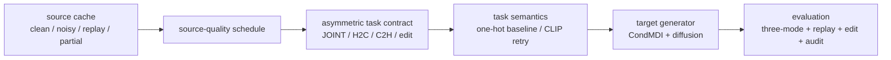

# StoryMotion v7.3.1 Consolidated Design

> [!abstract] 核心裁决
> v7.3.1 是 **Stage2 正式版重构决策页**，不是最终方法记录。2026-07-05 的 e0-e3 full three-mode eval 已完成，后续正式 backbone 继续固定为 `CondMDI + diffusion`。e3 `one-hot task + reliability schedule` 是新四组内最强：joint FDCLaTr `126.91`、joint caption F1 `0.253`、Out `9.0%`，优于 clean one-hot e2 的 joint FDCLaTr `147.53` / Out `11.6%`。但它仍弱于旧 clean unified baseline 的 joint FDCLaTr `85.70`、F1 `0.374`、Out `7.9%`，因此核心问题没有解决，只是找到局部改进信号。naive CLIP task instruction 注入未胜过 one-hot，不能作为默认主线；edit 仍依托 CondMDI mask-inpainting 天然能力，但需要单独 eval 闭环。

完整数据见 [[2026-07-01_storymotion-v7.3.1-metric-data]]。本文只保留：结论总览、正式 eval 裁决、论文表述边界、Stage2 大改实现、下一轮核心实验。

## 1. 总览

StoryMotion 的目标不是单一 camera completion，而是一个统一但非对称的 `JOINT / H2C / C2H / edit` 框架：

- `JOINT`：从 human text + camera text 生成 human-camera pair。
- `H2C`：给定 human source + camera text，生成 camera。
- `C2H`：给定 camera/source context + human text，生成人体。
- `edit`：对 sequence 中任意 branch / temporal span / synchronized span mask 后局部重生成。

当前证据把 v7.3.1 的定位从“方法已成型”改成“正式版重构后的实验裁决”：

| question | answer |
| --- | --- |
| clean camera completion 是否是瓶颈 | 不是。clean one-hot 的 H2C camera FDCLaTr `20.61` / F1 `0.620` 最强，但它不是 joint 最强。 |
| 只换 RF 是否足够 | 不足。`CondMDI + RF` camera clean 强，但 joint FDCLaTr / F1 大幅退化。 |
| 只换 MoLingo-style backbone 是否足够 | 不足。MoLingo FullRF p2b 只在 H2C clean/noisy Gaussian source 上有 Pareto 价值，缺少三模式与 replay 证据。 |
| 后续 baseline | Backbone 仍为 `CondMDI + diffusion`。实验管理上保留 e3 作为新 schedule candidate，保留旧 clean unified baseline 作为必须追平的 clean reference，e2 作为 clean-source ablation。 |
| core problem 是否解决 | 没有。e3 相对 e2 有 joint/framing 改进，但相对旧 clean baseline 仍明显退化。 |
| edit 优先级 | 能力上天然可做，指标上必须补；但 P0 先修 source reliability、joint coupling、generated replay 和 edit eval contract。 |

## 2. 证据裁决

本节只放足以影响路线选择的结果。历史实验的 final / diagnostic 分类已同步到 [[2026-07-01_storymotion-v7.3.1-metric-data]]。

### 2.1 Full Three-Mode Eval

本轮四组实验全部使用 `CondMDI + diffusion`，同一 cache、同一 seed、同一 training steps `82688`、训练 batch `512`、official eval batch `64`、full validation `10549`。四个训练目录均有 `train_log.jsonl`、`meta.json`、`last.pt`、`best_eval.pt` 和 TensorBoard event。训练指标采用最后 20 条 train log 均值；decoded metrics 才作为路线裁决依据。详细数据见 [[2026-07-01_storymotion-v7.3.1-metric-data#11. CondMDI + Diffusion Task / Source Schedule Eval 2026-07-05]]。

| id | task semantic | source schedule | train tail loss | H2C camera | C2H human | JOINT |
| --- | --- | --- | --- | --- | --- | --- |
| v6 clean | legacy task | clean unified | prior baseline | FDCLaTr `14.50`; F1 `0.638` | FDTMR `126.71` | FDTMR `155.73`; FDCLaTr `85.70`; F1 `0.374`; Out `7.9%` |
| e0 | CLIP instruction | clean source | loss `0.0299`; cam `0.0013`; hum `0.0414`; joint `0.0624` | FDCLaTr `92.38`; F1 `0.414` | FDTMR `128.81`; R1 `0.098` | FDTMR `200.87`; FDCLaTr `226.06`; F1 `0.164`; Out `22.4%` |
| e1 | CLIP instruction | reliability schedule | loss `0.0378`; cam `0.0213`; hum `0.0422`; joint `0.0547` | FDCLaTr `34.36`; F1 `0.515` | FDTMR `182.77`; R1 `0.092` | FDTMR `249.64`; FDCLaTr `204.71`; F1 `0.183`; Out `12.5%` |
| e2 | one-hot task | clean source | loss `0.0210`; cam `0.0020`; hum `0.0077`; joint `0.0556` | FDCLaTr `20.61`; F1 `0.620` | FDTMR `132.28`; R1 `0.095` | FDTMR `208.81`; FDCLaTr `147.53`; F1 `0.228`; Out `11.6%` |
| e3 | one-hot task | reliability schedule | loss `0.0375`; cam `0.0221`; hum `0.0369`; joint `0.0584` | FDCLaTr `34.62`; F1 `0.512` | FDTMR `147.60`; R1 `0.098` | FDTMR `195.85`; FDCLaTr `126.91`; F1 `0.253`; Out `9.0%` |
| CondMDI + RF | legacy task | clean unified | process ablation | FDCLaTr `11.99`; F1 `0.637` | FDTMR `129.13` | FDTMR `206.89`; FDCLaTr `219.36`; F1 `0.159`; Out `10.4%` |

Relative readout:

| comparison | H2C camera | JOINT | decision |
| --- | --- | --- | --- |
| e3 vs e2 | camera FDCLaTr `+14.01` worse; F1 `-0.108` worse | joint FDCLaTr `-20.62` better; F1 `+0.025` better; Out `-2.6pp` better | reliability schedule gives real but local joint/framing signal |
| e3 vs v6 clean | camera FDCLaTr `+20.12` worse; F1 `-0.126` worse | joint FDCLaTr `+41.21` worse; F1 `-0.121` worse; Out `+1.1pp` worse | current best v7.3.1 does not solve the core problem |
| e2 vs v6 clean | camera FDCLaTr `+6.11` worse; F1 `-0.018` worse | joint FDCLaTr `+61.83` worse; F1 `-0.146` worse; Out `+3.7pp` worse | clean source alone is not enough |
| e3 vs CondMDI + RF | camera FDCLaTr `+22.63` worse; F1 `-0.125` worse | joint FDCLaTr `-92.45` better; F1 `+0.094` better; Out `-1.4pp` better | diffusion + reliability is preferable to RF for joint |

裁决：

- e3 是新四组内最强 unified Stage2 配置：joint camera-text alignment、caption F1、framing Out 都最好，human TMR 也优于 e1/e2 joint。
- 但 e3 不是最终解决方案：它仍显著弱于旧 clean unified baseline，尤其 joint FDCLaTr `126.91` vs `85.70`、F1 `0.253` vs `0.374`。
- e2 是 clean oracle H2C / C2H ablation：clean camera completion 最强，但 joint 和 outscreen 不如 e3。
- reliability schedule 的作用是真实的：在 one-hot 语义下，H2C clean 指标下降，但 JOINT FDCLaTr 从 `147.53` 改到 `126.91`，Out 从 `11.6%` 改到 `9.0%`。
- naive CLIP task instruction 注入不成立：e0/e1 全面弱于 e2/e3，说明当前实现没有把 MotionLab-style task text 转成有效控制信号；不能简单替代 one-hot。
- e0/e1/e3 的 joint final JSON 来自 5090 上同 batch `64` 的 `expandable_segments=True` 重跑；这只改变 PyTorch allocator 策略，不改变模型、数据、seed、batch 或采样配置。旧 e2 joint 有一次 allocator OOM，最终 e2 joint 已同配置重跑完成。

### 2.2 Final Evidence vs Diagnostic Evidence

| evidence group | status for final paper | why |
| --- | --- | --- |
| StoryMotion v6 / CondMDI + diffusion full three-mode | formal clean reference | full `10549`, official callback, still stronger than e0-e3 on joint |
| e3 one-hot reliability full three-mode | improvement signal / candidate | full `10549`, official callback, best joint FDCLaTr / F1 / Out among e0-e3, but still below clean reference |
| e2 one-hot clean full three-mode | formal clean-oracle ablation | full `10549`, best clean H2C, shows clean completion is not enough |
| e0/e1 CLIP instruction full three-mode | negative ablation | full `10549`, shows naive CLIP task embedding injection regresses vs one-hot |
| CondMDI + RF full mixed three-mode | formal process ablation | full `10549`, isolates process swap, supports “RF not enough” |
| MoLingo FullRF p2b | candidate H2C evidence | good Gaussian clean/noisy Pareto, but no generated replay and no three-mode coverage |
| v7.2 E1-E6 / CP1-CP3 | diagnostic evidence | local gate/router/reliability patches move tradeoff but do not solve source reliability |
| generated replay | missing core evidence | final robustness claim cannot be made until replay enters train/eval |
| edit span eval | missing core evidence | edit is a target capability, but current eval is still mostly completion/generation |

### 2.3 Camera Completion Source Clarification

Clean camera completion 的标准输入应该是 clean human source + camera text；它用来证明 camera generator 能力。

此前 noisy human source 的目的不是把 camera completion 定义成“必须吃 noisy human”，而是诊断真实 pipeline：joint generation、generated replay 和 edit 场景中的 human source 不会一直是 oracle。若 camera branch 对 imperfect human 盲信，clean H2C 再强也不能支撑 unified StoryMotion。

因此后续指标必须分层：

- clean H2C：camera completion capacity。
- noisy/generated H2C：source-reliability robustness。
- JOINT：真实 human-camera coupling。
- edit：masked span regeneration + unmasked preservation。

## 3. 论文表述边界

当前可以写：

- StoryMotion studies unified human-camera generation and completion under asymmetric coupling.
- Clean-oracle camera completion hides a source-reliability failure that appears under noisy or generated human source.
- Reliability schedule improves joint camera-text alignment and framing under the current one-hot task route, but it remains below the old clean unified baseline and trades off clean H2C / C2H quality.
- The current strongest new v7.3.1 schedule candidate is `CondMDI + diffusion + one-hot task + reliability schedule`, not a solved final method.
- H2C matched-source generation is learnable, but clean H2C alone is not a sufficient proxy for StoryMotion.

当前不能写：

- StoryMotion has solved noisy / generated-source robustness.
- e3 has solved the core StoryMotion problem. It is an improvement signal, not a promoted final method.
- CLIP task instruction injection is validated. The current naive implementation regresses versus one-hot.
- `MoLingo + RF` outperforms `CondMDI + diffusion` across `JOINT / H2C / C2H`.
- RF is a sufficient replacement for diffusion.
- v7.2 / CP / p2b are final paper method evidence.
- camera-latent decoupling is already implemented or validated.

## 4. Stage2 大改方案

总目标：保留 unified framework，但把 Stage2 从 “mask pattern 区分任务” 改成 “source-condition-target contract”。主线 backbone 是 `CondMDI + diffusion`；当前实现基线是 e3 `one-hot task + reliability schedule`。RF / MoLingo 暂时只做 ablation 或 H2C anchor。

CLIP task semantic retry should use [[analysis/ICCV_2025/MotionLab_Unified_Human_Motion_Generation_and_Editing_via_the_Motion_Condition_Motion_Paradigm|MotionLab]] as the conceptual reference, but the table below records the current implementation status rather than treating CLIP instruction as validated.

| layer | implementation | modular or backbone-specific |
| --- | --- | --- |
| Source cache | offline store `H_gt / H_noisy / H_generated / H_partial` with `source_type`, `sigma`, `mask_ratio`, replay model id, seed, valid length | modular for cache/eval; backbone-specific for how source enters denoiser |
| Source-quality schedule | train on clean-heavy curriculum, then add noisy / generated / partial source buckets; log per-bucket metrics | modular scheduler; backbone-specific condition embedding |
| Asymmetric task contract | explicit `task_id`, source modality, target modality, dominant text role; H2C uses camera text as dominant, human text as auxiliary | modular metadata; backbone-specific text/attention injection |
| Task semantic injection | current stable route is one-hot task embedding; naive MotionLab-style CLIP instruction projection was implemented but underperformed, so any CLIP retry must redesign prompt, projection, scale, and interaction with text role routing | modular if task embeddings are precomputed; backbone-specific projection/injection point |
| Edit-aware mask sampler | whole branch, multi-span temporal, boundary repair, camera span, human span, synchronized joint span; loss mainly on masked target with preservation/boundary regularization | modular masks/loss; backbone-specific observed preservation and sampler |
| Camera-latent decoupling | optional later hypothesis: `C_hat = C_prior(text_c, shot) + DeltaC(H_src, relation, quality)`; gate or stop-gradient residual from imperfect human | relation extractor modular; latent head/adapter backbone-specific |
| Relation path | root velocity, bbox/screen occupancy, distance, view direction, visibility, shot scale; intervention probes zero/shuffle relation | feature/eval modular; injection backbone-specific |
| Framing verifier | Out, bbox center, shot scale, camera event F1; optional rerank or lightweight residual correction | modular unless inserted into training/sampling loop |
| Mechanism audit | source shuffle/noise, text shuffle, relation zero/shuffle, replay source swap | modular protocol; hook position backbone-specific |

Implementation order:

1. Start from e3 `CondMDI + diffusion + one-hot task + reliability schedule` because it is the strongest current full three-mode result.
2. Keep e2 clean source as the clean-oracle ablation; do not optimize only for H2C camera FDCLaTr.
3. Add generated replay cache and replay eval buckets before claiming source robustness.
4. Add edit-aware mask sampler and verify clean three-mode / replay buckets do not regress.
5. Redesign CLIP task semantics only as an ablation; the naive projection result is negative.
6. Only if replay/edit exposes persistent source blind trust, test camera-latent prior/residual decoupling + relation path.
7. Revisit RF or MoLingo only after replay/edit metrics define a stable target.

### 4.1 Camera-Latent Decoupling Clarification

当前 pipeline 中没有真正实现 “camera-latent decoupling”。现有实现包括：

- `source_meta`：记录 source type / noise / mask ratio 等可靠性元信息。
- `trust_gate`：用 source metadata 控制 observed source 注入强度。
- `relation_surrogate`：从 observed latent pooling 出一个条件向量。
- `soft_source`：把 observed source 作为软替换而非硬替换。

这些是 conditioning / gating，不是 decoupling。真正的 decoupling 至少需要把 camera 预测拆成 camera prior 与 human-conditioned residual，例如 `C_prior(text_c, shot)` 和 `DeltaC(H_src, relation, quality)` 两路，并控制 imperfect human source 只影响 residual。此前提出它的原因是：clean H2C 强但 noisy / generated source 下会暴露 camera 对 human source 的盲信；不过这仍是诊断假设，不是已验证模块。

因此当前优先级调整为：先固定 e3 作为 Stage2 baseline，并补 replay / edit eval；若 replay 或 edit 仍显示 camera 对 imperfect human source 盲信，再进入 camera prior-residual decoupling。CLIP task instruction 需要重做语义注入设计，不能直接沿用本轮 naive projection。

## 5. 下一轮核心实验

| priority | experiment | success criterion | role |
| --- | --- | --- | --- |
| P0 | clean-reference recovery under reliability schedule | recover near-v6 clean joint while preserving e3's joint/framing gains | decides whether this is a schedule fix or requires deeper conditioning redesign |
| P0 | generated replay eval / train bucket | replay H2C and JOINT do not collapse relative to Gaussian noisy; failure cases renderable | closes current source-robustness evidence gap |
| P1 | edit-aware mask curriculum on `CondMDI + diffusion` | clean three-mode stays near e3; masked span changes while unmasked span preserves | turns natural inpaint ability into measured edit claim |
| P1 | CLIP task semantic redesign | must beat one-hot e3 or show clear task-shuffle mechanism gain | retry only after fixing naive projection weakness |
| P1 | camera prior + residual decoupling | only after replay/edit diagnostics; improves noisy/replay H2C without large clean H2C or JOINT regression | tests optional architecture fix |
| P2 | MoLingo + diffusion | only run if we need backbone/process disentanglement for the paper | fills four-quadrant ablation |
| P2 | RF retry | only run if a modified RF sampler/training fixes joint collapse | process optimization, not main path |

Small-vs-large change decision:

- Not solved by small fixes: naive CLIP projection, one-hot clean source, and allocator-only changes do not close the gap to the clean unified baseline.
- Not a full backbone replacement yet: CondMDI + diffusion remains the right backbone because RF hurts joint and CondMDI keeps natural edit/inpaint ability.
- Required scope is medium-to-large Stage2 contract work: restore clean-reference quality while adding generated replay / source-quality schedule / edit masks / mechanism audit. If this cannot recover near-v6 clean joint, then camera prior-residual decoupling becomes a justified larger architecture change.

Metric data remains active in [[2026-07-01_storymotion-v7.3.1-metric-data]]. Archived notes consolidated here:

- `2026-07-01_storymotion-v7.2-stage2-architecture.md`
- `2026-07-02_storymotion-v7.2-stage2.md`
- `2026-07-03_storymotion-stage2-backbone-redesign.md`
- `2026-07-03_storymotion-stage2-session-architecture-summary.md`
